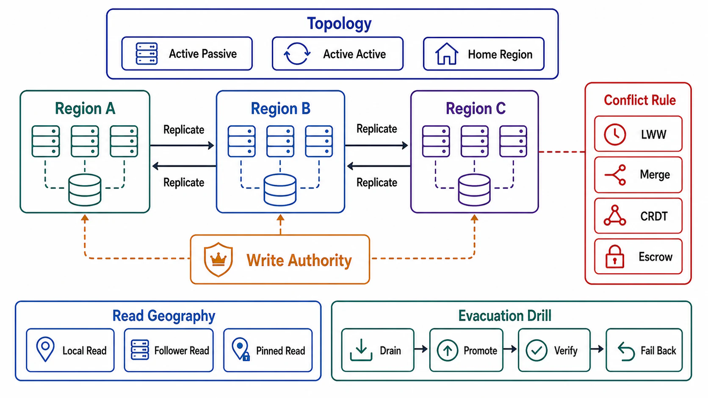

# Multi-Region and Conflict Handling



## Abstract

Multi-region architecture is the point where physics stops negotiating: cross-region round trips cost tens of milliseconds, so every design is a position on one axis — where writes are accepted — and every position pays a different bill. Single-region-writer pays latency for remote writers and an RTO for region failover; active-active pays with a permanent conflict-handling obligation, because two regions accepting writes to the same key *will* produce concurrent versions, and the resolution semantics — last-writer-wins discarding data by clock luck, version vectors surfacing siblings, CRDTs merging by construction, or consensus preventing conflicts by paying quorum latency on every write — are the actual product decision hiding inside the topology diagram. This file specifies the topologies with their honest bills, the conflict-resolution menu (Chapter 03 files 01 §5 and 04 §4, now with geography), and the strong option's true shape: Spanner's TrueTime demonstrates that external consistency across regions is purchasable — with bounded-uncertainty clocks, commit-wait, and Paxos on every write — which mostly proves how expensive the purchase is ([Spanner, OSDI 2012](https://docs.cloud.google.com/spanner/docs/true-time-external-consistency)).

The evacuation rule anchors everything: a region topology is worth exactly what its failover drill proved, at the RPO the acknowledgment rung (file 01 §2) actually bought — Chapter 03 file 08's "a backup is a hypothesis" generalizes to "a passive region is a hypothesis."

## 1. The Topology Menu

| Topology | Write Path | The Bill |
|---|---|---|
| Single region + DR copies | All writes to one region; async copies elsewhere | Remote users pay read latency (fixable with replicas) AND write latency (not fixable); region loss = RPO of the async lag + RTO of a rehearsed (or not) promotion |
| Primary region per dataset ("home regions") | Each tenant/dataset homed where its users are; writes route home | Latency solved per-tenant; cross-tenant operations become cross-region; tenant mobility becomes a migration (file 05's machinery) |
| Active-active, disjoint keyspaces | Both regions write, but to partitioned key ownership | Conflict-free by construction (it is single-writer per key, geographically arranged) — the underrated middle option |
| Active-active, shared keyspace | Any region writes any key; async peer replication | The full conflict obligation (§2) + RPO between peers; the topology teams announce first and understand last |
| Consensus-spanning (Spanner-class) | Every write is a cross-region quorum | No conflicts, external consistency — at ≥1 cross-region RTT per commit, forever; the ELC branch of PACELC paid in full (Ch03 f02 §3) |

The selection rule is Chapter 03's writer-cardinality rule with a map attached: state whose invariants demand a single writer gets a single write home (rows 1–3); only state whose merge is priced (Ch03 f01 §5) may enter row 4; row 5 is for the narrow set of invariants that genuinely need cross-region strong consistency and can afford the RTT — typically the control-plane and financial kernels, not the product's bulk.

## 2. The Conflict-Resolution Menu

For row-4 state, concurrent versions are a *when*, not an *if*. The menu, with each option's data-loss honesty:

```text
Figure 1. Two regions, one key, concurrent writes. Everything
below the fork is a product decision wearing infrastructure
clothes.

  region A: x ← "alice@new"     region B: x ← delete(x)
        \                            /
         ──── async replication ────
                    │
     ┌──────────────┼──────────────────┬──────────────────┐
     v              v                  v                   v
  LWW (clock)    version vectors    CRDT merge         consensus
  one write      BOTH kept as      merge function     (prevented:
  SILENTLY       siblings; reader  decides (add-wins  one write
  discarded —    or app must       set keeps alice)   would have
  which one      resolve — the     — semantics were   lost the
  decided by     Dynamo shape      chosen at TYPE     election)
  clock skew                       design time
```

| Option | Guarantee | The Catch |
|---|---|---|
| LWW (wall-clock) | Convergence | Silent data loss on every true conflict, arbitrated by clock skew; admissible only with Ch03 f01 §5's explicit data-loss acknowledgment — DynamoDB global tables ship exactly this default, and the acknowledgment is rarely co-shipped |
| Version vectors + siblings | No loss; causality preserved | Someone must resolve siblings — surfacing them to the application is honest and expensive; auto-resolving them re-invents one of the other rows |
| CRDTs | Convergence + no loss, by type construction | Only merge-preserved invariants (Ch03 f04 §4); metadata growth; the type's semantics (add-wins vs remove-wins) is a product decision made in a library import |
| Consensus per write | No conflicts exist | The row-5 bill; also the only row that delivers cross-region *transactions* rather than per-key convergence |

Spanner's mechanism deserves its two sentences of respect: TrueTime exposes clock *uncertainty* as an interval, and commit-wait holds each transaction until its timestamp is provably past — turning physical time into a correctness primitive instead of the folklore that LWW pretends it is ([TrueTime and external consistency](https://docs.cloud.google.com/spanner/docs/true-time-external-consistency)). That is what it actually costs to make timestamps mean something; every system arbitrating conflicts by unadorned wall clock is claiming Spanner's semantics without Spanner's machinery.

## 3. Read Geography

Reads are the solvable half of multi-region latency, and the file 07 delivery machinery applies with one addition: **regional read replicas serve the Chapter 03 file 02 claim their lag supports, per region.** A user in Sydney reading a Virginia-homed dataset through a local replica gets bounded-staleness at the replication lag — which is fine *when declared* and a correctness incident when the path claimed read-your-writes. The session-token mechanics (file 07) must therefore be region-aware: a write's LSN/timestamp token must either route the next read home (paying the RTT once, honestly) or gate on the local replica catching up (paying in read latency during lag spikes). Choosing per read path, from the Ch04 file 01 matrix — not globally — is what keeps the bill proportional.

## 4. Evacuation: The Drill Is the Topology

Region failover has three components the dossier must price separately: **detection** (regional gray failure is the hard case — Chapter 01 file 08 §2's differential observability across a WAN); **data cutover** (promotion at the file 01 §2 rung's RPO: async lag lost, semi-sync lost-if-degraded, consensus-spanning zero — the number is *decided now*, discovered then); and **traffic + dependency cutover** (DNS/anycast shift, plus the inventory nobody keeps: the third-party webhooks, the region-pinned quotas, the singleton crons that all assumed the home region). The Chapter 02 lesson applies at region scale: the evacuation tooling must not live only in the region being evacuated.

Evacuation cadence is the gate: quarterly game-day failovers of *real traffic slices* (drill R7, file 09), because an unexercised passive region accumulates configuration drift at the same rate as an untested backup accumulates fiction — and for the same reason.

## 5. Approval Gates

| Gate | Evidence Required | Failure Condition |
|---|---|---|
| Topology gate | Each dataset's row in the §1 menu, justified by its writer-cardinality contract and latency geography | Shared-keyspace active-active for single-writer invariants; or consensus-spanning bought for state that needed row 2 |
| Conflict gate | Row-4 state names its §2 resolution with the data-loss acknowledgment (LWW) or sibling-resolution owner (vectors) or invariant proof (CRDT) | Conflict handling = the vendor default, unread |
| Clock gate | Any time-arbitrated resolution documents its clock infrastructure and skew bound | Wall-clock LWW claiming more than "one side wins arbitrarily" |
| Geography gate | Per read path: the regional claim delivered, with region-aware session tokens where read-your-writes is promised | Local-replica reads silently downgrading declared claims |
| Evacuation gate | Region RPO computed from the ack rung; failover drilled with real traffic within the cadence; dependency inventory (webhooks, quotas, singletons) maintained | The passive region is a diagram; the RPO is a surprise |

## Output

The output of this file is a region design with its bills itemized: write topology matched to writer-cardinality contracts, conflicts resolved by declared semantics rather than clock luck, reads served at regionally honest claims, and an evacuation that has already happened on purpose — at a rehearsed RPO — before it happens by surprise.

## References

- [Corbett et al., "Spanner: Google's Globally-Distributed Database," OSDI 2012 / TrueTime and external consistency](https://docs.cloud.google.com/spanner/docs/true-time-external-consistency)
- [DeCandia et al., "Dynamo," SOSP 2007 — version vectors and sibling resolution](https://www.allthingsdistributed.com/2007/10/amazons_dynamo.html)
- [AWS — DynamoDB global tables conflict resolution (last-writer-wins)](https://docs.aws.amazon.com/amazondynamodb/latest/developerguide/V2globaltables_HowItWorks.html)
- [Shapiro et al., CRDTs — merge-by-construction and its invariant limits](https://inria.hal.science/inria-00609399)
- [Meta — October 2021 outage: the dependency-inventory lesson at region scale](https://engineering.fb.com/2021/10/05/networking-traffic/outage-details/)
