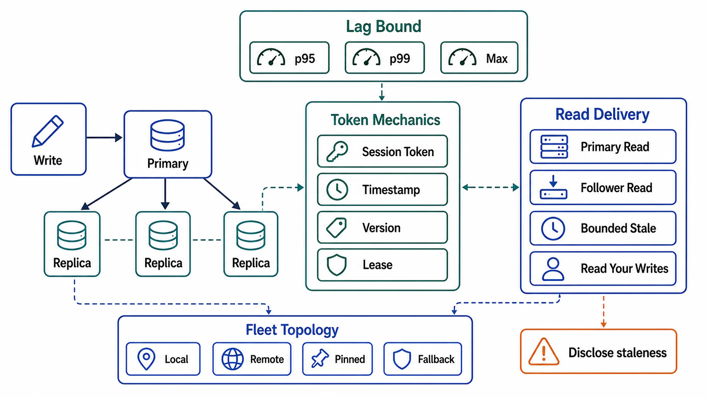

# Replica Reads and Consistency Delivery



## Abstract

Chapter 03 file 02 priced consistency claims per read path; this file is where each claim is *delivered* over a fleet of lagging replicas — the mechanism catalog that turns "read-your-writes" from a checkbox into routing logic, tokens, and gates. The delivery instruments are few and composable: sticky routing (pin a session's reads to a replica that has its writes), causality tokens (carry the write's LSN/timestamp and gate reads on it), leader reads (pay the leader's capacity for the strongest claims), and follower reads with explicit staleness (CockroachDB's exact- and bounded-staleness reads are the current state of the art in making the trade *queryable* — the client states its staleness tolerance and the system picks the newest safe timestamp within it, [bounded staleness reads](https://www.cockroachlabs.com/blog/bounded-staleness-reads/)). The file's premise, brutal and structural: every replica read is a consistency decision made at routing time, and a load balancer that round-robins reads across replicas without consulting the path's claim is making that decision randomly, per request, forever.

## 1. The Delivery Matrix

Each Chapter 03 file 02 claim, with its delivery mechanisms over replicas — ordered within each row from cheapest to strongest:

| Claim (Ch03 f02) | Delivery Mechanisms | The Fine Print |
|---|---|---|
| Linearizable | Leader read (with lease/read-index discipline, file 02 §2); or quorum read with sync repair (file 03 §1) | Replicas are simply not on this path; a "linearizable" path with a replica in it is file 03's gap 1 shipped as architecture |
| Read-your-writes | Session stickiness to a caught-up replica; or LSN/timestamp token gating (§2); or route-to-leader after recent write | Stickiness breaks on replica failure/deploy — the fallback must preserve the claim, not just the connection |
| Monotonic reads | Same-replica stickiness; or monotonically non-decreasing token per session | Cross-device sessions need the token, not the stickiness |
| Causal | Causality token carried across the *whole* interaction graph, including through queues and services | The token's transport is the hard part — it must ride the Ch01 file 04 trace/baggage machinery |
| Bounded staleness Δ | Lag-gated replica selection: serve only from replicas with lag < Δ; or timestamp-bounded reads (`max_staleness`) | Requires per-replica lag truth (file 01 §4); a replica that lies about lag serves violations |
| Eventual | Any replica, with the divergence metric live | The honest bottom rung — legitimate wherever Ch03 f02 declared it |

## 2. Token Mechanics

The causality token is the workhorse, and its mechanics decide whether the claim survives production:

```text
Figure 1. LSN-token read-your-writes over replicas.

  write ──► leader ──► ack carries commit position (LSN/ts) T_w
                │
                └─► client/session stores T_w (cookie, session
                    store, baggage — Ch01 f04 trace context)
  read(T_w) ──► router:
     ├─ replica R1 applied ≥ T_w ?  serve from R1   (fast, claim holds)
     ├─ none caught up?             wait ≤ deadline (pay latency)
     └─ deadline pressure?          route to leader (pay capacity)
                                    NEVER: serve stale silently
```

The four engineering decisions the figure hides: **token scope** (per-session is standard; per-key tokens are tighter and cheaper on replicas but heavier to transport); **token transport** (a token that lives only in one service's memory dies at the first hop — it must ride the request context across services, queues, and workflow steps, which is exactly the W3C baggage machinery Chapter 01 file 09 §7 mandated); **replica applied-position truth** (routers need per-replica applied-LSN at sub-second freshness — this is the file 01 §4 lag contract feeding routing, not just dashboards); and **the wait-vs-leader crossover** (a declared deadline after which the read escalates — unbounded waiting converts a lag spike into a latency outage on the read path).

## 3. Follower Reads Done Honestly

The CockroachDB construction generalizes and is worth importing as the standard shape: reads declare staleness *in the query* — exact (`AS OF SYSTEM TIME t`) or bounded (`with_max_staleness(Δ)`) — and bounded-staleness reads invert the usual order by inspecting replica state first and choosing the newest timestamp that is both safe locally and within the bound ([follower reads](https://www.cockroachlabs.com/docs/stable/follower-reads); [bounded staleness RFC](https://www.cockroachlabs.com/blog/bounded-staleness-reads/)). The properties to replicate in any stack: staleness is *explicit at the call site* (auditable against the path's Ch03 claim — no silent downgrades), the system *maximizes freshness within the bound* rather than serving arbitrary staleness, and unavailability of a fresh-enough replica is a *visible outcome* (wait/escalate/error), never a silent violation.

The Postgres-physical-replication footnote that costs teams real incidents: a standby serving long reads conflicts with WAL replay — the engine must either cancel the query or delay replay (widening lag for everyone), and `hot_standby_feedback` resolves it by exporting the standby's MVCC horizon *back to the primary*, turning replica read patterns into primary-side bloat (the Ch04 file 02 §4 vacuum coupling, across the replication link). Replica reads are never free capacity; they are capacity with a consistency contract and a backpressure channel.

## 4. Fleet Topology for Read Delivery

Delivery shapes the replica fleet itself: replicas are *pooled by claim*, not treated as interchangeable — a bounded-staleness analytics pool (long queries welcome, generous lag), a session-read pool (lag-gated tight, long queries rejected), and the leader reserved for linearizable and post-write reads. This is Chapter 01 file 03's workload isolation applied to read consistency: mixing a 40-minute analytical scan into the pool that serves read-your-writes gates is how lag SLOs die. The pool map — which claims may be served from which replicas — is control-plane routing policy (Chapter 02), versioned and distributed like any other, and the router's per-claim error/downgrade rate is the SLI that proves the whole file (Ch03 f10 §3's session-guarantee violation rate, now with a mechanism to blame).

## 5. Approval Gates

| Gate | Evidence Required | Failure Condition |
|---|---|---|
| Matrix gate | Every read path's claim maps to a named §1 mechanism; no replica appears on a linearizable path | Round-robin across replicas under paths claiming session guarantees |
| Token gate | Token scope + transport declared; survives service hops, queues, and failover; applied-position feeds routing at declared freshness | Read-your-writes that dies at the second service or the first replica failover |
| Explicitness gate | Follower reads declare staleness at the call site; fresh-replica unavailability is wait/escalate/error, never silent staleness | Silent downgrades under lag; "usually fresh enough" as a mechanism |
| Backpressure gate | Replica read patterns' feedback on the primary (standby conflicts, feedback bloat) measured and budgeted | Replica capacity counted as free; primary bloat discovered by vacuum incident |
| Pool gate | Replicas pooled by claim with routing policy as versioned control-plane state; per-claim violation SLIs live | One undifferentiated replica pool serving every claim and no one able to say which |

## Output

The output of this file is consistency claims that survive contact with a replica fleet: every claim delivered by a named mechanism with its price on the right meter — stickiness and tokens for sessions, lag-gated pools for bounded staleness, the leader for what only the leader can serve — and a violation SLI per claim that turns silent downgrades into pages.

## References

- [CockroachDB — Follower Reads](https://www.cockroachlabs.com/docs/stable/follower-reads) and [Bounded Staleness Reads RFC/blog](https://www.cockroachlabs.com/blog/bounded-staleness-reads/)
- [Terry et al., "Session Guarantees for Weakly Consistent Replicated Data," PDIS 1994 — the claims this file delivers](https://dl.acm.org/doi/10.1109/PDIS.1994.331722)
- [PostgreSQL — hot standby, query conflicts, and hot_standby_feedback](https://www.postgresql.org/docs/current/hot-standby.html)
- [W3C Baggage — the token transport lane](https://www.w3.org/TR/baggage/)
- [Kleppmann, *DDIA* — reading your own writes over replicas](https://dataintensive.net/)
