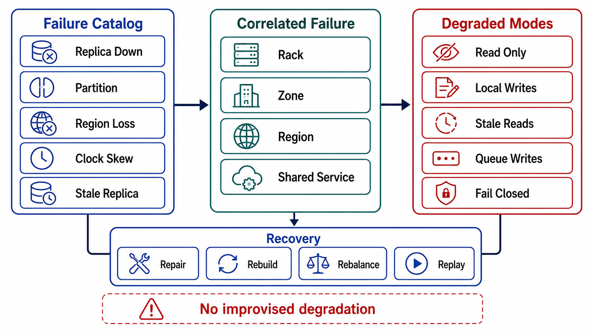

# Failure Modes and Degradation



## Abstract

Distribution multiplies the ways a system can be partially wrong, and this file catalogs the failure modes that are *specific to* replication, partitioning, and quorums — each with its detection signature, its blast mechanics, and its pre-declared degradation, in the Chapter 01 file 08 discipline. The catalog is incident-anchored throughout: split brain (GitHub 2018 — dual authority for 43 seconds, reconciliation for 24 hours), consensus-layer collapse (Roblox 2021 — the coordination service as the availability ceiling of everything above it, for 73 hours), failover-onto-lag (the acknowledgment rung's RPO, collected at the worst moment), and the correlated-failure arithmetic that Aurora's quorum design exists to answer ([quorums and correlated failure](https://aws.amazon.com/blogs/database/amazon-aurora-under-the-hood-quorum-and-correlated-failure/)). The file's organizing rule is the chapter's thesis inverted: every mechanism this chapter added — replicas, quorums, maps, regions — is also a new failure surface, and a distribution design is complete only when each surface has a failure row with a named response.

The degradation stance is inherited from Chapter 01 file 08 and sharpened for distribution: partial availability is the *point* of distribution, so the degraded modes (stale reads, minority-side read-only, shed rebalancing) must be designed states with contracts — not whatever the timeout defaults happen to produce.

## 1. The Failure Catalog

| Failure | Detection Signature | Blast Mechanics | Required Response |
|---|---|---|---|
| Split brain (dual writers) | Fencing-epoch rejections; divergence detectors; *not* "everything looks fine on both sides" — that is the failure | Every write during the window needs arbitration or discard; cost grows with window length (GitHub: 43 s → 24 h) | Prevention is the response: fencing-first transfer (Ch03 f01 §4), single arbiter (f02); on occurrence: freeze one side, reconcile per Ch03 f01 §5 pricing |
| Failover onto lag | Promoted replica's applied position < leader's acked position | Acknowledged writes vanish — durability contract violated retroactively; clients hold receipts for state that no longer exists | Failover eligibility gates (f01 §4); if taken anyway: RPO-gap client contract (Ch03 f08 §5 — idempotency records let clients detect and re-submit) |
| Quorum loss | Write rejections at W; read rejections at R | Per-partition unavailability — bounded blast if partitions are placement-diverse (f04 §2); fleet-wide if correlated | Declared per-partition degraded mode: read-only at R, or full stop; *never* silent W-relaxation (that is sloppy mode adopted by accident, f03 §3) |
| Correlated failure (AZ/rack/switch) | Simultaneous multi-replica loss inside one failure domain | The failure model the naive arithmetic ignored: N=3 across 3 AZs loses quorum when one AZ + one node fail | Placement diversity (f04 §2) + quorum sizing for the correlated case (f03 §2, the Aurora exercise); re-replication prioritized over optimization (f05 §3) |
| Consensus overload / collapse | Election thrash, apply-lag growth, watch-fanout saturation, log-store pathology (BoltDB freelist) | Everything holding authority through the cluster stalls together — the Roblox shape: discovery, flags, locks, and the tooling to fix them | Tenant admission + fanout budgets (f02 §3); independent management path (f02 §3); load-shed the coordination service's *readers* before its consensus rounds |
| Lag runaway (metastable) | Lag SLO breach → reader failover to leader → leader load ↑ → lag ↑ | Ch01 f08 §1's loop with replicas as fuel; ends with the leader serving everything and melting | Break the loop at routing: cap leader-escalation rate; degrade to declared-stale serving (Ch03 f02 §5's anomaly budget) rather than migrating all reads |
| Partition-map staleness | Wrong-owner request rate rising | Requests to old owners: rejected-with-redirect (designed) or served-stale (defect); during resharding, the cutover's exposure window | Epoch fencing + redirect protocol (f04 §3, §5); wrong-owner rate as the map-health SLI |
| Gray replica | Caller-side SLIs diverge from replica self-report — slow, not down (Ch01 f08 §2) | Health checks pass; requests routed to it degrade; retries amplify | Differential detection per replica; eject on caller-observed latency, with the minimum-fleet floor from Ch02 f07 §3 |
| Anti-entropy debt | Divergence-window SLI growth; repair backlog | Cold-key divergence accumulating beneath read-repair's reach (f03 §3) | Repair cadence as budgeted background work with a backlog alarm (Ch04 f02 §5's standing) |

## 2. The Arithmetic of Correlated Failure

The file 03 lesson deserves its worked form, because the naive and honest numbers differ by orders of magnitude:

```text
Figure 1. Independent vs correlated failure math, N=3 one-per-AZ,
p(node) = 0.001, p(AZ) = 0.0001 (monthly, illustrative):

  independent-only quorum-loss (2 of 3 nodes):
    ≈ 3·p² = 3×10⁻⁶            ← the number in the design doc
  with AZ failure + one more node:
    ≈ p(AZ)·(2p) + 3p² ≈ 2×10⁻⁷ + 3×10⁻⁶   … still fine, BUT:
  the real killer is the SHARED-DEPENDENCY term:
    one bad config push / cert expiry / control-plane fault
    hitting all replicas ≈ p(change error) — orders of magnitude
    larger than everything above, and NOT reduced by N.

  moral: past small N, availability is bought with failure-domain
  DIVERSITY and change discipline (Ch02 f06), not replica count.
```

This is the review's answer to "let's add two more replicas": replication subtracts the independent term, which stopped being the dominant term years ago. The dominant terms — correlated infrastructure failure and correlated *change* — are addressed by placement (f04), quorum geometry (f03 §2), and Chapter 02's rollout gates. Aurora's 6/4/3 geometry is the canonical worked answer for the infrastructure term; nothing in quorum math answers the change term.

## 3. Degraded Modes, Pre-Declared

The distribution-specific degraded states, each a contract rather than an accident:

| Degraded Mode | Contract |
|---|---|
| Stale-read serving under lag/partition | Per-path staleness disclosure (Ch03 f02 §5); bounded by the LKG-style horizon; the mode most systems are silently in already — declaring it is the upgrade |
| Minority-side read-only | The PC choice (Ch03 f02 §3) made visible: writes rejected with a typed error, reads served with a staleness flag; requires fencing to be *safe*, not just configured |
| Home-region write-only (region partition) | Remote regions serve reads + queue writes (Ch01 f04's `accepted` state) or reject — per the f06 topology's declared conflict stance |
| Rebalancing shed | Movement paused under load (f05 §3 priority); redundancy debt tracked as a first-class risk with a repayment deadline |
| Coordination-service brownout | Data plane on LKG snapshots (Ch02 f04) — the mode whose *possibility* is static stability; readers of the coordination service shed before its writers |

## 4. Approval Gates

| Gate | Evidence Required | Failure Condition |
|---|---|---|
| Catalog gate | Every §1 row instantiated for this system: detection signature wired, response named, owner assigned | A distribution mechanism exists with no corresponding failure row |
| Arithmetic gate | Availability math includes correlated-failure and shared-change terms, not just independent node loss | "Three replicas = five nines" reasoning anywhere |
| Degradation gate | Each §3 mode is a designed state with a typed contract, reachable by drill | Degraded behavior is whatever defaults produce; minority-side behavior discovered during the partition |
| Loop gate | Lag-runaway and rebalancing-storm loops have named break mechanisms with caps | Reader failover and movement triggers can amplify the failure that triggered them |
| Independence gate | The consensus/coordination layer's failure does not take down its own repair path (Roblox rule); the map's failure does not take down routing to fix the map | Recovery requires the failed layer |

## Output

The output of this file is a distribution design whose failure surfaces are enumerated with signatures, responses, and owners: split brain prevented by construction and priced on occurrence, quorum geometry sized for the failures that actually correlate, degraded modes that are contracts rather than accidents, and amplification loops with their break mechanisms installed before the incident that would otherwise discover them.

## References

- [GitHub — October 21, 2018 post-incident analysis](https://github.blog/2018-10-30-oct21-post-incident-analysis/)
- [Roblox — Return to Service: the October 2021 outage](https://about.roblox.com/newsroom/2022/01/roblox-return-to-service-10-28-10-31-2021)
- [AWS — Amazon Aurora Under the Hood: Quorums and Correlated Failure](https://aws.amazon.com/blogs/database/amazon-aurora-under-the-hood-quorum-and-correlated-failure/)
- [Huang et al., "Gray Failure," HotOS 2017 — the gray-replica detection premise](https://www.microsoft.com/en-us/research/publication/gray-failure-achilles-heel-cloud-scale-systems/)
- [Bronson et al., "Metastable Failures," HotOS 2021 — the lag-runaway loop's family](https://sigops.org/s/conferences/hotos/2021/papers/hotos21-s11-bronson.pdf)
