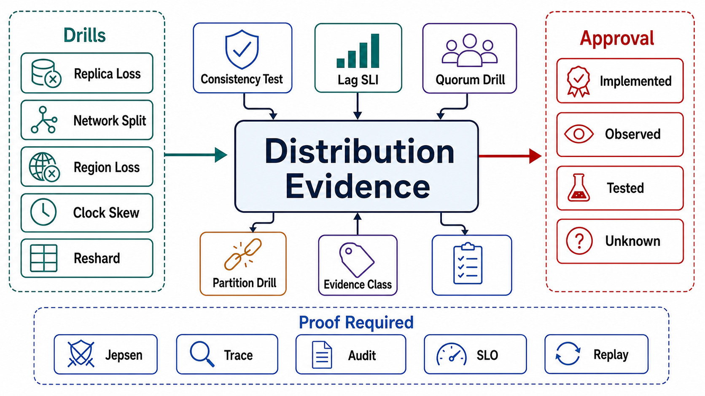

# Verification of Distribution



## Abstract

Distribution claims are the least verifiable by inspection and the most falsifiable by experiment of anything in this book: whether fencing actually fences, whether R+W>N actually overlaps under failure, whether the passive region can actually take traffic — none of these is visible in configuration, and all of them are one controlled fault away from a definite answer. This file specifies the evidence regime: Jepsen-class adversarial harnesses as the standard for consistency-under-fault claims (the methodology — generate concurrent operations, inject partitions and pauses, check the recorded history against the claimed model — has falsified documented guarantees in a double-digit list of production systems, [Jepsen analyses](https://jepsen.io/analyses)), the distribution-specific SLI set, and the drill catalog R1–R10 covering the incident shapes files 01–08 predicted, from single-node fencing through full region evacuation. Every result lands in the Chapter 01 file 11 taxonomy with a date and a *topology generation* — because distribution evidence expires when the fleet, the placement, or the map machinery changes, not merely when time passes.

The premise, which the incident record supports without exception: the gap between configured and actual behavior is *widest* in distribution, because the failure paths execute rarely and the happy paths execute always. A failover that has never run is not a failover; it is a runbook attached to a hope.

## 1. Adversarial Consistency Testing

The Jepsen-shape harness, as a permanent fixture rather than a one-time audit:

```text
Figure 1. The adversarial harness loop. The nemesis is the point:
consistency claims are only meaningful under the faults the
topology will actually experience.

  workload generators ──► cluster under test ◄── nemesis injects:
  (concurrent reads/          │                   · network partitions
   writes/CAS with            │                   · process pauses
   recorded invocation        │                     (SIGSTOP ≈ GC)
   + response times)          │                   · clock skew
        │                     │                   · node kill/restart
        v                     │                   · disk-full, slow-IO
  complete operation history ◄┘                     (the gray cases)
        │
        v
  checker: does the history fit the CLAIMED model?
  (linearizability / session guarantees / bounded staleness —
   the Ch03 f02 claim per path, not a generic "consistency")
        │
        v
  violation = a dated, reproducible counterexample
```

Scope obligations: the harness runs the *actual claims* per read path (a linearizability checker over an eventually-consistent path proves nothing either way); it runs against the production engine version, topology shape, and quorum configuration (file 03's arithmetic is config-sensitive); and it re-runs on engine upgrades, topology changes, and quorum reconfiguration — the three events that silently reset all prior evidence.

## 2. Distribution SLIs

| SLI | Guards | Alert Meaning |
|---|---|---|
| Per-replica lag (bytes + time), per cause | f01 §4 | Staleness claims approaching breach; the cause taxonomy makes the alert actionable |
| Semi-sync degradation events | f01 §2 | The RPO guarantee just silently evaporated — page, don't log |
| Failover-eligibility fleet count | f01 §4 | How many replicas could be promoted *right now* without data loss; zero is an incident before the failure |
| Fencing rejections (epoch violations) | Ch03 f04, f04 §3 | Nonzero = a stale authority tried to act — the defense worked; investigate the attempt |
| Wrong-owner request rate | f04 §5 | Map propagation health; rising = stale routers or a cutover exposure window |
| Election rate + apply lag (consensus) | f02 §2 | Thrash under load; the Roblox precursor signature |
| Coordination-service tenant rates + watch fanout | f02 §3 | Accretion approaching the cliff |
| Divergence window + repair backlog (anti-entropy) | f03 §3 | Cold-key divergence outliving the repair cadence |
| Rebalancing: in-motion count, movement throughput, redundancy debt | f05 §3 | Storm detection; debt with a repayment deadline |
| Per-claim violation rate (session guarantees, staleness bounds) | f07 | The delivery machinery failing per path — the SLI that proves the chapter |
| Region replication lag + evacuation-readiness (drill freshness, dependency inventory age) | f06 | The passive region drifting from hypothesis toward fiction |

## 3. Drill Catalog R1–R10

Chapter 02 drilled the planes, Chapter 03 the state contracts, Chapter 04 the data paths; R-drills exercise distribution. Same discipline: falsifiable hypothesis, controlled fault, pass condition, freshness window.

| # | Drill | Hypothesis | Pass Condition | Frequency |
|---|---|---|---|---|
| R1 | Kill the leader under sustained write load | f01 §2 rung + f01 §4 eligibility | Promotion only to caught-up replica; zero acknowledged-write loss at the declared rung; clients resolve ambiguity via idempotency keys | Quarterly |
| R2 | Partition the old leader *without* killing it (the GitHub case) | Fencing (Ch03 f01 §4) | Old leader's writes rejected by epoch from the moment of promotion; no dual-authority window in the write history | Quarterly |
| R3 | Adversarial harness (§1) full run under nemesis | Per-path Ch03 f02 claims | No history violations outside declared anomaly budgets | Per engine/topology/quorum change |
| R4 | Take down one full failure domain (AZ) plus one node | f03 §2 correlated sizing + f04 §2 placement | Write and read quorums hold per the declared geometry; re-replication proceeds at budgeted rate without starving serving | Semi-annually |
| R5 | Saturate the coordination service (watch storm + tenant burst replay) | f02 §3 budgets | Data plane unaffected on LKG; consensus latency degrades gracefully; no election thrash; management path independent | Annually + on tenant additions |
| R6 | Execute a live shard split on a loaded keyspace | f05 §4 protocol | All seven phase gates pass; cutover fenced; reverse replication proven by rolling back | Per resharding-machinery change |
| R7 | Evacuate a region with a real traffic slice | f06 §4 | Cutover at the computed RPO; dependency inventory (webhooks, quotas, singletons) held; return migration clean | Quarterly slices; annual full |
| R8 | Inject sustained lag (throttle replication) on the session-read pool | f07 delivery + f08 lag-runaway break | Tokens gate or escalate per contract; leader-escalation cap holds; no metastable migration of all reads | Semi-annually |
| R9 | Stale-map exposure: hold back map updates from a router subset during a move | f04 §3, §5 | Wrong-owner requests get redirect-with-refresh; zero silent stale service; SLI fired | Per map-machinery change |
| R10 | Gray replica: degrade one replica's I/O without failing health checks | f08 catalog | Caller-side differential detection ejects it; minimum-fleet floor respected; no retry amplification | Semi-annually |

R2 earns its separate line from R1 deliberately: killing a leader tests promotion; *partitioning* a live one tests fencing — and only the second would have caught GitHub 2018. Drills that only ever kill processes are testing the polite half of the failure space.

## 4. Evidence Classification of Distribution Claims

| Claim | It Is `tested` Only If |
|---|---|
| "Failover loses nothing" | R1 + R2 at the current topology generation, under write load |
| "We are linearizable / read-your-writes on path X" | R3's checker passed for X's claim under nemesis, this engine version |
| "We survive an AZ loss" | R4 with the *correlated* geometry, re-replication observed |
| "We can reshard live" | R6 including the rollback, on the current map machinery |
| "We can evacuate a region" | R7 within cadence, with the dependency inventory verified that run |
| "The coordination service is not our ceiling" | R5 at forecast fleet size and tenant load |

The topology-generation stamp is this chapter's addition to the evidence rules: a fleet that doubled, a placement that moved to new AZs, or a map layer that was rewritten resets these rows to `assumed` regardless of the calendar.

## 5. Approval Gates

| Gate | Evidence Required | Failure Condition |
|---|---|---|
| Harness gate | Adversarial testing per read-path claim, under nemesis, on production versions/topology; re-run triggers wired to upgrades and reconfigurations | Consistency claims verified by documentation or healthy-cluster tests |
| SLI gate | The §2 set live with owners; semi-sync degradation and failover-eligibility page rather than log | The RPO can evaporate, or the promotable-replica count can hit zero, silently |
| Drill gate | R1–R4 within freshness at the current topology generation; R5–R10 scheduled with owners | Fencing, correlated-failure geometry, or evacuation exists as configuration only |
| Partition gate | Drills include partitions and pauses, not only process kills (the R2 rule) | The failure space's impolite half is untested |
| Generation gate | Every claim stamped with topology generation; resets enforced on fleet/placement/map changes | Evidence from the 20-node era governing the 200-node fleet |

## Output

The output of this file is distribution behavior that has been *made to happen on purpose*: every consistency claim holding a dated counterexample-free harness run, every failover and fence and evacuation exercised at the current topology generation, and an SLI set that pages when the guarantees start evaporating rather than when users start noticing.

## References

- [Jepsen — Analyses: the methodology and the falsification record](https://jepsen.io/analyses)
- [GitHub — October 2018: the incident R2 exists to pre-empt](https://github.blog/2018-10-30-oct21-post-incident-analysis/)
- [Roblox — October 2021: the incident R5 exists to pre-empt](https://about.roblox.com/newsroom/2022/01/roblox-return-to-service-10-28-10-31-2021)
- [AWS — Aurora quorums and correlated failure: the geometry R4 verifies](https://aws.amazon.com/blogs/database/amazon-aurora-under-the-hood-quorum-and-correlated-failure/)
- [Principles of Chaos Engineering — the hypothesis discipline all R-drills follow](https://principlesofchaos.org/)
