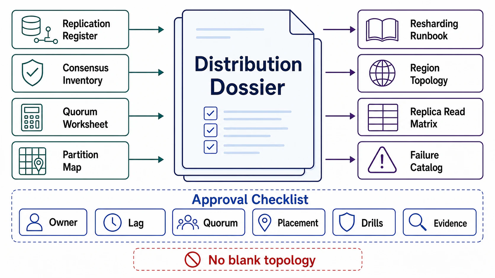

# Distribution Review Templates



## Abstract

This file collects the executable artifacts of Chapter 05: the per-store replication register, the consensus and coordination-service inventory, the quorum geometry worksheet, the partition-map contract, the resharding runbook skeleton, the region topology register, the replica-read delivery matrix, and the drill checklist. Every field is defined and justified in files 01–09; this file adds no new policy. A blank field here is a finding with a specific personality: it is usually a guarantee that exists in configuration and has never existed in behavior.

## Usage Protocol

1. Complete top-to-bottom; the order matches the file 00 dependency graph — topology before quorums, the map before resharding, everything before the drills that prove it.
2. Every state item referenced must exist in the Chapter 03 inventory with its writer-cardinality and consistency claims; every partition key must have passed Chapter 04 file 01's tests. Divergence is a seam finding.
3. Tag every claim with its file 09 §4 evidence row, its date, and its **topology generation** — fleet size, placement layout, map-machinery version. Generation changes reset evidence to `assumed`.
4. Re-run on: engine upgrades, quorum reconfiguration, fleet/placement changes, map-machinery changes, region additions, and any R-drill freshness expiry.

```text
Figure 1. Dossier assembly flow.

  file 01                files 02–04                 files 05–07
  replication register──► consensus inventory,   ──► resharding runbook,
  (topology + rung        quorum geometry,           region register,
   per state item)        partition-map contract     read-delivery matrix
      │                        │                          │
      └────────────┬───────────┴──────────────────────────┘
                   v
        file 08: failure catalog instantiated (signature,
                 response, owner per row)
                   v
        file 09: harness + SLIs + drills R1–R10
                 → evidence class + DATE + TOPOLOGY GENERATION
                   v
        approval: replication, quorums, partitioning, regions —
        event/stream architecture (Ch06) is NOT approved here
```

## Replication Register (per state item)

| State Item (Ch03) | Topology | Ack Rung | RPO Implied | Write-Latency Price | Semi-Sync Degradation Alarm | Log Choice (physical/logical consumers) | Lag SLO + Reader Breach Policy | Failover Eligibility (max lag) |
|---|---|---|---|---|---|---|---|---|
|  | single-leader / multi-leader / leaderless |  |  |  | yes/no |  |  |  |

## Consensus and Coordination Inventory

```yaml
consensus_group:
  name:
  purpose:                     # what authority it arbitrates (Ch03 f01/f04 refs)
  size: 2f+1 =                 # f tolerated; placement across failure domains
  election_timeout_vs_rtt:     # measured justification
  linearizable_read_mode: log | lease | read_index
  log_compaction: {policy, monitored}
  apply_lag_sli:
coordination_service:
  tenants:                     # per tenant: purpose, read/write rate, watch fanout
  admission_control:           # how new tenants are gated
  fanout_budget:
  lkg_caching:                 # data-plane consumers cache locally (Ch02 f04)
  storage_pathologies:         # known log-store issues (BoltDB-class), monitored
  management_independence:     # fixing it must not require it (Roblox rule)
  restore_evidence:            # Ch03 f08 applied to the coordination data
```

## Quorum Geometry Worksheet (per quorum-replicated store)

| Store | N / W / R | Placement (per failure domain) | Tolerates (correlated: AZ+1?) | Strict or Sloppy Under Failure | Read Repair (sync?) | Version Arbitration | CAS Path (consensus?) | Anti-Entropy Cadence |
|---|---|---|---|---|---|---|---|---|
|  |  |  |  |  |  | vector / consensus-ts / LWW+acknowledgment |  |  |

## Partition-Map Contract

```yaml
partition_map:
  scheme: hash | range | directory | composite
  scheme_justification:        # dominant patterns' locality (Ch04 f01 matrix)
  placement: ring+vnodes | fixed_count
  count_arithmetic:            # growth projection, per-shard ceilings incl.
                               #   restore time, overhead × count, divisibility
  single_writer:               # the consensus group that mutates the map
  distribution:                # versioned snapshots, LKG, propagation SLO (Ch02 f04)
  epoch_fencing:               # owners reject stale-epoch writes — enforced where
  stale_map_protocol: redirect_with_refresh   # never silent service, never scatter
  wrong_owner_sli:
  secondary_indexes:
    - index:
      shape: local | global
      price: scatter_fanout | async_lag + rebuild + staleness_claim
```

## Resharding Runbook Skeleton (per planned/possible operation)

| Phase | Gate Evidence | Rollback From This Phase | Owner |
|---|---|---|---|
| 1 Provision |  |  |  |
| 2 Clone (throttled per movement budget) |  |  |  |
| 3 Tail (lag → 0 sustained) |  |  |  |
| 4 Verify (count + content diff = 0) |  |  |  |
| 5 Cutover (fence first; 4 conditions of Ch03 f01 §4) |  |  |  |
| 6 Reverse replication (armed pre-cutover) |  |  |  |
| 7 Contract (read-silence telemetry) |  |  |  |

Movement budget: throughput cap ___ · in-motion cap ___ · priority (serving > re-replication > optimization) [ ] · trigger hysteresis [ ] · Whale escalation path supported by map machinery today [ ]

## Region Topology Register (per dataset)

| Dataset | §1 Topology Row (f06) | Writer Cardinality Honored | Conflict Resolution (+ data-loss acknowledgment if LWW) | Region RPO (from ack rung) | Read Claims Per Region | Evacuation: last drill date + dependency inventory age |
|---|---|---|---|---|---|---|
|  |  |  |  |  |  |  |

## Replica-Read Delivery Matrix (per read path)

| Read Path (Ch03 f02) | Claim | Delivery Mechanism (f07 §1) | Token Scope + Transport | Wait-vs-Leader Crossover | Replica Pool | Violation SLI Live |
|---|---|---|---|---|---|---|
|  |  |  |  |  |  |  |

## Failure Catalog Instantiation

```text
For each file 08 §1 row: [ ] detection signature wired to an alert
[ ] response named and reachable [ ] owner assigned [ ] degraded
mode (f08 §3) is a typed contract reachable by drill
Availability arithmetic includes correlated + shared-change terms [ ]
Lag-runaway and rebalancing-storm break mechanisms installed [ ]
```

## Drill and SLI Checklist

```text
[ ] R1  leader kill under write load — zero ack'd loss at rung
[ ] R2  leader PARTITIONED alive — fenced from promotion instant
[ ] R3  adversarial harness under nemesis — claims hold per path
[ ] R4  AZ + one node — correlated geometry held; re-replication budgeted
[ ] R5  coordination-service saturation — data plane on LKG, no thrash
[ ] R6  live shard split incl. rollback via reverse replication
[ ] R7  region evacuation with real traffic — RPO as computed
[ ] R8  sustained lag on session pool — tokens gated; runaway capped
[ ] R9  stale-map exposure — redirects only, SLI fired
[ ] R10 gray replica — differential ejection, floor respected
Each line: date + topology generation + evidence link.

SLIs live with owners: per-replica lag+cause [ ] semi-sync degradation
(pages) [ ] failover-eligibility count [ ] fencing rejections [ ]
wrong-owner rate [ ] election rate + apply lag [ ] coordination tenant
rates + fanout [ ] divergence window + repair backlog [ ] rebalancing
in-motion + redundancy debt [ ] per-claim violation rate [ ] region lag
+ evacuation readiness [ ]
```

## Approval Checklist

```text
[ ] Every state item's topology matches its Ch03 writer cardinality;
    ack rung declared with RPO arithmetic and latency price (file 01).
[ ] Semi-sync degradation alarms exist; failover eligibility enforced (file 01).
[ ] Consensus only on control-plane authority paths; groups sized and
    tuned with measured justification; linearizable-read mode named (file 02).
[ ] Coordination-service tenants inventoried with admission and fanout
    budgets; management path independent; storage pathologies known (file 02).
[ ] Quorum geometry derived from a correlated failure model; strict/sloppy
    declared; repair modes make claims real; CAS routed to consensus;
    version arbitration monotonic or LWW-acknowledged (file 03).
[ ] Partition map: one consensus-backed writer, versioned LKG distribution,
    epoch-fenced ownership, redirect protocol, wrong-owner SLI (file 04).
[ ] Secondary indexes declared local (scatter priced) or global
    (lag + rebuild + staleness claim) (file 04).
[ ] Shard-count arithmetic shown; movement budgeted with priorities and
    caps; resharding follows the seven fenced phases with rollback armed
    pre-cutover; whale path pre-built (file 05).
[ ] Region topology per dataset honors writer cardinality; conflicts have
    declared semantics with data-loss honesty; reads regionally claimed;
    evacuation drilled at computed RPO with dependency inventory (file 06).
[ ] Every read path's claim has a named delivery mechanism, token
    transport that survives hops and failover, and a violation SLI;
    replicas pooled by claim (file 07).
[ ] Failure catalog instantiated; degraded modes are typed contracts;
    amplification loops have installed breaks (file 08).
[ ] Adversarial harness per claim; R1–R4 fresh at current topology
    generation; every claim stamped class + date + generation (file 09).
```

## Final Approval Statement

```text
Chapter 05 approval is granted for replication topologies, acknowledgment
rungs, consensus and coordination layouts, quorum geometries, partition
schemes and maps, rebalancing and resharding procedures, region topologies,
and replica-read delivery — each shown to deliver a named Chapter 03 claim
at a computed availability, lag, and RPO budget, at a stated topology
generation. It does not approve event-log and stream architecture
(Chapter 06), and it does not reopen engine selection (Chapter 04).
```
