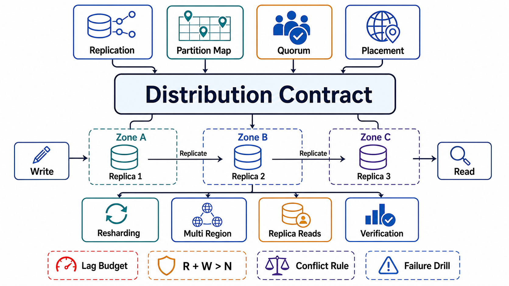

# Chapter 05: Replication, Partitioning, and Quorum Semantics

## Abstract

Distribution improves capacity only when partition ownership, replication lag, quorum reads/writes, rebalancing, and conflict handling are explicit — undocumented consistency behavior becomes a latent correctness defect. This chapter is the delivery layer for everything Chapters 03 and 04 contracted: replication topologies and acknowledgment rungs that turn RPO budgets into configuration, consensus deployed exactly where Chapter 03's single-arbiter rule demanded it and kept off every path that merely wanted a fast answer, quorum geometry derived from correlated failure models rather than the R+W>N folklore, partition maps as fenced control-plane state with one consensus-backed writer, resharding as a seven-phase migration with rollback armed before cutover, multi-region topologies whose conflict semantics are product decisions made in daylight, and replica reads that deliver each declared consistency claim through named mechanisms with violation SLIs.

The scar tissue is the chapter's spine: GitHub 2018 — a 43-second partition minting a second MySQL primary, 24+ hours of reconciliation, the incident that makes fencing-first non-negotiable ([post-incident analysis](https://github.blog/2018-10-30-oct21-post-incident-analysis/)); Roblox 2021 — a coordination service accreted into the availability ceiling of an entire platform, down for 73 hours along with the tooling needed to fix it ([return to service](https://about.roblox.com/newsroom/2022/01/roblox-return-to-service-10-28-10-31-2021)); and the standing Jepsen record that distribution guarantees are falsified, not documented, into existence ([analyses](https://jepsen.io/analyses)). One sentence for the whole chapter: every mechanism distribution adds — replicas, quorums, maps, regions — is also a new failure surface, and the design is complete only when each surface has a failure row, a degraded contract, and a drill.

## Chapter Structure

Each file is a self-contained research note: abstract, formal model, ASCII figures, decision tables, approval gates that can fail a design, and primary-source references. The reading order is a dependency graph (see [00-chapter-file-map.md](00-chapter-file-map.md)).

| Order | File | Concept |
|---:|---|---|
| 0 | [00-chapter-file-map.md](00-chapter-file-map.md) | Folder map, dependency graph, seams to Chapters 02/03/04/06 |
| 1 | [01-replication-topologies-and-lag.md](01-replication-topologies-and-lag.md) | Three topologies, the acknowledgment ladder as RPO fact, lag as a distribution |
| 2 | [02-consensus-and-coordination-services.md](02-consensus-and-coordination-services.md) | What consensus buys, Raft at review altitude, coordination-service accretion discipline |
| 3 | [03-quorum-semantics.md](03-quorum-semantics.md) | Honest quorum arithmetic, sloppy quorums, Aurora's correlated-failure geometry |
| 4 | [04-partitioning-and-placement.md](04-partitioning-and-placement.md) | Schemes, consistent hashing and vnodes, the map as fenced control-plane state, secondary indexes |
| 5 | [05-rebalancing-and-resharding.md](05-rebalancing-and-resharding.md) | Shard-count arithmetic, movement budgets, the seven-phase live split, whale-key surgery |
| 6 | [06-multi-region-and-conflict-handling.md](06-multi-region-and-conflict-handling.md) | Topology menu with bills itemized, conflict-resolution semantics, evacuation as the drill |
| 7 | [07-replica-reads-and-consistency-delivery.md](07-replica-reads-and-consistency-delivery.md) | The delivery matrix, token mechanics, honest follower reads, claim-pooled fleets |
| 8 | [08-failure-modes-and-degradation.md](08-failure-modes-and-degradation.md) | The failure catalog, correlated-failure math, degraded modes as typed contracts |
| 9 | [09-verification-of-distribution.md](09-verification-of-distribution.md) | Adversarial harnesses, distribution SLIs, drills R1–R10, topology-generation stamps |
| 10 | [10-distribution-review-templates.md](10-distribution-review-templates.md) | Executable dossier and approval checklist |

## Source Corpus

| Source | Official Material | Standard Imported Into This Chapter |
|---|---|---|
| Ongaro & Ousterhout | [Raft: In Search of an Understandable Consensus Algorithm](https://raft.github.io/raft.pdf) | The replicated log as the primitive from which elections, fencing epochs, and linearizable state machines derive; understandability as an engineering property with correctness consequences. |
| Amazon / Dynamo lineage | [Dynamo, SOSP 2007](https://www.allthingsdistributed.com/2007/10/amazons_dynamo.html), [DynamoDB global tables](https://docs.aws.amazon.com/amazondynamodb/latest/developerguide/V2globaltables_HowItWorks.html) | Sloppy quorums and hinted handoff as availability purchased with the overlap guarantee; version vectors and sibling resolution; LWW as a shipped default whose data-loss acknowledgment is rarely co-shipped. |
| AWS Aurora | [SIGMOD 2017](https://dl.acm.org/doi/10.1145/3035918.3056101), [Quorums and correlated failure](https://aws.amazon.com/blogs/database/amazon-aurora-under-the-hood-quorum-and-correlated-failure/) | Quorum geometry derived from the correlated failure model (6/4/3 for AZ+1); asymmetric quorums — pay the read quorum only during recovery; the log as the database. |
| Google Spanner | [OSDI 2012 / TrueTime](https://docs.cloud.google.com/spanner/docs/true-time-external-consistency) | External consistency across regions is purchasable — with bounded-uncertainty clocks, commit-wait, and Paxos per write; the honest price list for making timestamps mean something. |
| Karger et al. | [Consistent hashing, STOC 1997](https://dl.acm.org/doi/10.1145/258533.258660) | Bounded key movement under membership change; virtual nodes for variance and heterogeneity. |
| GitHub | [October 2018 post-incident analysis](https://github.blog/2018-10-30-oct21-post-incident-analysis/) | The split-brain shape: promotion without fencing during a 43-second partition; restore duration as the outage; the incident drills R1/R2 exist to pre-empt. |
| Roblox / HashiCorp | [Return to Service, October 2021](https://about.roblox.com/newsroom/2022/01/roblox-return-to-service-10-28-10-31-2021) | Coordination-service accretion as the availability ceiling; streaming-fanout and log-store pathologies under load; management tooling that must not depend on the layer it manages. |
| Notion / Vitess | [Sharding Postgres at Notion](https://www.notion.com/blog/sharding-postgres-at-notion), [Vitess resharding](https://vitess.io/docs/faq/sharding/overview/what-is-resharding-how-does-it-work/) | Shard-count arithmetic (480 = divisibility as elasticity); live resharding as copy → tail → verify → fenced cutover with reverse replication. |
| CockroachDB | [Follower reads](https://www.cockroachlabs.com/docs/stable/follower-reads), [Bounded staleness reads](https://www.cockroachlabs.com/blog/bounded-staleness-reads/) | Staleness declared at the call site; the system maximizes freshness within the bound; unavailability of fresh-enough replicas as a visible outcome, never a silent downgrade. |
| Jepsen | [Analyses](https://jepsen.io/analyses) | The falsification record: consistency claims verified only by adversarial history checking under partitions and pauses; the methodology this chapter's harness gate mandates. |
| Terry et al. / Kleppmann | [Session guarantees, PDIS 1994](https://dl.acm.org/doi/10.1109/PDIS.1994.331722), [*DDIA*](https://dataintensive.net/) | The claims replica reads must deliver; replication's three problems (leader failure, lag, concurrent writes) as the topology-selection lens. |

## Chapter Standards

1. Topology follows writer cardinality: single-writer state gets single-leader; only merge-priced state enters multi-leader or leaderless.
2. The acknowledgment rung is declared per state item; it *is* the RPO; semi-sync degradation pages; failover eligibility enforces the rung.
3. Consensus is control-plane machinery: deployed where a single authority is contractually required, never on paths that wanted speed rather than agreement.
4. The coordination service has a tenant inventory with admission control, fanout budgets, and a management path that does not depend on it.
5. Quorum geometry is derived from a declared, correlated failure model; R+W>N is a mechanism inventory, never a consistency claim.
6. Sloppy quorums are an availability feature confined to paths whose contracts already forgave them; failed writes are ambiguous, not undone.
7. The partition map has one consensus-backed writer, versioned LKG distribution, and epoch-fenced ownership; stale routers get redirects, never silent service.
8. Secondary indexes across partitions declare their price: scatter fanout (local) or lag-plus-rebuild (global).
9. Shard counts are computed with divisibility headroom; movement is admission-controlled with priorities; resharding is a seven-phase fenced migration with rollback armed before cutover.
10. Multi-region conflict semantics are declared per dataset with data-loss honesty; wall-clock arbitration claims nothing beyond "one side wins arbitrarily" without Spanner-class clock machinery.
11. Every read path's claim is delivered by a named mechanism — tokens, stickiness, lag-gated pools, or the leader — with a per-claim violation SLI.
12. Every distribution mechanism has a failure row: detection signature, response, owner, and a typed degraded mode reachable by drill.
13. Availability arithmetic includes correlated-failure and shared-change terms; replica count answers neither dominant term.
14. Consistency claims are proven by adversarial history checking under partitions and pauses — drills that only kill processes test the polite half of the failure space.
15. Distribution evidence carries class, date, and topology generation; fleet, placement, or map changes reset it to `assumed`.

## Chapter Completion Gate

Chapter 05 is complete only when the reviewer can answer these questions without guessing:

- For any state item: which topology replicates it, at which acknowledgment rung, and what exactly is lost if the leader dies right now?
- For any authority: which consensus group arbitrates it, and what happens to the data plane when that group is unavailable for an hour?
- For any quorum store: what is the geometry, what correlated failure was it sized for, and does it go sloppy under failure — and do its readers know?
- For any key: which partition owns it, who may change that fact, and what fences the old owner after it changes?
- For the largest key in the system: what absorbs its growth, and is the surgery path built?
- For any region: what is the computed RPO of losing it, when was evacuation last rehearsed, and what breaks that isn't data?
- For any read path: which mechanism delivers its claim over replicas, and what is its violation rate today?
- For every claim above: what is the evidence class, its date, and the topology generation it was proven at?

## Final Position

Distribution is the art of buying capacity and availability with copies while refusing to pay for them with correctness — and the refusal only holds where ownership is fenced, lag is contracted, quorums are sized for the failures that actually co-occur, and every guarantee has been made to fail on purpose before production finds the same fault by accident. This chapter closes the storage arc: Chapter 03 said what must be true, Chapter 04 laid it out, Chapter 05 spread it across machines that fail. Chapter 06 takes the same discipline to the event logs and streams that connect systems to each other.
