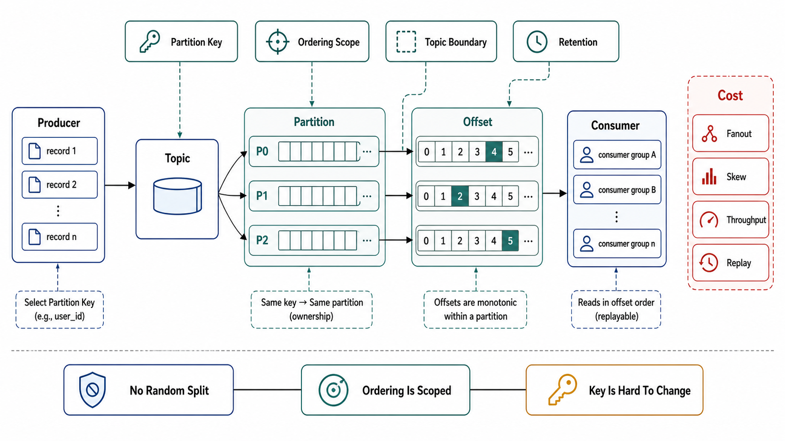

# The Log Abstraction and Topic Design



## Abstract

The append-only log is the simplest storage abstraction that solves three distributed-systems problems at once — ordering, durability-for-replay, and producer/consumer decoupling — which is why Kreps' argument that the log is the unifying abstraction beneath databases, replication, and stream processing ([LinkedIn Engineering](https://engineering.linkedin.com/distributed-systems/log-what-every-software-engineer-should-know-about-real-time-datas-unifying)) has held up for over a decade of production systems built on it. The brutal part the pitch omits: every one of those gifts is scoped to a *partition*, and the partition is chosen by a key hash fixed at produce time. The partition key is therefore not a tuning parameter — it is the ordering contract of the entire downstream system, it is nearly impossible to change without a full topic migration, and the single most expensive class of streaming defect in this chapter traces back to a key chosen for load distribution when the consumers needed it for ordering (or vice versa). This file prices the log honestly: what it buys, what topic/partition/key design decides irrevocably, and the arithmetic that must precede the first produced event.

## 1. The Formal Object

A topic T is a set of partitions {P₀…Pₙ₋₁}. Each partition is an append-only sequence of records addressed by a monotonically increasing offset. The system's guarantees, stated exactly:

- **Total order within one partition; no order across partitions.** "The topic is ordered" is a false statement for n>1, and designs that assume it fail silently under normal operation.
- **Route(record) = hash(key) mod n** (default partitioner). Records sharing a key share a partition and therefore share an order. Null-keyed records are sprayed (round-robin/sticky) — maximal balance, zero ordering.
- **Offsets are per-partition consumer cursors, not global positions.** Consumer progress is a vector of offsets, one per partition; there is no meaningful "position in the topic."
- **The broker does not track delivery.** Consumers own their offsets (Chapter 01 file 07 §8's commit-order semantics); the log is passive storage plus ordering, which is precisely why it scales and precisely why every delivery guarantee in file 02 is the *client's* job.

```text
Figure 1. Topic anatomy: ordering lives per partition, nowhere else.

  Topic "orders"  (n = 4 partitions)

  P0: [0][1][2][3][4][5]──►      key K1, K5  ─┐
  P1: [0][1][2][3]──────►        key K2      ─┼─ hash(key) mod 4
  P2: [0][1][2][3][4]───►        key K3, K7  ─┤
  P3: [0][1]────────────►        key K4      ─┘

  Guaranteed:  order(K1 events) — all in P0, offset-ordered
  NOT guaranteed: order between K1 and K2 events (different
  partitions; consumers may be minutes apart in lag)

  Consumer position = {P0:4, P1:4, P2:2, P3:2} — a vector,
  not a point.
```

## 2. What the Log Buys — Priced

| Property | Mechanism | Price |
|---|---|---|
| Replayability | Retention keeps records after consumption; consumers rewind by offset | Storage grows with retention × throughput; replay correctness requires consumer idempotence (file 02) — the log enables replay, it does not make replay safe |
| Producer/consumer decoupling | Broker buffers between rates | The buffer is bounded by retention; a consumer slower than its producer is not "decoupled," it is *dying on a schedule* (lag runaway, file 09 §2) |
| Fan-out | k consumer groups read independently at zero producer cost | k× read amplification on the broker; lag SLIs multiply by k (Chapter 03 file 05's DAG lag, transported here) |
| Recovery/rebuild | Derived state rebuilt by replay from offset 0 or a snapshot | Bounded by retention (file 07) — a rebuild claim without a retention contract is a false claim |
| Ordering | Per-partition total order | Scoped by key choice; serialized through one partition leader (Chapter 05 file 04) — the ordering scope is also the parallelism ceiling |

The connective truth across all five rows: the log converts *temporal coupling* into *storage and lag*. That is almost always a good trade — storage is cheap, synchronous coupling is lethal — but the trade is only visible if lag and retention are first-class SLIs, which is why file 03 makes lag the master signal and file 07 makes retention a contract rather than a config default.

## 3. The Partition Key Is the Ordering Contract

The key decision, made explicit because it is made irrevocably:

| Key choice | Ordering scope | Balance behavior | Legitimate when |
|---|---|---|---|
| Entity ID (order_id, user_id) | Per entity — the usual correctness need | Skew follows entity activity; hot entities → hot partitions (the Discord hot-partition mechanics of Chapter 04 file 01, replayed on a log) | Consumers apply per-entity state transitions; the common correct default |
| Coarse ID (tenant_id, region) | Per tenant — everything in a tenant serialized | Severe skew at large-tenant tail; one partition = one tenant's ceiling | Almost never; a tenant-sized ordering need usually hides a design error |
| Null / random | None | Perfect | Ordering-free workloads only (metrics, logs-as-in-logging); must be *declared*, because a later consumer that assumes order will be wrong quietly |
| Composite (entity + shard salt) | Per (entity, salt) — order broken *within* the entity | Rescues hot entities | Only with a consumer-side reorder/merge, which is expensive and usually a smell |

Two failure shapes account for most key-choice incidents. **Key too fine**: events for one business entity land in multiple partitions and interleave — the consumer observes `order_shipped` before `order_created`, and no amount of consumer logic fully recovers cross-partition order without a reorder buffer bounded by the very lag it cannot control. **Key too coarse**: one partition carries a whale tenant, its consumer pegs at 100% while nineteen siblings idle, and adding partitions does nothing because the key, not the count, is the bottleneck. The gate: the key is chosen from the *consumer's ordering requirement*, written down as "events for X must be observed in order" — never from producer-side load convenience.

## 4. Partition-Count Arithmetic

Partition count n sets three ceilings simultaneously, and must be derived, not defaulted:

1. **Consumer parallelism ceiling.** One partition is consumed by at most one consumer in a group (file 03); n partitions = max n workers. Sizing rule: n ≥ peak_throughput / single_consumer_throughput, with the measured (not estimated) per-consumer rate, times a growth factor — Notion's shard arithmetic (Chapter 05 file 04) applies verbatim.
2. **Ordering-scope granularity.** Larger n spreads keys thinner; it never fixes a hot key (a key maps to exactly one partition at any n).
3. **The repartitioning cliff.** Changing n changes hash(key) mod n for almost every key: records for one key now straddle the old and new partition, and *ordering is broken across the boundary*. Compacted topics (file 07) additionally scatter their key history. The honest procedure is a new topic + dual-write or replay migration (Chapter 03 file 07's expand–contract, applied to topics) — which is why n is chosen with 5–10× headroom up front, and why "we'll just add partitions later" is a plan to break ordering later.

## 5. Topic Granularity

| Design | Consequence | Verdict |
|---|---|---|
| One topic per event *type* (`order-created`, `order-shipped`) | Cross-type ordering lost — the type boundary splits one entity's history across partitions of different topics | Wrong wherever consumers apply entity state machines |
| One topic per *entity stream* (`orders`, keyed by order_id, typed events inside) | Per-entity order preserved; consumers filter types; schema governance carries multiple types per topic (file 08) | The correct default for domain events |
| One shared "events" firehose | Every consumer reads everything; lag, retention, and schema blast radius fully coupled across teams | Fails the file 08 governance gates; a topology, not a topic |
| Per-tenant topics | Topic-count explosion (broker metadata pressure); rebalance and governance overhead × tenants | Only at small, contractual tenant counts |

## 6. When the Log Is the Wrong Tool

The chapter's machinery is expensive — key design, lag SLIs, poison detours, retention contracts — and a fraction of it exists only to compensate for logs deployed where the workload wanted something else. The admission decision, made explicit:

| Workload shape | Right tool | Why the log fails it |
|---|---|---|
| Replay, rebuild, fan-out to k independent readers, per-key ordering | Partitioned log | — this is what the log is for |
| Competing consumers on independent work items: no ordering need, parallelism beyond any sane partition count, per-message retry isolation | Queue semantics — SQS/AMQP, or Kafka share groups ([KIP-932](https://cwiki.apache.org/confluence/display/KAFKA/KIP-932%3A+Queues+for+Kafka), production-ready in Kafka 4.2): many consumers per partition, per-record acknowledgment and redelivery | On a log, one slow record blocks its partition (file 05's poison problem), parallelism caps at partition count (file 03), and every consumer pays for ordering nobody asked for |
| Caller needs the answer | Request/response (Chapter 01 file 04; Chapter 07) | A log in the request path adds a broker hop plus consumer-scheduling latency to every call and converts a timeout into an orphaned event |
| Deadlines, priorities, cancellation | A scheduler/queue with those primitives (Chapter 09) | Offsets have no priority; a log cannot cancel record 4,001 because record 4,000,000 became urgent |

Kafka shipping queue semantics natively sharpens rather than blurs this: the decision was never "Kafka vs RabbitMQ" — it is *ordered replayable stream vs acknowledged work queue*, chosen per workload, sometimes on the same cluster. The anti-pattern the row exists to catch: the task queue built on consumer groups, where file 05's entire retry-topic apparatus is reconstructing the per-message ack a queue would have provided for free — while share groups' price must be stated with equal honesty: no ordering, no offset-based replay, no rebuild-from-history. A workload that needs *both* narratives and work distribution is two flows, not one topic.

## 7. Approval Gates

| Gate | Evidence Required | Failure Condition |
|---|---|---|
| Ordering-contract gate | The partition key derived from a written consumer ordering requirement ("events for X observed in order"); null-key declared ordering-free | Key chosen for load spreading with ordering assumed anyway; "topic is ordered" claimed for n>1 |
| Arithmetic gate | n derived from measured per-consumer throughput + growth headroom; the repartitioning cliff acknowledged with a migration plan | Default partition count; "add partitions later" as the scaling answer for a keyed topic |
| Skew gate | Key cardinality and hot-key distribution measured against partition count (Chapter 04 file 01's skew analysis); whale keys identified | Uniform-key assumption on entity-activity data |
| Decoupling-honesty gate | Consumer rate ≥ producer rate demonstrated, or lag growth alarmed with runway-to-retention math (file 09) | "The log buffers it" as the answer to a permanently slower consumer |
| Scope gate | Topic granularity from the entity-stream row justified against the table above | Per-type topics carrying entity state machines |
| Tool-fit gate | The log's gifts (replay, order, fan-out) named per flow as the reason it was chosen; work-queue workloads routed to queue semantics (§6) | "Kafka because we have Kafka" — a task queue on consumer groups, with poison machinery compensating for the missing per-message ack |

## Output

The output of this file is a topic design with its irrevocable decisions made deliberately: the log admitted only where its gifts were the requirement, a partition key derived from the consumers' written ordering requirement, a partition count derived from measured throughput with repartitioning acknowledged as a migration rather than a knob, skew analysis against real key distributions, and topic granularity that keeps one entity's history in one ordered stream.

## References

- [Kreps, "The Log: What every software engineer should know about real-time data's unifying abstraction," LinkedIn Engineering, 2013](https://engineering.linkedin.com/distributed-systems/log-what-every-software-engineer-should-know-about-real-time-datas-unifying)
- [Apache Kafka documentation — design: topics, partitions, ordering, and the consumer position model](https://kafka.apache.org/documentation/#design)
- [Kreps, Narkhede, Rao, "Kafka: a Distributed Messaging System for Log Processing," NetDB 2011](https://notes.stephenholiday.com/Kafka.pdf)
- [Kleppmann, *Designing Data-Intensive Applications* — partitioned logs and derived data](https://dataintensive.net/)
- [KIP-932 — Queues for Kafka: share groups, per-record acknowledgment (production-ready in Kafka 4.2)](https://cwiki.apache.org/confluence/display/KAFKA/KIP-932%3A+Queues+for+Kafka)
- [Morling, "Let's Take a Look at… KIP-932: Queues for Kafka!" — the semantics trade analysis behind §6](https://www.morling.dev/blog/kip-932-queues-for-kafka/)
