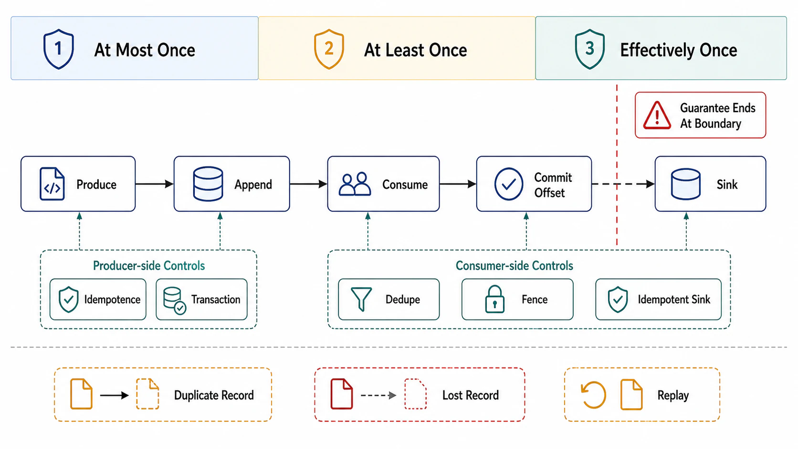

# Delivery Semantics and Idempotent Consumption



## Abstract

Exactly-once *delivery* is impossible in an asynchronous network with failures — the Two Generals result applied to acknowledgments means a sender can never distinguish "processed, ack lost" from "never processed," so it must choose between re-sending (at-least-once) and not (at-most-once) ([Treat's canonical statement of the argument](https://bravenewgeek.com/you-cannot-have-exactly-once-delivery/)). What production systems achieve instead is exactly-once *processing semantics*: at-least-once delivery composed with deduplication or transactional atomicity so that duplicates have no observable effect. Kafka's KIP-98 machinery — idempotent producers via broker-side (producer-ID, sequence-number) fencing, and transactions that commit produced records and consumed offsets atomically ([KIP-98](https://cwiki.apache.org/confluence/display/KAFKA/KIP-98+-+Exactly+Once+Delivery+and+Transactional+Messaging), [Confluent's design exposition](https://www.confluent.io/blog/exactly-once-semantics-are-possible-heres-how-apache-kafka-does-it/)) — is the reference implementation of this composition. The trap this file exists to close: those guarantees hold *within* the log system, and evaporate at the boundary where a consumer touches an external database, an API, or a user. End-to-end semantics are therefore a property the last hop must earn, always, and the consumer-side idempotency contract (Chapter 01 file 04 §3) is not an optimization — it is the only thing standing between "at-least-once" and "we double-charged customers."

## 1. The Delivery-Semantics Lattice

| Semantics | Producer behavior | Consumer offset behavior | Observable failure |
|---|---|---|---|
| At-most-once | Fire, don't retry | Commit *before* processing | Loss: crash between commit and process drops records |
| At-least-once | Retry until ack | Commit *after* processing | Duplicates: crash between process and commit replays records |
| "Exactly-once" (processing) | At-least-once + dedup/transactions | Offset commit atomic with the side effect | Neither — *within the transactional boundary only* |

The commit-order rule is Chapter 01 file 07 §8's contract, restated as the load-bearing default: **commit after processing, and make processing idempotent.** At-most-once is legitimate only where the record's value expires faster than a retry (real-time telemetry ticks); it must be declared, because a consumer that commits early "for throughput" has silently changed the system's data-loss contract.

## 2. The Producer Side: Idempotence and Transactions

```text
Figure 1. KIP-98 machinery: what each layer fences.

  ── idempotent producer (dedup within one partition session) ──
  producer (PID=7)                       broker, partition P0
     send batch seq=41 ────────────────►  expect 41 ✓ append
     (ack lost, retry)                    
     send batch seq=41 ────────────────►  41 ≤ last(41): DUPLICATE
                                          drop, re-ack  ✓
  ── transactions (atomic multi-partition + offsets) ──
     begin txn
       produce → topic-B  P2             all-or-nothing via
       produce → topic-C  P1             transaction coordinator
       sendOffsets(source offsets)       (2-phase: PREPARE →
     commit txn ────────────────────────► COMMIT markers in logs)
     
     consumers with isolation.level=read_committed
     skip records of aborted txns; zombie producers
     fenced by epoch bump on the transactional.id
```

Three facts that decide designs. First, the idempotent producer removes only *retry* duplicates on *one partition from one producer session* — it does nothing about application-level re-sends (the app calling `send()` twice is two logical records with two sequence numbers). Second, transactions make **consume → transform → produce** atomic when source and sink are both the log: offsets are committed inside the transaction, so a crash replays from the last committed transaction and aborted output is invisible to `read_committed` readers — this is the machinery Kafka Streams' `processing.guarantee=exactly_once_v2` rides, and file 06 composes it with checkpointing. Third, zombie fencing (epoch bump on `transactional.id` reuse) is what makes the guarantee survive the *pair* of failures — old instance wedged but alive, new instance started — that defeats naive locking; it is Chapter 03's fencing-token argument (Kleppmann) reappearing with the broker as the arbiter.

## 3. The Boundary: Where Guarantees Go to Die

Kafka transactions end at Kafka. The moment the consumer's side effect is an external system — a row in Postgres, a payment API call, an email — the transaction cannot cover it, and one of three end-to-end patterns must:

| Pattern | Mechanism | Guarantee | Price |
|---|---|---|---|
| Idempotent side effect | Natural idempotence (UPSERT keyed by event ID; state overwrite) | Duplicates converge — the strongest cheap option | Requires the operation to *be* idempotent; increments and appends are not |
| Dedup table | Transactionally record processed event IDs in the *same* store as the side effect; skip seen IDs | Exactly-once effect per store | A table + a uniqueness check per event; ID retention must exceed max replay window |
| Two-phase commit sink | Sink participates in the processor's checkpoint (Flink's TwoPhaseCommitSinkFunction, file 06) | Exactly-once into 2PC-capable sinks | Sink must support prepare/commit; latency coupled to checkpoint interval |

The dedup-table pattern is the outbox pattern's mirror image (Chapter 03 file 05): outbox makes *producing* atomic with a database write; the dedup table makes *consuming* atomic with one. Both work because they put the atomicity where a real transaction exists — inside one database — instead of pretending one spans systems. And the event ID they key on must be assigned at the *origin* (producer-side UUID in the envelope, file 08), not derived from offsets, because replays and topic migrations renumber offsets but preserve identity.

For consumer-side calls to external APIs, the Idempotency-Key contract ([IETF draft](https://datatracker.ietf.org/doc/draft-ietf-httpapi-idempotency-key-header/), imported in Chapter 01 file 04 §3) is the transport: key = event ID, and the API's dedup window must exceed the consumer's maximum redelivery horizon — a number the review must actually compare, because a 24-hour API dedup window under a 7-day replay policy is a silent double-execution license.

## 4. Duplicate Arithmetic

At-least-once duplicates are not rare-event noise; they arrive in bursts exactly when the system is already degraded. Every rebalance replays the uncommitted tail of each partition (up to `max.poll.records` × in-flight batches per worker); every consumer crash replays since its last commit; every DLQ replay (file 05) re-delivers by design. Rule of thumb the review should demand: duplicate rate ≈ (rebalance rate × mean uncommitted tail) + failure replays, spiking 3–5 orders of magnitude above steady state during incidents. A dedup mechanism sized against steady-state duplicate rates fails on the day it exists for — Chapter 02's metastability argument, in miniature.

## 5. Approval Gates

| Gate | Evidence Required | Failure Condition |
|---|---|---|
| Vocabulary gate | Claims stated as "at-least-once delivery + idempotent effect" or "transactional processing within the log"; the boundary where log-internal guarantees end is drawn on the dataflow diagram | "Exactly-once delivery" claimed anywhere; guarantees asserted across the external-sink boundary without a §3 pattern |
| Commit-order gate | Offsets committed after side effects; any commit-before-process path declared as at-most-once with a data-loss sign-off | Early commit discovered in code review rather than declared |
| Identity gate | Origin-assigned event ID in every envelope; dedup keyed on it; ID retention ≥ max replay horizon (retention policy, file 07) | Offset-derived identity; dedup window shorter than replay window |
| Non-idempotent-effect gate | Every increment/append/charge-class side effect covered by a dedup table or 2PC sink — named, not implied | "The consumer is basically idempotent" without enumeration of effects |
| Burst gate | Dedup capacity and uniqueness-check throughput sized for rebalance-burst duplicate rates, not steady state | Dedup store that falls over during the incident that produces duplicates |

## Output

The output of this file is an end-to-end delivery contract per event flow: the honest semantics named at each hop, producer idempotence and transactions deployed where the log can enforce them, one of the three boundary patterns deployed where it cannot, origin-assigned identity threading the whole path, and dedup machinery sized for the bursty duplicate arithmetic of real failures rather than the calm of steady state.

## References

- [KIP-98 — Exactly Once Delivery and Transactional Messaging, Apache Kafka](https://cwiki.apache.org/confluence/display/KAFKA/KIP-98+-+Exactly+Once+Delivery+and+Transactional+Messaging)
- [Narkhede, "Exactly-Once Semantics Are Possible: Here's How Kafka Does It," Confluent, 2017](https://www.confluent.io/blog/exactly-once-semantics-are-possible-heres-how-apache-kafka-does-it/)
- [Treat, "You Cannot Have Exactly-Once Delivery," 2015 — the impossibility argument](https://bravenewgeek.com/you-cannot-have-exactly-once-delivery/)
- [Apache Kafka documentation — message delivery semantics](https://kafka.apache.org/documentation/#semantics)
- [IETF HTTPAPI — The Idempotency-Key HTTP Header Field (draft)](https://datatracker.ietf.org/doc/draft-ietf-httpapi-idempotency-key-header/)
- [Kleppmann, "How to do distributed locking," 2016 — fencing tokens, the argument transactions' epoch fencing implements](https://martin.kleppmann.com/2016/02/08/how-to-do-distributed-locking.html)
