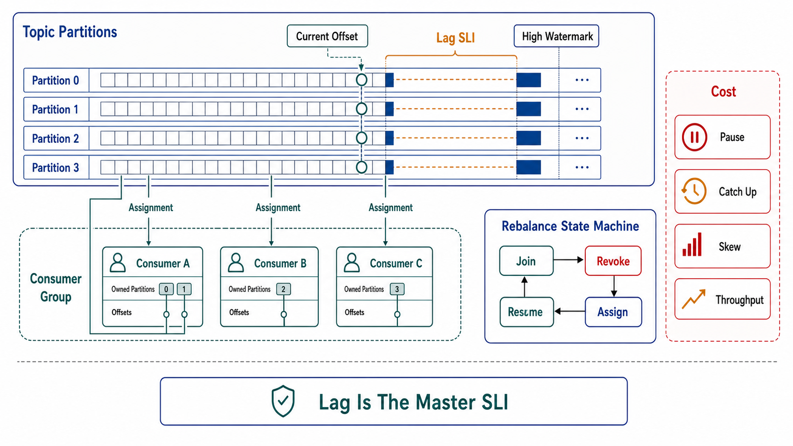

# Consumer Groups, Lag, and Rebalancing



## Abstract

The consumer group is the log's unit of horizontal scale — partitions assigned across group members, each partition to exactly one member — and its coordination protocol is where streaming systems concentrate their self-inflicted downtime. The original "stop-the-world" rebalance revoked *every* partition from *every* member whenever any member joined, left, or merely missed a heartbeat, so one slow consumer or one rolling deploy paused an entire group's consumption; incremental cooperative rebalancing ([KIP-429](https://cwiki.apache.org/confluence/display/KAFKA/KIP-429%3A+Kafka+Consumer+Incremental+Rebalance+Protocol)) and static membership ([KIP-345](https://cwiki.apache.org/confluence/display/KAFKA/KIP-345%3A+Introduce+static+membership+protocol+to+reduce+consumer+rebalances)) exist specifically because that cost was intolerable at fleet scale, and the broker-driven protocol ([KIP-848](https://cwiki.apache.org/confluence/display/KAFKA/KIP-848%3A+The+Next+Generation+of+the+Consumer+Rebalance+Protocol) — GA since Kafka 4.0, opt-in via `group.protocol=consumer`, slated to become the default) removes the client-side synchronization barrier entirely: assignment is computed broker-side and reconciled incrementally per member, so the epidemic failure mode of one member stalling the whole group's join protocol structurally cannot occur. Above the mechanics sits the one signal that summarizes a streaming system's health: **consumer lag** — not as a count of records but as *time*: how far behind the present this consumer's view of the world is, and whether that distance is shrinking. Lag is the master SLI of this chapter; everything in files 04 and 09 is machinery for keeping it bounded.

## 1. Group Mechanics — the Facts That Bind

- **Assignment invariant:** at most one consumer per partition per group. Parallelism ceiling = partition count (file 01 §4). Extra members idle as warm spares — legitimate, but they must be *known* to be spares. (Share groups relax this invariant — at the price of ordering and offset-replay; that is a different tool, admitted in file 01 §6, not a tuning of this one.)
- **Liveness is two-dimensional:** `session.timeout.ms` (heartbeat thread — is the process alive?) and `max.poll.interval.ms` (is the *processing loop* alive?). The second is the one that fires in practice: a consumer stuck 6 minutes on a slow database call under a 5-minute poll interval is evicted, its partitions replayed elsewhere, and — if the stall is workload-caused — the successor stalls too. This is the rebalance-storm seed (file 09 §1).
- **Offsets belong to the group**, stored broker-side keyed by (group, topic, partition). Changing a group ID silently means "start over from `auto.offset.reset`" — a config typo away from reprocessing a week of events or skipping to the end.

## 2. Rebalance Cost Models

```text
Figure 1. Eager vs cooperative rebalance under one member joining.

  EAGER (classic):                COOPERATIVE (KIP-429):
  t0  C3 joins                    t0  C3 joins
  t1  ALL members revoke ALL      t1  members keep partitions;
      partitions                      assignor computes minimal move:
  t2  world stops: 0 partitions       {P5: C1 → C3}
      consumed; state gone,       t2  only C1 revokes P5;
      uncommitted tails queued        P0–P4, P6–P8 never pause
  t3  full reassignment; every    t3  C3 assumes P5
      member re-fetches, re-
      builds state, replays tail
      
  pause scope: whole group        pause scope: moved partitions only
  duplicate scope: every          duplicate scope: P5's uncommitted
  partition's uncommitted tail    tail only
```

The cost of a rebalance is not the coordination round-trip; it is (a) the consumption pause across affected partitions, (b) the replay of every affected partition's uncommitted tail (file 02 §4's duplicate burst), and (c) for stateful consumers, state re-fetch/rebuild on the new owner — which for a Streams/Flink-class operator with gigabytes of state turns a "quick rebalance" into minutes of lag accrual. The state-rebuild term has its own dedicated mitigation: standby replicas (Kafka Streams' `num.standby.replicas`, with warm-up movement per [KIP-441](https://cwiki.apache.org/confluence/display/KAFKA/KIP-441%3A+Smooth+Scaling+Out+for+Kafka+Streams)) keep a second copy of each task's state on another member, so ownership transfer is a changelog catch-up rather than a from-zero rebuild — memory and disk spent to make rebalance cheap, a purchase any gigabyte-scale stateful group should be making deliberately. Static membership (KIP-345) attacks the most common trigger — rolling restarts — by letting a returning member with the same `group.instance.id` reclaim its partitions within the session timeout with *no rebalance at all*. The deployment rule that follows: stateful consumer fleets run cooperative assignment + static membership + restart-completes-within-session-timeout, and a review that finds eager assignment on a stateful group in 2026 has found negligence, not a trade-off.

## 3. Lag as the Master SLI

Record-count lag (`log-end-offset − committed-offset`) is the raw gauge, and it misleads in both directions: 100,000 records behind is nothing at 1M rec/s and catastrophic at 10 rec/s. The derived signals that actually operate a system:

| Signal | Definition | What it answers |
|---|---|---|
| Time lag | now − timestamp(last committed record) | How stale is every downstream view? The number Chapter 03 file 05's freshness SLIs consume |
| Lag velocity | d(lag)/dt | Falling = recovering; **flat under load = capacity exactly consumed (one incident from runaway); rising = already failing**, whatever the absolute number |
| Catch-up runway | lag ÷ (consume_rate − produce_rate), valid only when positive | Time-to-recovery after an incident; infinite when velocity ≥ 0 |
| Retention runway | (retention_horizon − oldest_unconsumed_age) | Time until unconsumed data is *deleted* — the deadline lag runaway is racing (file 09 §2) |

LinkedIn's Burrow codified the operational insight behind these ([Burrow](https://github.com/linkedin/Burrow)): evaluate lag by *consumer behavior over a window* — is the committed offset advancing, is lag monotonically growing — rather than by a fixed threshold, because every fixed record-count threshold is simultaneously too noisy for one topic and too late for another. The alerting rule this chapter standardizes: page on **time-lag SLO breach** and on **positive lag velocity sustained beyond one evaluation window**, never on raw record counts.

## 4. Assignment Strategy and Skew

Range assignment plus correlated key skew (file 01 §3) yields the classic pathology: one member owns the whale partitions and pegs while its siblings idle — group-level throughput fine, per-partition time lag terrible. The diagnosis discipline: lag dashboards render **per-partition**, never only group-aggregate, because aggregate lag hides exactly the partition that is about to breach retention. Remedies in order of honesty: fix the key (file 01), then weight-aware assignment, then — last, with its ordering cost priced — composite-key salting.

## 5. Approval Gates

| Gate | Evidence Required | Failure Condition |
|---|---|---|
| Protocol gate | Cooperative assignment + static membership on stateful groups; restart duration measured < session timeout; KIP-848 posture stated for new deployments | Eager assignment on stateful consumers; rolling deploys observed triggering full rebalances |
| Liveness-budget gate | `max.poll.interval.ms` sized from measured worst-case batch processing time × safety factor; slow-dependency stalls bounded by client timeouts (Chapter 01 file 08's budgets) inside the poll loop | Poll-loop eviction storms under dependency slowness; timeout raised as the "fix" without bounding the work |
| Lag-SLI gate | Time lag, lag velocity, catch-up runway, and retention runway computed per partition; alerts on time-SLO breach and sustained positive velocity | Record-count thresholds as the only alarm; group-aggregate-only dashboards |
| Identity gate | Group IDs and `auto.offset.reset` under change control; reset behavior on unknown group verified in a drill (E-series, file 10) | A group-ID typo able to silently skip or replay history |
| Spare-capacity gate | Member count vs partition count stated; idle members declared as spares; scale-out beyond partition count recognized as a no-op | "We added consumers" as a fix for a partition-count ceiling |

## Output

The output of this file is a consumer-group configuration with its coordination costs engineered rather than suffered: cooperative and static membership eliminating avoidable rebalances, liveness budgets derived from measured processing time, per-partition time-lag/velocity/runway SLIs wired to alerts, and the parallelism ceiling and skew behavior of the assignment read directly against the topic design of file 01.

## References

- [KIP-429 — Kafka Consumer Incremental Rebalance Protocol](https://cwiki.apache.org/confluence/display/KAFKA/KIP-429%3A+Kafka+Consumer+Incremental+Rebalance+Protocol)
- [KIP-345 — Static membership: reduce consumer rebalances](https://cwiki.apache.org/confluence/display/KAFKA/KIP-345%3A+Introduce+static+membership+protocol+to+reduce+consumer+rebalances)
- [KIP-848 — The Next Generation of the Consumer Rebalance Protocol](https://cwiki.apache.org/confluence/display/KAFKA/KIP-848%3A+The+Next+Generation+of+the+Consumer+Rebalance+Protocol)
- [Sokolowski, "Incremental Cooperative Rebalancing," Confluent — the fleet-scale cost analysis motivating KIP-429](https://www.confluent.io/blog/incremental-cooperative-rebalancing-in-kafka/)
- [Confluent — KIP-848: A New Consumer Rebalance Protocol for Apache Kafka 4.0 (GA status and migration)](https://www.confluent.io/blog/kip-848-consumer-rebalance-protocol/)
- [KIP-441 — Smooth Scaling Out for Kafka Streams (standby/warm-up task movement)](https://cwiki.apache.org/confluence/display/KAFKA/KIP-441%3A+Smooth+Scaling+Out+for+Kafka+Streams)
- [LinkedIn Burrow — consumer-lag evaluation by behavior windows rather than thresholds](https://github.com/linkedin/Burrow)
- [Apache Kafka documentation — consumer configuration and group membership](https://kafka.apache.org/documentation/#consumerconfigs)
