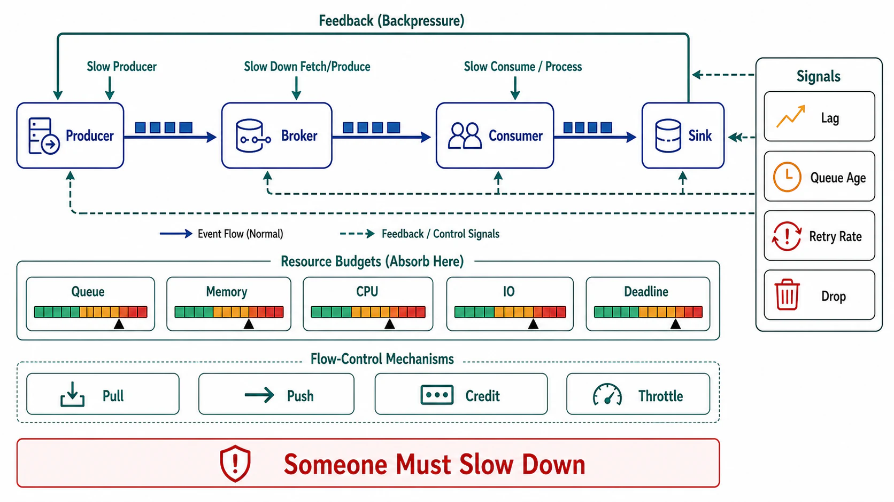

# Backpressure and Flow Control



## Abstract

Backpressure is not an error condition; it is the mechanism by which a pipeline tells the truth about its capacity. Every stage of every dataflow has a finite processing rate, and when an upstream rate exceeds it, exactly one of three things absorbs the difference: a bounded buffer (delay), load shedding (loss), or an unbounded buffer (an outage on a timer — the queue grows until memory, disk, or retention kills something, and by then the backlog itself has become the incident, as the AWS Builders' Library analysis of insurmountable queue backlogs lays out ([Builders' Library](https://aws.amazon.com/builders-library/avoiding-insurmountable-queue-backlogs/))). This file instantiates Chapter 01 file 08's overload contract for streaming: the design rule that **every buffer is bounded and every bound has a declared overflow behavior**, the pull/credit mechanics that make rate mismatch propagate as signal rather than accumulate as backlog (Reactive Streams' demand model ([reactive-streams.org](https://www.reactive-streams.org/)); Flink's credit-based network flow control ([Flink deep dive](https://flink.apache.org/2019/06/05/a-deep-dive-into-flinks-network-stack/))), and the endpoint question most streaming designs never answer: when the log itself is the buffer and the consumer is the bottleneck, *who slows the producer down?*

## 1. The Conservation Law

For any stage: `arrival_rate − service_rate = d(queue)/dt`. Nothing in software repeals this. A pipeline design is precisely an answer to where the queue derivative is allowed to be positive, for how long, and what happens at the bound:

```text
Figure 1. The three lawful fates of a rate mismatch — and the unlawful one.

  producer 12k/s ──► [ stage: 10k/s ] ──► downstream
                        Δ = +2k/s

  1 DELAY   bounded buffer fills, then producer BLOCKS/slows
            (backpressure propagates the deficit upstream)
  2 LOSS    shed at admission: drop, sample, or reject with signal
            (declared, measured, per-class — Ch01 f08 shed order)
  3 DEGRADE consumer does less per record (cheaper path, batching)
  ─────────────────────────────────────────────────────────────
  X UNBOUNDED QUEUE: "we'll catch up later" with no arithmetic.
    memory queue → OOM in minutes; disk queue → hours;
    log-as-buffer → retention breach in days (f09 §2).
    Same outage, different fuse lengths.
```

The review question is never "does this system have backpressure?" — every system does, eventually, in the form of a crash. The question is whether the pressure path was *designed*: which stage signals, which stage slows, which class sheds first, and what the user-visible behavior is at each stage of Chapter 01 file 08's degradation ladder.

And one identity must be run with real numbers in every review, because it converts utilization targets into recovery-time promises: after an outage of duration T at arrival rate λ, recovery at service rate μ takes **T·λ/(μ−λ)** — the backlog divided by the surplus. Worked once: λ = 10k rec/s, μ = 12k rec/s, one hour down → 36M records of backlog, cleared at the 2k rec/s surplus in **5 hours**. The recovery multiplier λ/(μ−λ) is the honest reading of a utilization dashboard: a consumer fleet run at 90% utilization recovers from every incident 9× slower than the incident itself; at 95%, 19×. "Efficient" steady-state sizing is a decision to live inside multi-day recovery windows, and it should be signed as one.

## 2. Pull, Push, and Credit

| Model | Mechanism | Where it lives | Failure honesty |
|---|---|---|---|
| Pull (consumer-paced) | Consumer fetches at its own rate; the log holds the rest | Kafka consumers — `poll()` is backpressure by construction | Overload converts to *lag*, visible and durable; but nothing slows the producer (§4) |
| Credit / demand | Receiver grants sender N-record credits; sender never exceeds granted demand | Reactive Streams `request(n)`; Flink's per-channel credit exchange; gRPC/HTTP-2 flow-control windows | Rate mismatch propagates hop-by-hop to the source in bounded time; deadlock-free only if credits are never granted against unbounded downstream buffers |
| Push + bounded queue | Sender pushes; receiver's bounded queue blocks or rejects at the rim | Internal thread pools, in-process pipelines | Correct iff the blocking/rejection propagates — a bounded queue drained by a task that silently drops is loss wearing delay's clothes |

Two mechanics worth internalizing from the exemplars. **Flink's credit-based flow control** replaced TCP-connection-level backpressure precisely because a shared TCP connection conflates channels: one slow operator's channel stalled every channel multiplexed on the connection, including checkpoint barriers — the fix gives each logical channel its own credit loop, so pressure is *scoped to the slow path* and barriers can overtake data. The general lesson: flow control at the wrong granularity turns one bottleneck into a correlated stall (head-of-line blocking), and the granularity of pressure must match the granularity of independence you claimed in the partition design (file 01). **Reactive Streams' rule** that `request(n)` demand is the *only* thing permitting emission makes buffer bounds compositional: any chain of compliant stages has bounded memory end-to-end, which is the property ad-hoc callback pipelines cannot prove about themselves.

## 3. Consumer-Side Budget Discipline

The consumer's poll loop is a rate promise (file 03's `max.poll.interval.ms`). Keeping it under pressure requires the same budget arithmetic as any request path: per-batch downstream calls carry timeouts summing under the poll interval; expensive per-record work moves behind an internal bounded queue with its own overflow rule; and *batch size is the flow-control knob of last resort* — halving `max.poll.records` doubles liveness headroom at the cost of throughput, a trade that should be encoded as config, not discovered mid-incident. The anti-pattern to name: the consumer that handles pressure by buffering records in application memory ahead of a slow sink — it has re-invented the unbounded queue one hop past the log, throwing away the log's durability on the way.

The budget arithmetic inverts for AI-era consumers, and the inversion deserves naming because it breaks every default. A consumer whose per-record work is an embedding or model call costs 100 ms–seconds per record instead of microseconds — four to six orders above the transforms the framework defaults were tuned for. Consequences: partition count (file 01 §4) is now derived from *model-serving concurrency*, not broker throughput; poll budgets must absorb inference tail latencies, so batch size shrinks toward the accelerator's batching sweet spot behind a bounded queue rather than toward `max.poll.records`; and the §4 producer answer defaults to admission or lag-absorb, because "scale out the consumer" now prices in GPUs, not pods. File 06 §5 carries the full AI-flow treatment; the flow-control point here is that a lag SLI on such a topic is a *capacity purchase order with a timestamp*, and pretending otherwise just delays the invoice.

## 4. Who Slows the Producer?

The log's pull model means consumer overload never propagates to producers by mechanism — only by *policy*. Lag grows; producers feel nothing; retention is the fuse. Every log-based design therefore owes an explicit answer, chosen per topic class:

| Answer | Mechanism | Legitimate when |
|---|---|---|
| Nobody — lag absorbs it | Retention runway (file 03 §3) sized ≥ worst credible consumer outage + catch-up time; alarmed | Analytics/derived views where staleness is priced (Chapter 03 file 02 claims) |
| Producer admission control | Produce-side quotas (broker request quotas), token buckets at the producing service, cost-based admission from Chapter 01 file 08 | Multi-tenant topics; any producer that can burst 10× organically |
| Synchronous coupling — deliberately | Producer awaits consumer-visible effect (request/response over the log) | Almost never; if the producer must know, the log was the wrong transport for that interaction |
| Shed at the producer | Sample, aggregate, or drop lowest-class events before produce | Telemetry-class flows; must be declared where at-most-once (file 02 §1) is being chosen |

The uncomfortable, load-bearing truth: "the log decouples us" and "consumer overload is the producer's problem too" are both true, on different timescales. Decoupling buys you the retention window — hours or days — to fix the consumer without touching the producer. It does not buy a permanently slower consumer; that arithmetic (file 01 §2) ends in data loss regardless of how the buffers are arranged, and the only design question is whether the loss is chosen (shedding, per class) or ambient (retention expiry, whatever happened to be oldest).

## 5. Approval Gates

| Gate | Evidence Required | Failure Condition |
|---|---|---|
| Bounded-buffer gate | Every queue/buffer in the pipeline enumerated with its bound and overflow behavior (block / shed-class / degrade) | Any unbounded in-memory queue; any bound with undefined overflow |
| Propagation gate | Pressure path traced source-ward: which mechanism slows each upstream hop, at what granularity; head-of-line coupling across independent paths ruled out | Pressure that terminates at an internal buffer; one slow channel stalling siblings sharing a transport |
| Producer-policy gate | The §4 answer chosen and implemented per topic class; retention runway arithmetic on record for the "nobody" rows | Consumer overload with no producer policy — retention expiry as the implicit shedding policy |
| Budget gate | Poll-loop work bounded by timeouts under the liveness budget (file 03); batch size as an operable knob | Poll-interval eviction under dependency slowness; buffering-in-app-memory ahead of slow sinks |
| Shed-order gate | Loss, where chosen, per Chapter 01 file 08's class order — measured with drop counters per class | Silent drops; uniform loss across classes of unequal value |

## Output

The output of this file is a designed pressure path: every buffer bounded with a declared overflow, credit or pull mechanics propagating rate deficits to the source at the right granularity, consumer loops that keep their liveness promises under dependency slowness, and — for every topic — a written answer to who slows the producer, with retention runway as arithmetic rather than hope.

## References

- [AWS Builders' Library — Avoiding insurmountable queue backlogs](https://aws.amazon.com/builders-library/avoiding-insurmountable-queue-backlogs/)
- [Reactive Streams specification — demand-based flow control with non-blocking backpressure](https://www.reactive-streams.org/)
- [Apache Flink — A Deep-Dive into Flink's Network Stack (credit-based flow control)](https://flink.apache.org/2019/06/05/a-deep-dive-into-flinks-network-stack/)
- [RFC 9293 — Transmission Control Protocol: window-based flow control, the ur-mechanism](https://www.rfc-editor.org/rfc/rfc9293.html)
- [Apache Kafka documentation — quotas as produce-side admission control](https://kafka.apache.org/documentation/#design_quotas)
