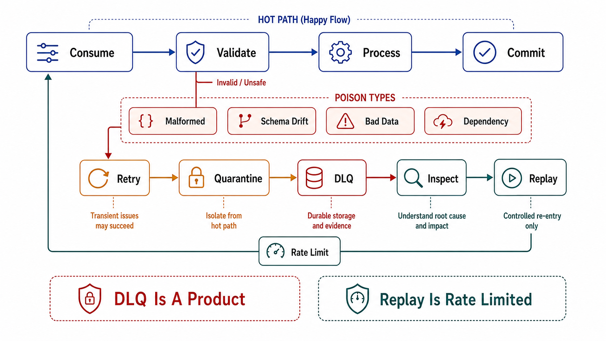

# Poison Events, DLQ, and Replay



## Abstract

A poison event — one record the consumer cannot process — is a partition-level denial of service in a keyed log: the consumer cannot skip it without violating ordering, cannot process it, and so retries it forever while every record behind it in the partition ages toward retention expiry. The naive responses bracket the failure space: retry-forever converts one bad record into a stalled partition; skip-and-log converts it into silent data loss with an audit trail nobody reads. The engineered middle is a *graduated* path — bounded in-place retries for transient faults, retry topics with escalating backoff for slow-to-heal faults, and a dead-letter queue as the terminal parking lot — with the discipline Uber's reprocessing architecture made canonical: retry queues are tiered by delay, DLQ entries carry full diagnostic envelopes, and re-injection back into the main flow is a designed path, not an ops improvisation ([Uber Engineering](https://www.uber.com/blog/reliable-reprocessing/)). The brutal-truth core of this file: a DLQ without an owner, an SLO, and a replay procedure is not error handling — it is a slow-motion drop with better logging, and the review must price it as exactly that.

## 1. Poison Taxonomy — Because the Cure Differs

| Class | Example | Correct disposition |
|---|---|---|
| Transient-environment | Sink timeout, throttle, lock conflict | Bounded in-place retries with backoff + jitter (Chapter 01 file 08's retry budget); *not* poison — do not DLQ what a second attempt cures |
| Slow-healing dependency | Downstream schema not yet deployed, referenced entity not yet arrived (out-of-order cross-stream) | Retry topic with delay ≥ heal horizon; escalating tiers (5 m → 1 h → 6 h) |
| Deterministic-bad-record | Malformed payload, schema violation escaped the registry (file 08), semantically impossible value | DLQ immediately — every retry is pure waste and pure lag |
| Bug-in-consumer | NPE on a legal record shape | DLQ *and* page: the poison is in the code; replay after fix (§4) |

The classification must be made *by the consumer, per exception path*, because the four rows have opposite treatments: retrying a deterministic-bad-record burns the partition's liveness budget for nothing, while DLQ-ing a transient timeout amputates good data. The common implementation defect — one catch-all handler mapping every exception to the same retry policy — collapses the taxonomy and inherits the worst property of each row.

## 2. The Graduated Path

```text
Figure 1. Graduated poison handling: main flow stays live, ordering
cost is paid knowingly, DLQ is terminal and owned.

  main topic ──► consumer ──✓──► side effect
                   │ fail
                   ▼ classify (§1)
        transient? in-place retry ×N (backoff+jitter)
                   │ still failing / slow-healing
                   ▼
        retry.5m ──► retry.1h ──► retry.6h     (each: delayed
                   │ exhausted                  redelivery, own
                   ▼                            consumer)
              DLQ topic ── owner, alert, SLO, envelope:
                           {event, error, stack, attempt count,
                            source partition/offset, timestamps}
                   │ after fix
                   ▼
        re-inject ──► main flow (idempotent effects absorb
                      duplicates — file 02; ordering vs the
                      key's later events is ALREADY broken)
```

Two prices to state plainly. First, **the moment an event leaves the main partition for a retry topic, per-key ordering is broken**: later events for the same key may complete while the detoured event waits. This is a *correct* trade only when the consumer's effects are commutative for that interleaving or the entity's state machine rejects out-of-order transitions explicitly (Chapter 03 file 01's invariants); a review that finds retry topics under a strict-ordering requirement has found a contradiction, and one of the two must yield. Second, retry topics multiply infrastructure: each tier is a topic + consumer + lag SLI of its own. Kafka Connect's built-in dead-letter routing ([KIP-298](https://cwiki.apache.org/confluence/display/KAFKA/KIP-298%3A+Error+Handling+in+Connect)) covers the connector case; application consumers must build the tiers deliberately or accept the simpler bounded-retry → DLQ two-stage path.

## 3. DLQ as a Product, Not a Dumpster

The DLQ's failure mode is organizational, not technical: it works perfectly as a queue while functioning as a write-only graveyard. The contract that prevents this:

- **Ownership**: the *consumer-owning* team owns the DLQ (they own the failure to process); named, on-call-reachable.
- **SLO**: time-to-triage per entry class (e.g., bug-class paged within minutes; bad-record-class triaged within one business day). A DLQ depth alarm is necessary but insufficient — depth 3 for six months is the graveyard signature that depth alarms never catch; **age of oldest entry** is the honest metric.
- **Envelope**: the DLQ record carries the original event *plus* error, stack, attempt history, source coordinates, and schema version — sufficient to diagnose without re-running the failure. A DLQ of bare payloads forces re-failure as the diagnostic tool.
- **Terminality with an exit**: entries leave by exactly two doors — re-injection after a fix, or explicit discard with a recorded decision. Silent expiry of DLQ retention is data loss laundered through a second topic; DLQ retention is therefore set *longer* than main-topic retention and its expiry alarmed (file 07's contract applies with more force here, not less).

## 4. Replay Discipline

Replay — re-consuming committed history, whether from DLQ re-injection, an offset rewind after a bug, or a full rebuild (Chapter 03 file 05 §4) — is the log's superpower and the fastest way to convert one incident into two. The invariants:

1. **Idempotence is the license.** Replay re-executes side effects; file 02's boundary patterns (dedup table, idempotent effects) are prerequisites, verified by drill (E6, file 10) *before* the replay is needed. The event IDs replay carries are origin-assigned — offsets renumber, identity must not.
2. **Non-idempotent externalities are enumerated and masked.** Emails, payments, notifications: replay mode must suppress or route them to a sink that reconciles — "we re-sent 40,000 password-reset emails" is the canonical replay incident.
3. **Time semantics shift.** Replayed events process at wall-clock now with event-time then; windowed logic (file 06's watermarks) and TTL-dependent effects behave differently on replay unless they key on event time — a replay plan that never mentions time semantics has not been thought through.
4. **Rate is capped.** Replay at full historical throughput is a self-inflicted load test on every downstream (Chapter 03 file 05's rebuild caution); replays run rate-limited, monitored, and abortable.
5. **Scope is recorded.** Which offsets/keys, why, approved by whom — replay is a state mutation of every downstream system and gets change-control treatment, not a shell one-liner at 3 a.m.

## 5. Approval Gates

| Gate | Evidence Required | Failure Condition |
|---|---|---|
| Taxonomy gate | Exception paths classified per §1 with distinct dispositions; retry budgets per Chapter 01 file 08 | One catch-all handler; deterministic failures being retried; transient failures being DLQ'd |
| Ordering-honesty gate | Retry-topic detours reconciled with the topic's ordering contract (file 01): commutative effects or explicit state-machine rejection shown | Retry topics under an undeclared strict-ordering assumption |
| DLQ-contract gate | Owner, triage SLO, oldest-entry-age alarm, diagnostic envelope, retention > main topic with alarmed expiry | Depth-only alarming; bare-payload entries; DLQ retention silently shorter than the triage SLO |
| Replay-license gate | Idempotence drill passed on every replayable flow; non-idempotent externalities enumerated with replay masks; time-semantics statement | First idempotence test *is* the production replay; externality list "none" without enumeration |
| Replay-ops gate | Rate-capped, abortable, change-controlled replay procedure, rehearsed (E-series, file 10) | Replay as improvised offset manipulation under incident pressure |

## Output

The output of this file is a poison-handling design that keeps partitions live without laundering loss: a per-exception taxonomy driving graduated retries, retry-topic detours taken only where the ordering contract permits, a DLQ operated as an owned product with age-based SLOs and a terminal-with-exit lifecycle, and a rehearsed, rate-capped, idempotence-licensed replay capability that turns the log's history from a liability into the recovery mechanism it was bought for.

## References

- [Uber Engineering — Building Reliable Reprocessing and Dead Letter Queues with Apache Kafka](https://www.uber.com/blog/reliable-reprocessing/)
- [KIP-298 — Error Handling in Connect (dead-letter routing for Kafka Connect)](https://cwiki.apache.org/confluence/display/KAFKA/KIP-298%3A+Error+Handling+in+Connect)
- [Confluent — Error Handling Patterns in Kafka (retry topics, DLQ patterns)](https://www.confluent.io/blog/error-handling-patterns-in-kafka/)
- [IETF HTTPAPI — Idempotency-Key header (the consumer-side replay license, via Chapter 01 file 04)](https://datatracker.ietf.org/doc/draft-ietf-httpapi-idempotency-key-header/)
