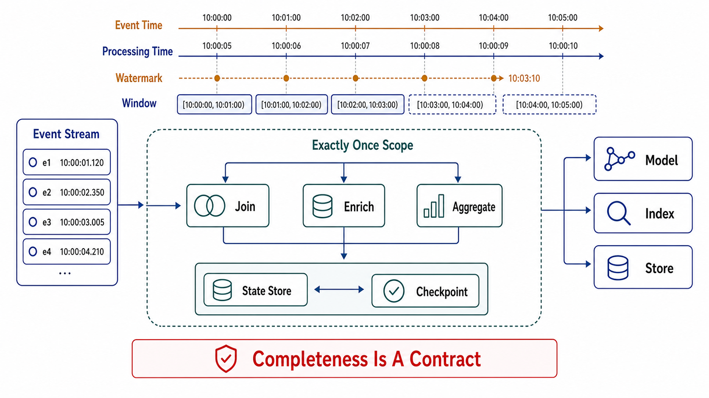

# Stream Processing and Stateful Computation



## Abstract

The moment a consumer aggregates, joins, windows, or deduplicates, it stops being a stateless record pump and becomes a distributed database whose tables happen to be called "operator state" — and it inherits every obligation of one: durability, recovery, consistency between state and position, and a story for what its outputs mean while it is catching up. The reference machinery is well settled. Flink's asynchronous barrier snapshots — a Chandy-Lamport variant that flows checkpoint barriers through the dataflow to capture a globally consistent cut of all operator state plus source offsets without stopping the pipeline ([Carbone et al., arXiv:1506.08603](https://arxiv.org/abs/1506.08603)) — solve state/position consistency; the Dataflow Model's separation of event time from processing time, with watermarks as the explicit claim about input completeness ([Akidau et al., VLDB 2015](https://www.vldb.org/pvldb/vol8/p1792-Akidau.pdf)), solves what windowed answers *mean* over disordered input. The honest frame this file installs: "exactly-once" in stream processing is a statement about *state* — each record affects checkpointed state exactly once — and extends to outputs only through transactional sinks; and a watermark is not a fact about the world but a *policy decision* about how long to wait for stragglers, with every choice trading latency against completeness and the leftover error surfacing as late data that some explicit rule must absorb.

## 1. Event Time, Processing Time, and the Watermark Bargain

Event time is when the thing happened; processing time is when the operator sees it; the skew between them is unbounded in practice (mobile clients batch-upload hours of events; a replay, file 05 §4, delivers last week at wall-clock now). Any windowed computation keyed on processing time silently recomputes its answers under replay and misassigns every delayed event — processing-time windows are legitimate only for operational metering of the pipeline itself.

A watermark W(t) is the pipeline's declaration: "I believe no events with event time < t remain upstream." It is *derived from heuristics* (observed max event time − allowed lateness), not from knowledge, so it embodies a bargain:

```text
Figure 1. The watermark bargain: latency vs completeness, with the
error term made explicit.

  event time ─────────────────────────────────────►
     window [12:00, 12:05)
                    ▲ last on-time event 12:04:58
                    │
  watermark passes 12:05 ──► window CLOSES, result EMITTED
       │ (waited `lateness` past observed max — the policy knob)
       │
  straggler arrives, event time 12:03 ──► LATE DATA. Choose:
    a) drop (declared loss — count it)
    b) re-emit corrected result (downstream must handle retraction)
    c) side-output to a late-data flow (reconciled offline)

  tighter lateness → faster answers, more late data
  looser lateness → completer answers, more latency + state held
```

The review demands three named artifacts, because each is a silent-defect source when defaulted: the **watermark policy** (what lateness bound, derived from measured event-time skew distributions, not vibes), the **late-data rule** (a/b/c above — and if (b), proof the downstream consumes retractions, which most sinks cannot), and the **replay statement** (windows keyed on event time behave identically under replay; anything keyed on wall clock does not — file 05 §4's third invariant, enforced here).

## 2. State, Checkpoints, and What Exactly-Once Actually Covers

Asynchronous barrier snapshots, mechanically: sources note their offsets and inject barrier n; each operator, on receiving barrier n from *all* inputs, snapshots its state and forwards the barrier; when every sink acknowledges, checkpoint n — a consistent cut of {source positions + all operator state} — is durable. Recovery restores the whole pipeline to cut n and replays the sources from the recorded offsets: every record after the cut is reprocessed, but its effects on state land exactly once *because the state it might have double-affected was rolled back with it*. That is the precise sense of exactly-once state semantics — a rollback-plus-replay protocol, not duplicate-proof delivery.

What it does not cover: anything that escaped the pipeline between the cut and the crash. Outputs already emitted to an external sink are re-emitted on replay. Closing that hole requires the sink to join the checkpoint protocol — Flink's two-phase-commit sinks stage output per checkpoint and commit only when the checkpoint completes ([Flink end-to-end exactly-once](https://flink.apache.org/2018/02/28/an-overview-of-end-to-end-exactly-once-processing-in-apache-flink-with-apache-kafka-too/)); with a Kafka sink this rides file 02's transactions, and the composition (checkpoint interval = transaction commit cadence) sets the end-to-end result latency floor. Sinks that cannot 2PC fall back to file 02 §3's idempotent/dedup patterns — the boundary discipline is identical, only the enforcement point moves.

Operational state facts that decide production designs:

| Fact | Consequence |
|---|---|
| Checkpoint cost scales with state size and change rate | Incremental checkpoints (RocksDB-backed) for large state; checkpoint duration must stay ≪ interval, else the pipeline spends its life checkpointing — alarmed as a ratio |
| Recovery time ≈ state restore + replay since last checkpoint | The pipeline's RTO; drives interval choice; measured by drill (E8, file 10), never estimated |
| State lives per key, partitioned like the stream | Key skew (file 01 §3) becomes *state* skew: one whale key = one giant state shard = one slow checkpoint path |
| Unbounded keyspace ⇒ unbounded state | Every keyed state declares TTL or an eviction rule; "we keep it forever" is a capacity plan measured in months-to-incident |

## 3. Joins, Enrichment, and the Completeness Trap

Stream-stream joins hold both sides' unmatched events in state for the join window — the window bound *is* the state bound, and widening it for match completeness is a memory decision, not a logic tweak. Stream-table enrichment (event joins reference data) hides a subtler defect: if the table side is itself fed by a lagging stream (Chapter 03 file 05's DAG), the join enriches today's events with yesterday's reference state, and under replay the mismatch compounds — the drilled question is "what version of the reference data did this output see," and event-time-versioned (temporal) joins are the honest fix where the answer matters. Both patterns are where "the pipeline is a database" stops being a metaphor: the join buffer is a table with a retention policy, whether or not anyone wrote one down.

## 4. Kafka Streams vs Flink-Class Runtimes — the Placement Decision

Same theory, different enforcement: Kafka Streams co-locates processing with the consumer group (state in local RocksDB + changelog topics; exactly-once via file 02's transactions, `exactly_once_v2`) — operationally cheap, bounded by the group protocol's rebalance behavior (file 03) and by Kafka-to-Kafka topologies. Flink-class runtimes own their scheduling and checkpointing (barriers, savepoints, arbitrary sources/sinks) — strictly more capable on state size, event-time machinery, and non-Kafka boundaries, at the price of operating a second distributed system. The decision rule: topology complexity and state size pick the runtime; team operational capacity vetoes it (Chapter 04's boring-technology gate applies — a Flink cluster nobody can operate is a liability with checkpoints).

## 5. The AI-Native Instance: Streams Feeding Models and Indexes

The highest-stakes stream topologies in current systems are AI-derived state: document → parse → chunk → embed → index (Chapter 03 file 05's ingestion DAG, run as a production stream) and event → feature → online store (the training/serving path). Everything in this chapter applies with the dials turned to uncomfortable settings, and the settings are worth enumerating because each one defeats a default:

- **Freshness is time lag, and it is a retrieval-quality SLI.** "The index doesn't know that document yet" is file 03's time lag wearing product clothes; it is measured per partition, because one whale tenant's ingestion backlog is exactly the divergence an aggregate hides.
- **The transform version is part of the record's identity.** Embedding model, chunker version, and prompt/enrichment version go in the envelope (file 08) as schema-governed fields — an embedding without its model version is a number, not a meaning. The corollary is the expensive one: upgrading the model is a **full replay at GPU prices**, and it gets the whole file 05 §4 treatment (rate-capped, cost-estimated *before* approval, run as a dual-index expand–contract in Chapter 03 file 07's shape) rather than being discovered as an invoice.
- **Idempotence is nearly free here — take it.** Vector-index upserts keyed by origin-assigned chunk ID make the entire path duplicate-tolerant; at-least-once + upsert is the correct default, and transactional machinery is rarely worth its latency in an ingestion flow whose sink converges anyway.
- **LLM-derived enrichments break replay determinism.** Embeddings are deterministic per model version; generated summaries, labels, and extractions are not — a replay regenerates *different bytes*. Chapter 03 file 05 §5's rule applies with full force: persist the derived artifact as the record of what the system actually served, and let replay *choose* — restore the artifact, or regenerate and accept the divergence — explicitly.
- **Feature pipelines inherit the diamond.** The same source flowing to training through a batch path and to serving through a stream path is Chapter 03 file 05 §2's diamond, and its production name is training/serving skew. The fix is structural, not procedural: one derivation graph with two materialization cadences, never two independent implementations of "the same" feature.

## 6. Approval Gates

| Gate | Evidence Required | Failure Condition |
|---|---|---|
| Time-semantics gate | Event-time vs processing-time choice per operator; watermark policy from measured skew; late-data rule (drop/retract/side-output) with downstream compatibility shown | Processing-time windows on domain logic; late data unhandled or "shouldn't happen" |
| State-obligation gate | Per-operator state inventory: size projection, TTL/eviction, key-skew analysis inherited from file 01 | Unbounded keyed state; join windows sized by guesswork |
| Checkpoint gate | Interval vs duration ratio alarmed; incremental checkpointing for large state; recovery time measured by drill = the declared RTO | Checkpoint duration approaching interval; RTO asserted, never rehearsed |
| Output-boundary gate | Sinks classified: 2PC/transactional vs idempotent/dedup (file 02 §3); result-latency floor from commit cadence stated | Emitted-then-crashed duplicates unhandled; "exactly-once" claimed past a non-transactional sink |
| Runtime gate | Streams-vs-Flink-class choice justified by topology/state/team arithmetic | Runtime chosen by fashion; second distributed system adopted without an operating owner |
| AI-flow gate | Transform/model versions in the envelope; re-embedding replays cost-estimated and rate-capped before approval; freshness SLO per index; nondeterministic derived artifacts persisted; one derivation graph across training and serving | Index staleness with no SLI; model upgrades discovered at GPU-invoice time; two "identical" feature implementations diverging |

## Output

The output of this file is a stream-processing topology admitted as the database it is: event-time semantics with an explicit watermark bargain and late-data rule, checkpointed state with measured recovery and bounded growth, output boundaries enforced transactionally or by declared idempotence, a runtime placement decision priced in operational capacity rather than capability envy — and, for the flows feeding models and indexes, transform versions treated as identity and re-derivation priced at GPU rates before anyone presses replay.

## References

- [Carbone et al., "Lightweight Asynchronous Snapshots for Distributed Dataflows," arXiv:1506.08603](https://arxiv.org/abs/1506.08603)
- [Akidau et al., "The Dataflow Model," VLDB 2015 — event time, watermarks, windows, triggers](https://www.vldb.org/pvldb/vol8/p1792-Akidau.pdf)
- [Apache Flink documentation — Stateful Stream Processing (state, barriers, snapshots)](https://nightlies.apache.org/flink/flink-docs-stable/docs/concepts/stateful-stream-processing/)
- [Apache Flink — An Overview of End-to-End Exactly-Once Processing (two-phase-commit sinks)](https://flink.apache.org/2018/02/28/an-overview-of-end-to-end-exactly-once-processing-in-apache-flink-with-apache-kafka-too/)
- [Apache Kafka Streams documentation — processing guarantees (`exactly_once_v2`)](https://kafka.apache.org/documentation/streams/core-concepts)
