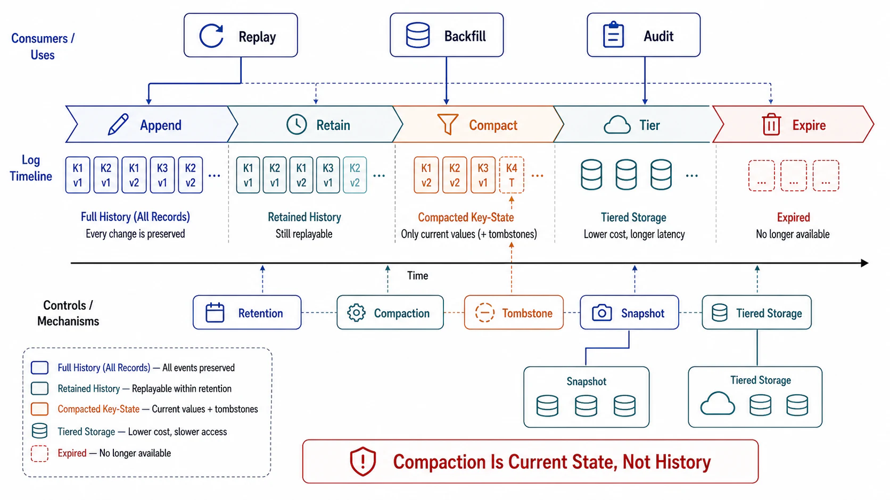

# Retention, Compaction, and the Log as Storage



## Abstract

Retention is the clause of the log contract that everything else in this chapter quietly depends on and almost no team writes down: every replay claim (file 05), every rebuild claim (Chapter 03 file 05 §4), every catch-up-after-outage plan (file 03's retention runway), and every new-consumer bootstrap is bounded by how much history the log still holds — and the default answer, seven days chosen by nobody, becomes a de facto data-loss policy the first time an incident outlives it. This file makes retention a multi-party contract: producers, every consumer group, and the recovery procedures each declare their required horizon, and the topic's policy is the maximum of those declarations with the arithmetic on record. It then prices the two mechanisms that stretch the log toward "storage": log compaction, which keeps the latest record per key — a *materialized current-state table*, deliberately not history — with semantics (tombstones, non-contiguous offsets, no lateness guarantee before compaction) that surprise consumers built against delete-based topics; and tiered storage ([KIP-405](https://cwiki.apache.org/confluence/display/KAFKA/KIP-405%3A+Kafka+Tiered+Storage)), which decouples retention from broker disk by offloading closed segments to object storage, making retention an economic decision rather than a hardware one — at the price of a two-class read path whose cold tier must be capacity-tested before the first full-history replay depends on it.

## 1. Retention as a Multi-Party Contract

```text
Figure 1. The retention horizon is the max of declared needs —
not a config default.

  who needs history          declared horizon
  ────────────────────────────────────────────────
  slowest consumer group     worst outage + catch-up   3 d
  DLQ triage + re-inject     triage SLO + fix time     14 d
  derived-view rebuild       full rebuild window       30 d │ max
  new-consumer bootstrap     from-zero read time       30 d │ =
  audit/compliance read      regulatory window         90 d ▼
  ────────────────────────────────────────────────
  topic retention ≥ 90 d  (or: audit reads move to an
  archive sink, and the log honestly keeps 30 d)

  and the OTHER direction (Ch03 f06 §2): retention CEILING —
  GDPR/erasure obligations cap how long personal data may
  persist; the floor and ceiling must not cross.
```

Three enforcement rules make the contract real. First, **expiry is an alarmed event, not a silent default**: when the oldest unconsumed offset of any group approaches the retention edge, that is a data-loss countdown (file 03's retention runway) and pages someone. Second, **the ceiling binds too**: Chapter 03 file 06's deletion obligations apply to logs with extra force, because a log's copies-by-design (replicas, tiered segments, downstream materializations) multiply erasure surface — crypto-shredding via per-subject keys is frequently the only honest erasure story for long-retention topics. Third, **changing retention is a contract renegotiation**: shortening it invalidates rebuild and replay claims downstream teams already depend on, and gets the same change control as an API break (file 08's governance machinery owns the notification path).

## 2. Compaction: Current State, Not History

A compacted topic retains, eventually, only the most recent record per key — Kafka's log compaction ([documentation](https://kafka.apache.org/documentation/#compaction)) — turning the topic into a durable changelog whose full read yields a current-state table. It is the correct transport for entity snapshots, connector state, and Streams changelogs. The semantics that must be understood as *contract*, because each has produced production surprises:

| Semantic | Consequence for consumers |
|---|---|
| Intermediate records vanish | Any consumer needing *history* (event sourcing, audit) is on the wrong topic type — compaction is lossy by design, per key |
| Tombstones (key, null) delete a key — and are themselves purged after a delay | A bootstrapping consumer that reads slower than the tombstone-retention window can *miss deletions* and resurrect deleted keys; `delete.retention.ms` must exceed worst-case full-read time |
| Offsets become non-contiguous | Consumers assuming dense offsets break; position arithmetic (lag as count) degrades — time lag (file 03 §3) survives, count lag lies |
| Compaction lag is unbounded-ish | The "latest per key" guarantee holds *eventually*; the uncompacted head means readers see some superseded records — idempotent upsert consumption (file 02) absorbs this; anything else must not assume compactness |

The design rule: a topic is *either* an event history (delete-based retention, ordering as narrative) *or* a current-state changelog (compacted, latest-wins) — a single topic asked to be both serves neither, and the common correct topology is the pair: an event topic for the narrative, a compacted topic materialized from it for state bootstrap.

## 3. Tiered Storage: Retention as Economics

KIP-405 splits the log into a hot tier (broker-local segments, the recent tail) and a cold tier (closed segments offloaded to object storage), with the broker transparently serving reads from either. What it changes: retention cost decouples from broker disk and rebalance cost (moving a partition no longer moves its history), so "keep 6 months" becomes an object-storage line item instead of a cluster redesign — the economic move that makes §1's contract affordable at long horizons. What it does not change: the cold tier is a *different performance class* — first-byte latency and aggregate throughput are object-storage-shaped, so a full-history replay or a from-zero bootstrap now exercises a path steady-state traffic never touches. The gates that follow: cold-read throughput is load-tested against the declared rebuild window (a 30-day rebuild claim served at cold-tier speed may arithmetic out to 30 days *of reading*), and tail consumers are isolated from cold-scan consumers so a rebuild doesn't starve the real-time path.

## 4. The Log as System of Record — the Caution

Kreps' unifying-abstraction argument (file 01) tempts a stronger conclusion: make the log the *primary* store — event sourcing, state as a fold over events ([Fowler's statement of the pattern](https://martinfowler.com/eaaDev/EventSourcing.html)). The capabilities are real (perfect audit trail, temporal queries, rebuild-anything) and so are the costs, which arrive later and compound: schema evolution against *immutable history* means every consumer carries upcasters for every version ever written (file 08 — and retention makes old versions immortal); erasure obligations against immutable history force crypto-shredding complexity everywhere; queries need materialized views for everything (the fold is not a query engine); and the replay/versioning discipline of files 05–06 stops being an ops concern and becomes the core application semantics. The chapter's position, consistent with Chapter 04's admission bar: event sourcing is a specialized architecture with a real payoff in audit-heavy, temporally-queried domains — adopted deliberately with the full cost sheet, never backed into because "we already have the events in Kafka." A log that *feeds* systems of record (CDC, outbox — Chapter 03 file 05) is the default posture; a log that *is* the system of record is an exception that must argue for itself.

## 5. Approval Gates

| Gate | Evidence Required | Failure Condition |
|---|---|---|
| Contract gate | Retention = max(declared horizons) with the §1 table on record; expiry-approach alarmed per group; ceiling (erasure) reconciled with floor | Default retention nobody chose; unconsumed data expiring silently; floor > ceiling undetected |
| Compaction-semantics gate | Compacted topics consumed only by upsert-idempotent readers; `delete.retention.ms` > worst-case bootstrap read; count-lag retired in favor of time lag on compacted topics | History expectations on a compacted topic; resurrection-by-slow-bootstrap possible |
| Topic-type gate | Each topic declared history *or* changelog; both-in-one designs split into the event + compacted pair | One topic serving narrative and state bootstrap simultaneously |
| Tiered-read gate | Cold-tier throughput load-tested against declared rebuild/bootstrap windows; tail and cold-scan consumers isolated | Rebuild claims priced at hot-tier speed; replay starving real-time consumers |
| System-of-record gate | Event-sourcing adoption (if any) argued with the full cost sheet: upcasting, erasure, materialization, replay-as-semantics | Log-as-SoR backed into via "the data's already there" |

## Output

The output of this file is a retention policy that is a signed contract rather than a config artifact: horizons derived from every party's declared need and alarmed at the edges, compaction used for what it is (current state) with its tombstone and offset semantics honored, tiered storage adopted with its cold path tested against the recovery claims that depend on it, and the log's role — feeder of systems of record, or exceptionally the record itself — chosen with the costs on the table.

## References

- [KIP-405 — Kafka Tiered Storage](https://cwiki.apache.org/confluence/display/KAFKA/KIP-405%3A+Kafka+Tiered+Storage)
- [Apache Kafka documentation — log compaction semantics](https://kafka.apache.org/documentation/#compaction)
- [Kreps, "The Log," LinkedIn Engineering — the log-as-storage argument this file prices](https://engineering.linkedin.com/distributed-systems/log-what-every-software-engineer-should-know-about-real-time-datas-unifying)
- [Fowler, "Event Sourcing" — the pattern and its stated complexities](https://martinfowler.com/eaaDev/EventSourcing.html)
- [Google SRE Book — Data Integrity: defense in depth for retention/erasure obligations](https://sre.google/sre-book/data-integrity/)
