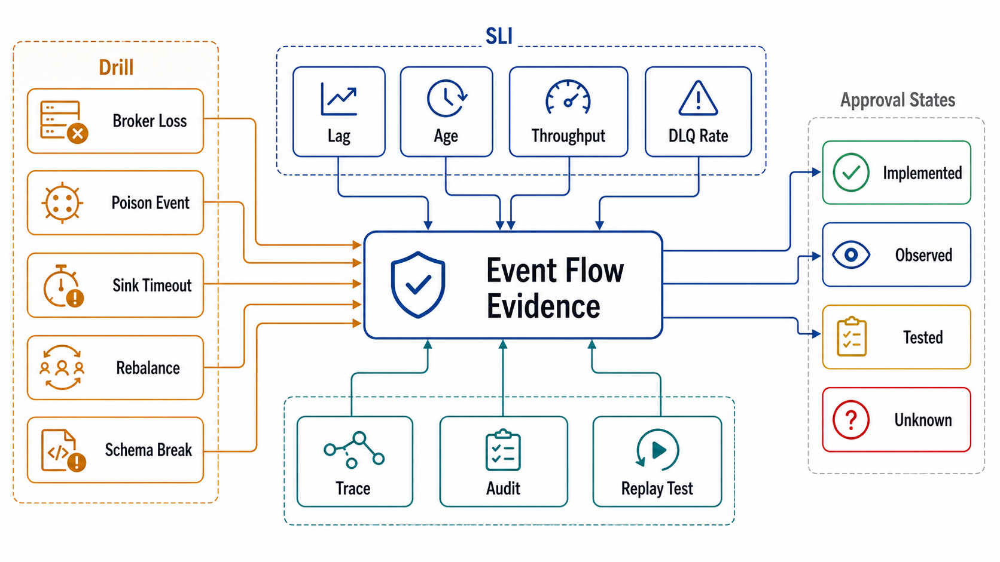

# Verification of Event Flows



## Abstract

Every guarantee this chapter approves is a claim about behavior under failure — ordering under interleaving, idempotence under duplicates, liveness under poison, recovery under crash, alarms under runaway — and none of them can be verified by reading configuration, because the configuration describes the intent and the failures test the implementation. This file is the chapter's evidence machinery: ten drills (E1–E10) that convert each contract from files 01–09 into a falsifiable experiment with a pass condition and a rehearsal frequency, the streaming SLI set that makes the slow-tempo failure modes of file 09 observable while they are still countdowns, and the evidence-classification discipline inherited from Chapter 01 file 11 — each claim tagged tested/observed/assumed with a date and a **flow-generation stamp** (the topic configuration, group protocol, schema versions, and consumer-fleet version the evidence was generated against), because a drill passed against last quarter's topology verifies last quarter's system.

## 1. The Drill Catalog

| Drill | Hypothesis under test | Fault injected / procedure | Pass condition | Frequency |
|---|---|---|---|---|
| E1 Ordering audit | Per-key order survives production interleaving (file 01) | Produce interleaved multi-key sequences with sequence-numbered payloads; consume across the full group | Zero per-key inversions observed at every consumer; cross-partition order *not* asserted anywhere downstream | Per topic-design change |
| E2 Commit-order kill | At-least-once + idempotent effects: no loss, duplicates absorbed (file 02) | SIGKILL consumers mid-batch, repeatedly, under load | Every marker event's effect present exactly once in the sink; commit-before-process paths absent | Monthly, automated |
| E3 Rebalance cost | Cooperative + static membership bound the pause (file 03) | Rolling restart of the full fleet; one member SIGKILL | No full-group rebalance on rolling restart; pause scope = moved partitions only; measured pause < declared budget | Per deploy-pipeline change + quarterly |
| E4 Duplicate burst | Dedup headroom ≥ rebalance-scale bursts (files 02 §4, 09 F4) | Replay the uncommitted-tail volume of a full-group rebalance at once | Dedup path holds at burst rate; zero double effects; no dedup-store saturation | Quarterly |
| E5 Backpressure path | Pressure propagates by design, not by OOM (file 04) | Throttle the sink to 10% capacity for an hour | All buffers stay at bounds; declared overflow behavior observed; producer policy (quota/shed/none-with-runway) engages as written | Quarterly |
| E6 Replay license | Replay is safe before it is needed (file 05 §4) | Rate-capped replay of a real window into the production-like path | No duplicate externalities (emails/charges = 0); masked sinks confirmed; time-semantics statement holds (windows keyed on event time reproduce) | Semi-annual + before any planned replay |
| E7 Poison injection | Taxonomy routes correctly; partition stays live (file 05) | Inject malformed, slow-healing, and bug-class records | Each class takes its declared path; partition time lag recovers < budget; DLQ envelope complete enough to diagnose without re-running | Quarterly |
| E8 Checkpoint recovery | Stream-processor RTO is the measured number (file 06) | SIGKILL the processor at peak state; restore | Recovery time ≤ declared RTO; state/offset cut consistent (no window double-count or gap); 2PC sinks emit no duplicates | Quarterly |
| E9 Retention-edge race | The runway comparison alarms before loss (files 03 §3, 09 F3) | Pause a canary consumer group; let lag age toward the horizon | Runway-comparison alarm fires with ≥ declared lead time; escalation runbook engages; no silent expiry of unconsumed canary data | Semi-annual |
| E10 Schema gauntlet | Compatibility scope covers the retained tail (file 08) | Produce oldest-in-retention schema version to current consumers; attempt an incompatible produce | Old version consumed correctly by every current reader; incompatible produce *rejected at the registry*, never lands on the log | Per schema change (CI) + quarterly full audit |

Drill discipline, carried over from Chapters 02–05: drills run against production or a topology-faithful staging (partition counts, group protocol, schema registry modes identical — a 3-partition staging topic cannot verify a 60-partition production contract), failures during drills are findings rather than reasons to soften the drill, and every pass is stamped (§3).

## 2. The Streaming SLI Set

The file 09 catalog is observable iff these are first-class, per-partition where noted:

| SLI | Definition | Feeds |
|---|---|---|
| Time lag (per partition) | now − event_time(last committed) | F2, F5; Chapter 03 file 05 freshness SLOs |
| Lag velocity | d(lag)/dt over an evaluation window | F2 — the *primary* page |
| Runway pair | catch-up runway vs retention runway, as a comparison | F3 — pages when the inequality flips toward loss |
| Rebalance frequency | rebalances per group per hour, with cause labels | F1 |
| Poll-interval utilization | worst batch time ÷ max.poll.interval | F1 leading margin |
| Duplicate rate | dedup-hit counter at every idempotent boundary | F4; validates E4 headroom claims |
| DLQ pair | inflow vs triage rate; age of oldest entry | F6 |
| End-to-end latency | produce → final side effect, per flow, at p50/p99 | The user-facing number everything above protects |
| Checkpoint ratio | checkpoint duration ÷ interval | File 06 gate; F1-adjacent for processors |

The design rule repeated from file 03 because dashboards keep violating it: aggregates are for capacity planning; **alerts fire on per-partition and per-flow signals**, since every interesting failure in this chapter is a divergence one aggregate hides.

## 3. Evidence Classes and the Flow-Generation Stamp

```text
Figure 1. The evidence lifecycle: drills mint stamped evidence;
topology changes burn it.

  drill En passes ──► evidence entry
                      {claim, class: tested, date,
                       flow-generation stamp}
                            │
        stamped field changes?          stamp intact?
        (partitions, protocol,          evidence remains
         schema version, fleet…)        citable until its
                            │           cadence expires
                            ▼
                  class resets → assumed
                  (with expiry) ──► re-run En against the
                                    new generation, or the
                                    dossier refuses the claim
```

Chapter 01 file 11's taxonomy applies unchanged — *tested* (a drill above, dated), *observed* (production telemetry over a stated window), *assumed* (declared, with an expiry) — with this chapter's stamp requirement: every piece of evidence records the **flow generation** it was produced against: `{topic: partitions, retention, cleanup.policy; group: protocol, membership mode, fleet version; schemas: subject versions + compatibility mode; processor: runtime + checkpoint config}`. Any change to a stamped field invalidates the evidence that carried it — that is the *point* of the stamp: it converts "we tested this once" into a dependency edge the review can check. The dossier (file 11) refuses evidence older than its stamp.

## 4. Approval Gates

| Gate | Evidence Required | Failure Condition |
|---|---|---|
| Coverage gate | E1–E10 mapped to every flow the dossier claims; gaps declared as *assumed* with expiry dates | Contracts with no falsifying drill; "we've never needed to test that" |
| Fidelity gate | Drill environment topology-faithful (partitions, protocol, registry modes) or run in production | 3-partition staging verifying 60-partition claims |
| Stamp gate | All evidence carries date + flow-generation stamp; invalidation on stamped-field change is enforced, not honorary | Undated evidence; drills passed against retired topologies still cited |
| Cadence gate | Frequencies from §1 met; E6 rehearsed before any real replay; E10 wired into producer CI | Replay license first exercised during the incident; schema gauntlet run manually and rarely |
| Alert-shape gate | §2 SLIs implemented per partition/flow; pages on derivatives and comparisons (velocity, runway pair), not raw counts | Aggregate-only or absolute-threshold-only alerting surviving review |

## Output

The output of this file is the chapter's evidence base: ten rehearsed, stamped, falsifiable drills covering ordering, delivery, coordination, pressure, poison, recovery, retention, and schema contracts; an SLI set that turns slow-tempo failures into countdowns with alarms on the derivatives; and an evidence-invalidation discipline that keeps every claim honest against the topology it was actually tested on.

## References

- [Google SRE Workbook — alerting on SLOs: burn-rate and multi-window methods (the derivative-alerting pattern §2 applies)](https://sre.google/workbook/alerting-on-slos/)
- [LinkedIn Burrow — behavioral lag evaluation (the window-based method behind the velocity SLI)](https://github.com/linkedin/Burrow)
- [Principles of Chaos Engineering — hypothesis-driven fault injection, the drill method's foundation](https://principlesofchaos.org/)
- [Jepsen — the adversarial-verification stance this chapter's drills apply to event flows](https://jepsen.io/analyses)
