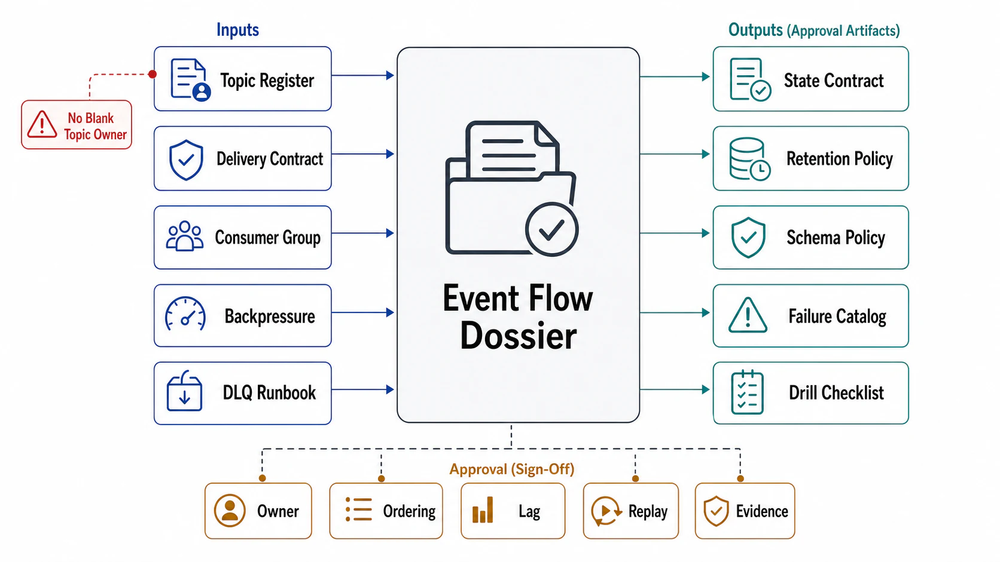

# Event Flow Review Templates



## Abstract

This file assembles the chapter into its executable form: the dossier a team completes to put an event flow — producer to final side effect — in front of an architecture review, and the checklist the reviewer walks to approve it. The dossier's organizing principle is the chapter's root thesis made procedural: every section forces a *written answer* to a question the log otherwise lets a team defer — who needs this ordering, who absorbs these duplicates, who slows this producer, who owns this DLQ, how long is this history really needed, who reads this schema — because in event-driven systems the expensive defects are exactly the deferred answers, discovered at retention edges and replay time. A dossier section answered "N/A" is legitimate; a section answered vaguely is a finding. Evidence citations must satisfy file 10's stamp discipline: dated, flow-generation-stamped, and no older than the topology they describe.

## 1. Dossier Assembly

```text
Figure 1. Dossier assembly: each section is produced by one file's
gates; the checklist consumes the whole.

  f01 ─► §A topic & ordering        f06 ─► §F processing topology
  f02 ─► §B delivery contract      f07 ─► §G retention contract
  f03 ─► §C consumption plan       f08 ─► §H schema & envelope
  f04 ─► §D pressure path          f09 ─► §I failure & degradation
  f05 ─► §E poison & replay        f10 ─► §J evidence ledger
                     │
                     ▼
        reviewer checklist (§3) ─► approve flow / findings
```

## 2. The Event Flow Dossier

**§A Topic and ordering (file 01).** The tool-fit statement first: which of the log's gifts (replay, order, fan-out) this flow actually needs — a flow that names none belongs on queue semantics (file 01 §6) and stops here. Then: topic name, type (history | compacted changelog), partition count with the sizing arithmetic, partition key, and the *written consumer ordering requirement* the key was derived from ("events for X must be observed in order"). Key-skew analysis: cardinality, whale keys, measured distribution. Repartitioning stance: the migration plan, or the declared headroom that defers it.

**§B Delivery contract (file 02).** Per hop, the honest semantics (at-least-once + idempotent effect | transactional-within-log | at-most-once with data-loss sign-off). The dataflow diagram with the transactional boundary drawn. Origin-assigned event ID scheme. For every non-idempotent side effect: its name and its §3-pattern (dedup table | 2PC sink | idempotency-key API), with dedup-window ≥ replay-horizon shown numerically.

**§C Consumption plan (file 03).** Group ID (under change control), assignment strategy + membership mode, member count vs partition count (spares declared), `max.poll.interval.ms` derivation from measured worst-case batch, lag SLIs wired (time lag, velocity, both runways — per partition), `auto.offset.reset` posture.

**§D Pressure path (file 04).** Buffer inventory: every queue with bound + overflow behavior. The pressure trace source-ward. The *producer answer* for this topic (lag-absorbs-with-runway-arithmetic | quotas | shed-by-class), named and implemented. Batch-size-down documented as the operable knob.

**§E Poison and replay (file 05).** Exception-path taxonomy table (class → disposition). Retry-topic tiers if any, with the ordering-honesty reconciliation. DLQ contract: owner, triage SLO, oldest-entry-age alarm, envelope fields, retention > main. Replay procedure: rate cap, abort path, externality masks, time-semantics statement, change-control record.

**§F Processing topology (file 06)** — *if stateful.* Runtime and why. Event-time vs processing-time per operator; watermark policy from measured skew; late-data rule with downstream compatibility. State inventory with TTLs and skew analysis. Checkpoint interval/duration ratio; measured recovery time = declared RTO. Sink classification (2PC | idempotent). For AI-derived flows additionally: transform/model versions in the envelope, freshness SLO per index, re-derivation replay cost estimate at current GPU rates, persistence policy for nondeterministic artifacts, and the single derivation graph shared by training and serving paths.

**§G Retention contract (file 07).** The multi-party horizon table (§1 of file 07) with each declaring party named; floor vs ceiling reconciliation (erasure obligations); expiry-approach alarms; tiered-storage posture with cold-path test results against rebuild claims.

**§H Schema and envelope (file 08).** Registry subject, compatibility mode (transitivity stated) with the retention-scope justification; envelope field checklist (event ID, type, schema ID, event time, source, trace context); consumer registry (who reads, owned by whom); semantic-evolution policy; contract-test coverage against oldest-in-retention version.

**§I Failure and degradation (file 09).** The F1–F8 catalog mapped to this flow: owning team + runbook per mode; derivative alarms in place; storm mitigations (budget margin, cooperative+static, pause authority); the D1–D5 ladder instantiated; this flow's position in the shared-cluster criticality ranking.

**§J Evidence ledger (file 10).** E1–E10 status for this flow: date, result, flow-generation stamp per drill; gaps as *assumed* entries with expiry dates; SLI implementation attestation.

## 3. Reviewer Checklist

| # | Check | Source gate | Common failure it catches |
|---:|---|---|---|
| 1 | The log's gifts named per flow; work-queue workloads routed to queue semantics | f01 tool-fit | The task queue on consumer groups, poison machinery compensating |
| 2 | Ordering requirement written by *consumers*, key derived from it | f01 ordering-contract | Key chosen for load spreading; "topic is ordered" for n>1 |
| 3 | Partition arithmetic shown; repartitioning acknowledged as migration | f01 arithmetic | Default count; "add partitions later" on a keyed topic |
| 4 | No "exactly-once delivery" anywhere; boundary drawn; every non-idempotent effect enumerated with its pattern | f02 vocabulary + non-idempotent-effect | The unenumerated charge/email/increment |
| 5 | Commit-after-process everywhere, or at-most-once signed off | f02 commit-order | Early commit "for throughput" |
| 6 | Dedup window ≥ replay horizon, numerically | f02 identity | 24 h dedup under 7 d replay |
| 7 | Cooperative + static on stateful groups; standby replicas on gigabyte-state groups; poll budget from measured batches | f03 protocol + liveness-budget | Eviction storms under dependency slowness |
| 8 | Per-partition time lag, velocity, and both runways alarmed; recovery multiplier λ/(μ−λ) computed at declared utilization | f03 lag-SLI / f09 derivative-alarm | Aggregate dashboards hiding the dying partition; 95% utilization sold as efficiency |
| 9 | Every buffer bounded with declared overflow; pressure path terminates at a policy, not a crash | f04 bounded-buffer + propagation | The in-app queue ahead of a slow sink |
| 10 | The producer question answered per topic | f04 producer-policy | Retention expiry as the implicit shedding policy |
| 11 | Poison taxonomy with distinct dispositions; DLQ has owner, age alarm, exit doors | f05 taxonomy + DLQ-contract | Catch-all handlers; the write-only graveyard |
| 12 | Replay rehearsed (E6) with externality masks, before it is needed | f05 replay-license | First idempotence test = the production replay |
| 13 | Watermark policy + late-data rule named; replay time-semantics stated | f06 time-semantics | Processing-time windows on domain logic |
| 14 | State bounded (TTL); checkpoint ratio alarmed; RTO measured not asserted | f06 state + checkpoint | Unbounded keyspace; rehearsal-free recovery claims |
| 15 | AI flows: transform versions in envelope; re-derivation cost-estimated; freshness SLO per index; one derivation graph for training and serving | f06 AI-flow | Model upgrades discovered at GPU-invoice time; training/serving skew |
| 16 | Retention = max(declared horizons), parties named; ceiling reconciled; expiry alarmed | f07 contract | Seven days chosen by nobody |
| 17 | Compacted topics: upsert-only readers, tombstone window > bootstrap time | f07 compaction-semantics | Resurrection by slow bootstrap |
| 18 | Transitive compatibility scoped to the retained tail; registry enforcement pre-produce | f08 scope + enforcement | Non-transitive BACKWARD default; advisory registry |
| 19 | Envelope complete; consumer registry answers "who reads this" | f08 envelope + consumer-registry | Notification-by-incident |
| 20 | F-catalog owned; ladder + criticality ranking pre-agreed | f09 ladder + ownership | 3 a.m. triage negotiation |
| 21 | Evidence ledger current: stamps valid, cadences met, gaps declared with expiry | f10 all | Drills passed against retired topologies |

## 4. Approval Statement

Approval of an event-flow dossier asserts: the ordering, delivery, retention, and schema contracts are written and evidence-backed end-to-end from producer to final side effect; pressure and poison paths are designed with owners; and the flow's failure modes have pre-agreed responses. It asserts *nothing* about the broker's internal replication (Chapter 05's approval), the request/response APIs at the flow's edges (Chapter 01 file 04), or the consistency claims of stores the flow feeds (Chapter 03) — those approvals are prerequisites, cited by reference in §A–§J, never re-argued here.

## Output

The output of this file — and the chapter — is an executable review instrument: a ten-section dossier that forces the deferred questions of event-driven design into written, evidence-stamped answers, and a twenty-one-point checklist that converts this chapter's gates into findings a review can actually produce.

## References

- [Chapter 06 file map — the approval dependency graph this dossier assembles](00-chapter-file-map.md)
- [Chapter 01 file 11 — evidence classification the ledger inherits](../01-architectural-objective-and-system-boundary/11-evidence-classification-and-architecture-review.md)
- [Google SRE Book — the launch-review discipline this template's checklist form follows](https://sre.google/sre-book/reliable-product-launches/)
