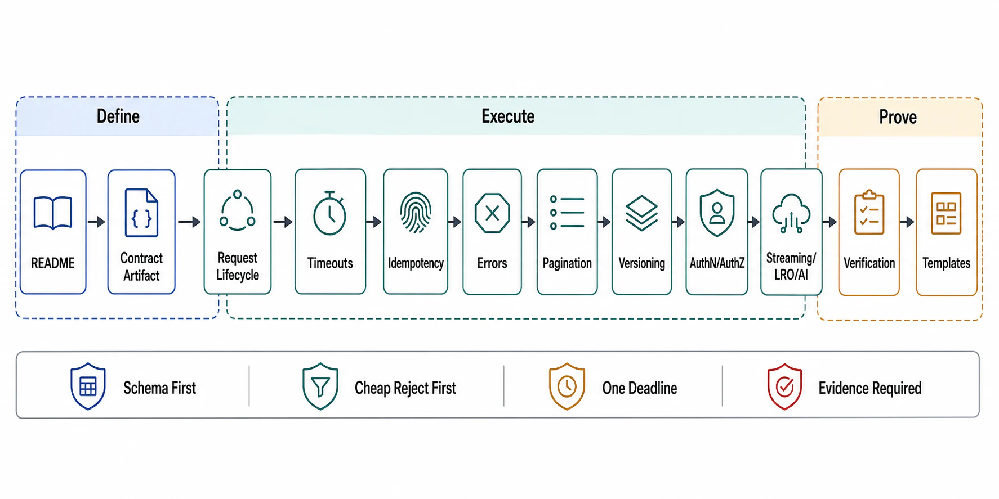

# Chapter 07 File Map



## Purpose

A production API must specify schema, idempotency-key behavior, timeout budget, retry semantics, pagination boundary, status codes, authentication context, authorization decision, and partial-failure response shape — the root thesis this chapter implements. Chapter 01 file 04 *declared* the contract fields every boundary owes; this chapter *designs* them: the contract as a schema-first artifact with generated conformance, the request lifecycle as an ordered pipeline where each stage's position is a correctness decision, time as a budget that decomposes across hops, retries as a priced amplifier licensed only by idempotency, errors as a machine-readable contract rather than prose, pagination and versioning as the two places APIs quietly break their consumers, identity and authorization as per-request decisions with declared decision points, and the streaming/long-running/AI lifecycles that no request/response template covers. The seam discipline: Chapter 01 file 04 owns *that* these fields exist; this chapter owns *how* they are engineered; Chapter 09 will own the queue/scheduler machinery behind admission decisions this chapter only prices.

Each file is a self-contained research note: an abstract stating the claim, a formal model, figures, decision tables, approval gates that can fail a design, and primary-source references.

## Reading Order

| Order | File | Architecture Decision Produced |
|---:|---|---|
| 1 | [README.md](README.md) | Chapter thesis, source corpus, and completion gate |
| 2 | [01-the-contract-artifact-and-schema-first-design.md](01-the-contract-artifact-and-schema-first-design.md) | The contract as the reviewed artifact; schema-first vs code-first; when a request API is the wrong tool |
| 3 | [02-request-lifecycle-and-middleware-order.md](02-request-lifecycle-and-middleware-order.md) | The lifecycle pipeline; stage ordering as correctness; admission placement |
| 4 | [03-timeout-budgets-retries-and-hedging.md](03-timeout-budgets-retries-and-hedging.md) | Deadline propagation, budget decomposition, retry amplification math, hedging |
| 5 | [04-idempotency-and-safe-retries.md](04-idempotency-and-safe-retries.md) | Idempotency-Key mechanics, ambiguity handling, the retry license |
| 6 | [05-errors-status-codes-and-partial-failure.md](05-errors-status-codes-and-partial-failure.md) | Error taxonomy, RFC 9457 problem details, partial-failure shapes |
| 7 | [06-pagination-filtering-and-bulk-surfaces.md](06-pagination-filtering-and-bulk-surfaces.md) | Cursor contracts, consistency-under-pagination, limits, bulk endpoints |
| 8 | [07-versioning-deprecation-and-compatibility.md](07-versioning-deprecation-and-compatibility.md) | Compatibility rules, versioning schemes, deprecation machinery (RFC 9745/8594) |
| 9 | [08-authentication-authorization-and-tenancy.md](08-authentication-authorization-and-tenancy.md) | Identity in the path, authz decision placement, tenancy enforcement |
| 10 | [09-streaming-long-running-and-ai-request-lifecycles.md](09-streaming-long-running-and-ai-request-lifecycles.md) | SSE/streaming contracts, LRO pattern, token streaming, tool-calling APIs |
| 11 | [10-verification-of-api-contracts.md](10-verification-of-api-contracts.md) | Drills C1–C10, contract testing, API SLIs, contract-generation stamps |
| 12 | [11-api-review-templates.md](11-api-review-templates.md) | Executable dossier and approval checklist |

## Approval Dependency Graph

```text
Figure 1. Chapter 07 approval dependency graph.

  [01] Contract artifact (schema-first; request API admitted at all?)
        │
        v
  [02] Request lifecycle + middleware order
        │
        ├────────────────────────────┐
        v                            v
  [03] Time: budgets, retries,  [08] Identity: authn/authz/tenancy
       hedging                       (placed INSIDE [02]'s pipeline)
        │
        v
  [04] Idempotency (the license [03]'s retries require)
        │
        v
  [05] Errors + partial failure (what retries/timeouts surface)
        │
        ├──────────────────┐
        v                  v
  [06] Pagination     [07] Versioning + deprecation
        │                  │
        └────────┬─────────┘
                 v
  [09] Streaming, LRO, and AI lifecycles (composes all above)
                 v
  [10] Verification ──► [11] Dossier
```

Concrete dependencies the graph encodes:

- Retries ([03]) without idempotency ([04]) are a correctness defect, not a resilience feature; the two files approve one mechanism seen from two sides.
- Error shapes ([05]) are downstream of time ([03]) because timeout ambiguity is the hardest error class: "failed" and "unknown" must be distinguishable in the contract.
- Streaming and LRO ([09]) exist precisely where [03]'s budget arithmetic proves a synchronous response impossible — the file is the escape hatch the earlier files price.
- Identity ([08]) hangs off the lifecycle ([02]) because *where* authn/authz run in the pipeline decides what an unauthenticated request can cost.

## Prerequisites From Earlier Chapters

| Artifact | Consumed By |
|---|---|
| Contract fields, status machine, ambiguity discipline ([Ch01 file 04](../01-architectural-objective-and-system-boundary/04-input-output-and-api-contracts.md)) | All files — this chapter is that file, engineered |
| Overload semantics, shed order, retry budgets ([Ch01 file 08](../01-architectural-objective-and-system-boundary/08-failure-domain-and-overload-semantics.md)) | [02], [03] |
| Control/data plane split — gateway config vs request path ([Ch02 file 03](../02-control-plane-and-data-plane-separation/03-data-plane-anatomy.md)) | [02] |
| Consistency claims per read path ([Ch03 file 02](../03-state-ownership-and-consistency-model/02-consistency-model-selection.md)) | [06] |
| Keyset pagination mechanics ([Ch04 file 04](../04-data-modeling-storage-engines-and-query-paths/04-query-path-contracts.md)) | [06] |
| Idempotent consumption, dedup windows ([Ch06 file 02](../06-event-logs-streams-and-backpressure/02-delivery-semantics-and-idempotent-consumption.md)) | [04] |
| Log-vs-queue-vs-RPC admission ([Ch06 file 01 §6](../06-event-logs-streams-and-backpressure/01-the-log-abstraction-and-topic-design.md)) | [01], [09] |
| Trust boundary, zero-trust posture ([Ch01 file 10](../01-architectural-objective-and-system-boundary/10-security-privacy-and-trust-boundary.md)) | [08] |

## Chapter Rule

Chapter 07 approves API contracts and the request lifecycles that serve them — schema artifacts, pipeline ordering, time budgets, retry/idempotency pairs, error shapes, pagination and versioning surfaces, per-request identity decisions, and streaming/LRO/AI lifecycles — each priced from client SDK to final status code. It does not approve the storage those APIs read and write (Chapters 03–05), the event flows they emit (Chapter 06), or the queue and scheduler machinery behind admission (Chapter 09 owns that); it prices their contracts and cites their approvals.
