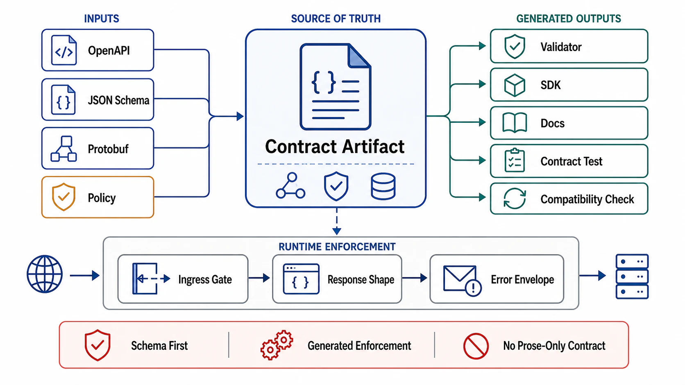

# The Contract Artifact and Schema-First Design



## Abstract

An API's real contract is whatever its consumers depend on — which, absent discipline, converges on *everything observable about it*: field order, error prose, timing, undocumented behavior (Hyrum's Law, stated by its author as "with a sufficient number of users of an API, it does not matter what you promise in the contract: all observable behaviors of your system will be depended on by somebody" — [hyrumslaw.com](https://www.hyrumslaw.com/)). The only countermeasure is to make the *intended* contract a first-class, machine-readable, reviewed artifact — an OpenAPI document ([spec](https://spec.openapis.org/oas/latest.html)), a protobuf service definition ([proto3 spec](https://protobuf.dev/programming-guides/proto3/)), a GraphQL SDL — from which validation, SDKs, mocks, and conformance tests are *generated*, so the artifact cannot drift from the implementation without something failing. This file establishes the artifact discipline, the schema-first-versus-code-first decision (which is really a question about who reviews what, when), the interface-style decision made on workload shape rather than fashion, and — first, because it gates everything else — the admission question this chapter's raised standard demands: whether a synchronous request/response API is the right tool for this interaction at all.

## 1. Is a Request API the Right Tool? — the Admission Decision

The mirror of Chapter 06 file 01 §6, from the synchronous side:

| Interaction shape | Right tool | Why request/response fails it |
|---|---|---|
| Caller needs the answer to proceed; work completes within the budget (file 03) | Request/response | — this is what it is for |
| Work exceeds any honest timeout budget (p99 work time ≳ client deadline) | Long-running operation ([09]) | A synchronous call becomes a timeout generator; the client retries work that is still running — duplicate execution at the worst moment |
| Caller doesn't need the answer, only the effect, and tolerates asynchrony | Event to a log (Ch06) | The synchronous hop couples the caller's availability to the callee's for no consumer benefit |
| Many consumers need to observe the change | Event fan-out (Ch06) — the API mutates, the log distributes | N consumers polling a request API is N reimplementations of a log, each with its own missed-update bug |
| Caller needs incremental output as it is produced | Streaming response ([09]) | Buffering the whole result destroys time-to-first-byte and memory bounds simultaneously |

The gate is honesty about the *interaction*, not the endpoint: most real systems answer "request API *plus*" — a synchronous mutation that emits an event (the outbox composition, Chapter 03 file 05), or a request that returns an operation handle. What fails review is the default-synchronous reflex: every interaction shipped as blocking request/response and the mismatches discovered as production timeout tickets.

## 2. The Artifact and Its Enforcement Loop

```text
Figure 1. The contract artifact's enforcement loop — every arrow
that is missing is a place the real contract drifts from the
written one.

              ┌──────────────────────────────┐
              │  contract artifact (OpenAPI/  │
              │  proto/SDL) — versioned,      │
              │  reviewed as code             │
              └──┬───────┬───────┬───────┬────┘
                 v       v       v       v
             request  client   mock    conformance
             validators SDKs   servers  tests
                 │       │       │       │
                 v       v       v       v
              server   consumers  CI    CI gate:
              rejects  compile    tests implementation
              off-     against    against must satisfy
              contract the        the    the artifact —
              input at contract,  contract,not vice versa
              the edge not the    not the
                       server     server
```

Three rules give the artifact teeth. **Generated, not transcribed**: validators, SDKs, and mocks derive from the artifact mechanically; hand-maintained parallel copies are drift with a build step. **The artifact wins conflicts**: when implementation and artifact disagree, CI fails — an implementation-wins posture converts the artifact into documentation, and documentation is where contracts go to lie. **Breaking-change detection is mechanical**: a schema diff tool classifies every artifact change as compatible or breaking (the field-level law table lives in file 07), and breaking changes route to the deprecation machinery rather than a merge button. Schema-first vs code-first is then revealed as a review-ordering question: schema-first puts the contract review *before* the implementation exists (right for cross-team and public surfaces); code-first with generated schemas is acceptable for interior APIs *if* the generated artifact still gates CI — what is never acceptable is code-first with the schema as an unreviewed by-product.

## 3. Interface Style Is a Workload Decision

| Style | Strengths | Honest costs | Fits |
|---|---|---|---|
| REST/JSON over HTTP | Ubiquity, cacheability, human-debuggable, gateway/tooling ecosystem | Verbose payloads; N+1 endpoint shapes; weak streaming | Public APIs, CRUD-shaped resources, maximal-reach surfaces |
| gRPC/protobuf | Binary efficiency, streaming in all four shapes, deadline propagation built in (file 03), codegen discipline | Browser hostility (needs proxies), binary opacity in debugging, HTTP/2 operational surface | Interior service-to-service, latency-sensitive paths, polyglot fleets |
| GraphQL | Client-shaped responses, one round trip for composite views, typed introspection | The server surrenders the query plan to clients — cost variance per request is unbounded without depth/complexity limits and persisted queries; caching fragments; authz becomes per-field | Aggregation tiers over many backends for product UIs — *with* the cost-control machinery, or not at all |

Two disciplines cut across all three. First, the style is chosen per *surface*, not per company: a public REST API, gRPC interior, and a GraphQL BFF coexist correctly when each carries its own artifact and gates. Second, GraphQL's row is the one that fails reviews most often, because its named cost — client-controlled query cost — is Chapter 04 file 04's query-path contract violated by design unless persisted queries, complexity budgets, and per-field authz are present; a GraphQL adoption without those three is an unbounded-work endpoint with a type system.

## 4. The Consumer Side of the Contract

Contracts bind two parties, and the artifact only captures the producer's half. The consumer's half is captured by consumer-driven contract tests ([Pact's methodology](https://docs.pact.io/)): each consumer records the subset of the contract it actually uses, and the producer's CI replays those expectations against every proposed change. The effect is Hyrum's Law made tractable — the producer no longer guesses which observable behaviors matter; it has the list, and a change that breaks nobody's recorded expectations is *demonstrably* safe to ship even when the diff tool calls it breaking (removing a field no consumer reads). The inverse effect is equally valuable: the recorded expectations expose consumers depending on undocumented behavior *before* the producer changes it — the drift is surfaced as a failing contract test with a consumer's name on it, not as a production incident with nobody's.

## 5. Approval Gates

| Gate | Evidence Required | Failure Condition |
|---|---|---|
| Admission gate | The §1 interaction analysis per endpoint class; LRO/event/streaming routed to their machinery | Default-synchronous reflex; work exceeding the timeout budget served as blocking request/response |
| Artifact gate | Versioned, reviewed contract artifact per surface; validators/SDKs/mocks generated; artifact-wins CI gate | Hand-maintained schema copies; implementation-wins drift; schema as unreviewed by-product |
| Diff gate | Mechanical breaking-change classification on every artifact change, wired to file 07's deprecation machinery | Breaking changes discovered by consumers; compatibility judged by eyeball |
| Style gate | Interface style justified per surface against the §3 table; GraphQL only with persisted queries + complexity budgets + per-field authz | Style by fashion; GraphQL as an unbounded-work endpoint |
| Consumer gate | Consumer-driven contracts for cross-team surfaces, replayed in producer CI | Producer guessing what consumers depend on; Hyrum's Law managed by hope |

## Output

The output of this file is a contract discipline with enforcement teeth: every interaction admitted to request/response deliberately or routed to the machinery it actually needs, a machine-readable artifact from which conformance is generated and against which CI fails, breaking changes detected by diff rather than by incident, interface styles chosen per surface on workload evidence, and the consumer half of every cross-team contract recorded and replayed.

## References

- [Wright, "Hyrum's Law" — all observable behavior becomes contract](https://www.hyrumslaw.com/)
- [OpenAPI Specification (latest) — the REST contract artifact](https://spec.openapis.org/oas/latest.html)
- [Protocol Buffers proto3 language guide — the gRPC contract artifact](https://protobuf.dev/programming-guides/proto3/)
- [Pact — consumer-driven contract testing methodology](https://docs.pact.io/)
- [GraphQL specification — introspection, execution, and the client-shaped query model](https://spec.graphql.org/)
