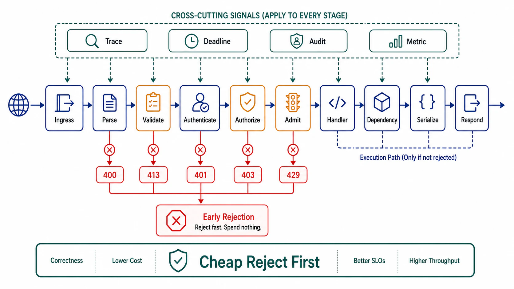

# Request Lifecycle and Middleware Order



## Abstract

Between socket accept and final byte, every request traverses a pipeline of stages — decode, identify, admit, authorize, validate, execute, respond, record — and the *order* of those stages is a set of correctness and security decisions that most frameworks let teams make by accident, in whatever sequence middleware happened to be registered. The ordering laws are not stylistic: cheap-and-rejecting stages run before expensive ones or the system can be griefed at the cost of its most expensive stage; identity precedes admission or per-tenant fairness is unenforceable (an anonymous request cannot be counted against anyone); authorization precedes any handler work or information leaks through timing and error shape; and the observability stages must bracket everything or the requests that fail *in the pipeline* — precisely the interesting ones — vanish from telemetry. This file gives the canonical order with the reasoning per position, the admission stage's placement as the data-plane enforcement point of Chapter 01 file 08's overload contract (with the machinery itself deferred to [Chapter 09](../09-scheduling-queues-and-resource-admission/README.md)), and the gateway-versus-service division of labor that Chapter 02's plane separation implies for request paths.

## 1. The Canonical Pipeline

```text
Figure 1. The request lifecycle. Position is load-bearing:
each stage is placed so that everything after it can trust
what it established, and everything expensive sits behind
everything cheap.

  socket ──► [0 accept/TLS]      connection identity, cheap kill
        ──► [1 decode limits]    size caps, header caps, parse
        │                        bombs die here — BEFORE allocation
        ──► [2 trace start]      request ID + W3C traceparent minted;
        │                        from here, NOTHING is invisible
        ──► [3 authenticate]     who is asking (Ch01 f10; file 08)
        ──► [4 admit/limit]      per-identity quotas, cost-based
        │                        admission (Ch01 f08; machinery Ch09)
        │                        — identity-aware, pre-expense
        ──► [5 authorize]        may THIS identity do THIS to THAT
        │                        (file 08: decision point, not vibes)
        ──► [6 validate]         contract validation, generated from
        │                        the artifact (file 01); semantic checks
        ──► [7 execute]          handler: budgets attached (file 03),
        │                        idempotency consulted (file 04)
        ──► [8 respond]          status per file 05; stream per f09
        └─► [9 record]           metrics/log/trace flush — runs on
                                 EVERY exit path, including stage 1-6
                                 rejections
```

The two orderings teams most often get wrong, and why they matter: **admission before authorization** (4 before 5) is correct because authorization may be expensive (policy evaluation, directory lookups) and admission exists to protect exactly such stages — but admission *after* authentication (3 before 4), because unauthenticated admission can only rate-limit by IP, which multi-tenant NAT renders both leaky (one tenant exhausts a shared IP's budget) and unfair. **Validation after authorization** (5 before 6) is the information-leak rule: a validation error on a resource the caller may not see reveals the resource's existence and shape; the caller entitled to nothing learns nothing, not even that its request was malformed in an interesting way.

## 2. Rejection Economics — the Worked Number

The pipeline's economic function is to make rejection cheap and acceptance deliberate. Run the arithmetic once: a handler that costs 50 ms of compute behind stages that cost 0.5 ms cumulatively means a rejected-at-admission request is **100× cheaper** than an executed one — so a fleet sized for 10k rps of legitimate work can absorb ~1M rps of rejected abuse at equal cost, *if and only if* rejection happens at stage 4. Invert the order — validation or authz calls that touch backends before admission — and the amplification collapses: the abuse now costs what the backends cost, and Chapter 01 file 08's protection exists on paper only. This is also the argument for pushing coarse limits (stage 1's size caps, connection limits) to the gateway: the cheapest rejection is the one that never reaches the service.

## 3. Gateway vs Service — the Division of Labor

Chapter 02's split, applied: the gateway (data-plane element, config pushed from the control plane) owns what is *uniform across services* — TLS termination, coarse limits, routing, retry-once-on-connect-failure semantics, trace initiation; the service owns what requires *its* context — semantic validation, authorization against its resources, cost-based admission priced in its units, idempotency. The classic failure is drift in both directions: gateways accreting per-service business logic (a control-plane change now ships someone's feature) and services re-implementing gateway concerns divergently (nine bespoke rate limiters, none tenant-aware). The dossier field is a two-column table — this concern, that owner — with every row having exactly one owner.

One rule deserves its own sentence: **the gateway must not retry non-idempotent methods**, ever; a gateway that retries POSTs on timeout converts every slow response into a potential duplicate execution, upstream of any idempotency machinery the client attached — this is file 04's contract enforced at the topology level.

## 4. Context Is Explicit

Everything the pipeline establishes — identity, tenant, trace context, deadline, admission class, idempotency key — travels in an explicit, typed request context, not in thread-locals, globals, or re-derivation. Two laws: the context is *immutable after its establishing stage* (a handler that rewrites the tenant ID is a confused-deputy factory — file 08), and the context *propagates outward* on every downstream call (deadline per file 03, trace per W3C Trace Context, identity per file 08's on-behalf-of rules). A deadline that dies at the service boundary and a trace that ends where the interesting call graph begins are the same defect at different altitudes: pipeline state that stopped traveling.

## 5. Approval Gates

| Gate | Evidence Required | Failure Condition |
|---|---|---|
| Order gate | Pipeline stages enumerated with the §1 ordering; deviations justified in writing per surface | Middleware order = registration accident; validation or authz spend before admission |
| Rejection-economics gate | The §2 arithmetic run with this service's numbers; cheap-rejection ratio stated; coarse limits at the gateway | Abuse costed at handler prices; parse bombs reaching allocation |
| Division gate | Gateway/service concern table with single owners; gateway retry policy excludes non-idempotent methods | Business logic in gateway config; per-service bespoke rate limiters; gateway POSTs retried |
| Context gate | Typed request context; immutable post-establishment; deadline + trace + identity propagate on every downstream call | Thread-local identity; deadlines that die at the boundary; unauthenticated internal hops |
| Telemetry-bracket gate | Stage 2 before all rejections' emitters, stage 9 on every exit path; pipeline rejections visible per stage per identity | Rejected requests invisible; "no logs because it never reached the handler" |

## Output

The output of this file is a request pipeline whose order is an argument rather than an accident: cheap rejection ahead of every expensive stage with the amplification arithmetic on record, identity ahead of fairness, authorization ahead of information, a gateway/service division with one owner per concern, and an explicit context that carries identity, deadline, and trace to every hop the request touches.

## References

- [AWS Builders' Library — Fairness in multi-tenant systems (identity-aware admission)](https://aws.amazon.com/builders-library/fairness-in-multi-tenant-systems/)
- [AWS Builders' Library — Using load shedding to avoid overload (rejection placement and cost)](https://aws.amazon.com/builders-library/using-load-shedding-to-avoid-overload/)
- [W3C Trace Context — the propagation contract stage 2 initiates](https://www.w3.org/TR/trace-context/)
- [Google SRE Book — Handling Overload (per-customer limits, criticality, the admission stage's doctrine)](https://sre.google/sre-book/handling-overload/)
- [OWASP API Security Top 10 — the attack classes the §1 ordering exists to blunt](https://owasp.org/API-Security/editions/2023/en/0x11-t10/)
