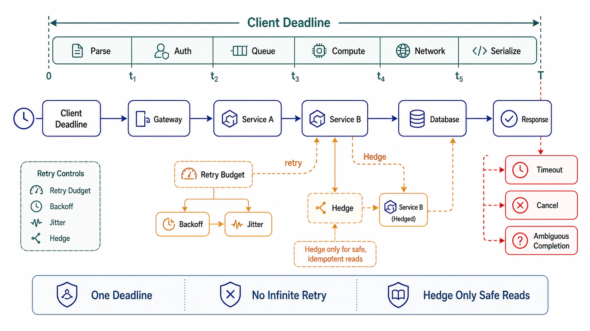

# Timeout Budgets, Retries, and Hedging



## Abstract

Time in a distributed request path is a budget that decomposes, not a collection of independent knobs — and the defaults prove most teams have never done the decomposition: infinite client timeouts, per-hop timeouts longer than the caller's, and retry policies configured per service in isolation that multiply into amplification factors nobody chose. The correct model is a single deadline minted at the edge and *propagated* — each hop receives the remaining budget, spends some, and passes the rest, refusing work it cannot finish in time (gRPC ships this as first-class deadline propagation — [gRPC deadlines guide](https://grpc.io/docs/guides/deadlines/)). Retries are then priced honestly: a retry is a deliberate load amplifier that trades capacity for tail latency, safe only under three simultaneous licenses — an idempotent target (file 04), a remaining budget that fits another attempt, and a *bounded global amplification* (retry budgets/token buckets, not per-call counters — the discipline AWS codified after storm postmortems: [timeouts, retries, and backoff with jitter](https://aws.amazon.com/builders-library/timeouts-retries-and-backoff-with-jitter/), and Brooker's token-bucket formulation of *why* per-call caps fail: [retries as amplifiers](https://brooker.co.za/blog/2022/02/28/retries.html)). Hedging — the Tail-at-Scale move of sending a second copy of a slow request rather than waiting ([Dean & Barroso, CACM 2013](https://cacm.acm.org/research/the-tail-at-scale/)) — is the same trade at a sharper price point. The worked arithmetic in §2 and §3 is the file's spine, because every number in it is chosen by someone, and the defaults choose badly.

## 1. Deadline Propagation — the Model

```text
Figure 1. One deadline, decomposed. Each hop receives remaining
budget, reserves its own work + response time, and passes the rest.

  client deadline: 2,000 ms
     │
     v
  [edge]  receives 2000 · reserves 50 (respond+serialize)
     │    passes 1950
     v
  [svc A] receives 1950 · own work 200 · passes 1700 to B
     │                                  (minus network reserve 50)
     v
  [svc B] receives 1700 · needs DB p99=400 + work 100
     │    → attempt fits: proceed. If remaining were 300:
     │    → REFUSE NOW (fail fast) — do not start work that
     v      cannot finish; the client's timer fires either way
  [DB]    query timeout = min(statement default, remaining−reserve)

  Two laws:
  L1  child timeout < parent remaining, ALWAYS — a child allowed
      to outlive its parent does orphan work that nobody will read
      (and holds locks/connections while doing it)
  L2  deadline checks happen BEFORE expensive stages, not after —
      checking post-work converts "too late" into "too late and
      we paid anyway"
```

The refusal in the figure is the point most designs miss: a hop that *knows* it cannot meet the remaining budget must fail immediately with the distinct budget-exhausted error (file 05), because the alternative — starting anyway — produces the worst outcome in the taxonomy: work performed, response discarded, client already retrying, effect possibly applied (the ambiguity file 04 exists to resolve). Deadline propagation is also the automatic cleanup mechanism: cancellation flows down the same channel, so a client abandoning a request stops the whole tree's spend, not just the first hop's.

## 2. Retry Amplification — the Worked Number

Per-layer retry policies multiply. Three layers, each configured with the innocuous-looking "3 attempts": a persistent fault at the bottom sees 3 × 3 × 3 = **27 attempts per client request** — and if clients retry too, ×3 again = 81. At 10k rps of client traffic against a struggling dependency, that is 810k rps of attack traffic generated by your own resilience configuration, arriving precisely when the dependency is least able to serve it: the retry storm, which is Chapter 06's metastable-failure shape with timeouts as the trigger. The rules that follow from the arithmetic:

| Rule | Mechanism | What it prevents |
|---|---|---|
| Retry at *one* layer, not every layer | The layer owning the operation's semantics (usually the closest to the client with idempotency context) retries; inner layers fail fast upward | Multiplicative amplification |
| Budget, don't count | Retry token bucket: retries spend from a global budget (e.g., ≤10% of request rate); exhausted budget = no retries fleet-wide | Per-call "3 attempts" being individually reasonable and collectively fatal |
| Full jitter on backoff | `sleep = random(0, min(cap, base·2^attempt))` | Synchronized retry waves re-shocking a recovering dependency |
| Retry only retriable errors | File 05's taxonomy: 5xx-transient and budget-permitting yes; 4xx-deterministic never | Burning budget re-sending requests that can never succeed |
| Circuit-break persistent failure | Failure-rate threshold flips the path to fail-fast + probe | Paying timeout latency per request against a dead dependency |

The budget rule deserves its Brooker-flavored restatement: per-call retry counters make a *local* promise ("this call retries at most 3×") while the failure mode is *global* (aggregate load doubling under 100% failure of a hot path). Only a globally scoped budget — token bucket per service per dependency — bounds what actually matters, which is the fleet's amplification factor under correlated failure.

## 3. Hedging — Paying Capacity for Tail Latency

Hedging attacks a different problem: not failure but *slowness variance*. The Tail-at-Scale observation quantifies it: with per-hop p99 = 10 ms tail, a request fanning to 100 servers experiences that tail on 63% of requests — tails compound with fan-out, so the p999 of components becomes the p50 of the composite. The hedge: after the p95 latency mark, send the request to a second replica and take the first answer. Cost arithmetic: hedging at p95 adds ≤5% load for a dramatic tail cut (the slowest 5% of requests get a second, usually-fast sample); hedging at p50 doubles load. The licenses mirror retries — idempotent target only, budget-bounded, and *cancel the loser* (an unhedged cancellation path means paying 2× for every hedged request, converting a tail optimization into a capacity tax). Hedge where fan-out is high and variance is infrastructural (GC pauses, cache misses); do not hedge where slowness is load-caused — hedging into an overloaded pool is retry-storm arithmetic with better branding.

## 4. Timeout Values Are Derived, Not Chosen

The number itself: a hop's timeout derives from the dependency's *measured* latency distribution and the remaining budget — `timeout ≈ min(p99.9 + margin, remaining − reserve)` — and is re-derived when the distribution shifts (a dependency that got 2× slower deserves a conscious decision, not a silently absorbed budget). Two anti-patterns close the file: the **infinite default** (no timeout = a thread/connection held for the peer's TCP half-open eternity; every client library's default is wrong for production until proven otherwise), and the **timeout inversion** (child > parent), which converts every parent timeout into orphaned in-flight work — L1's violation, findable mechanically by walking the config graph, and worth a drill (C3, file 10) because config drift regenerates it continuously.

## 5. Approval Gates

| Gate | Evidence Required | Failure Condition |
|---|---|---|
| Propagation gate | Deadline minted at edge, propagated on every hop (gRPC deadline / explicit header); refusal-on-insufficient-budget implemented; cancellation flows down | Per-hop independent timeouts; work started that cannot finish; orphan work on client abandon |
| Inversion gate | Config-graph walk shows child < parent everywhere, with reserves; re-derivation trigger on dependency-latency shift | Any child timeout ≥ parent remaining; infinite defaults anywhere on the path |
| Amplification gate | One retrying layer named per operation; global retry budget (token bucket) with its % stated; full jitter; the §2 multiplication run for this topology | Per-layer attempt counters; amplification factor unknown; retries on deterministic errors |
| Hedging gate | Hedge threshold (p95+), idempotent targets only, loser cancellation verified, load delta measured | Hedging non-idempotent calls; no cancellation; hedging into load-caused slowness |
| Breaker gate | Circuit breakers on persistent-failure paths with probe policy; breaker state visible in telemetry | Every request paying full timeout against a dead dependency |

## Output

The output of this file is a time design with one owner per number: an edge-minted deadline that decomposes hop by hop with refusal below the waterline, retries confined to one layer under a global budget with jitter and taxonomy discipline, hedging deployed where variance is infrastructural and cancellation is real, and every timeout derived from a measured distribution instead of inherited from a library's opinion of 30 seconds.

## References

- [gRPC — Deadlines guide (propagation as a first-class mechanism)](https://grpc.io/docs/guides/deadlines/)
- [AWS Builders' Library — Timeouts, retries, and backoff with jitter](https://aws.amazon.com/builders-library/timeouts-retries-and-backoff-with-jitter/)
- [Brooker — "Fixing retries with token buckets and circuit breakers" (retries as unbounded amplifiers)](https://brooker.co.za/blog/2022/02/28/retries.html)
- [Dean & Barroso, "The Tail at Scale," CACM 2013 — tail compounding and hedged requests](https://cacm.acm.org/research/the-tail-at-scale/)
- [Google SRE Book — Addressing Cascading Failures (retry storms, deadline propagation doctrine)](https://sre.google/sre-book/addressing-cascading-failures/)
