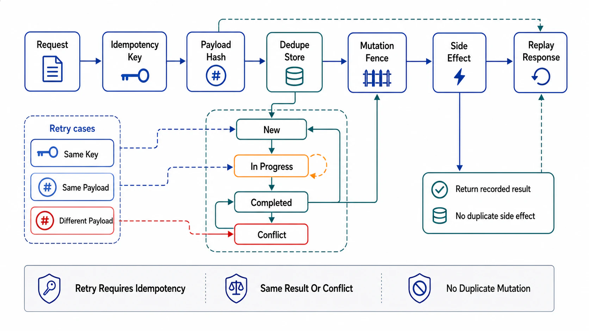

# Idempotency and Safe Retries



## Abstract

Every retry in file 03 and every timeout ambiguity in the status machine rests on one mechanism: the mutation that can be safely attempted twice. The client-generated idempotency key — sent with the request, stored with the result, replayed on retry — is the industry-settled design (Stripe's implementation is the canonical exposition: [designing robust and predictable APIs with idempotency](https://stripe.com/blog/idempotency); the IETF standardization is in progress as [draft-ietf-httpapi-idempotency-key-header](https://datatracker.ietf.org/doc/draft-ietf-httpapi-idempotency-key-header/), still a draft as of mid-2026 — the *pattern* is stable, the header's formal status is not, and the review should cite it accordingly). What the simple description hides is where implementations actually fail: the key must be checked-and-reserved *atomically with* the side effect (a check-then-act gap turns concurrent retries into double execution — the exact race the mechanism exists to close); the stored result must be the *full response*, replayed byte-faithfully, or retries observe different answers than the original; the reservation must handle the *in-flight* case (second request arrives while the first is still executing); and the retention window must exceed the longest credible retry horizon, which is a number this chapter's clients (including Chapter 06's event consumers calling APIs) can make surprisingly long. AWS's Builders' Library states the same discipline from the server's side: [making retries safe with idempotent APIs](https://aws.amazon.com/builders-library/making-retries-safe-with-idempotent-APIs/).

## 1. The Mechanism, With Its Races Closed

```text
Figure 1. Idempotency-key state machine — the three-state design
that closes the races the naive check-then-act version leaves open.

  request(key K) arrives
        │
        v
  atomically: INSERT key K state=IN_PROGRESS (unique constraint)
        │
        ├─ insert WON ──► execute handler
        │                   │ success            │ failure
        │                   v                    v
        │            store full response    store error OR delete K
        │            state=COMPLETED        (policy: is the failure
        │            return response        retriable? see §2)
        │
        ├─ conflict: state=COMPLETED ──► replay stored response
        │                                (byte-faithful, same status)
        │
        └─ conflict: state=IN_PROGRESS ──► 409/425-class "retry
                     later" — do NOT execute concurrently, do NOT
                     block the worker waiting

  Same key + DIFFERENT payload ──► 422-class rejection, always:
  a reused key is a client bug, and executing either payload
  silently is choosing which bug to have.
```

The three-state design is the whole trick. The unique-constraint insert makes reservation atomic with the decision to execute — two racing retries cannot both win it. The `IN_PROGRESS` branch handles the ambiguity window honestly: the first attempt may still succeed, so the second must neither re-execute nor pretend to know the outcome. And the payload-fingerprint check (store a request hash with the key) catches the client bug that otherwise produces the least-debuggable behavior in the catalog: two different requests, one response, no error anywhere.

## 2. Scope, Storage, and Retention Decisions

| Decision | Rule | The failure it prevents |
|---|---|---|
| Key scope | Per (identity, endpoint) namespace — one tenant's keys cannot collide with or probe another's | Cross-tenant replay: tenant B "retries" tenant A's key and receives A's stored response — a data leak wearing a convenience feature |
| What is stored | Full response: status, headers that matter, body — replayed exactly | The retry that returns 200 where the original returned 201 + Location; clients branching on the difference |
| Failure storage | Deterministic failures (validation, authz) stored and replayed; *transient* failures (timeout downstream, 503) NOT stored — the retry should genuinely re-attempt | Storing a 503 converts one transient blip into a permanently failing key; storing nothing converts validation errors into re-executions |
| Retention | ≥ the longest retry horizon of any legitimate client — and clients include Ch06 consumers whose replay window is the *retention* of their topic (days); state the number, compare the two | The 24 h idempotency window under a 7-day event-replay policy: Ch06 file 02's gate, enforced from the server side |
| Atomicity domain | Key store and side effect in the same transactional domain where possible (same DB); where not, the key reservation IS the outbox-pattern decision (Ch03 file 05) applied to requests | Key committed, effect lost (or vice versa) across a crash — the mechanism itself acquiring the dual-write bug |

## 3. Natural Idempotency First

The key machinery is the *general* solution and the second choice. Where the operation can be *naturally* idempotent, be that instead: `PUT` with full state (set, not increment), state-machine transitions that are no-ops when already satisfied (`cancel` on a cancelled order returns success), creation keyed by a natural unique identity (external reference ID with a uniqueness constraint — the constraint is the idempotency mechanism, at zero extra infrastructure). The decision rule: reach for the Idempotency-Key store only when the operation is irreducibly effect-ful per invocation — charge money, send email, enqueue work — because every naturally idempotent endpoint is one less state machine, one less retention policy, and one less replay surface to verify. The API-shape corollary: design mutations as *state declarations* ("the subscription should be: active, plan X") rather than *deltas* ("add one seat") wherever the domain allows; declarations are idempotent by construction, deltas never are.

## 4. The Client's Half of the Contract

The mechanism binds both sides, and the client's obligations are routinely undocumented: generate the key *before* the first attempt (a key minted per attempt is attempt-counting, not idempotency); persist it across process restarts if retries survive them (the crashed-and-restarted client that mints a fresh key is a duplicate-execution engine); reuse it for retries *of the same logical operation only*; and stop retrying on deterministic failures (file 03's taxonomy — a 422 retried with the same key is traffic with no possible payoff). Server-side, these obligations become SDK design: the generated client (file 01) mints, persists, and threads keys automatically, because a contract enforced by documentation alone converges on Hyrum's-Law entropy — some clients will do it right, and the difference will surface as a payments-duplication incident filtered by client library version.

## 5. Approval Gates

| Gate | Evidence Required | Failure Condition |
|---|---|---|
| Atomicity gate | Reservation is a unique-constraint insert (or equivalent CAS) atomic with the execute decision; in-flight state handled without concurrent execution | Check-then-act gap; two racing retries both executing; workers blocking on in-flight keys |
| Replay-fidelity gate | Full response stored and replayed byte-faithfully; payload fingerprint rejects key reuse with different bodies | Retries observing different statuses/bodies; silent key-reuse acceptance |
| Failure-policy gate | Deterministic failures replayed, transient failures re-attempted — the split declared per error class (file 05 taxonomy) | Stored 503s poisoning keys; validation errors re-executing |
| Scope-and-retention gate | Keys namespaced per (identity, endpoint); retention ≥ longest client retry horizon, compared explicitly against Ch06 replay windows | Cross-tenant key collisions; idempotency window shorter than an event consumer's replay policy |
| Natural-first gate | Naturally idempotent designs (declarative mutations, uniqueness constraints, no-op transitions) chosen where the domain allows; key machinery reserved for irreducible effects | Key store deployed as the default for endpoints a PUT would have fixed |
| Client-contract gate | SDKs mint/persist/thread keys automatically; client obligations in the contract artifact, not folklore | Idempotency correctness varying by client library version |

## Output

The output of this file is the retry license the rest of the chapter spends: mutations that are naturally idempotent wherever the domain allows and key-protected where they are not, with reservation atomic against races, byte-faithful replay, a failure-storage policy that distinguishes deterministic from transient, retention that has been compared against every real retry horizon including event replay, and clients whose half of the contract is generated rather than hoped for.

## References

- [Stripe — Designing robust and predictable APIs with idempotency](https://stripe.com/blog/idempotency)
- [IETF HTTPAPI — The Idempotency-Key HTTP Header Field (draft-07, Standards Track intended; still a draft as of 2026)](https://datatracker.ietf.org/doc/draft-ietf-httpapi-idempotency-key-header/)
- [AWS Builders' Library — Making retries safe with idempotent APIs](https://aws.amazon.com/builders-library/making-retries-safe-with-idempotent-APIs/)
- [Stripe API Reference — idempotent requests (retention and replay behavior as shipped)](https://docs.stripe.com/api/idempotent_requests)
