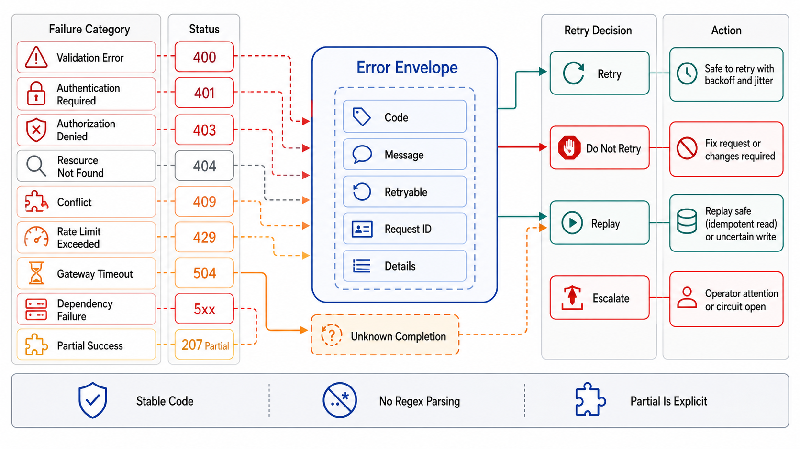

# Errors, Status Codes, and Partial Failure



## Abstract

Error responses are the half of the contract that gets designed last and depended on hardest: clients branch on them programmatically (retry or not, surface or suppress, refresh a token or page a human), which means an error surface without machine-readable structure forces every client to parse prose — and prose changes, so every wording tweak is an undeclared breaking change to somebody's regex (Hyrum's Law at its purest). The settled answer is RFC 9457 problem details ([RFC 9457](https://www.rfc-editor.org/rfc/rfc9457.html), obsoleting RFC 7807): a typed JSON error body with a stable `type` URI as the machine key, decoupled from both the human-readable strings and the HTTP status code. Around that format this file builds the three disciplines the format alone does not give: an error *taxonomy* whose primary axis is what the caller should do next (retry, fix, wait, escalate) rather than what went wrong internally; the **ambiguity honesty** rule — timeout and connection-lost outcomes are "unknown," not "failed," and the contract must say which statuses mean the effect may still have happened (the status machine of Chapter 01 file 04, given its response shapes); and partial-failure design for the endpoints that do more than one thing — batch operations, multi-resource writes, fan-out reads — where a single top-level status code is structurally incapable of telling the truth.

## 1. Status Codes Carry Class, the Body Carries Meaning

The division of labor: the HTTP status code tells *generic intermediaries and frameworks* how to classify the response (retriable? cacheable? auth-related?); the problem-details body tells *the client application* what actually happened and what to do. Collapsing either into the other fails: encoding fine-grained semantics in bespoke status codes fights every proxy and SDK on the path, and returning `200 {"success": false}` hides failure from everything that speaks HTTP — retry policies, caches, monitoring, load balancers all see success. The canonical mapping, stated as rules rather than a code list:

| Class | Codes | Client's next move | Notes |
|---|---|---|---|
| Caller error, deterministic | 400/404/409/422 | Fix the request; *never* retry unchanged | Retrying a 422 with the same payload is traffic with no payoff (file 03's taxonomy) |
| Identity | 401 / 403 | Refresh credentials / don't repeat | 401 = who are you; 403 = you may not — and 404 is the deliberate alternative to 403 where resource *existence* is itself confidential (file 08) |
| Pressure | 429 + Retry-After | Back off per the header, spend retry budget | The admission stage's voice (file 02 §1); Retry-After is a contract field, not a courtesy |
| Server, transient | 502/503/504 | Retry within budget with jitter | 504 is the ambiguous one — see §2 |
| Server, deterministic | 500 | Escalate; retry rarely helps | A 500 that is actually a caller error miscategorized will be retried forever by well-behaved clients |

And the RFC 9457 rules that make the body load-bearing: `type` is a stable, versioned URI under the contract's governance (it is the machine key clients branch on — changing it is a breaking change per file 07); `detail` is for humans and explicitly *not* for parsing; extension members carry the structured fields clients need (`errors[]` per field for validation, `retry_after`, the trace/request ID for support correlation — every error body carries the request ID, because "what was the request ID" is the first question every support thread asks).

## 2. Ambiguity Honesty — "Failed" vs "Unknown"

The client's error handling has three terminal states, not two: succeeded, failed-definitely, and **unknown** — and the contract must make the third state *recognizable*, because its correct handling (retry with the same idempotency key, or query the resource) differs from failed-definitely's (fix or escalate). The unknown class: client-side timeout, connection reset mid-response, 504 from an intermediary, and any 5xx where the server cannot prove the handler didn't run. The rules: a server that *can* prove no side effect occurred should say so (a distinct problem `type` for "rejected before execution" — file 02's pipeline makes this provable for stages 0–6), because that single bit upgrades the client from "query then maybe retry" to "retry immediately"; and SDKs surface unknown as unknown — a generated client that maps timeouts to a generic `ApiError` has erased the distinction the whole mechanism depends on. This is file 04's state machine observed from the client: ambiguity is resolved by idempotent retry or by read-back, never by assumption.

## 3. Partial Failure — When One Status Code Cannot Be True

A batch endpoint that writes 100 items and fails on 3 has no honest single status code: 200 lies about the 3, 500 lies about the 97 (and invites a retry of all 100 — which is why batch endpoints without per-item results *force* clients into all-or-nothing retry semantics the server never promised). The shapes that tell the truth:

```text
Figure 1. Partial-failure shapes, by endpoint type.

  BATCH WRITE (heterogeneous outcomes are normal):
    status 200 ("the batch was processed") +
    per-item results, positionally correlated:
    { "results": [ {"status":201,"id":"a1"},
                   {"status":422,"problem":{...}},   ← item-level
                   {"status":201,"id":"a3"} ] }        RFC 9457
    + summary counts {succeeded: 97, failed: 3}
    Client contract: retry FAILED ITEMS ONLY, under the item-level
    taxonomy (§1) — the batch is not the retry unit; items are.
    Requires: per-item idempotency (file 04), or the retry of
    item 2 re-executes items 1 and 3.

  ATOMIC MULTI-WRITE (all-or-nothing was promised):
    no partial shape needed — that is the promise: one status,
    409/422 with the FIRST violation (or all violations) on
    failure, nothing applied. The design decision is WHICH
    promise (atomic vs independent) — and it is a Ch03 f03
    transaction-boundary decision surfaced in an API shape.

  FAN-OUT READ (composite views, degraded sources):
    200 + per-section presence markers:
    { "profile": {...}, "recommendations": null,
      "_degraded": ["recommendations"] }
    The null-vs-error distinction is contractual: "absent because
    empty" and "absent because the backend timed out" MUST be
    distinguishable, or clients render wrong data as no data.
    (This is Ch01 f08's degraded mode, given a response shape.)
```

The meta-rule across all three: partial failure is a *contract* property, not an implementation detail — the shape, the retry unit, and the degraded markers appear in the artifact (file 01) with the same rigor as the happy path, and the drill that validates them (C6, file 10) injects the mixed outcome and checks that generated SDKs expose per-item results rather than flattening them into a boolean.

## 4. Error Surface Governance

Errors evolve like any contract surface, with two extra traps. **Stability**: problem `type` URIs and extension member names are versioned contract (file 07's rules apply); teams treat error bodies as their scratch space precisely because clients "shouldn't" parse them — Hyrum's Law guarantees they do, so the error schema ships in the artifact and the diff gate covers it. **Information discipline**: error bodies cross the trust boundary, so internal detail (stack traces, SQL, internal hostnames, other tenants' identifiers) never ships in them — the debugging detail lives server-side, keyed by the request ID the body *does* carry; and the existence-confidentiality rule (404-over-403, §1) is applied per resource class as a deliberate policy, not left to whichever handler was written last. The OWASP API list is the standing catalog of what leaks when this discipline is absent ([OWASP API Security Top 10](https://owasp.org/API-Security/editions/2023/en/0x11-t10/)).

## 5. Approval Gates

| Gate | Evidence Required | Failure Condition |
|---|---|---|
| Structure gate | RFC 9457 problem details on every error path; stable versioned `type` URIs; request ID in every error body | Prose-only errors; clients shipping regexes over `detail`; 200-with-failure bodies |
| Taxonomy gate | Every error class mapped to a client action (fix/retry/wait/escalate); SDKs expose the classification | Deterministic errors marked retriable; 500s that are miscategorized 4xxs |
| Ambiguity gate | Unknown distinguished from failed-definitely in contract and SDKs; provably-not-executed rejections carry their distinct type | Timeouts surfaced as failures; SDKs flattening unknown into generic errors |
| Partial-failure gate | Batch/composite endpoints declare their shape (per-item results / atomic promise / degraded markers) in the artifact; retry unit stated; per-item idempotency where items retry | Single status code over heterogeneous outcomes; null meaning both "empty" and "broken" |
| Leakage gate | Error bodies audited against the trust boundary; existence-confidentiality (404-vs-403) policy per resource class | Stack traces, internal identifiers, or other tenants' data in error responses |

## Output

The output of this file is an error surface that is contract, not exhaust: status codes carrying class for the infrastructure and problem details carrying meaning for the clients, an action-oriented taxonomy with ambiguity honored as its own terminal state, partial-failure shapes that let batch and composite endpoints tell the truth, and governance that keeps the error schema as stable and as leak-audited as the happy path it accompanies.

## References

- [RFC 9457 — Problem Details for HTTP APIs (obsoletes RFC 7807)](https://www.rfc-editor.org/rfc/rfc9457.html)
- [RFC 9110 — HTTP Semantics (status code definitions and their intermediary contracts)](https://www.rfc-editor.org/rfc/rfc9110.html)
- [OWASP API Security Top 10 (2023) — the leakage and object-authorization catalog behind §4](https://owasp.org/API-Security/editions/2023/en/0x11-t10/)
- [Google AIP-193 — Errors (the action-oriented taxonomy discipline in a shipped design system)](https://google.aip.dev/193)
