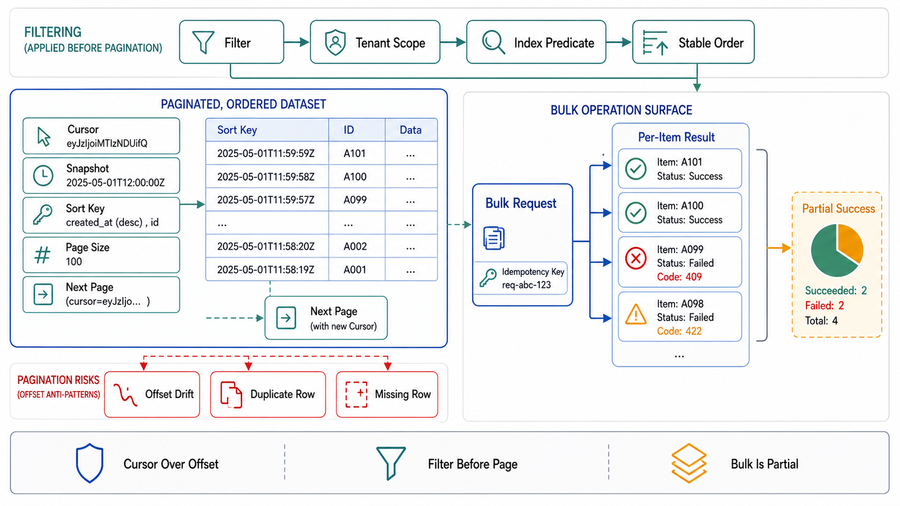

# Pagination, Filtering, and Bulk Surfaces



## Abstract

List endpoints are where APIs make their least-examined promises: that a collection can be traversed completely, in bounded per-request work, while the collection changes underneath the traversal — three properties that offset pagination (`?offset=99900&limit=100`) fails simultaneously. The storage argument is Chapter 04 file 04's, surfaced into the contract: offset pagination *reads and discards* everything it skips, so page N costs O(N·page_size) and deep pages become an amplification attack the API funds itself ([use-the-index-luke's no-offset analysis](https://use-the-index-luke.com/no-offset)); worse, offsets are positions in a moving list, so concurrent inserts and deletes silently skip or duplicate rows *with no error* — the least detectable data-loss class an API can ship. The settled contract shape is the opaque cursor over a stable sort key ([Google AIP-158](https://google.aip.dev/158) is the reference design): keyset-anchored, encoding the position *in the data* rather than in the result sequence. Around it this file fixes the promises a cursor must document (what a traversal sees under concurrent change — a Chapter 03 file 02 consistency claim, made per list endpoint), the filter surface as a priced query contract rather than an open predicate language, and bulk endpoints as the place where pagination, partial failure (file 05), and admission (file 02) intersect.

## 1. The Cursor Contract

```text
Figure 1. Offset vs cursor under concurrent change — the silent-skip
failure that makes this a correctness file, not a performance file.

  page 1 (offset 0, limit 3):  [A][B][C]     client holds offset=3
  ── row B deleted ──
  page 2 (offset 3, limit 3):  positions now [A][C][D][E][F]…
                               returns [E][F][G] — D WAS NEVER SEEN.
  No error. No gap marker. The client's "complete" export is
  missing rows it will never know about.

  cursor design: page 1 returns opaque token = enc(last_key='C')
  page 2: WHERE key > 'C' ORDER BY key LIMIT 3 → [D][E][F]  ✓
  deletion of B is irrelevant: position lives in the DATA.

  cost: offset page N reads O(N·limit) rows; keyset page N reads
  O(limit) — page 1,000 at limit 100 is 100,000 rows read to
  return 100 (1,000× amplification) vs 100 read to return 100.
```

The contract rules the mechanism implies: the cursor is **opaque** (clients that decode and fabricate cursors are clients depending on your encoding — version the token, sign it if tampering matters, and reject unknown versions cleanly); it is **bounded-lifetime** (a cursor references a sort position and possibly a snapshot — its expiry is a contract field, and the expired-cursor error is a distinct problem type per file 05, not a 500); the sort is **total and stable** (a non-unique sort key needs a tiebreaker column in the key, or equal-valued rows straddle page boundaries nondeterministically); and `limit` has a **server-side maximum** stated in the artifact — the client's limit is a request, the server's cap is the promise (an uncapped limit is an unbounded-work endpoint, file 01 §3's GraphQL critique in miniature).

## 2. What a Traversal Sees — the Declared Claim

A paginated read is a read path, and Chapter 03 file 02's rule applies: its consistency claim is declared, not implied. The honest options, in descending strength: **snapshot traversal** (cursor pins a snapshot/point-in-time — the traversal is a consistent picture; costs snapshot retention for the cursor's lifetime, which is why the expiry above exists); **keyset-stable traversal** (no row already passed is re-observed, rows inserted behind the cursor are missed, rows ahead may or may not appear — the practical default, and its guarantees fit in exactly that one sentence, which should appear in the docs verbatim); **no claim** (offset pagination's truth). What fails review is not choosing a weak claim — it is shipping export/reconciliation features on top of an endpoint whose claim cannot support them: a compliance export built on keyset-stable traversal of a hot table is a data-loss generator with a progress bar, and the correct design routes it to a snapshot (or to Chapter 06's log, which is what "give me everything, consistently, without racing the present" actually asks for).

## 3. Filtering — a Priced Surface, Not a Predicate Language

Every filterable field is a query path the storage layer must serve within the declared latency envelope — a row in Chapter 04 file 01's access-pattern matrix, backed by a file 04 query-path contract, enforced at the API edge. The rules: the filter grammar is **enumerated** (these fields, these operators — not a general expression language accepted first and indexed never); every allowed combination maps to a **named index or plan** in the Chapter 04 dossier, and a filter addition is a schema-review event, not a query-param addition; **unsupported combinations are rejected** at validation (400-class, with the supported set in the error body) rather than served by table scan — the scan "works" in staging and detonates at production cardinality, which is Chapter 04's plan-flip incident class delivered via query string. Sorting multiplies the same way (each sort order is an index or a top-K scan); the sort × filter matrix is finite, published, and priced, and "we'll add `?q=` later" is deferred to the search path it actually is (Chapter 04 file 07), not bolted onto the list endpoint.

## 4. Bulk Surfaces — Where the Contracts Compound

Bulk endpoints (batch create/update, bulk export, mass delete) are not big versions of single-item endpoints; they are the intersection where this chapter's contracts all apply at once, and each contributes a rule: **admission** — a bulk request's cost is its item count × item cost, so it is priced at admission (file 02 §1) with a documented max batch size, not admitted as "one request"; **partial failure** — per-item results with per-item problem types (file 05 §3's shape), because the batch is never the honest retry unit; **idempotency** — per-item keys or a batch key with all-or-nothing semantics, chosen deliberately (file 04), because retrying a half-succeeded batch without per-item idempotency re-executes the succeeded half; **pagination** — bulk *reads* are traversals and inherit §2's claim discipline, and the tempting shortcut (one giant response) trades it for a memory bound and a timeout (file 03) that both break at growth. The general rule: past a threshold the dossier states, bulk work stops being a request and becomes a *job* — the LRO pattern of file 09 — and the threshold is derived from the timeout budget arithmetic, not from optimism.

## 5. Approval Gates

| Gate | Evidence Required | Failure Condition |
|---|---|---|
| Cursor gate | Opaque, versioned, bounded-lifetime cursors over a total stable sort; expired-cursor as a distinct problem type; server-side limit cap in the artifact | Offset pagination on mutable collections; decodable cursors clients fabricate; uncapped limits |
| Claim gate | Traversal semantics declared per list endpoint (snapshot / keyset-stable / none); export and reconciliation features matched to a claim that supports them | Completeness-critical features on keyset-stable or offset traversals; claims implied by silence |
| Filter-pricing gate | Enumerated filter/sort grammar; every combination mapped to a named index/plan (Ch04 dossier); unsupported combinations rejected with the supported set | Open predicate surfaces; filters served by scan; filter additions shipped as query-param patches |
| Bulk gate | Max batch size at admission; per-item results and idempotency; batch-vs-job threshold derived from the timeout budget | Bulk requests admitted as one request; half-succeeded batches retried whole; "big response" exports |
| Amplification gate | The §1 cost arithmetic run for the deepest legitimate page; deep-traversal load tested (drill C7, file 10) | Page-depth cost discovered by the first crawler that walks the collection |

## Output

The output of this file is a list surface whose promises are chosen: cursors that anchor position in data rather than in a moving sequence, a declared traversal claim per endpoint with completeness-critical features routed to claims that can carry them, a filter grammar enumerated and priced against named indexes, and bulk operations that carry admission cost, per-item truth, and a derived threshold where they stop pretending to be requests.

## References

- [use-the-index-luke — "We need tool support for keyset pagination" (the no-offset argument and cost model)](https://use-the-index-luke.com/no-offset)
- [Google AIP-158 — Pagination (opaque page tokens as the reference contract design)](https://google.aip.dev/158)
- [Google AIP-160 — Filtering (an enumerated, governed filter grammar in a shipped design system)](https://google.aip.dev/160)
- [RFC 9110 — HTTP Semantics (safe methods, and the caching semantics list endpoints inherit)](https://www.rfc-editor.org/rfc/rfc9110.html)
