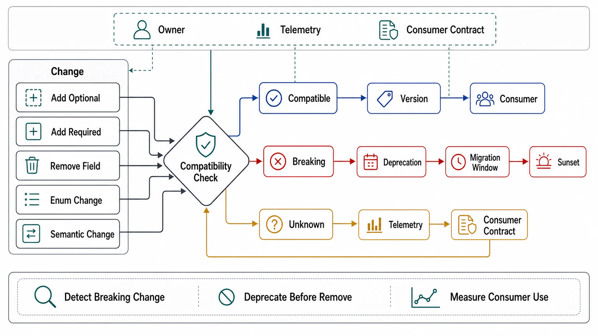

# Versioning, Deprecation, and Compatibility



## Abstract

Versioning is the API discipline with the largest gap between how much teams argue about it (URL vs header vs media type) and what actually determines outcomes (the compatibility law table, the additive-first culture, and whether deprecation has machinery or just announcements). The ordering of this file is therefore deliberate: compatibility rules first, because the best version is the one you never mint — an API that evolves additively under a written definition of "breaking" can serve years of change on one version; versioning schemes second, as the escape hatch for the changes the law table cannot absorb, with Stripe's rolling date-based versions as the production-proven design that decouples *server evolution* from *client migration* (each account pinned to its version; version-to-version transforms server-side — [Stripe on API versioning](https://stripe.com/blog/api-versioning)); deprecation machinery third, now with actual standards to cite — the `Deprecation` header ([RFC 9745](https://www.rfc-editor.org/rfc/rfc9745.html), published March 2025) signals *this is deprecated* with a date, `Sunset` ([RFC 8594](https://www.rfc-editor.org/rfc/rfc8594.html)) signals *this stops working* at a time — so the review can demand machine-readable deprecation rather than a blog post. The chapter-seam note: this file is Chapter 03 file 07's migration matrix and Chapter 06 file 08's registry discipline, applied to the request surface — same laws, third enforcement point.

## 1. The Compatibility Law Table

"Breaking" is defined mechanically or it is defined by incident. The field-level laws, enforced by the diff gate of file 01:

| Change | Request direction | Response direction |
|---|---|---|
| Add optional field | Compatible | Compatible — *iff clients ignore unknown fields; this tolerance is a stated client obligation in the artifact, verified by contract test (C9), not assumed* |
| Add required field | **Breaking** — old clients omit it | n/a |
| Remove / rename field | Compatible if request field was optional and unused; else breaking | **Breaking** — rename is remove+add wearing a refactor's clothes (Ch06 file 08's law, verbatim) |
| Widen a type/range (accept more) | Compatible | **Breaking** (clients validated against the old range) |
| Narrow a type/range (accept less) | **Breaking** | Compatible |
| Add enum value | Compatible in requests | **Breaking unless** the contract declared open enums and clients handle unknown values — the same declared-tolerance pattern as unknown fields |
| Change semantics of existing field | **Breaking, always, and invisible to every diff tool** | Same — the registry-invisible break of Ch06 file 08 §4: new meaning rides a new field |
| Tighten/loosen an error type or status mapping | Breaking if clients branch on it — and per file 05, they do | Error schema is contract surface; same laws |

The asymmetry running through the table is the point to internalize: requests and responses harden in *opposite directions* (a server may accept more than it did; it may not send more than clients tolerate or less than they need) — which is Postel's principle with the modern correction attached: tolerance must be *specified and tested*, not assumed, because unspecified leniency becomes load-bearing behavior that can never be tightened (Hyrum's Law closing the loop from file 01).

## 2. Versioning Schemes — When the Laws Cannot Absorb It

| Scheme | Mechanics | Honest assessment |
|---|---|---|
| Additive-only, no versions | All change within §1's laws; contract grows, never breaks | The correct *default posture*, not a scheme; fails only when semantics must change |
| Global URL versions (`/v2/`) | New namespace per breaking epoch | Honest and blunt: /v2 is a *new API* whose migration is priced like one; the failure mode is v1 living forever because migration was priced honestly and nobody paid |
| Rolling dated versions (Stripe model) | Account pinned to its first-seen version; server holds transform chain between adjacent versions; clients upgrade version-at-a-time | Decouples server evolution from client migration — the server carries the compatibility burden as *code* (transforms), testable and enumerable; the cost is the transform chain's own maintenance, which is real and grows |
| Per-resource/header versions | Version negotiated per call | Maximum flexibility, combinatorial test surface — a version *matrix* nobody can exhaustively verify; reserve for surfaces with few, sophisticated consumers |

The decision discipline is arithmetic, not aesthetics: count the consumers, their upgrade latency, and the concurrent-version window each scheme implies, then staff the window. A /v2 with a two-year migration tail means running, patching, and securing two APIs for two years — the scheme choice *is* that commitment, and a review that approves the version without the staffing has approved half a decision. (When *not* to version, completing the raised standard's question: when the change fits §1's laws — mint nothing; when the change is semantic — new field or new endpoint, not new version; version only when the *shape of the surface itself* must change incompatibly.)

## 3. Deprecation Is Machinery, Not Announcement

```text
Figure 1. The deprecation pipeline — each stage machine-readable,
each with an exit criterion, no stage skippable.

  [mark]      Deprecation: @<date>  (RFC 9745) on responses +
              artifact annotation → generated SDKs emit compile-
              time warnings; docs auto-badge
     │
  [measure]   per-consumer usage telemetry on the deprecated
     │        surface: WHO still calls it (identity from file 08),
     │        trending toward zero or not — the gate to proceed
  [notify]    targeted, to the identified callers (not broadcast):
     │        migration path, dates, and a working example
  [sunset]    Sunset: <timestamp> (RFC 8594) announced ≥ one
     │        client release cycle ahead; brownouts (scheduled
     │        temporary 410s) BEFORE the real cutoff — the only
     │        notification channel that reliably reaches every
     │        consumer is a failure they can schedule around
  [remove]    410 Gone with a problem type pointing at the
              migration doc — not 404, which says "never existed"
```

Two rules make the pipeline honest. **Measurement gates progression**: sunsetting a surface that identified consumers still depend on is choosing an incident date; the telemetry (per-identity call counts on deprecated surfaces) is the *evidence* the dossier requires, and "we announced it twice" is not evidence. **Brownouts are the real notification**: planned, short, escalating unavailability windows convert "the email nobody read" into "the staging failure somebody triaged" — they are kindness delivered as controlled failure, and they belong in the sunset schedule, not in the incident retro that follows skipping them.

## 4. The Version Skew Window

Every deploy creates a window where old and new run concurrently — server fleets mid-rollout, clients on stale SDKs, cached responses with old shapes — so *every* release is a compatibility event whether or not a version was minted. The rules this imposes: N/N+1 compatibility is the floor for anything that speaks to itself (rolling restarts mean both versions serve simultaneously — Chapter 03 file 07's expand–contract applied to payloads); response caches are consumers too (a cached v-old response replayed to a v-new client is a skew event the TTL schedules — Chapter 08's seam); and rollback re-runs the whole table *backward*, so a change compatible forward but not backward (new server writes a field old server rejects) has quietly spent the rollback option — the dossier's skew field asks for both directions.

## 5. Approval Gates

| Gate | Evidence Required | Failure Condition |
|---|---|---|
| Law gate | §1's table adopted in the artifact's diff tooling; declared client tolerances (unknown fields, open enums) contract-tested | "Breaking" adjudicated per-argument; tolerance assumed; semantic changes riding existing fields |
| Scheme gate | Versioning scheme chosen with the consumer-count/window/staffing arithmetic on record; additive-first as default posture | /v2 minted for a change the laws could absorb; version window unstaffed |
| Machinery gate | RFC 9745 Deprecation + RFC 8594 Sunset emitted mechanically from artifact annotations; SDK warnings generated | Deprecation as blog post; sunset dates in prose nobody's tooling reads |
| Evidence gate | Per-identity usage telemetry on deprecated surfaces gating sunset; brownouts scheduled before removal; 410-with-migration-pointer after | Sunset by calendar rather than by telemetry; removal discovered by consumers in production |
| Skew gate | N/N+1 compatibility (both directions, incl. rollback) verified per release (drill C9); caches counted as consumers | Rollback that fails on data the new version wrote; cached old shapes breaking new clients |

## Output

The output of this file is an evolution discipline where breaking is a mechanical verdict, versions are minted only for what the law table cannot absorb and staffed for the window they create, deprecation runs as a measured pipeline from RFC 9745 marking through brownouts to 410, and every ordinary deploy is treated as the two-version compatibility event it actually is.

## References

- [Stripe — APIs as infrastructure: future-proofing Stripe with versioning (rolling dated versions, server-side transforms)](https://stripe.com/blog/api-versioning)
- [RFC 9745 — The Deprecation HTTP Response Header Field (March 2025)](https://www.rfc-editor.org/rfc/rfc9745.html)
- [RFC 8594 — The Sunset HTTP Header Field](https://www.rfc-editor.org/rfc/rfc8594.html)
- [Wright, "Hyrum's Law" — why unspecified tolerance becomes unbreakable contract](https://www.hyrumslaw.com/)
- [Google AIP-180 — Backwards compatibility (a shipped definition of "breaking" at field granularity)](https://google.aip.dev/180)
