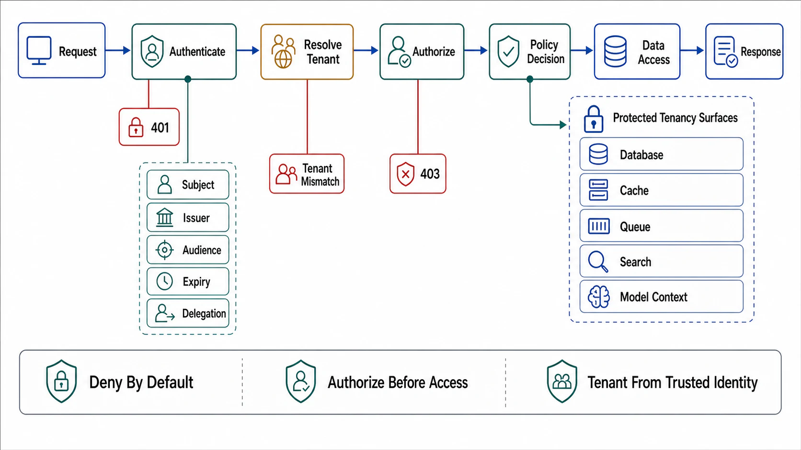

# Authentication, Authorization, and Tenancy



## Abstract

Identity in the request path is three separable decisions that sloppy designs fuse into one: **authentication** (what principal is making this call, established once per request at pipeline stage 3), **authorization** (may this principal perform this operation on this resource, decided per request against policy), and **tenancy** (which tenant's data universe this request lives in, derived from the authenticated principal and *never* from request parameters). The modern posture is zero-trust ([NIST SP 800-207](https://csrc.nist.gov/pubs/sp/800/207/final)): every hop authenticates its caller — including service-to-service hops behind the perimeter, because "internal" is a network location, not a trust level — and authorization is decided per request by policy, not per network by topology. The mechanics have consolidated: OAuth 2.0 hardened by its security BCP ([RFC 9700](https://www.rfc-editor.org/rfc/rfc9700.html), January 2025), converging into OAuth 2.1 (still an IETF draft as of mid-2026, but its requirements — PKCE everywhere, no implicit grant, no bearer tokens in URLs — are the de facto floor: [draft-ietf-oauth-v2-1](https://datatracker.ietf.org/doc/draft-ietf-oauth-v2-1/)); workload identity via mTLS/SPIFFE for the service-to-service layer ([SPIFFE](https://spiffe.io/docs/latest/spiffe-about/overview/)). What has *not* consolidated — and is therefore where reviews earn their keep — is authorization architecture: where the decision point sits, what context it sees, and how object-level checks avoid becoming the per-handler folklore that the OWASP API list has ranked as the #1 API vulnerability class (BOLA — broken object level authorization) in both of its editions ([OWASP API Security Top 10](https://owasp.org/API-Security/editions/2023/en/0x11-t10/)).

## 1. The Three Decisions and Where They Live

```text
Figure 1. Identity decisions in the pipeline (file 02's stages,
zoomed). The tenancy rule is the one that prevents the worst
incident class.

  [3 authenticate]  token/mTLS → principal
        │           principal = {subject, tenant, scopes,
        │                        acting-party chain}
        │           TENANT COMES FROM THE CREDENTIAL.
        │           A tenant_id in the path/body/query is a
        │           DISPLAY parameter — it is VERIFIED against
        │           the credential's tenant, never TRUSTED.
        v
  [4 admit]         quotas keyed by (tenant, principal) — file 02
        v
  [5 authorize]     decision per (principal, action, resource):
        │             coarse (scope/role) at the edge — cheap,
        │             context-free
        │             fine (object-level: is resource R in
        │             principal's tenant? does policy grant
        │             action A on R?) at the SERVICE, where the
        │             resource's attributes exist
        v
  [7 execute]       handler receives DECIDED context; queries are
                    tenant-scoped BY CONSTRUCTION (row-level
                    security / mandatory scoping predicate), so a
                    forgotten check fails CLOSED, not open
```

The tenancy rule in capitals is the file's most important sentence, because cross-tenant leakage — tenant A reading tenant B's object by iterating IDs — is BOLA, and BOLA is not an exotic attack; it is a missing `WHERE tenant_id = :ctx` on one of four hundred queries. The structural defense is *defense by construction*: tenant scoping enforced below the handler (row-level security in the store, or a repository layer that cannot emit an unscoped query), so the object-level check the handler forgot is a query that returns nothing rather than someone else's data. Per-handler authorization checks are then a second layer, not the only one — and the drill (C8, file 10) tests exactly the forgotten-check case: a valid credential from tenant A requesting tenant B's concrete object IDs across every endpoint, mechanically.

## 2. The Decision-Point Architecture

Authorization architecture is a placement decision with the same shape as Chapter 02's plane separation: a **policy decision point** (PDP) evaluates rules; **policy enforcement points** (PEPs) at the gateway and in services ask it; policy is versioned control-plane state distributed to the data plane. The trade table the review walks:

| Placement | Latency | Context available | Failure honesty |
|---|---|---|---|
| Inline library (policy compiled into the service) | ~µs | Full resource context | Policy updates ride deploys — slow to revoke; per-service drift risk |
| Local sidecar/agent PDP with pushed policy (OPA-style — [OPA docs](https://www.openpolicyagent.org/docs/)) | sub-ms | Full, via input document | The Ch02 pattern: last-known-good policy under control-plane outage; the *declared* staleness window is the revocation latency |
| Central PDP service | +1 network hop per decision | Whatever the call carries | A hard runtime dependency on the request path — its availability multiplies into every API's (Ch02 file 07's math); demands the file 03 budget treatment and a fail-closed/fail-open decision made in daylight |

Two rules regardless of placement: **fail closed, with a declared exception list** (an unreachable PDP denies by default; the endpoints that may fail open — health checks, status pages — are enumerated in the dossier, because an implicit fail-open is an authorization bypass with an availability excuse); and **decision logs are audit surface** (every deny and every *notable* allow — privileged actions, cross-tenant admin access — is logged with principal, resource, policy version; Chapter 01 file 09's audit contract, fed from here).

## 3. Tokens, Delegation, and the Machine-to-Machine Layer

Token discipline, stated as the rules that fail reviews: **short-lived access tokens** (minutes-to-an-hour) with rotation via refresh, because token lifetime *is* revocation latency for stateless validation — a 24-hour JWT means a fired employee's token works for 24 hours unless a denylist (which re-introduces the stateful check the JWT was supposed to remove) covers the gap; the tradeoff is real and must be *chosen*: stateless-with-short-TTL, or stateful-introspection-with-instant-revocation, not a long-lived stateless token with neither property. **Audience and scope narrowing**: a token minted for service A and replayable against service B is lateral movement as a feature; `aud` restriction plus per-surface scopes is the blast-radius control. **Delegation is explicit**: when service A calls B on behalf of user U, the "acting-party chain" travels in the token (OAuth token exchange — [RFC 8693](https://www.rfc-editor.org/rfc/rfc8693.html)), and B authorizes against *U's* rights, not A's — the alternative (A's god-credential with U in a header B trusts) is the confused-deputy design, and every internal API that accepts an unauthenticated `X-User-Id` header has shipped it. For the machine layer: workload identities (SPIFFE/mTLS certificates, cloud IAM roles) with automated rotation, never long-lived static API keys in config — the static key is the credential that outlives its author, its rotation ceremony, and eventually its secrecy.

## 4. The Agent Seam

AI agents calling APIs are the newest principal class and the oldest problem wearing new clothes: a delegation chain (user → agent → tool → API) that must not collapse into a god-credential. The current consolidation point is MCP's adoption of OAuth 2.1 for remote server authorization ([MCP authorization spec](https://modelcontextprotocol.io/specification/2025-11-25/basic/authorization)) — which is the right instinct (standard delegation, not bespoke keys) and does not change this file's laws: the agent is an *acting party* in the §3 chain, its token carries the *user's* authority narrowed to the tool's scope, and object-level authorization still happens at the resource. What changes is the risk weighting: agents iterate — an agent probing IDs is BOLA exploitation at machine speed — so per-principal anomaly limits (file 02's admission, keyed to the agent principal) and the C8 drill move from quarterly hygiene to standing controls. Chapter 11 owns the agent side of this boundary; this file owns the API side: an agent principal is authenticated, delegated, scoped, and rate-limited like any other caller, with *no* tool-specific trust shortcuts.

## 5. Approval Gates

| Gate | Evidence Required | Failure Condition |
|---|---|---|
| Tenancy gate | Tenant derived from credential everywhere; request-parameter tenant IDs verified-not-trusted; scoping enforced below the handler (RLS/mandatory predicate), failing closed | Any query whose tenant scope depends on handler discipline alone; C8 drill finding a single cross-tenant read |
| Zero-trust gate | Every hop (incl. internal) authenticates its caller; workload identity with automated rotation; no static keys on the request path | "Internal" as a trust level; unauthenticated headers carrying identity; keys older than their owners' tenure |
| Decision-point gate | PDP placement chosen against the §2 table; fail-closed with enumerated exceptions; policy versioned and distributed as control-plane state; decision logs feeding the audit contract | Implicit fail-open; per-service policy folklore; central PDP without budget/availability treatment |
| Token gate | Access-token lifetime = chosen revocation latency (stated); `aud`/scope narrowing per surface; delegation via token exchange with acting-party chain | 24 h stateless tokens with no revocation story; tokens valid everywhere; `X-User-Id`-style trusted headers |
| Agent gate | Agent principals authenticated and delegated per §4 (OAuth 2.1-class, user authority, narrowed scope); per-principal anomaly limits; C8 as a standing control | Tool-specific trust shortcuts; agent god-credentials; agent traffic indistinguishable from user traffic in audit logs |

## Output

The output of this file is an identity design where the three decisions have three owners: authentication established once per request with tenancy derived from the credential and enforced below the handlers, authorization decided at declared decision points that fail closed and leave audit trails, tokens whose lifetimes are chosen revocation latencies and whose delegation chains survive every hop — including the agent hop — without collapsing into anyone's god-credential.

## References

- [NIST SP 800-207 — Zero Trust Architecture](https://csrc.nist.gov/pubs/sp/800/207/final)
- [RFC 9700 — Best Current Practice for OAuth 2.0 Security (BCP 240, January 2025)](https://www.rfc-editor.org/rfc/rfc9700.html)
- [draft-ietf-oauth-v2-1 — The OAuth 2.1 Authorization Framework (draft as of 2026; requirements stable)](https://datatracker.ietf.org/doc/draft-ietf-oauth-v2-1/)
- [OWASP API Security Top 10 (2023) — BOLA as the standing #1](https://owasp.org/API-Security/editions/2023/en/0x11-t10/)
- [RFC 8693 — OAuth 2.0 Token Exchange (the acting-party/delegation mechanism)](https://www.rfc-editor.org/rfc/rfc8693.html)
- [SPIFFE — workload identity for the machine-to-machine layer](https://spiffe.io/docs/latest/spiffe-about/overview/)
- [Open Policy Agent — policy decision points with pushed policy](https://www.openpolicyagent.org/docs/)
- [MCP specification (2025-11-25) — authorization: OAuth 2.1 for the agent principal class](https://modelcontextprotocol.io/specification/2025-11-25/basic/authorization)
