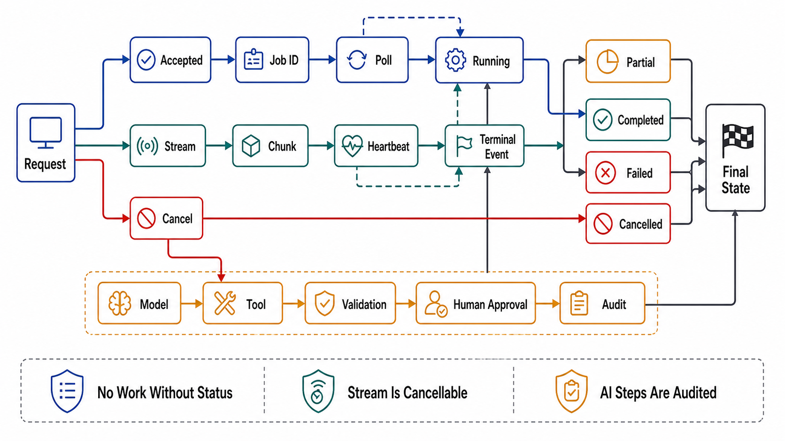

# Streaming, Long-Running, and AI Request Lifecycles



## Abstract

This file owns the request shapes the classic request/response template cannot serve — work that outlives any honest timeout, output that must arrive incrementally, and the AI lifecycles that combine both — and its first claim is arithmetic, not taste. The long-running-operation threshold is *derived*: when a work class's p99 duration approaches the client deadline budget (file 03), the synchronous shape doesn't become slow, it becomes *wrong* — clients time out and retry work that is still running, stacking duplicate executions at exactly the moment of load. The settled patterns: the **LRO handle** ([Google AIP-151](https://google.aip.dev/151) is the reference design) — mutation returns `202` + an operation resource the client polls or subscribes to, with the operation itself carrying idempotency (file 04), progress, cancellation, and a result whose retention is a declared contract; and **streaming responses** (SSE over HTTP — [WHATWG server-sent events](https://html.spec.whatwg.org/multipage/server-sent-events.html) — or gRPC server streaming) for incremental output. The AI instantiation is where both patterns meet their hardest client: token streaming is SSE with money flowing through it (TTFT as the perceived-latency SLI, mid-stream failure as a *billing* event, backpressure against a GPU that cannot pause cheaply), tool-calling turns one request into a conversation with state, and MCP's Streamable HTTP transport ([spec 2025-11-25](https://modelcontextprotocol.io/specification/2025-11-25/basic/transports)) is the current consolidation of exactly this file's concerns — sessions, resumability, and streaming — into an agent-facing standard.

## 1. The Derived Threshold, Worked

The numbers that decide the shape: client deadline budget 30 s (file 03's edge deadline, generous); work class p99 = 45 s, p50 = 8 s. The synchronous shape fails **9.3% of requests by construction** (whatever fraction exceeds 30 s) — and those failures are file 05's worst class: unknown outcomes on work still running, retried by well-behaved clients into duplicate execution. The design rule: **shape per work class, chosen by the distribution, with hysteresis** — p99 comfortably inside the budget → synchronous; p99 near or beyond it → LRO, *even though p50 is fast*, because the shape must serve the distribution's tail, not its median. The hybrid that serves fast-tail-heavy distributions honestly: attempt synchronously with an internal cutoff (e.g., 5 s), and *upgrade* to an LRO handle at the cutoff (`202` + operation) — the client gets the fast answer when it exists and the honest handle when it doesn't, and nobody gets a timeout for work that was always going to finish at second 40. What fails review is the reflex this file exists to kill: raising the timeout to 120 s as the "fix," which converts a wrong shape into a wrong shape that also holds connections, threads, and retry ambiguity four times longer.

## 2. The LRO Contract

```text
Figure 1. The operation resource — the mutation becomes data, and
every hard question becomes a field.

  POST /jobs  (Idempotency-Key: K)          ← file 04 applies to
     → 202 Accepted                            the CREATION
       { "operation": "/operations/op_9f2",
         "status": "running",                 running | succeeded |
         "progress": {...},                   failed | cancelled
         "created": ..., "expires": ... }   ← result RETENTION is
                                              a contract field
  GET /operations/op_9f2      poll (with jitter; server sets
                              Retry-After — poll pacing is
                              admission, file 02)
  DELETE /operations/op_9f2   cancellation: best-effort, honest —
                              "cancelled" means EFFECTS STOPPED,
                              not "we stopped reading the result";
                              uncancellable stages declared
  result on success: inline if small, else a URI (with its own
  authz per file 08 — operation results are resources)

  The three lifecycle rules:
  R1  operation state is durable — a deploy/crash of the API tier
      must not orphan running work or lose handles (state lives
      in a store, work in Ch09's queue, NOT in process memory)
  R2  the terminal result is immutable and retained for the
      declared window; expired = 410 with a problem type, not 404
  R3  creation is idempotent (key K): the retry of the CREATE
      returns the SAME operation, not a second job — file 04's
      state machine is the dedup mechanism for work itself
```

R1 is where LRO implementations actually die: the operation store and the work queue are Chapter 03/09 state with this chapter's contract on top, and an "LRO" whose state lives in the serving process is a timeout with extra steps. Notification beyond polling — webhooks or an event topic (Chapter 06) — is an *addition*, not a replacement: the poll path must remain, because push channels fail silently and the handle is the source of truth.

## 3. Streaming Contracts

A streaming response replaces one promise (a complete body or an error status) with a harder one: a well-formed *prefix* whose incompleteness is detectable. The contract fields that make streams honest: **framing** (SSE events / length-prefixed chunks — never "parse the concatenation"); **the mid-stream error shape** — status 200 is already sent when the failure happens, so errors arrive *in-band* as a typed terminal event, and a stream that just stops is indistinguishable from the network eating it, which is why **explicit termination** (a `done` event, or SSE's named terminal event) is mandatory, not stylistic; **resumability** as a declared property (SSE's `Last-Event-ID` gives it nearly free for replayable sources — but only if event IDs are stable, which is a file 04-grade identity decision); **keep-alive** at the application layer (comment pings under proxy idle timeouts, which kill more streams than code does); and **backpressure posture** (file 04 of Chapter 06, applied per-connection: a slow reader either buffers-to-a-bound, or is disconnected with a resumable position — unbounded per-client buffers are the same unlawful queue as always). Streaming is also an *admission* problem wearing a transport costume: a stream holds a connection and server state for minutes, so concurrent-stream counts are quota'd per principal (file 02) — 10k held streams is a resource commitment the fleet must have been sized for.

## 4. The AI Instantiation — Token Streams and Tool Calls

**Token streaming** is §3 with the dials at maximum and a meter running. The SLI split is the first design fact: **TTFT** (time to first token — the user's perceived latency, dominated by queueing + prefill) and inter-token cadence (decode speed) are different budgets with different owners (Chapter 10 owns the serving internals; this file owns the contract), and a single "response latency" number describes neither. The contract consequences, each one a review item: the stream carries **usage accounting** in-band (a terminal usage event — because billing a stream the client aborted at token 500 of 2,000 requires knowing where it stopped, making §3's explicit termination a *financial* control, and the abort path a metering event, not just a cancellation); mid-stream failure at token N is a *partial delivery with partial cost* — the contract states whether/how partial output is billed and whether resumption re-bills; **cancellation must reach the GPU** (a client abort that the API tier absorbs while decode continues is money burning on an abandoned answer — the cancellation propagation of file 03, with a per-token price attached); and per-principal concurrent-stream quotas are also *capacity* quotas, because each held stream is KV-cache residency (Chapter 10's currency).

**Tool calling** breaks the one-shot shape differently: the model's response is a *request back to the caller* (invoke tool T with arguments A), making the API a multi-turn state machine — and every earlier file re-applies at machine speed: tool schemas are contract artifacts (file 01) the model is the consumer of; tool invocations carry the delegation chain (file 08 §4 — the agent acts with the *user's* narrowed authority, and MCP's OAuth 2.1 adoption is this rule standardized); tool calls are mutations, so idempotency keys thread through them (file 04 — a retried conversation turn must not re-execute the payment the tool call performed); and the conversation itself is state with an owner and a retention policy (Chapter 03's questions, asked of chat history). MCP's Streamable HTTP transport consolidates the plumbing — session IDs, POST-with-SSE-response, resumability — and its existence is this file's closing argument: the industry needed a standard because every one of these contract questions was being answered ad hoc, per vendor, wrongly.

## 5. Approval Gates

| Gate | Evidence Required | Failure Condition |
|---|---|---|
| Threshold gate | Work-class latency distributions vs deadline budgets; shape derived per class; sync-to-LRO upgrade path for hybrid distributions | Timeout raises as the fix; p99 > budget served synchronously; shape chosen by template |
| LRO gate | Durable operation state (R1); declared result retention (R2); idempotent creation (R3); honest cancellation semantics; poll pacing via Retry-After | Handles orphaned by deploys; second job per retry; "cancelled" streams still executing |
| Stream-contract gate | Framing, in-band typed errors, explicit termination, declared resumability, app-level keep-alive, per-principal stream quotas | Streams that just stop; errors after 200 unexpressible; unbounded slow-reader buffers |
| Token-economics gate | TTFT and cadence as separate SLIs; in-band usage accounting incl. abort metering; partial-delivery billing stated; cancellation verified to reach the accelerator (drill C10) | Aborted streams billed by guesswork; GPU decode continuing after client abort; one blended latency number |
| Tool-loop gate | Tool schemas as contract artifacts; delegation chain per file 08 §4; idempotency keys through tool-executed mutations; conversation state with owner + retention | Re-executed tool mutations on turn retry; agent god-credentials; chat history as unowned state |

## Output

The output of this file is a lifecycle design for the requests that outgrow request/response: shapes derived from latency distributions rather than optimism, operations that are durable idempotent resources with declared retention and honest cancellation, streams whose prefixes and terminations are contract, and AI lifecycles where the token stream is metered and cancellable to the GPU, and the tool loop carries contracts, delegated authority, and idempotency through every turn.

## References

- [Google AIP-151 — Long-running operations (the operation-resource reference design)](https://google.aip.dev/151)
- [WHATWG HTML — Server-sent events (SSE framing, Last-Event-ID resumability)](https://html.spec.whatwg.org/multipage/server-sent-events.html)
- [MCP specification (2025-11-25) — transports: Streamable HTTP, sessions, resumability](https://modelcontextprotocol.io/specification/2025-11-25/basic/transports)
- [gRPC — server streaming and deadline semantics for streams](https://grpc.io/docs/what-is-grpc/core-concepts/)
- [Dean & Barroso, "The Tail at Scale" — why the shape must serve the distribution's tail](https://cacm.acm.org/research/the-tail-at-scale/)
