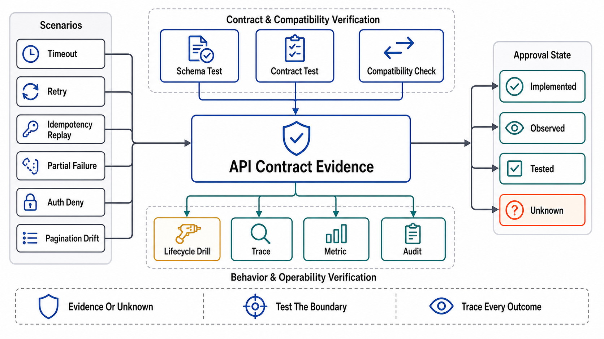

# Verification of API Contracts



## Abstract

An API contract is a set of promises about behavior under adversity — retries, timeouts, skew, mixed outcomes, hostile principals — and none of those promises is verified by the happy-path test suite that every service already has. This file is the chapter's evidence machinery: ten drills (C1–C10) that convert each file's gates into falsifiable experiments with pass conditions and rehearsal cadences, the API SLI set that makes contract violations observable as trends rather than tickets, and the evidence discipline inherited from Chapter 01 file 11 with this chapter's stamp: every piece of evidence carries a **contract-generation stamp** — the artifact version, gateway/policy configuration, SDK versions, and dependency-timeout topology it was proven against — because a drill passed against last quarter's contract verifies last quarter's API. The through-line from Chapter 06 holds here with one addition: API drills are uniquely cheap to run *continuously* (a synthetic client is just another consumer), so the cadence column for half the catalog reads "standing, in CI or synthetic traffic" rather than "quarterly" — an API contract that is only verified episodically is unverified most of the time.

## 1. The Drill Catalog

```text
Figure 1. The drill loop for contract evidence — same lifecycle as
Ch06 file 10, with the contract-generation stamp as the invalidator.

  drill Cn passes ──► evidence {claim, class: tested, date,
                                contract-generation stamp}
        │                                │
        │            stamped field changes (artifact version,
        │            gateway config, SDK major, timeout topology)
        │                                │
        │                                v
        │                    class resets → assumed (with expiry)
        └── standing drills (CI/synthetic) re-mint the evidence
            continuously — the preferred steady state
```

| Drill | Hypothesis under test | Procedure / fault injected | Pass condition | Cadence |
|---|---|---|---|---|
| C1 Conformance | Implementation satisfies the artifact (file 01) | Generated conformance suite + schema-diff on every change | Zero drift; breaking diffs blocked from merge | Standing, CI |
| C2 Consumer contracts | No consumer's recorded expectations break (file 01 §4) | Replay Pact-class consumer contracts in producer CI | All consumer expectations green, or the break is negotiated *before* merge | Standing, CI |
| C3 Timeout topology | Child < parent everywhere; refusal below waterline (file 03) | Config-graph walk + inject dependency slowness at each tier | No inversion found; budget-exhausted refusals fire; no orphan work after client abandon | Per config change + quarterly injection |
| C4 Retry amplification | Fleet amplification is bounded (file 03 §2) | Force 100% failure on a dependency at load; measure aggregate attempt rate | Amplification ≤ declared budget (e.g., ≤1.1×); jitter visible; breakers open | Quarterly, in load environment |
| C5 Idempotency race | Concurrent same-key retries execute once (file 04) | Fire N concurrent requests, same key, same payload; also same key, different payload; also crash-mid-execution | Exactly one execution; byte-identical replays; payload mismatch rejected; in-flight handled without double execution | Standing, CI + monthly at load |
| C6 Partial failure | Batch/composite endpoints tell per-item truth (file 05 §3) | Inject mixed outcomes into batch and fan-out endpoints | Per-item statuses correct; SDKs expose them unflattened; degraded markers distinguish empty-vs-broken | Standing, CI |
| C7 Deep traversal | Pagination cost and completeness hold at depth (file 06) | Walk the deepest legitimate collection while mutating it; measure per-page cost | O(limit) per page; no silent skips vs a ground-truth snapshot; expired cursors fail with their problem type | Quarterly |
| C8 Tenancy probe | No cross-tenant object access (file 08 §1) | Valid tenant-A credential requests tenant-B's concrete IDs across *every* endpoint, mechanically from the artifact | Zero cross-tenant reads/writes; failures are 404/403 per the declared confidentiality policy | Standing, synthetic + per release |
| C9 Skew and tolerance | N/N+1 both directions; declared client tolerances real (file 07) | Old SDK vs new server, new SDK vs old server, rollback replay; unknown-field and unknown-enum injection | All four directions green; tolerant readers tolerate; rollback safe against new-version data | Per release, CI |
| C10 Stream lifecycle | Streams terminate, resume, meter, and cancel honestly (file 09) | Kill streams mid-flight; abort as client at token N; disconnect and resume; hold slow-reader connections | In-band terminal events always; abort metering matches delivery; resumption without gaps/duplicates; slow readers bounded; cancellation reaches the backend (GPU idle confirmed for token streams) | Monthly + standing synthetic |

## 2. The API SLI Set

| SLI | Definition | What it catches |
|---|---|---|
| Availability per endpoint class | Successful ÷ valid requests, *excluding* correct rejections (a 422 on garbage is the contract working) | The blended number that hides one endpoint's collapse |
| Latency p50/p99 per endpoint, per tenant class | Measured at the edge, budget-relative (percent of deadline consumed) | Budget erosion invisible in absolute numbers; whale-tenant asymmetry |
| Ambiguous-outcome rate | Timeouts + connection drops + 504s ÷ requests | The unknown class (file 05 §2) trending — each one is a retry-and-hope event |
| Retry amplification factor | Fleet attempt rate ÷ client request rate, per dependency | C4's number, watched continuously between drills |
| Idempotency replay rate | Key-conflict replays ÷ mutations | Baseline client retry health; spikes = an SDK or network regression somewhere |
| Deprecated-surface usage | Calls per deprecated element per identity | File 07's evidence gate, as a dashboard instead of an argument |
| Authz decision latency + deny rate | PDP p99; denies per endpoint per principal class | The §2 placement decision's ongoing bill; deny spikes = policy or probe |
| Stream health | TTFT, mid-stream failure rate, abort-vs-complete ratio, orphaned-stream count | File 09's contracts as trends; orphans = cancellation not propagating |

The design rule carried from Chapter 06: alert on *derivatives and ratios* (amplification factor rising, ambiguous rate trending, budget-consumption creeping) rather than raw counts, and slice by tenant/principal class before averaging — an API SLI that averages a whale tenant against the long tail reports the health of neither.

## 3. Evidence Classes and the Contract-Generation Stamp

Chapter 01 file 11's taxonomy — *tested* (a drill above, dated), *observed* (production telemetry over a stated window), *assumed* (declared, with expiry) — with the stamp fields for this chapter: `{artifact: surface + version; gateway: config generation; policy: PDP policy version; SDKs: generated-client versions in the wild; time: the dependency-timeout topology from C3's walk}`. Any stamped-field change resets dependent evidence to *assumed*: a new artifact version invalidates C1/C2/C9 evidence, a gateway config change invalidates C3/C4, a policy change invalidates C8. The standing-drill posture in §1 is what makes this discipline cheap rather than bureaucratic — evidence that re-mints itself on every CI run is never stale, and the dossier (file 11) can demand freshness because freshness costs nothing where it matters most.

## 4. Approval Gates

| Gate | Evidence Required | Failure Condition |
|---|---|---|
| Coverage gate | C1–C10 mapped to every surface the dossier claims; gaps declared *assumed* with expiry | Contracts with no falsifying drill; "the integration tests cover it" |
| Standing gate | CI-viable drills (C1, C2, C5, C6, C8 probe, C9) running as standing checks, not calendar events | Episodic-only verification of continuously-changing surfaces |
| Adversity gate | C3/C4/C10 run with real fault injection at load, in an environment with production-shaped topology | Retry amplification "verified" without a failing dependency; stream drills without kills |
| Stamp gate | Evidence carries the contract-generation stamp; stamped-field changes reset dependent evidence; dossier refuses stale evidence | Drills passed against retired artifact versions still cited |
| SLI gate | §2's set implemented per endpoint class and tenant class; alerts on ratios and derivatives | Blended availability; absolute-threshold-only alerting; whale-averaged latency |

## Output

The output of this file is the chapter's evidence base: ten drills that make every promise falsifiable — conformance, consumer expectations, time topology, amplification, idempotency races, partial truth, deep traversal, tenancy, skew, and stream lifecycles — run standing where CI can carry them and injected where only adversity can prove them, with SLIs that watch the same promises between drills and a stamp discipline that retires evidence the moment the contract it proved stops existing.

## References

- [Pact — consumer-driven contract testing (C2's machinery)](https://docs.pact.io/)
- [Google SRE Workbook — implementing SLOs (the endpoint-class SLI discipline)](https://sre.google/workbook/implementing-slos/)
- [Principles of Chaos Engineering — hypothesis-driven fault injection (C3/C4/C10's method)](https://principlesofchaos.org/)
- [OWASP API Security Top 10 (2023) — the attack classes C8 mechanizes](https://owasp.org/API-Security/editions/2023/en/0x11-t10/)
