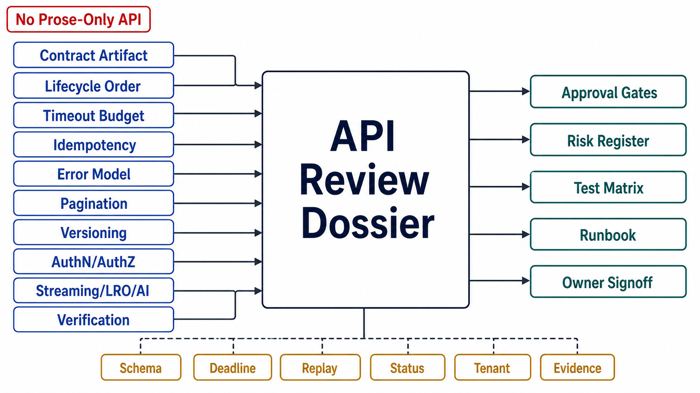

# API Review Templates



## Abstract

This file assembles the chapter into its executable form: the dossier a team completes to put an API surface — contract artifact to final status code — in front of an architecture review, and the checklist the reviewer walks to approve it. The organizing principle is the chapter's root thesis made procedural: every section forces a written answer to a question the request/response template lets teams skip — why is this synchronous, who owns each number in the time budget, what licenses these retries, what does the client do with this error, what does a traversal see, who still calls the deprecated thing, whose authority does this hop act with, what happens at token 500 of 2,000 — because API defects concentrate exactly where the template supplied a default and nobody examined it. Evidence citations must satisfy file 10's stamp discipline: dated, contract-generation-stamped, standing where CI can carry them.

## 1. Dossier Assembly

```text
Figure 1. Dossier assembly: each section is produced by one file's
gates; the checklist consumes the whole.

  f01 ─► §A artifact & admission    f06 ─► §F list surfaces
  f02 ─► §B lifecycle & pipeline    f07 ─► §G evolution & skew
  f03 ─► §C time budget             f08 ─► §H identity & tenancy
  f04 ─► §D idempotency             f09 ─► §I streaming/LRO/AI
  f05 ─► §E error surface           f10 ─► §J evidence ledger
                     │
                     v
        reviewer checklist (§3) ─► approve surface / findings
```

## 2. The API Surface Dossier

**§A Artifact and admission (file 01).** The interaction analysis per endpoint class: why request/response (or the LRO/event/streaming routing for what isn't). The contract artifact: location, version, review process, what is generated from it (validators, SDKs, mocks, conformance), and the artifact-wins CI gate. Interface style per surface with the workload justification; GraphQL surfaces show persisted queries + complexity budgets + per-field authz or don't ship. Consumer-contract coverage for cross-team surfaces.

**§B Lifecycle and pipeline (file 02).** The stage order with deviations justified. The rejection-economics arithmetic (cheap-rejection ratio) for this service's numbers. The gateway/service concern table, one owner per row; gateway retry policy shown to exclude non-idempotent methods. The typed context: fields, establishing stages, propagation onto every downstream call.

**§C Time budget (file 03).** The deadline decomposition diagram for the deepest call path: edge deadline, per-hop reserves, derived timeouts with the latency distributions they came from. The retrying layer (singular) per operation; the global retry budget and its percentage; jitter policy. Hedging deployments with thresholds and cancellation evidence. The C3 config-walk result: no inversions, dated.

**§D Idempotency (file 04).** Per mutation: naturally idempotent (mechanism named — declarative PUT, uniqueness constraint, no-op transition) or key-protected (three-state reservation shown). Storage/replay fidelity; failure-storage policy per error class; key scope and retention with the comparison against the longest client retry horizon *including Ch06 event-replay windows*. SDK behavior: keys minted/persisted/threaded automatically.

**§E Error surface (file 05).** The problem-type catalog: stable `type` URIs, versioned, in the artifact. The action taxonomy mapping (fix/retry/wait/escalate) as SDKs expose it. The ambiguity design: unknown distinguishable from failed-definitely; provably-not-executed rejections carry their type. Partial-failure shapes per batch/composite endpoint with the retry unit stated. The leakage audit result.

**§F List surfaces (file 06).** Per list endpoint: cursor design (opacity, versioning, lifetime, expiry error), sort key totality, server-side limit cap. The declared traversal claim and the features that depend on it — exports/reconciliation matched to claims that support them. The filter/sort grammar with its index mapping into the Chapter 04 dossier. Bulk endpoints: max batch size, per-item results/idempotency, the batch-vs-job threshold with its derivation.

**§G Evolution and skew (file 07).** The compatibility laws as implemented in diff tooling; declared client tolerances under contract test. The versioning scheme with the consumer-count/window/staffing arithmetic. Deprecation state: currently deprecated surfaces, their RFC 9745/8594 headers, per-identity usage telemetry, brownout schedule. The N/N+1 statement, both directions, rollback included.

**§H Identity and tenancy (file 08).** Authn mechanism per principal class (user, service, agent); token lifetimes as chosen revocation latencies; delegation chains for on-behalf-of paths. The authz decision-point architecture with fail-closed posture and enumerated exceptions. Tenancy enforcement below the handler (RLS/mandatory predicate) with the C8 result, dated. Decision-log feed into the audit contract.

**§I Streaming, LRO, and AI (file 09).** Work-class latency distributions vs deadline budgets; the derived shape per class; upgrade paths. LRO surfaces: durable state, result retention, idempotent creation, cancellation semantics. Stream contracts: framing, in-band errors, termination, resumability, keep-alive, per-principal stream quotas. Token streams additionally: TTFT/cadence SLIs, in-band usage accounting with abort metering, partial-delivery billing statement, GPU-cancellation evidence (C10). Tool loops: schemas as artifacts, delegation, idempotency through tool mutations, conversation-state ownership.

**§J Evidence ledger (file 10).** C1–C10 status per surface: date, result, contract-generation stamp; standing drills identified with their CI locations; gaps as *assumed* with expiry; SLI implementation attestation per endpoint and tenant class.

## 3. Reviewer Checklist

| # | Check | Source gate | Common failure it catches |
|---:|---|---|---|
| 1 | Every endpoint class admitted to its shape deliberately (sync/LRO/event/stream) | f01 admission | Default-synchronous reflex; timeout tickets as shape feedback |
| 2 | Artifact-wins CI; validators/SDKs/mocks generated; breaking diffs blocked | f01 artifact + diff | Schema as documentation; drift by transcription |
| 3 | Consumer contracts replayed in producer CI for cross-team surfaces | f01 consumer | Hyrum's Law managed by hope |
| 4 | Pipeline order per f02 §1; rejection arithmetic run; coarse limits at the gateway | f02 order + economics | Authz/validation spend before admission; parse bombs reaching allocation |
| 5 | Gateway/service table, one owner per concern; no gateway retries of non-idempotent methods | f02 division | Nine bespoke rate limiters; gateway-duplicated POSTs |
| 6 | One deadline, propagated; child < parent verified; refusal below waterline; cancellation flows down | f03 propagation + inversion | Orphan work; infinite defaults; post-work deadline checks |
| 7 | One retrying layer; global retry budget with jitter; amplification measured (C4) | f03 amplification | 3×3×3 self-DDoS in the resilience config |
| 8 | Hedging only on idempotent targets with loser cancellation | f03 hedging | 2× capacity tax; hedging into overload |
| 9 | Mutations naturally idempotent or three-state key-protected; races drilled (C5) | f04 atomicity + natural-first | Check-then-act double execution |
| 10 | Full-response replay; payload-mismatch rejection; retention ≥ longest retry horizon | f04 replay + retention | Different answers per retry; event-replay outliving the dedup window |
| 11 | RFC 9457 everywhere; stable type URIs; request ID in every error | f05 structure | Clients parsing prose; support threads without correlation |
| 12 | Unknown ≠ failed in contract and SDKs; not-executed rejections distinguishable | f05 ambiguity | Timeouts surfaced as failures; retry-safety erased by the SDK |
| 13 | Partial-failure shapes declared; per-item retry units; empty ≠ broken | f05 partial-failure | One status code lying about 97 or 3 |
| 14 | Opaque bounded-lifetime cursors; total sort; limit caps; claim per traversal | f06 cursor + claim | Silent skips; exports on claims that can't carry them |
| 15 | Filter grammar enumerated and index-mapped; unsupported = rejected | f06 filter-pricing | Table scans via query string |
| 16 | Compatibility laws in tooling; tolerances tested; versions minted only past the laws, staffed for the window | f07 law + scheme | Eyeball compatibility; /v2 without a migration budget |
| 17 | Deprecation as machinery: headers, telemetry, brownouts, 410-with-pointer | f07 machinery + evidence | Sunset by calendar; removal as incident |
| 18 | Tenant from credential; scoping below handlers; C8 clean and standing | f08 tenancy | BOLA; the one unscoped query among four hundred |
| 19 | Zero-trust hops; token lifetime = revocation latency; delegation chains explicit; agent principals per f08 §4 | f08 zero-trust + token + agent | Internal trust by topology; god-credentials; trusted identity headers |
| 20 | Shapes derived from distributions; LROs durable/idempotent/retained; streams terminate, resume, meter | f09 threshold + LRO + stream | Timeout raises; orphaned operations; streams that just stop |
| 21 | Token streams: abort metering, partial-billing statement, GPU cancellation verified | f09 token-economics | Billing by guesswork; decode burning after abandon |
| 22 | Evidence ledger current: stamps valid, standing drills standing, gaps expiring | f10 all | Contracts verified against artifacts that no longer exist |

## 4. Approval Statement

Approval of an API surface dossier asserts: the contract is an enforced artifact whose lifecycle, time, retry, error, traversal, evolution, identity, and streaming behaviors are declared, priced, and evidence-backed from client SDK to final status code. It asserts *nothing* about the storage those handlers touch (Chapters 03–05), the events they emit (Chapter 06), the queue machinery behind admission and LRO execution (Chapter 09), or the model-serving internals behind token streams (Chapter 10) — those approvals are prerequisites, cited by reference, never re-argued here.

## Output

The output of this file — and the chapter — is an executable review instrument: a ten-section dossier that forces the template's defaults into examined decisions, and a twenty-two-point checklist that converts this chapter's gates into findings a review can actually produce.

## References

- [Chapter 07 file map — the approval dependency graph this dossier assembles](00-chapter-file-map.md)
- [Chapter 01 file 11 — evidence classification the ledger inherits](../01-architectural-objective-and-system-boundary/11-evidence-classification-and-architecture-review.md)
- [Google SRE Book — the launch-review discipline this template's checklist form follows](https://sre.google/sre-book/reliable-product-launches/)
