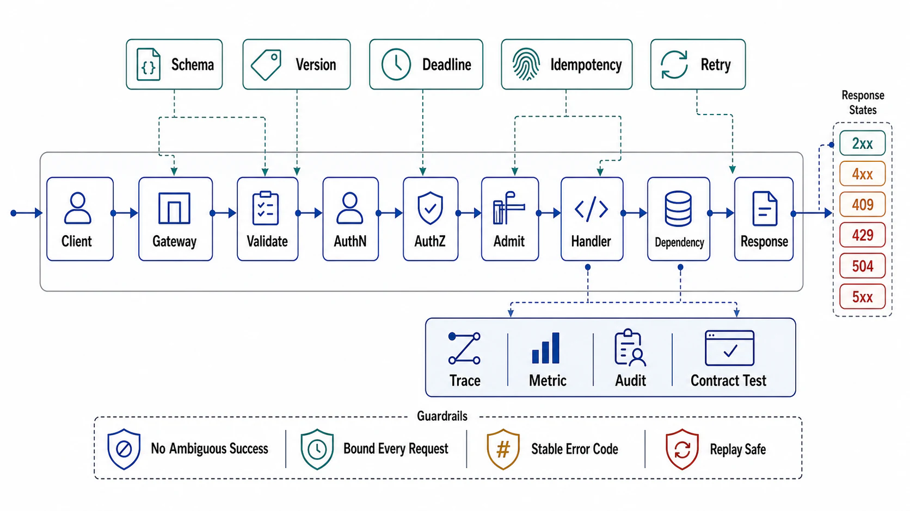

# Chapter 07: API Contracts and Request Lifecycle

## Abstract

A production API must specify schema, idempotency-key behavior, timeout budget, retry semantics, pagination boundary, status codes, authentication context, authorization decision, and partial-failure response shape — and the reason each field is mandatory is that the request/response template supplies a default for it, and the defaults are collectively wrong: infinite timeouts, per-layer retry counters that multiply into self-inflicted attack traffic, offset pagination that silently loses rows, error prose that clients parse with regexes, tenant IDs trusted from request bodies, and synchronous shapes serving work that outlives any honest deadline. This chapter engineers each field: the contract as a machine-readable artifact with an enforcement loop (generated conformance, mechanical breaking-change detection, consumer-driven contracts against Hyrum's Law); the lifecycle as an ordered pipeline where cheap rejection precedes every expensive stage; time as one edge-minted deadline that decomposes hop by hop; retries licensed by three-state idempotency machinery; errors as RFC 9457 contract with ambiguity honored as its own terminal state; cursors, compatibility laws, and deprecation machinery for the two surfaces where APIs quietly break their consumers; zero-trust identity with tenancy enforced below the handlers; and the streaming/LRO/AI lifecycles — derived from latency distributions, not templates — where the token stream turns every one of this chapter's contracts into a metered, cancellable, delegated conversation.

The chapter's through-line is the seam with Chapter 01 file 04 made precise: that file declared *that* these contract fields exist at every boundary; this chapter decides *how* each is engineered, priced from client SDK to final status code. One sentence for the whole chapter: an API's defaults are decisions someone else made — the review's job is to find every one still in effect and make it yours.

## Chapter Structure

Each file is a self-contained research note: abstract, formal model, ASCII figures, decision tables, approval gates that can fail a design, and primary-source references. The reading order is a dependency graph (see [00-chapter-file-map.md](00-chapter-file-map.md)).

| Order | File | Concept |
|---:|---|---|
| 0 | [00-chapter-file-map.md](00-chapter-file-map.md) | Folder map, dependency graph, prerequisites from Chapters 01/02/03/04/06 |
| 1 | [01-the-contract-artifact-and-schema-first-design.md](01-the-contract-artifact-and-schema-first-design.md) | The artifact's enforcement loop, Hyrum's Law, interface style per workload, when a request API is the wrong tool |
| 2 | [02-request-lifecycle-and-middleware-order.md](02-request-lifecycle-and-middleware-order.md) | The canonical pipeline, rejection economics, gateway/service division, explicit context |
| 3 | [03-timeout-budgets-retries-and-hedging.md](03-timeout-budgets-retries-and-hedging.md) | Deadline decomposition, retry amplification arithmetic, token-bucket budgets, hedging |
| 4 | [04-idempotency-and-safe-retries.md](04-idempotency-and-safe-retries.md) | The three-state key machine, natural idempotency first, scope/retention, the client's half |
| 5 | [05-errors-status-codes-and-partial-failure.md](05-errors-status-codes-and-partial-failure.md) | RFC 9457, the action taxonomy, unknown ≠ failed, partial-failure shapes |
| 6 | [06-pagination-filtering-and-bulk-surfaces.md](06-pagination-filtering-and-bulk-surfaces.md) | Cursor contracts, declared traversal claims, priced filter grammars, batch-vs-job thresholds |
| 7 | [07-versioning-deprecation-and-compatibility.md](07-versioning-deprecation-and-compatibility.md) | The compatibility law table, versioning as staffed commitment, RFC 9745/8594 machinery, skew windows |
| 8 | [08-authentication-authorization-and-tenancy.md](08-authentication-authorization-and-tenancy.md) | Zero-trust hops, tenancy below the handler, decision-point placement, tokens and delegation, agent principals |
| 9 | [09-streaming-long-running-and-ai-request-lifecycles.md](09-streaming-long-running-and-ai-request-lifecycles.md) | Derived shape thresholds, the LRO contract, stream honesty, token economics, tool loops |
| 10 | [10-verification-of-api-contracts.md](10-verification-of-api-contracts.md) | Drills C1–C10 (standing where CI can carry them), API SLIs, contract-generation stamps |
| 11 | [11-api-review-templates.md](11-api-review-templates.md) | Executable dossier and approval checklist |

## Source Corpus

| Source | Official Material | Standard Imported Into This Chapter |
|---|---|---|
| Wright | [Hyrum's Law](https://www.hyrumslaw.com/) | All observable behavior becomes contract; the artifact, consumer contracts, and specified tolerance as the only countermeasures. |
| OpenAPI / protobuf / GraphQL | [OpenAPI spec](https://spec.openapis.org/oas/latest.html), [proto3 guide](https://protobuf.dev/programming-guides/proto3/), [GraphQL spec](https://spec.graphql.org/) | The contract as machine-readable artifact from which conformance is generated; interface style as a workload decision with GraphQL's client-controlled cost named. |
| Pact | [Consumer-driven contract testing](https://docs.pact.io/) | The consumer's half of the contract recorded and replayed in producer CI. |
| gRPC / Google SRE | [Deadlines guide](https://grpc.io/docs/guides/deadlines/), [Addressing Cascading Failures](https://sre.google/sre-book/addressing-cascading-failures/), [Handling Overload](https://sre.google/sre-book/handling-overload/) | One propagated deadline with refusal below the waterline; retry storms as the cascading-failure engine; criticality-aware admission. |
| AWS Builders' Library | [Timeouts, retries, and backoff with jitter](https://aws.amazon.com/builders-library/timeouts-retries-and-backoff-with-jitter/), [Making retries safe with idempotent APIs](https://aws.amazon.com/builders-library/making-retries-safe-with-idempotent-APIs/), [Fairness in multi-tenant systems](https://aws.amazon.com/builders-library/fairness-in-multi-tenant-systems/) | Jittered bounded retries, idempotency as the retry license, identity-aware admission. |
| Brooker | [Retries as amplifiers / token buckets](https://brooker.co.za/blog/2022/02/28/retries.html) | Per-call retry counters make local promises against a global failure mode; only globally scoped budgets bound fleet amplification. |
| Dean & Barroso | [The Tail at Scale, CACM 2013](https://cacm.acm.org/research/the-tail-at-scale/) | Tail compounding under fan-out; hedged requests as capacity-for-tail-latency with cancellation as the license. |
| Stripe | [Idempotency](https://stripe.com/blog/idempotency), [API versioning](https://stripe.com/blog/api-versioning) | The client-generated idempotency key as settled design; rolling dated versions with server-side transforms decoupling evolution from migration. |
| IETF HTTP standards | [RFC 9457 problem details](https://www.rfc-editor.org/rfc/rfc9457.html), [RFC 9110 semantics](https://www.rfc-editor.org/rfc/rfc9110.html), [RFC 9745 Deprecation](https://www.rfc-editor.org/rfc/rfc9745.html), [RFC 8594 Sunset](https://www.rfc-editor.org/rfc/rfc8594.html), [Idempotency-Key draft](https://datatracker.ietf.org/doc/draft-ietf-httpapi-idempotency-key-header/) | Machine-readable errors, status semantics intermediaries obey, deprecation as headers tooling reads; the idempotency header's draft status stated honestly. |
| Google AIPs | [AIP-151 LROs](https://google.aip.dev/151), [AIP-158 pagination](https://google.aip.dev/158), [AIP-160 filtering](https://google.aip.dev/160), [AIP-180 compatibility](https://google.aip.dev/180), [AIP-193 errors](https://google.aip.dev/193) | A shipped design system as the reference for operation resources, opaque page tokens, governed filter grammars, and field-level compatibility law. |
| use-the-index-luke | [No-offset](https://use-the-index-luke.com/no-offset) | Offset pagination's O(N·limit) cost and silent-skip correctness failure; keyset as the contract-shaping fix. |
| NIST / IETF OAuth / OWASP | [SP 800-207](https://csrc.nist.gov/pubs/sp/800/207/final), [RFC 9700 OAuth BCP](https://www.rfc-editor.org/rfc/rfc9700.html), [OAuth 2.1 draft](https://datatracker.ietf.org/doc/draft-ietf-oauth-v2-1/), [RFC 8693 token exchange](https://www.rfc-editor.org/rfc/rfc8693.html), [OWASP API Top 10](https://owasp.org/API-Security/editions/2023/en/0x11-t10/) | Zero-trust hops, hardened OAuth as the floor (2.1's status stated honestly), explicit delegation chains, BOLA as the standing #1 API vulnerability. |
| SPIFFE / OPA | [SPIFFE overview](https://spiffe.io/docs/latest/spiffe-about/overview/), [OPA docs](https://www.openpolicyagent.org/docs/) | Workload identity with automated rotation; policy decision points with pushed policy as the Chapter 02 pattern applied to authorization. |
| WHATWG / MCP | [Server-sent events](https://html.spec.whatwg.org/multipage/server-sent-events.html), [MCP transports 2025-11-25](https://modelcontextprotocol.io/specification/2025-11-25/basic/transports), [MCP authorization](https://modelcontextprotocol.io/specification/2025-11-25/basic/authorization) | Stream framing and resumability; the agent-facing consolidation of sessions, streaming, and OAuth 2.1 delegation this chapter's laws predict. |

## Chapter Standards

1. Every interaction is admitted to its shape deliberately — request/response, LRO, event, or stream — with the routing derived from latency distributions and consumer counts, never from the default-synchronous reflex.
2. The contract is a versioned, reviewed, machine-readable artifact; validators, SDKs, mocks, and conformance are generated from it; CI fails when implementation and artifact disagree, in the artifact's favor.
3. Breaking is a mechanical verdict from a field-level law table; declared client tolerances (unknown fields, open enums) are contract-tested obligations, not assumptions.
4. The pipeline order is an argument: decode limits, then trace, then authenticate, then admit, then authorize, then validate, then execute — cheap rejection ahead of every expensive stage, with the rejection-economics arithmetic on record.
5. One deadline is minted at the edge and decomposes hop by hop; children never outlive parents; hops refuse work they cannot finish; cancellation propagates down the same channel.
6. Retries live at one layer under a globally scoped budget with full jitter, spent only on retriable errors against idempotent targets; the fleet amplification factor is measured, not estimated.
7. Every mutation is naturally idempotent where the domain allows, and three-state key-protected where it is not — reservation atomic, replay byte-faithful, retention compared against every real retry horizon including event replay.
8. Errors are RFC 9457 problem details with stable versioned types, an action-oriented taxonomy, request IDs everywhere, and unknown honored as a terminal state distinct from failed.
9. Partial failure is contract: per-item results with per-item idempotency for batches, atomic promises kept atomic, degraded markers that distinguish empty from broken.
10. List endpoints ship opaque bounded-lifetime cursors over total sorts, a declared traversal claim per endpoint, an enumerated filter grammar mapped to named indexes, and limit caps in the artifact.
11. Versions are minted only for changes the law table cannot absorb, staffed for the window they create; deprecation runs as machinery — RFC 9745/8594 headers, per-identity telemetry, brownouts, 410-with-pointer.
12. Every hop authenticates its caller; tenancy derives from the credential and is enforced below the handlers, failing closed; token lifetimes are chosen revocation latencies; delegation chains stay explicit through every hop, including agents.
13. LROs are durable, idempotent-on-creation resources with declared result retention and honest cancellation; streams carry framing, in-band typed errors, explicit termination, declared resumability, and per-principal quotas.
14. Token streams meter in-band including aborts, state their partial-delivery billing, and propagate cancellation to the accelerator; tool loops carry contract artifacts, delegated authority, and idempotency keys through every turn.
15. API evidence carries class, date, and contract-generation stamp (artifact version, gateway config, policy version, SDK versions, timeout topology); stamped-field changes reset evidence to `assumed`; drills run standing wherever CI can carry them.

## Chapter Completion Gate

Chapter 07 is complete only when the reviewer can answer these questions without guessing:

- For any endpoint: why is it synchronous — and what latency distribution proves the shape still fits?
- For any request: what is the remaining deadline at each hop, and which hop refuses when it cannot finish?
- For any dependency: what is the fleet's measured retry amplification factor when it fails completely?
- For any mutation: what makes the second attempt safe — which mechanism, atomically with what, retained how long?
- For any error a client receives: what should it do next, and can its SDK tell "failed" from "unknown"?
- For any traversal: what does the client provably see while the collection changes underneath it?
- For any deprecated surface: who still calls it, by name, and when is the next brownout?
- For any hop in any call chain: whose authority is it acting with, and what enforces tenant scope if the handler forgets?
- For any stream: what does the client observe at token N when the backend dies — and what does it get billed?
- For every claim above: what is the evidence class, its date, and the contract generation it was proven at?

## Final Position

An API is a promise factory: every field, status code, timeout, and default is a commitment somebody will build on, whether or not it was made on purpose. The template's gift is speed; its price is that the promises ship unexamined — and this chapter's discipline is simply the examination: derive the shape, own the numbers, license the retries, structure the errors, declare the traversal, staff the version, prove the tenancy, meter the stream. Chapters 03–06 built the state, storage, distribution, and event machinery behind the handler; this chapter is the machinery's public face. Chapter 08 turns to the caches and materializations that sit between that face and the storage it fronts — where every consistency promise this chapter made gets renegotiated by a TTL.

## References

- [Wright, "Hyrum's Law"](https://www.hyrumslaw.com/)
- [RFC 9457 — Problem Details for HTTP APIs](https://www.rfc-editor.org/rfc/rfc9457.html)
- [Stripe — APIs as infrastructure: future-proofing Stripe with versioning](https://stripe.com/blog/api-versioning)
- [Dean & Barroso, "The Tail at Scale," CACM 2013](https://cacm.acm.org/research/the-tail-at-scale/)
