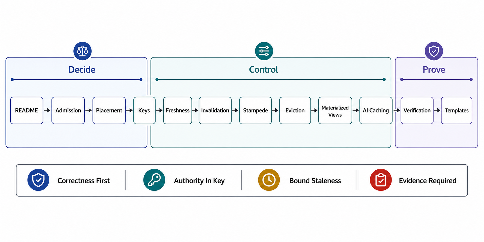

# Chapter 08 File Map — Caching, Materialization, and Invalidation



## Reading Order

| Order | File | Owns |
|---:|---|---|
| 1 | [01-the-cache-admission-decision-and-correctness-model.md](01-the-cache-admission-decision-and-correctness-model.md) | When a cache is the wrong tool; the seven-field correctness model; the hit-ratio fallacy and miss-amplification arithmetic |
| 2 | [02-cache-placement-and-the-layer-topology.md](02-cache-placement-and-the-layer-topology.md) | The layer ladder (client → CDN → gateway → service → in-process → store); RFC 9111 semantics; the end-to-end staleness composition law |
| 3 | [03-key-construction-scope-and-variance.md](03-key-construction-scope-and-variance.md) | Key = full input closure; tenancy and authorization in the key; negative caching; key-cardinality economics |
| 4 | [04-freshness-ttl-and-staleness-contracts.md](04-freshness-ttl-and-staleness-contracts.md) | TTL as a declared staleness bound; stale-while-revalidate / stale-if-error; the freshness budget derivation |
| 5 | [05-invalidation-and-coherence.md](05-invalidation-and-coherence.md) | Invalidation pipelines from the log; leases and stale-set prevention; versioned keys vs purge; measuring consistency (Polaris) |
| 6 | [06-stampede-metastability-and-degraded-modes.md](06-stampede-metastability-and-degraded-modes.md) | Thundering herds; coalescing, leases, probabilistic early expiration; the cold-cache death spiral; cache-off as a designed mode |
| 7 | [07-eviction-admission-and-memory-economics.md](07-eviction-admission-and-memory-economics.md) | Eviction and admission policies (LRU → W-TinyLFU → S3-FIFO/SIEVE); workload evidence; memory economics per hit |
| 8 | [08-materialized-views-and-incremental-maintenance.md](08-materialized-views-and-incremental-maintenance.md) | Materialization as a cache with a maintenance plan; refresh vs incremental (IVM/DBSP); maintenance lag as the staleness SLI |
| 9 | [09-ai-native-caching.md](09-ai-native-caching.md) | KV/prefix caches, KVCache-centric serving, semantic caching's correctness risk, model-version keying — the AI-native instantiation |
| 10 | [10-verification-of-cache-correctness.md](10-verification-of-cache-correctness.md) | Drill catalog K1–K10; cache SLI set; cache-generation evidence stamps |
| 11 | [11-cache-review-templates.md](11-cache-review-templates.md) | The cache surface dossier and reviewer checklist |

## Approval Dependency Graph

```text
Figure 1. Approval dependencies. The correctness model [01] gates
everything; invalidation [05] cannot be approved before keys [03]
and freshness [04]; the failure files [06][07] and the AI file [09]
feed the evidence machinery [10] → templates [11].

  [01 admission + correctness model]
        │
        v
  [02 placement/layers] ──► [03 keys] ──► [04 freshness/TTL]
        │                        │              │
        │                        v              v
        │                  [05 invalidation & coherence]
        │                        │
        ├──► [06 stampede/metastability]      [08 materialization]
        │                        │              │
        ├──► [07 eviction/admission]           │
        │                        │              │
        └──► [09 AI-native caching] ◄──────────┘
                                 │
                                 v
                        [10 verification]
                                 │
                                 v
                        [11 review templates]
```

## Prerequisites From Earlier Chapters

| Prerequisite | Where it is established | Consumed by |
|---|---|---|
| Derived state has a source of truth, lineage, and rebuild path | [Ch03 file 05](../03-state-ownership-and-consistency-model/05-derived-state-and-lineage.md) | [01], [05], [08] |
| Consistency claims are declared per read path | [Ch03 file 02](../03-state-ownership-and-consistency-model/02-consistency-model-selection.md) | [01], [04] |
| Read models / denormalized projections and their maintenance cost | [Ch04 file 05](../04-data-modeling-storage-engines-and-query-paths/05-denormalization-projections-and-read-models.md) | [08] |
| The log as the invalidation transport; consumer lag; replay | [Ch06 file 01](../06-event-logs-streams-and-backpressure/01-the-log-abstraction-and-topic-design.md), [Ch06 file 03](../06-event-logs-streams-and-backpressure/03-consumer-groups-lag-and-rebalancing.md) | [05], [08] |
| Response caches are consumers of the API contract; TTL renegotiates promises | [Ch07 file 07](../07-api-contracts-and-request-lifecycle/07-versioning-deprecation-and-compatibility.md) | [02], [04] |
| Tenancy from the credential; BOLA as the #1 leak class | [Ch07 file 08](../07-api-contracts-and-request-lifecycle/08-authentication-authorization-and-tenancy.md) | [03] |
| Metastable failures and overload semantics | [Ch01 file 08](../01-architectural-objective-and-system-boundary/08-failure-domain-and-overload-semantics.md), [Ch02 file 07](../02-control-plane-and-data-plane-separation/07-coupled-failure-domains-and-anti-patterns.md) | [06] |
| Evidence classification (tested / observed / assumed) | [Ch01 file 11](../01-architectural-objective-and-system-boundary/11-evidence-classification-and-architecture-review.md) | [10], [11] |

## Chapter Rule

This chapter approves *caching decisions*: what may be cached, keyed how, stale how long, invalidated by what, degraded to what, and evicted by what policy — plus materializations as caches with maintenance plans. It does not approve the storage engines under the caches (Chapter 04), the log that transports invalidations (Chapter 06), the API contracts whose responses get cached (Chapter 07), or the GPU serving internals behind KV caches (Chapter 10) — those are cited as prerequisites, never re-argued.
