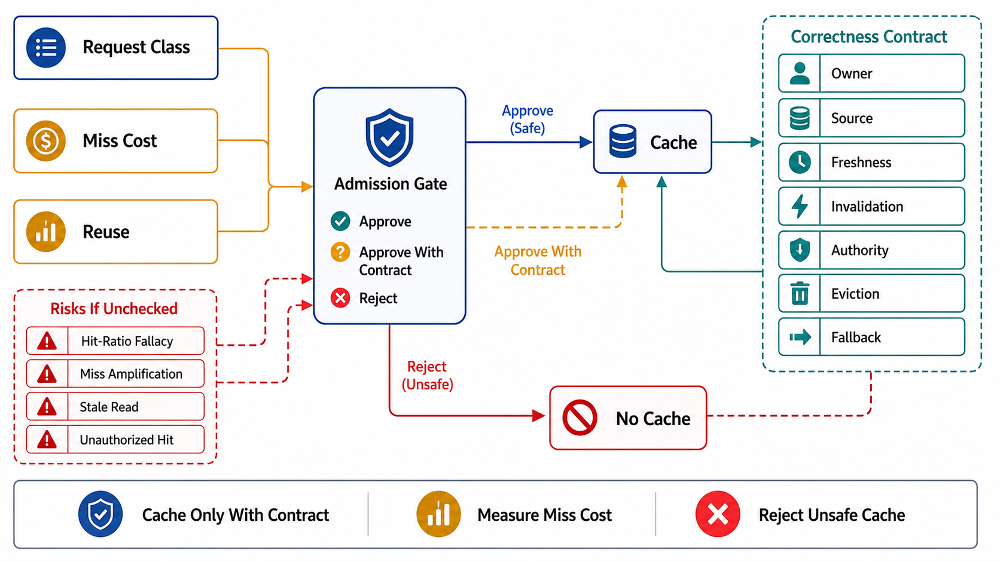

# The Cache Admission Decision and Correctness Model



## Abstract

A cache is a bet that yesterday's computation predicts today's request, purchased by accepting a weaker consistency claim than the source of truth offers — and this chapter's root position is that the bet must be *underwritten*, not assumed. A cache entry is derived state (Chapter 03 file 05's category, with every obligation that carries: a source of truth, a declared derivation, a rebuild path), and a cache is correct only when seven fields are defined for every entry class: **key construction** (the full input closure), **freshness contract** (the staleness bound the reader tolerates), **invalidation trigger** (what event retires the entry), **stampede control** (what happens when it expires under concurrency), **admission/eviction policy** (what deserves the memory), **fallback path** (what a miss or a dead cache costs), and **negative semantics** (whether "not found" is cacheable). Hit ratio — the number every dashboard leads with — is not an architecture metric until those fields exist, because a 99% hit ratio on a cache serving wrong tenants' data, or one whose loss takes down the origin, measures the *size of the problem*, not the quality of the design. The arithmetic that reframes the whole chapter: origin load is proportional to the **miss** ratio, so the interesting derivative is at the wrong end of the number — a hit ratio drifting from 99% to 98% reads as a rounding error and *doubles* the origin's load.

## 1. When a Cache Is the Wrong Tool — the Admission Decision

The decision table, before any machinery is designed. A cache is admitted per *entry class*, not per service:

| Situation | Verdict | Reason / the honest alternative |
|---|---|---|
| High reuse, tolerant readers (declared staleness bound > refresh interval) | Cache — the design case | The bet pays: reuse amortizes the fill; staleness is contracted, not accidental |
| Read-your-writes or linearizable read required (Ch03 file 02's claim) | **No cache on that path** | A cache that must always be fresh is the origin with extra steps and a new failure mode; route the path to the source |
| Low reuse (unique keys, long-tail-dominated, N≈1 hits/entry) | No cache | Fill cost + memory buys nothing; Twitter's production analysis shows large real clusters with exactly this shape ([OSDI 2020](https://www.usenix.org/conference/osdi20/presentation/yang)) |
| Recompute cheaper than a network cache round-trip | Compute inline (or in-process memoize) | A remote cache is a network service; sub-millisecond recomputation loses to it |
| Origin cannot survive the cache's absence at current traffic | Cache is **load-bearing infrastructure**, not an optimization | Admit it as capacity (file 06's laws apply in full: warming, degraded modes, kill-cache drills) — or fix origin capacity first |
| Result must be auditable/exact per request (billing, authorization decisions) | No cache, or versioned-key cache with proof | A stale allow/deny is an incident, not a performance artifact (Ch07 file 08's decisions are cached only with explicit revocation-latency accounting) |

The two verdicts teams most often skip past: the *no-cache* verdict on strongly consistent paths (the cache gets added anyway and the consistency claim silently downgrades — Chapter 07 file 07's "response caches are consumers too" seam, from the other side), and the *load-bearing* verdict — the moment origin capacity is sized assuming the hit ratio, the cache has stopped being an optimization and become a tier whose failure semantics must be designed like any other tier's.

## 2. The Correctness Model

```text
Figure 1. The seven-field entry-class contract. A cache design is
the table of these rows — one per entry class — not a technology
choice. Every later file owns one or two columns.

  entry class:  "user profile render, per (user, locale)"
  ┌──────────────────┬────────────────────────────────────────┐
  │ key closure      │ (user_id, locale, schema_v, model_v?)  │ file 03
  │ freshness        │ ≤ 30 s stale tolerated (declared SLI)  │ file 04
  │ invalidation     │ CDC event on user row → purge/version  │ file 05
  │ stampede control │ coalesce + lease; XFetch on hot keys   │ file 06
  │ admission/evict  │ W-TinyLFU class; TTL ceiling 24 h      │ file 07
  │ fallback         │ origin read @ p99 800 ms; degraded UI  │ files 01/06
  │ negative entries │ cache "absent" 5 s (tombstone key)     │ file 03
  └──────────────────┴────────────────────────────────────────┘
  An entry class missing any row is an UNDESIGNED cache: it has
  behavior in every one of these dimensions anyway — just behavior
  nobody chose.
```

Two consequences of treating entries as derived state. First, **the rebuild path is part of the design**: every cache must be answerable to "delete it all — what happens?", and the answer is priced in file 06's cold-start arithmetic, not assumed to be "it refills." Second, **staleness is a consistency claim made to readers** (Chapter 03 file 02's vocabulary): "cached" is not a euphemism that exempts the path from declaring what readers may observe; it is a bounded-staleness claim whose bound is the TTL/invalidation design, and file 04 makes that bound a first-class contract.

## 3. The Hit-Ratio Fallacy, Worked

Origin load = request rate × miss ratio. Fleet at 100k req/s: at 99% hits the origin sees 1k req/s; at 98% — a drift no hit-ratio dashboard alarms on — it sees 2k req/s, **a 100% origin load increase from a one-point ratio change**. Generalized: going from hit ratio h₁ to h₂ multiplies origin load by (1−h₂)/(1−h₁), which is why the review demands the *miss ratio and its derivative* as the watched SLI (file 10), and why capacity planning at 95% hits means the origin is sized for 5% — so a full cache flush presents **20×** the origin's provisioned load (file 06's death-spiral input). The same arithmetic prices eviction-policy work: Twitter's cluster analysis and the SIEVE/S3-FIFO results (file 07) report miss-ratio reductions of 20–40% — invisible framed as "hit ratio 97.6% → 98.2%", but a 25% origin-load cut framed correctly. The review rule: **every hit-ratio number in a dossier is restated as a miss ratio and an origin-load consequence.**

## 4. Approval Gates

| Gate | Evidence Required | Failure Condition |
|---|---|---|
| Admission gate | §1 verdict per entry class, written; no-cache verdicts on strongly consistent paths respected | Cache added by reflex; consistency claim silently downgraded by a TTL |
| Contract gate | The seven-field table (§2) complete per entry class | Any field answered "default" — undesigned behavior in a correctness dimension |
| Derived-state gate | Source of truth, derivation, and rebuild path named per entry class (Ch03 file 05 inheritance) | Cache contents nobody can regenerate; "the cache *is* the data" discovered during an outage |
| Load-bearing gate | If origin cannot serve full traffic: cache declared as infrastructure with warming, degraded modes, and kill-cache drill (file 06/10) | Hit ratio treated as an optimization while origin capacity assumes it |
| Arithmetic gate | Hit-ratio claims restated as miss ratio + origin-load multiplier; capacity plan uses the miss end | Dashboards celebrating 99% while a 1-point drift doubles origin load unwatched |

## Output

The output of this file is the chapter's admission and correctness frame: a per-entry-class decision on whether caching is even the right tool, a seven-field contract that replaces "we cache it" with designed behavior in every dimension the cache has behavior in anyway, and the miss-ratio arithmetic that converts hit-ratio vanity into origin-load consequence.

## References

- [Nishtala et al., "Scaling Memcache at Facebook" (NSDI 2013) — the canonical look-aside architecture and its failure modes](https://www.usenix.org/conference/nsdi13/technical-sessions/presentation/nishtala)
- [Yang, Yue, Rashmi, "A large scale analysis of hundreds of in-memory cache clusters at Twitter" (OSDI 2020) — workload evidence for the admission verdicts](https://www.usenix.org/conference/osdi20/presentation/yang)
- [Brooker, "Caches, Modes, and Unstable Systems" — the load-bearing verdict's stability argument](https://brooker.co.za/blog/2021/08/27/caches.html)
- [RFC 9111 — HTTP Caching (the freshness/validation vocabulary this chapter builds on)](https://www.rfc-editor.org/rfc/rfc9111.html)
