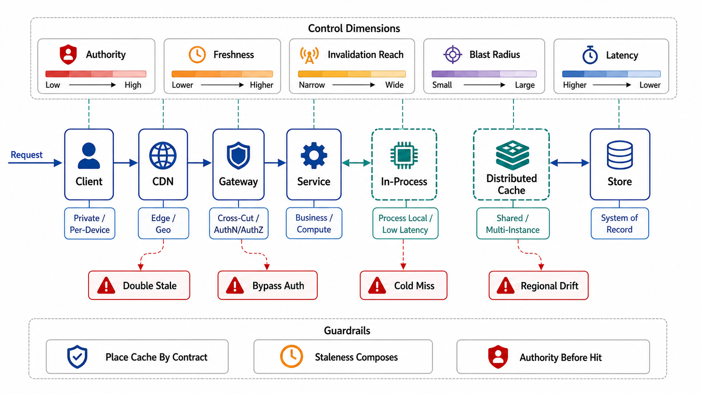

# Cache Placement and the Layer Topology



## Abstract

Real systems do not have "a cache"; they have a *stack* of them — browser and SDK caches, CDN points of presence, gateway response caches, service-level look-aside caches, in-process memoization, and the storage engine's own buffer pool — and most cache incidents are not failures of any single layer but of the *composition*: staleness bounds that add up across layers into an end-to-end window nobody declared, invalidations that reach some layers and not others, and debugging sessions that cannot say which of six layers served the wrong byte. This file owns placement — which layer a given entry class belongs to, decided by where the reuse is shared and how invalidation reaches it — and states the chapter's **composition law**: for layered caches, worst-case end-to-end staleness is the *sum* of per-layer staleness bounds along the serving path (each layer can hand a maximally stale value to the layer above just before expiry), while origin protection *multiplies* (the origin sees the product of layer miss ratios). Both compositions are computed in the dossier, not discovered in production. The HTTP layers run on standardized semantics ([RFC 9111](https://www.rfc-editor.org/rfc/rfc9111.html)): `Cache-Control` is the *origin's contract with every cache it will never meet*, which makes the header a reviewed artifact of Chapter 07's contract discipline, not a config knob.

## 1. The Layer Ladder

| Layer | Shared across | Invalidation reach | Belongs there |
|---|---|---|---|
| Client/SDK cache | One user/device | Weakest: TTL + validators only (`ETag`/`If-None-Match` revalidation) | Immutable assets (content-hashed), single-user reads where staleness is personally tolerable |
| CDN / edge | All users, per geography | Purge API + surrogate keys; TTL floor | Public/shared responses, anonymous pages, media; *never* credentialed responses without an explicit, reviewed `Vary`/key design (file 03) |
| Gateway response cache | All users of the API | Local purge feasible; per-route policy | Whole-response reuse where the route's key closure is small and declared |
| Service look-aside (Memcache/Redis-class) | All instances of a service | Full: the file 05 invalidation pipeline targets this layer | The workhorse: objects and query results with cross-user reuse and event-driven invalidation |
| In-process | One process | Deploy/restart, or per-entry TTL of seconds | Hot descriptors (config, feature flags, schema handles) where a network hop per read is absurd; smallest and most dangerous per-byte (invisible to fleet observability unless exported) |
| Storage buffer pool / internal | The engine | The engine's own coherence — always correct | Not this chapter's to design (Chapter 04); listed because capacity planning that ignores it double-counts |

Placement rule: an entry class lives at the *highest layer whose sharing scope matches its reuse and whose invalidation reach satisfies its freshness contract*. Pushing a shared, event-invalidated object down into per-process caches multiplies staleness windows by instance count and makes file 05's pipeline unable to reach it; pushing a per-user object up to the CDN converts a privacy boundary into a cache key problem (file 03's leak class).

## 2. The Composition Law, Worked

```text
Figure 1. Staleness adds; protection multiplies. Three layers on
the serving path for one entry class:

   CDN            TTL 60 s
    └─ gateway    TTL 30 s
        └─ service look-aside   invalidation-based, p99 lag 5 s

  Worst-case end-to-end staleness (client-observed):
      60 + 30 + 5  =  95 s
  — each layer may serve an entry filled at the previous layer's
  last-valid moment. The declared freshness contract (file 04) must
  cover 95 s, not the 60 the CDN dashboard shows.

  Origin protection (steady state, independent-ish misses):
      miss(CDN)=0.20 × miss(gw)=0.30 × miss(svc)=0.10
      → origin sees 0.6% of requests   (~167× shielding)
  — and the same product says a *flush of any one layer* multiplies
  origin load by that layer's 1/miss factor alone: flushing the
  service layer here is a 10× step at the origin (file 06).
```

Three corollaries the review enforces. **(1) The end-to-end staleness sum is computed per entry class and compared against the file 04 contract** — the per-layer TTLs are then *derived* from the budget, exactly as Chapter 07 file 03 derives timeouts from the deadline budget (same discipline, staleness instead of time-remaining). **(2) Invalidation reach is audited per layer**: an event-driven purge that reaches the service layer but not the CDN converts the CDN's TTL into the *real* staleness bound — the fast pipeline below it is cosmetic (file 05 owns the pipeline; this file owns knowing which layers it covers). **(3) Layer attribution is an observability requirement**: every cached response carries which-layer-served-this (`Age`, custom hit headers, cache name in traces), because "who served the stale byte" is the first question of every cache incident and the composition makes it six-way ambiguous by default.

## 3. HTTP Semantics Are the Contract Surface

For every layer that speaks HTTP, the origin's headers are the *only* control channel it has over caches it does not operate — the browser it will never patch, the corporate proxy it has never heard of. Consequences: `Cache-Control` directives are part of the API contract artifact (Chapter 07 file 01's schema-first discipline extends to caching metadata: reviewed, versioned, conformance-tested), with the private/public distinction (`private`, `no-store`) treated as a security control, not a performance one; validators (`ETag`) are contract fields enabling cheap revalidation (304s) rather than blind TTL expiry; and `Age`/`Via` are the observability floor of §2's attribution rule. The named failure: a credentialed response without `Cache-Control: private` cached by a shared intermediary is a cross-user data leak executed by standards-compliant infrastructure doing exactly what the origin told it to.

## 4. Approval Gates

| Gate | Evidence Required | Failure Condition |
|---|---|---|
| Placement gate | Entry class × layer matrix with the §1 rule applied; sharing scope and invalidation reach named per class | Same object cached at four layers because each team added one; per-user data at shared layers |
| Composition gate | End-to-end staleness sum per entry class ≤ declared freshness contract; per-layer TTLs derived from the budget | TTLs chosen per layer in isolation; the 95-second reality behind a 60-second dashboard |
| Reach gate | Invalidation coverage audited per layer; layers outside the pipeline's reach carry the honest (TTL) bound in the composition | "We purge on write" true at one layer of six |
| Attribution gate | Which-layer-served-this observable on every cached response (headers + traces) | Cache incidents beginning with an archaeology project |
| HTTP-contract gate | `Cache-Control`/`ETag`/`Vary` in the contract artifact, reviewed and conformance-tested; `private`/`no-store` treated as security controls | Caching headers as unreviewed framework defaults; credentialed responses cacheable by intermediaries |

## Output

The output of this file is a placement design: every entry class assigned to the layer its reuse and invalidation reach justify, per-layer TTLs derived from an end-to-end staleness budget under the composition law (staleness adds, protection multiplies), and HTTP caching metadata promoted to contract surface — so the cache stack behaves as one designed system instead of six accidental ones.

## References

- [RFC 9111 — HTTP Caching: freshness, validation, and the directive vocabulary](https://www.rfc-editor.org/rfc/rfc9111.html)
- [Nishtala et al., "Scaling Memcache at Facebook" (NSDI 2013) — regional layering and invalidation reach at scale](https://www.usenix.org/conference/nsdi13/technical-sessions/presentation/nishtala)
- [Fastly — cache freshness and HTTP caching semantics in a production CDN](https://www.fastly.com/documentation/guides/concepts/cache/cache-freshness/)
- [MDN — Cache-Control (the practitioner-facing map of RFC 9111 directives)](https://developer.mozilla.org/en-US/docs/Web/HTTP/Reference/Headers/Cache-Control)
