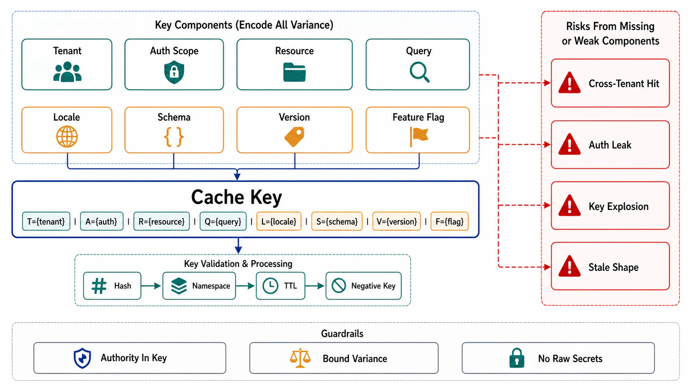

# Key Construction, Scope, and Variance



## Abstract

A cache key is a claim of *referential transparency*: every input that can change the value is in the key, so two requests producing the same key are guaranteed to accept the same bytes. Every cache correctness bug that is not a staleness bug is a violation of exactly this claim — a dimension that varies the output but was left out of the key — and the two worst instances are security incidents wearing performance costumes: **tenant/principal omitted from the key** (user A's response served to user B — Chapter 07 file 08's BOLA, executed by the cache instead of the handler) and **authorization context omitted** (an entry filled for a privileged viewer replayed to an unprivileged one — the cached-authorization bypass, which is why cursors, and cache entries alike, are minted only *after* authorization filtering). This file gives the key-closure discipline, its cost side (every keyed dimension multiplies cardinality, so closure is *engineered* by normalizing inputs, not by concatenating the request), the HTTP projection of the same law (`Vary` is key construction performed by header), and negative caching — the decision of whether "absent" is a cacheable value, which is simultaneously a hot-miss protection and a staleness bug factory for freshly created objects.

## 1. The Key Closure

```text
Figure 1. Key = the value's full input closure, normalized.

  value = f(inputs)          key must determine ALL of:
  ┌───────────────────────────────────────────────────────┐
  │ identity of the object        (user_id, resource_id)  │
  │ variant dimensions            (locale, device class,  │
  │                                A/B cohort, API ver)   │
  │ principal/tenant scope        (tenant_id — from the   │
  │                                credential, Ch07 f08)  │
  │ authorization context         (role/visibility class  │
  │                                — or key AFTER filter) │
  │ producer version              (schema_v, renderer_v,  │
  │                                model_v — file 09)     │
  └───────────────────────────────────────────────────────┘
  Omitted dimension → wrong-value bug (cross-variant serve).
  Spurious dimension → cardinality explosion, hit ratio → 0.
  Producer version in the key → deploy = implicit invalidation
  (the version-bump alternative to purging, file 05 §2).
```

The discipline has two directions. **Closure** (no omissions) is verified mechanically, not by review prose: the drill is a property test — replay recorded request pairs that differ in exactly one candidate dimension and assert the cache never serves one's response to the other (file 10, K4). **Normalization** (no spurious dimensions) is where hit ratio is engineered: canonicalize before keying — sorted/whitelisted query parameters, locale collapsed to supported set, irrelevant headers dropped — because a raw-URL key treats `?a=1&b=2` and `?b=2&a=1` as different objects and treats one marketing UTM parameter as a cache-buster. The whitelist beats the blacklist: key on the dimensions *known* to vary the output, and let unknown inputs fail closed into a miss rather than fail open into a shared entry.

## 2. Tenancy and Authorization in the Key — the Leak Class

The rule, stated at the strength the incident class deserves: **scope dimensions come from the authenticated context, never from the request surface** (Chapter 07 file 08's tenancy law applied to keys — a tenant ID lifted from a URL parameter into a cache key lets a hostile caller *choose whose cache entry to read*), and any cache above the authorization decision must either key on the full authorization context or be restricted to responses that are identical for all principals (the CDN rule from file 02). The subtle variant that survives naive review: an entry keyed per-object but filled through a *privileged* read path — key closure holds per object, yet the value embeds visibility (redactions, field-level permissions) that differ by viewer; the fix is keying on the viewer's visibility class or moving the cache below authorization. The standing verification is C8's sibling: a cross-tenant/cross-role probe run against the *cache-served* path specifically, because the origin's checks passing proves nothing about what the cache replays (file 10, K5).

## 3. Variance for HTTP Caches, and Negative Entries

**`Vary` is key construction by header.** For shared HTTP caches the effective key is (URL + the headers named in `Vary`), so the same closure/normalization tension replays: omit `Vary: Accept-Language` and one locale's page is served to all; emit `Vary: Cookie` (or `Vary: *`) and the cache is disabled by cardinality — per-credential responses belong behind `Cache-Control: private`, not behind a `Vary` that pretends to key them ([RFC 9111 §4.1](https://www.rfc-editor.org/rfc/rfc9111.html#section-4.1)). The reviewed artifact is the per-route `Vary` list, and it is the *whitelist normalization of §1* expressed in the standard's vocabulary.

**Negative caching** is the decision to make "absent" a value: caching lookup misses protects the origin from repeated misses on nonexistent keys — the classic protection against both innocent hot-misses and enumeration traffic, standardized for DNS in [RFC 2308](https://www.rfc-editor.org/rfc/rfc2308.html). Its failure mode is precise: a negative entry outliving the object's *creation* serves "not found" for a thing that now exists — the newly registered user who doesn't exist for five minutes. The design rules: negative TTLs are short and separately configured (seconds, not the positive TTL), negative entries are first-class targets of the file 05 invalidation pipeline (a create event purges the tombstone), and negative hit ratio is a separate SLI (file 10) because a spike in it is either an enumeration attack or an invalidation bug, and both are worth an alarm.

## 4. Approval Gates

| Gate | Evidence Required | Failure Condition |
|---|---|---|
| Closure gate | Per entry class: the keyed-dimension list with the varying-inputs analysis; property-test drill (K4) standing | A dimension that varies output but not the key; closure argued by prose instead of tested |
| Normalization gate | Canonicalization spec (whitelisted params/headers, collapsed variants); cardinality estimate per class | Raw request as key; UTM parameters as cache-busters; hit ratio destroyed by spurious dimensions |
| Scope gate | Tenant/principal dimensions sourced from credentials; caches above authz restricted to principal-invariant responses or keyed on visibility class; K5 probe standing | Request-parameter scoping; privileged-fill replayed to unprivileged viewers; a single cross-tenant cache hit |
| Vary gate | Per-route `Vary` whitelist in the contract artifact; `private` for credentialed responses | `Vary: *`/`Vary: Cookie` as key design; credentialed responses in shared caches |
| Negative gate | Per class: cacheable-absence decision; short separate TTL; creation events purge tombstones; negative-hit SLI | Created objects invisible behind stale tombstones; negative entries outside the invalidation pipeline |

## Output

The output of this file is a key design per entry class: a normalized closure over every output-varying dimension — with tenancy and authorization scoped from credentials and verified by standing cross-scope probes, `Vary` treated as the same law in HTTP's vocabulary, and negative entries admitted deliberately with their own TTLs and invalidation — so that a cache hit is a *proof* the bytes are acceptable to this caller, not a hope.

## References

- [RFC 9111 §4.1 — calculating cache keys with `Vary`](https://www.rfc-editor.org/rfc/rfc9111.html#section-4.1)
- [RFC 2308 — Negative Caching of DNS Queries (the negative-TTL reference design)](https://www.rfc-editor.org/rfc/rfc2308.html)
- [OWASP — Web Cache Deception / poisoning class (key-closure violations as attack surface)](https://owasp.org/www-community/attacks/Cache_Poisoning)
- [Nishtala et al., "Scaling Memcache at Facebook" (NSDI 2013) — key/pool separation for workload isolation](https://www.usenix.org/conference/nsdi13/technical-sessions/presentation/nishtala)
