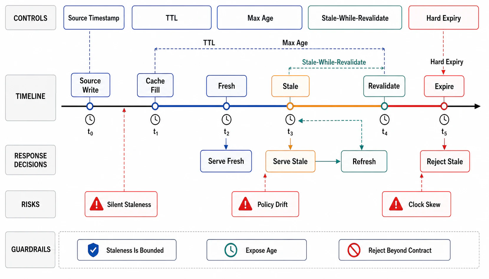

# Freshness, TTL, and Staleness Contracts



## Abstract

A TTL is a consistency contract wearing a config value's clothes: setting `ttl = 300` *is* the declaration "readers of this path may observe the world as it was five minutes ago," and the chapter's position is that this declaration must be made in the consistency vocabulary (a bounded-staleness claim, Chapter 03 file 02) and *derived* from reader tolerance, not typed from folklore. This file gives the freshness algebra: the staleness budget starts from the weakest reader's tolerance, subtracts the composition overhead of the layer stack (file 02's sum), and what remains is divided into per-layer TTLs — the same derive-don't-choose discipline Chapter 07 file 03 imposed on timeouts. It then separates the two freshness regimes — **TTL-bounded** (staleness guaranteed by clock, invalidation unnecessary for correctness) and **invalidation-based** (freshness guaranteed by the file 05 pipeline, TTL demoted to a backstop against pipeline loss) — because most production confusion is designs that believe they are in one regime while operating in the other. Finally it covers the standardized staleness *extensions* that make freshness a graceful dimension rather than a cliff: `stale-while-revalidate` (serve stale, refresh in background — latency-hiding within a declared bound) and `stale-if-error` (serve stale when the origin is failing — an availability trade made explicit), both from [RFC 5861](https://www.rfc-editor.org/rfc/rfc5861.html), both contracts precisely because they *extend* the staleness readers can observe.

## 1. The Freshness Budget, Derived

```text
Figure 1. TTLs are outputs, not inputs. Worked, for one entry class:

  reader tolerance (product decision, written):
      "search results may lag catalog edits by ≤ 2 min"   T = 120 s

  serving path: CDN → service look-aside
      invalidation reach (file 02 §2): pipeline reaches the
      service layer; CDN is TTL-only

  budget:  Σ layer bounds ≤ T
      service layer: invalidation-based, pipeline p99 lag 5 s
      CDN:           TTL-only → TTL_CDN ≤ 120 − 5 = 115 s
                     (deploy margin → set 90 s)

  Wrong direction (the folklore version): "CDN 5 min because the
  default, Redis 1 h because it was in the last project" → end-to-
  end bound 65 min against a 2-min reader tolerance — a ~30×
  violation nobody decided.
```

Rules the derivation forces into the open. **Reader tolerance is a product decision with an owner and a written number** — engineering can derive everything downstream of T, but not T itself; a dossier whose freshness row says "reasonable" has delegated a product promise to a config default. **Different readers, different budgets**: the same data often serves a human UI (minutes are fine) and a reconciliation job (minutes are corruption) — which is a *placement* split (two paths, two entry classes), not a compromise TTL that serves neither (Chapter 06 file 06's derived-view freshness SLO is this same contract on the streaming side). **Staleness is measured, not just budgeted**: the observed age-at-serve distribution per entry class is the SLI (file 10) — a budget without measurement is Chapter 01 file 11's *assumed* evidence class, expiring on the first incident.

## 2. The Two Regimes — and Knowing Which One You're In

| | TTL-bounded | Invalidation-based |
|---|---|---|
| Freshness guaranteed by | The clock: max staleness = TTL, unconditionally | The file 05 pipeline: staleness = event propagation lag (typically ms–s) |
| TTL's role | *The* contract | Backstop only — bounds the damage of a lost invalidation; can be hours |
| Fails how | Predictably stale (readers see up-to-TTL-old data always) | Silently unbounded when the pipeline breaks — **unless** the backstop TTL exists |
| Fits | Tolerant readers, high fan-out, writes without events, third-party data | Tight budgets over event-producing state (the Ch06 seam); load-bearing caches where refill storms are dangerous (file 06) |
| The confusion incident | — | Team believes "we invalidate on write" while a layer (file 02 §2) or an entry class (negative entries, file 03 §3) is outside the pipeline's reach: the backstop TTL — often infinite — is the real bound |

The review question that sorts every cache into a regime: *"if the invalidation pipeline silently stopped, what bounds staleness, and would you notice?"* The answers required: the backstop TTL (finite, stated) bounds it; and the pipeline's lag/liveness is monitored as a first-class SLI (file 05's Polaris-class measurement), so "silently" is impossible. A design that answers "nothing" and "no" is running an unbounded-staleness cache with good intentions.

## 3. Graceful Staleness — SWR and Stale-If-Error

`stale-while-revalidate` decouples the *latency* cost of freshness from the reader: within the declared window after expiry, the cache serves the stale entry and refreshes in the background — readers never wait on a fill, and refresh concurrency collapses to one (a standards-level cousin of file 06's coalescing). The contract discipline: the SWR window *extends the observable staleness bound* (budget line: TTL + SWR window in §1's sum) and suits monotonically improving content, not correctness-critical reads. `stale-if-error` is an availability policy made explicit: when the origin is down or erroring, serving data at most X-stale beats serving errors — for the entry classes where the product agrees it does. Writing X into the header (or the look-aside equivalent into the fallback config) converts an incident-time improvisation ("can we just serve the cache?") into a reviewed decision with a bound — and it is the honest bridge to file 06's degraded modes: the cache as *designed* fallback rather than accidental one. Both windows appear in the dossier's staleness table; both are exercised by drills (K2 serves the SWR path under load; the kill-origin drill must show stale-if-error engaging within its declared bound, not a thundering refill).

## 4. Approval Gates

| Gate | Evidence Required | Failure Condition |
|---|---|---|
| Derivation gate | Reader tolerance T written per entry class with a product owner; per-layer TTLs derived from T minus composition overhead | Folkloric TTLs; a "reasonable" freshness row; budget violated by defaults nobody chose |
| Regime gate | Each entry class classified TTL-bounded or invalidation-based; the "pipeline stops" question answered with a finite backstop + monitored lag | Invalidation-based caches with infinite backstops; regime confusion discovered in an incident |
| Split-reader gate | Readers with incompatible tolerances split into separate paths/classes | One compromise TTL serving both a UI and a reconciliation job |
| Measurement gate | Age-at-serve distribution per entry class as a standing SLI, compared against budget | Budgets without measurement (assumed-class evidence); staleness known only when a user reports it |
| Graceful-staleness gate | SWR/stale-if-error windows declared per class, included in the staleness sum, exercised by drills | Incident-time "just serve the cache" improvisation; SWR on correctness-critical reads |

## Output

The output of this file is a freshness design in which every TTL is a derived number tracing back to a written reader tolerance, every cache knows which regime guarantees its freshness and what bounds it when that guarantee breaks, staleness is measured against budget rather than assumed, and graceful-staleness windows are contracts with bounds instead of incident-time improvisations.

## References

- [RFC 5861 — HTTP Cache-Control Extensions for Stale Content (`stale-while-revalidate`, `stale-if-error`)](https://www.rfc-editor.org/rfc/rfc5861.html)
- [RFC 9111 — HTTP Caching: freshness lifetime and age calculation](https://www.rfc-editor.org/rfc/rfc9111.html)
- [Terrace & Freedman-lineage industry practice via Fastly — freshness and revalidation semantics in production CDNs](https://www.fastly.com/documentation/guides/concepts/cache/cache-freshness/)
- [Meta Engineering, "Cache made consistent" — measuring the consistency a pipeline actually delivers](https://engineering.fb.com/2022/06/08/core-infra/cache-made-consistent/)
