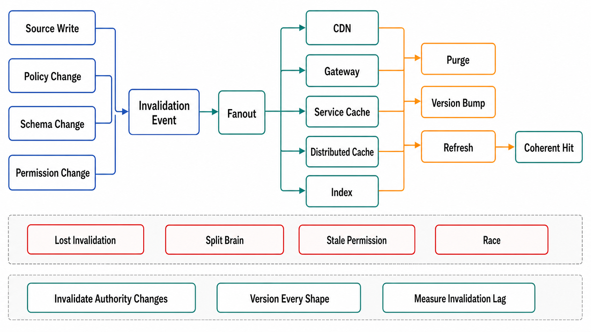

# Invalidation and Coherence



## Abstract

Cache invalidation earned its place in the two-hard-things joke for a specific technical reason: it is a *distributed coherence protocol* that teams attempt to implement as an afterthought — an at-least-once, ordered-enough, complete-enough fan-out from every write to every cache layer holding any key derived from that write, running forever, with its failures invisible by default (a lost invalidation produces no error; it produces a reader believing something false, later). This file makes the protocol explicit. The transport is Chapter 06's machinery — invalidations ride the same CDC/log path as any derived-state maintenance, with Chapter 06 file 02's delivery semantics doing the correctness work (at-least-once delivery + idempotent purges; ordering per key via partitioning) — and the design space is three mechanisms with different guarantees: **purge** (delete the entry; next reader refills — simple, but creates the miss the stampede machinery must absorb), **versioned keys** (writers bump a version that is part of the key; old entries die by unreachability — invalidation without a fan-out, at the cost of version-lookup design), and **write-through/update** (replace the value in place — freshest, but concurrency-hardest: this is where the stale-set race lives, and where Facebook's Memcache leases earn their citation). The file closes with the discipline that separates grown-up deployments from hopeful ones: coherence is *measured*, not assumed — Meta's Polaris treats "cache eventually agrees with the database" as a monitored invariant, the work that took TAO's consistency from six nines to ten ([Meta, "Cache made consistent"](https://engineering.fb.com/2022/06/08/core-infra/cache-made-consistent/)).

## 1. The Pipeline Is a Chapter 06 Consumer

```text
Figure 1. Invalidation as derived-state maintenance. The write path
produces one durable fact; every cache layer is a consumer.

  write ─► store ─► CDC/log (Ch06 f01; Meta's McSqueal shape:
                    invalidations tail the commit log, so a write
                    that commits WILL emit — no dual-write gap,
                    Ch03 f05's outbox argument)
                      │
        ┌─────────────┼──────────────────┐
        v             v                  v
   service cache   CDN purge API     search/derived indexes
   (delete/update) (surrogate keys)  (Ch06 f06's consumers)
        │             │
        └─ ACK/lag monitored per consumer group (Ch06 f03):
           invalidation lag p99 IS the staleness bound of every
           invalidation-based entry class (file 04 §2)
```

Design rules the figure encodes. **Source from the commit log, not the application**: application-emitted invalidations sit on the wrong side of the dual-write problem — a crash between store-commit and cache-purge is a permanent stale entry; tailing the log (CDC) makes emission a consequence of commit. **Deletes are idempotent, so at-least-once is enough**: purge twice, no harm — which is why purge pipelines are *easier* to make correct than update pipelines, and the default recommendation. **Completeness is a mapping problem**: the hard half of invalidation is knowing *which keys* a write touches — a denormalized entry caching a join of five tables must be invalidated by writes to any of them; this key-dependency map is authored per entry class in the dossier (and is exactly the maintenance plan that file 08 formalizes for materialized views — same problem, same map). **Fan-out at CDN scale is a solved purchase**: surrogate keys (tag entries at fill time, purge by tag) plus modern purge propagation — Fastly's gossip design and Cloudflare's instant purge both deliver global invalidation in ~150 ms ([Fastly](https://www.fastly.com/blog/over-a-decade-later-evolution-of-instant-purge), [Cloudflare](https://blog.cloudflare.com/instant-purge/)) — so "the CDN can't invalidate fast enough" is no longer a real constraint; unmapped dependencies are.

## 2. Choosing the Mechanism

| Mechanism | Guarantee | Cost / failure mode | Choose when |
|---|---|---|---|
| Purge (delete) | Next read is fresh (a miss) | Miss storm on hot keys — every purge is a stampede invitation (file 06); simplest to make correct (idempotent) | Default. Hot keys get purge + coalescing/lease protection |
| Versioned key | Old entries unreachable instantly; no fan-out race can serve them | Needs a fast version lookup (itself cached — turtles, but shallow ones); dead entries occupy memory until evicted; version source must be as available as the cache | Fan-out too wide to purge reliably; deploy-scoped versions (schema_v/model_v in key, file 03) get invalidation *for free* on rollout |
| Write-through / in-place update | Readers never see a miss; freshest steady state | The stale-set race (§ below); update value must be constructible outside the origin read path; wrong under concurrent writers unless fenced | Very hot, read-dominant entries where purge-storms are unaffordable (the Memcache/TAO regime) |

**The stale-set race, and leases.** Look-aside update flows interleave: reader A misses, reads value v1 from the store; writer commits v2 and purges; reader A — slow — now writes v1 into the cache, *after* the purge, installing stale data with no TTL rescue if the class runs long backstops. Memcache's fix is the **lease**: the cache hands the missing reader a token; the set is accepted only if no invalidation for that key arrived since the token was issued — stale sets are rejected at the door. The same token, rate-limited per key, doubles as thundering-herd control (one leased filler; the rest wait briefly), which is why the mechanism appears again in file 06 ([Nishtala et al., NSDI 2013](https://www.usenix.org/conference/nsdi13/technical-sessions/presentation/nishtala)). The general lesson generalizes past Memcache: *any* fill-after-read cache write is a stale-set candidate, and the fix is always a fencing token ordered against invalidations (Chapter 03 file 04's fencing argument, at cache speed).

## 3. Coherence Is Measured — the Polaris Discipline

A pipeline that is not monitored converges to broken: every component is at-least-once, but the composition silently drops coverage as entry classes, layers, and dependency edges are added faster than the map is updated. The discipline Meta's Polaris names: run a consumer that *observes the invariant itself* — on each invalidation event, query the cache replicas as a client and verify none still serves the pre-write value past the propagation window; report violations as a rate at fixed timescales. This converts "we think we invalidate correctly" into a measured consistency number — the work that moved TAO's cache consistency from 99.9999% to 99.99999999% — and it is this chapter's model verification pattern (file 10, K1): black-box, invariant-level, continuous, and honest about the difference between the pipeline *running* and the pipeline *working*. The dossier row it produces: per entry class, the measured fraction of reads-after-write that observed stale data beyond the declared bound — the number file 04's contracts are audited against.

## 4. Approval Gates

| Gate | Evidence Required | Failure Condition |
|---|---|---|
| Transport gate | Invalidations sourced from CDC/commit log (or outbox); no bare dual writes; lag per consumer monitored as the staleness bound | Application-emitted purges with a crash window; pipeline lag unmeasured |
| Mapping gate | Key-dependency map per entry class (which writes touch which keys), reviewed on schema/entry-class change | Denormalized entries invalidated on one of five source tables; the map in one engineer's head |
| Mechanism gate | Purge/versioned/write-through chosen per class from the §2 table; hot-key purges paired with file 06 protection; write-through paths lease/fence-protected | Update pipelines with stale-set races; purge storms on hot keys with no coalescing |
| Reach × completeness gate | Every layer holding a class is a pipeline target (file 02 §2's audit); negative entries included (file 03 §3) | "We purge on write" true for one layer or one shape of write |
| Measurement gate | Polaris-class invariant monitoring per class; violation rate reported against the file 04 contract | Coherence asserted from architecture diagrams; staleness bugs found by users |

## Output

The output of this file is an invalidation design that is an explicit coherence protocol: sourced from the commit log so emission is a consequence of commit, mapped completely from writes to dependent keys across every layer that holds them, mechanized per entry class (purge by default, versions for wide fan-out, leased write-through for the hottest reads), and *measured* by invariant-observing monitors — so the two-hard-things joke stops being a design document.

## References

- [Meta Engineering, "Cache made consistent" — Polaris, invalidation tracing, and six-to-ten-nines consistency](https://engineering.fb.com/2022/06/08/core-infra/cache-made-consistent/)
- [Nishtala et al., "Scaling Memcache at Facebook" (NSDI 2013) — leases, McSqueal, regional invalidation](https://www.usenix.org/conference/nsdi13/technical-sessions/presentation/nishtala)
- [Bronson et al., "TAO: Facebook's Distributed Data Store for the Social Graph" (ATC 2013) — write-through graph caching at scale](https://www.usenix.org/conference/atc13/technical-sessions/presentation/bronson)
- [Fastly, "The evolution of instant purge" — surrogate keys and global purge propagation](https://www.fastly.com/blog/over-a-decade-later-evolution-of-instant-purge)
- [Cloudflare, "Instant Purge: invalidating cached content in under 150ms"](https://blog.cloudflare.com/instant-purge/)
