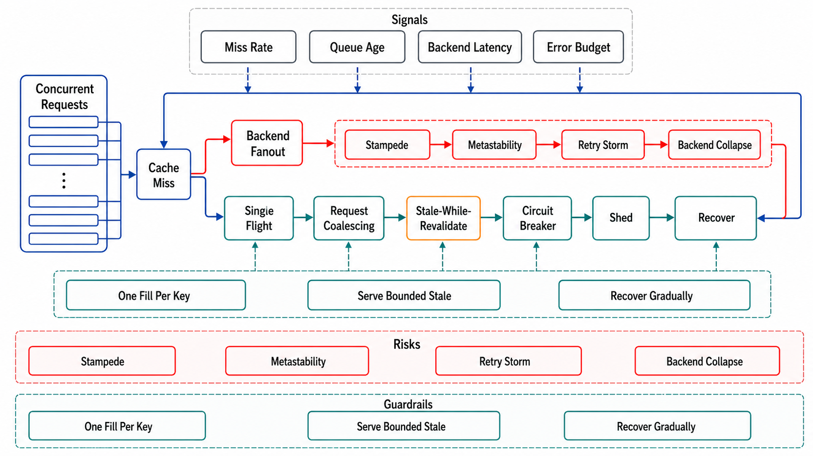

# Stampede, Metastability, and Degraded Modes



## Abstract

This file owns the failure physics of caches: the mechanisms by which a component installed to *reduce* load becomes the amplifier that destroys the system, and the designed modes that prevent it. The unifying model is Brooker's: a cached system has two stable operating loops — the good one (high hits, origin at trickle load) and the bad one (low hits, origin drowning, which keeps latency high, which keeps entries from refilling) — and both are *stable*, which makes cache-driven collapse a **metastable failure**: the trigger can end while the failure sustains itself ([Brooker](https://brooker.co.za/blog/2021/08/27/caches.html); Bronson et al.'s taxonomy names caching as a canonical sustaining effect). The three entry ramps into the bad loop: **expiry stampede** (one hot key expires; every concurrent reader becomes an origin fill — the thundering herd), **mass invalidation** (a deploy, flush, or config change empties keys wholesale — Facebook's 2010 outage is the type specimen: an invalid config value made clients delete the cache key and query the databases in a self-sustaining feedback loop that ended only by turning the site off), and **cold start** (a restarted cache meeting warm-cache-sized traffic — file 01's arithmetic: a fleet at 95% hits presents **20×** provisioned load to the origin on a flush). The countermeasures are layered: request coalescing and leases (collapse concurrent fills to one), probabilistic early expiration (desynchronize expiry itself), TTL jitter (desynchronize mass expiry), warming (never meet full traffic cold), and — the honest last line — *cache-off as a designed, drilled operating mode* rather than a discovered one.

## 1. Collapse the Concurrency: Coalescing and Leases

The stampede's mechanism is concurrency at a miss: N readers observe the same expired key inside one fill latency δ, and an undefended look-aside launches N identical origin queries — N = (per-key request rate) × δ, so a 5k req/s key with an 800 ms fill is **4,000 duplicate queries** per expiry event. Two defenses, one per topology: **in-process/single-owner — request coalescing** (Go's `singleflight` shape: first caller fills, concurrent callers for the same key wait on that one flight and share its result — N→1 by construction); **distributed look-aside — leases** (the cache grants one fill token per key per interval; token holders fill, others briefly wait or serve slightly-stale; the same token fences stale sets, file 05 §2). The production number that ends debate about whether this is worth the complexity: Facebook's lease deployment cut a stampede-prone workload's peak database load from **17k queries/s to 1.3k/s** — 13× — with a 10-second per-key token rate ([NSDI 2013](https://www.usenix.org/conference/nsdi13/technical-sessions/presentation/nishtala)). Review rule: every hot entry class names its coalescing mechanism, and "the origin can absorb it" is a claim tested at the key's *peak* concurrency (drill K3), not its average.

## 2. Desynchronize the Expiry: XFetch and Jitter

Coalescing caps the cost of an expiry event; probabilistic early expiration makes the event itself unlikely. The optimal published policy ([Vattani, Chierichetti, Lowenstein, VLDB 2015](http://www.vldb.org/pvldb/vol8/p886-vattani.pdf)) — **XFetch** — has each reader independently decide to refresh early with probability rising as expiry nears:

```text
Figure 1. XFetch: refresh now iff
    now − δ·β·ln(rand()) ≥ expiry        (rand ∈ (0,1])
  δ = observed recompute/fill time, β ≈ 1 (β>1 refreshes earlier).

Worked: TTL 300 s, fill δ = 2 s, hot key at 1k req/s.
  −ln(rand) has mean 1 → refresh decisions concentrate in the
  final ~δ·β = 2 s before expiry; the first reader in that band
  wins, refreshes in-line, resets TTL — the herd never observes
  an expired key. Cost: refreshes ~2 s of TTL early (0.7% of the
  budget), no coordination, two lines of code at read time.
```

The complementary population-scale defense is **TTL jitter**: identical TTLs assigned at identical times (a deploy warming a fleet, a batch fill) synchronize a future mass expiry — a time-bomb stampede; adding ±10–20% randomness to every TTL spreads the wavefront permanently. Jitter is to caches what Chapter 07 file 03's full jitter is to retries — the same lesson, that synchronized clients are an outage mechanism, applied to expiry clocks.

## 3. The Bad Loop: Cold Starts, Feedback, and Cache-Off as a Mode

```text
Figure 2. The metastable loop, and where each defense cuts it.

   cache empty/cold ──► miss ratio ↑ ──► origin load ↑ (20× at
        ▲                                    95% design hits)
        │                                        │
   entries can't fill ◄── fills time out ◄── origin saturates
        │
   sustaining loops that OUTLIVE the trigger:
     · retries multiply origin load further (Ch07 f03's budget!)
     · errors interpreted as invalid → clients DELETE keys
       (Facebook 2010's exact mechanism)
   cuts: warming (never enter cold) · admission throttle at the
   origin (serve some well, not all badly — Ch01 f08) · retry
   budgets · stale-if-error (file 04 §3) · load-shed to a static
   degraded mode
```

The disciplines. **Warming is a deploy step, not a hope**: load-bearing caches (file 01's verdict) are pre-filled — replayed traffic, snapshot restore, or gradual traffic ramp — before receiving full load; a cache tier restart that meets 100% traffic instantly is a self-inflicted stampede. **The origin's admission control is the loop-breaker**: when the bad loop starts, an origin that sheds to its real capacity and serves *some* fills quickly refills the cache and climbs back to the good loop; an origin that accepts everything and serves all of it slowly keeps fills timing out and the loop closed — this is Chapter 01 file 08's overload contract functioning as cache-recovery machinery. **Fail-static beats fail-closed for config-shaped caches**: the 2010 lesson in one sentence — a client that treats "I can't verify this value" as "delete and re-fetch it" turns every origin hiccup into deletion pressure; last-known-good with bounded age (Chapter 02 file 04's static stability) is the correct posture. **Cache-off is drilled**: the kill-cache drill (K7) — disable the tier in a controlled window, watch the origin either hold (shedding correctly, degraded mode engaging) or buckle at a measured request rate — converts "what happens if we lose Redis" from an incident question into a dossier number with a date.

## 4. Approval Gates

| Gate | Evidence Required | Failure Condition |
|---|---|---|
| Coalescing gate | Per hot entry class: coalescing/lease mechanism named; peak per-key fill concurrency measured (K3) | N-way duplicate fills at expiry; "the origin can take it" untested |
| Desynchronization gate | XFetch (or equivalent) on hot keys; TTL jitter fleet-wide; no synchronized mass-expiry cohorts | Deploy-time synchronized TTLs; time-bomb expiry wavefronts |
| Warming gate | Load-bearing caches have a warming procedure exercised on every restart path (deploy, failover, scale-out) | Cold tiers meeting full traffic; warming as tribal knowledge |
| Loop-breaker gate | Origin admission control + retry budgets verified under bad-loop conditions; fail-static posture for config-shaped entries; stale-if-error wired | Feedback loops that outlive their trigger; error paths that delete keys (the 2010 shape) |
| Cache-off gate | K7 kill-cache drill run against production-shaped load; degraded mode engages; the origin's true no-cache capacity is a written number | "The cache is just an optimization" asserted but never demonstrated; cache-off capacity unknown |

## Output

The output of this file is a cache that cannot take the system down by doing its job badly: fills collapsed to one per key, expiries desynchronized by probability and jitter, restarts warmed, the metastable bad loop cut by origin admission control and fail-static posture, and the cache's absence rehearsed as a designed degraded mode with a measured capacity number instead of a discovered one.

## References

- [Brooker, "Caches, Modes, and Unstable Systems" — the two-loop metastability model](https://brooker.co.za/blog/2021/08/27/caches.html)
- [Bronson et al., "Metastable Failures in Distributed Systems" (HotOS 2021) — caching as a canonical sustaining effect](https://sigops.org/s/conferences/hotos/2021/papers/hotos21-s11-bronson.pdf)
- [Meta Engineering, "More Details on Today's Outage" (2010) — the config/cache feedback-loop postmortem](https://engineering.fb.com/2010/09/23/uncategorized/more-details-on-today-s-outage/)
- [Vattani, Chierichetti, Lowenstein, "Optimal Probabilistic Cache Stampede Prevention" (VLDB 2015) — the XFetch algorithm and its optimality](http://www.vldb.org/pvldb/vol8/p886-vattani.pdf)
- [Nishtala et al., "Scaling Memcache at Facebook" (NSDI 2013) — leases: 17k/s → 1.3k/s under stampede](https://www.usenix.org/conference/nsdi13/technical-sessions/presentation/nishtala)
- [golang.org/x/sync/singleflight — request coalescing as a library primitive](https://pkg.go.dev/golang.org/x/sync/singleflight)
