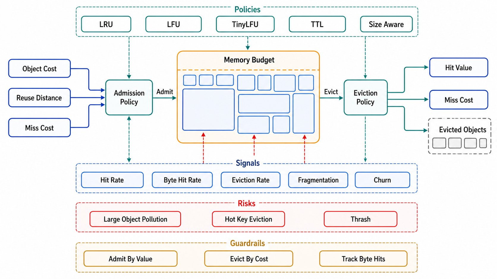

# Eviction, Admission, and Memory Economics



## Abstract

Eviction policy is the cache answering "what deserves this memory?" a million times a second, and the field's production evidence has overturned two comfortable defaults. First, **LRU is not a safe default**: it is scan-vulnerable (one analytical sweep or crawler pass evicts the entire working set in exchange for keys that will never be read again), metadata-heavy, and lock-contended at high concurrency. Second, **admission beats smarter eviction**: TinyLFU's insight is that the highest-leverage decision is at the *door* — whether a newly missed key deserves insertion at all, judged by an approximate frequency sketch against the eviction candidate — which is what lets Caffeine's W-TinyLFU (a small LRU window for burst recency + a frequency-gated main region) approach optimal hit ratios across workload types ([Einziger, Friedman, Manes](https://arxiv.org/abs/1512.00727)). The research frontier has since converged on a striking simplification: **S3-FIFO** ([SOSP 2023](https://dl.acm.org/doi/10.1145/3600006.3613147)) and **SIEVE** ([NSDI 2024](https://www.usenix.org/conference/nsdi24/presentation/zhang-yazhuo)) show that FIFO-family designs with a tiny probationary filter (S3-FIFO) or a single moving eviction hand (SIEVE) beat or match LRU-family policies across thousands of production traces while being simpler *and* more scalable (no per-hit lock; SIEVE cuts FIFO's miss ratio by a mean 21% and is lock-free on hits). Adoption judgment as of mid-2026: production-adopted (Google, VMware, Redpanda, 20+ OSS libraries) and a defensible default for web/object workloads; W-TinyLFU remains the stronger choice where frequency skew is extreme or adversarial scans are likely. The chapter's framing for all of it: the policy exists to spend §1's arithmetic — a 20% miss-ratio reduction *is* a 20% origin-load cut — and its choice is evidence-driven via trace simulation, not fashion-driven.

## 1. What the Workloads Actually Look Like

The design inputs come from measurement, and the two definitive public corpora agree on the shape. Twitter's analysis of 153 production clusters ([OSDI 2020](https://www.usenix.org/conference/osdi20/presentation/yang)) found: many clusters are **write-heavy** (>30% writes — caches used as transient stores, not read accelerators, where eviction policy barely matters and TTL design dominates); object sizes are small and *bimodal* (metadata vs content, arguing for size-aware admission — one 1 MB entry costs a thousand 1 KB hits' worth of memory); popularity is Zipfian but with **bursts and drift** (pure LFU overcommits to yesterday's hot keys; pure LRU overreacts to scans — exactly the tension W-TinyLFU's window and S3-FIFO's small probationary queue both resolve); and TTL, not capacity, bounds many working sets (making *expired-entry harvesting* a first-order memory-efficiency problem — memory held by dead entries is capacity the policy never gets to allocate). CacheLib's experience report ([OSDI 2020](https://www.usenix.org/conference/osdi20/presentation/berg)) adds the consolidation lesson: dozens of specialized caches converge on one engine with per-pool policies, hybrid DRAM+flash tiers for large working sets, and — relevantly for reviews — the observation that most production caches at Facebook run *modest* hit ratios on *enormous* request volumes, where single-point improvements are worth entire clusters of origin capacity.

## 2. The Policy Table and the Frontier

```text
Figure 1. The admission/eviction decision path.

  miss on key k
     │  admission (the door): does k deserve memory AT ALL?
     │    · frequency sketch ≥ victim's? (TinyLFU)
     │    · probationary small queue first (S3-FIFO)
     │    · size-aware: value bytes vs expected reuse
     v
  insert → main region → eviction (the exit):
     · SIEVE hand: skip visited=1 (reset), evict visited=0
     · W-TinyLFU: SLRU main, window for bursts
     · never: unbounded growth "because memory was free"
```

| Policy | Mechanism | Strengths | Costs / when it loses |
|---|---|---|---|
| LRU | Recency list | Familiar; fine at low stakes | Scan-flushed working sets; per-hit lock + list write; 25–40% worse miss ratios on skewed traces |
| W-TinyLFU (Caffeine) | Frequency-sketch admission + windowed SLRU | Near-optimal across workload types; scan-resistant by construction | Sketch + segment complexity; JVM-ecosystem maturity strongest |
| S3-FIFO | Three FIFO queues; small probationary queue filters one-hit wonders | Simple; scalable (FIFO, minimal locking); excels on web traces where most objects are seen once | Wrong for uniformly hot small working sets (filter adds nothing) |
| SIEVE | FIFO + visited bit + moving hand | Simplest of all; lock-free hits; mean 21% miss reduction vs FIFO; turn-key | Not scan-resistant in adversarial cases; young algorithm — watch, but it has NSDI's community award and real adoption |
| TTL-driven (no capacity pressure) | Expiry harvesting dominates | Matches write-heavy/transient clusters (Twitter's finding) | Needs proactive expired-entry reclamation or memory is squatted by the dead |

**The selection discipline is simulation, not taste**: record a production key trace (days, not minutes — drift matters), replay it through candidate policies (libCacheSim-class tooling), and pick on miss ratio × throughput at the deployment's concurrency. This is the chapter's research-frontier standard in action: the S3-FIFO/SIEVE result is recent, peer-reviewed, production-adopted — and *still* enters a dossier through a trace simulation on *this workload*, because both papers' own evidence is that policies differ by workload family.

## 3. Memory Economics and Hot Keys

Two costings close the file. **Price the byte against the miss**: a cache's budget question is `(memory $ per entry-month) vs (misses avoided × origin cost per miss)` — size-aware admission is this arithmetic enforced per entry (the 1 MB object admitted only if its reuse beats the thousand small entries it displaces), TTL ceilings are it enforced over time (an entry idle past its reuse horizon is memory rented for nothing), and DRAM-vs-flash tiering (CacheLib's hybrid model) is it enforced per storage class — flash misses cost more latency but the capacity buys working sets DRAM never could. **Hot keys are a partition problem, not a policy problem**: a single key at 500k req/s exceeds one cache node's NIC/CPU regardless of eviction policy — the fixes are replication of the hot key across nodes (read fan-in division), client-local L1 micro-caches with seconds-long TTLs (file 02's in-process row, deliberately), or key splitting; detection is a standing SLI (per-key top-N by request rate), because hot keys are born from product events (the viral object) faster than capacity reviews run — Chapter 04 file 01's hot-partition analysis, replayed at the cache tier.

## 4. Approval Gates

| Gate | Evidence Required | Failure Condition |
|---|---|---|
| Policy-evidence gate | Policy chosen by trace simulation on this workload's recorded keys; miss ratio restated as origin load (file 01 §3) | Policy by framework default or fashion; hit-ratio deltas dismissed as small when they halve or double origin traffic |
| Admission gate | One-hit-wonder fraction measured; admission mechanism (sketch/probationary/size-aware) for classes where it pays | Every miss inserted; scans and crawls flushing working sets |
| Size/TTL-economics gate | Size-aware admission for bimodal objects; TTL ceilings tied to reuse horizons; expired-entry harvesting verified under memory pressure | Mega-entries displacing working sets; memory squatted by expired-but-unharvested entries |
| Hot-key gate | Per-key top-N SLI standing; hot-key playbook (replicate/L1/split) exercised (K6) | Viral keys saturating single nodes; hot keys discovered by outage |
| Frontier gate | S3-FIFO/SIEVE-class options evaluated with adoption status stated; decision recorded either way | Ignoring five years of eviction research; or adopting it without a trace run |

## Output

The output of this file is an eviction and admission design chosen by evidence: policies selected by trace simulation with miss-ratio deltas priced as origin load, admission filtering at the door where the leverage is, memory spent against explicit byte-vs-miss economics with the dead harvested and the huge scrutinized, and hot keys handled as the partitioning problem they are — with the FIFO-family frontier adopted where this workload's traces endorse it.

## References

- [Einziger, Friedman, Manes, "TinyLFU: A Highly Efficient Cache Admission Policy" — the admission argument](https://arxiv.org/abs/1512.00727)
- [Yang et al., "FIFO Queues are All You Need for Cache Eviction" (SOSP 2023) — S3-FIFO](https://dl.acm.org/doi/10.1145/3600006.3613147)
- [Zhang et al., "SIEVE is Simpler than LRU" (NSDI 2024) — the turn-key eviction frontier](https://www.usenix.org/conference/nsdi24/presentation/zhang-yazhuo)
- [Yang, Yue, Rashmi, "A large scale analysis of hundreds of in-memory cache clusters at Twitter" (OSDI 2020) — the workload evidence](https://www.usenix.org/conference/osdi20/presentation/yang)
- [Berg et al., "The CacheLib Caching Engine: Design and Experiences at Scale" (OSDI 2020) — consolidation and hybrid DRAM/flash](https://www.usenix.org/conference/osdi20/presentation/berg)
- [Brooker, "Why Aren't We SIEVE-ing?" — the practitioner's adoption analysis](https://brooker.co.za/blog/2023/12/15/sieve.html)
