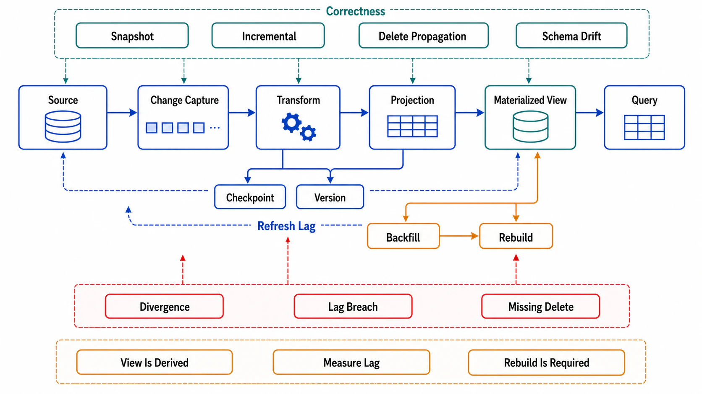

# Materialized Views and Incremental Maintenance



## Abstract

A materialized view is a cache that admits what every cache is: derived state with a *maintenance plan*. Where file 05's caches invalidate and refill on demand, a materialization keeps the derived result continuously computed — which trades the cache's problems (stampedes, cold starts) for a new central contract: **maintenance lag is the staleness bound**, and the maintenance *strategy* is the design decision. The strategies form a ladder: **full refresh** (recompute everything on a schedule — trivially correct, staleness = schedule period, cost grows with base size not change size), **incremental maintenance by hand** (application code updates projections from change events — Chapter 04 file 05's read models and Chapter 06 file 06's stream jobs; flexible, and the birthplace of drift bugs), and **automatic incremental view maintenance (IVM)** — the system derives the incremental program from the query itself. The frontier standard applies: IVM's theory matured decisively with **DBSP** ([VLDB 2023 best paper](https://www.vldb.org/pvldb/vol16/p1601-budiu.pdf)), which gives a compositional algebra turning arbitrary rich queries (joins, aggregation, recursion) into incremental programs whose work is proportional to *change size*, not base size; production engines built on this lineage — Materialize (differential dataflow) and Feldera (DBSP directly) — are real, commercially deployed, and as of mid-2026 the honest adoption judgment is: proven for streaming-analytics and serving-view workloads, still a specialized dependency choice rather than a database default (partial exceptions in mainstream engines remain limited to restricted query classes). Noria's contribution ([OSDI 2018](https://www.usenix.org/conference/osdi18/presentation/gjengset)) completes the design space: *partially stateful* views — materialize only the keys actually read, backfill misses through upqueries — which is precisely the cache/materialization hybrid, and the formal answer to "this view is too big to materialize."

## 1. The Maintenance Ladder and Its Contract

```text
Figure 1. Materialization = the same seven-field contract as file
01, with maintenance strategy determining the freshness row.

  strategy          staleness bound       cost shape
  ─────────────────────────────────────────────────────────
  full refresh      schedule period       O(base) per period
      (nightly aggregate: 24 h stale, correct by rebuild)
  hand-rolled IVM   pipeline lag (Ch06    O(change) + eng. cost of
      f03: monitored)                     the drift class
  automatic IVM     engine lag (ms–s)     O(change), derived
      (DBSP/differential lineage)         correctly BY CONSTRUCTION
  partial (Noria)   lag for hot keys +    O(change ∩ read set) +
                    upquery on cold miss  backfill on demand
  ─────────────────────────────────────────────────────────
  Choose UP the ladder as: freshness budget tightens (file 04),
  change rate ≪ base size, and query complexity makes hand-rolled
  maintenance a proven bug source.
```

The decision inputs are the same numbers as everywhere in this chapter, plus one: **change ratio**. Full refresh costs O(base) per period; incremental costs O(change). A 10 TB base with 0.1% daily change pays 1,000× the necessary compute under daily full refresh — but a small, fast-changing table inverts the arithmetic, and refresh's unbeatable property (staleness resets to zero; drift cannot accumulate) makes it the right bottom rung for small bases and loose budgets. The review asks for the ratio, the freshness budget, and the query complexity — and expects the rung to follow.

## 2. The Drift Problem — Why Hand-Rolled Maintenance Fails Review at Scale

Hand-rolled incremental maintenance is application code re-deriving what a query optimizer knows: which changes affect which outputs. Its systematic failure classes: **missed dependency edges** (the projection joins five tables; the maintenance code subscribes to four — file 05 §1's mapping problem, now producing wrong *values* rather than stale ones), **non-idempotent application of at-least-once deliveries** (Chapter 06 file 02's law violated in the projection updater: a redelivered event double-counts an aggregate), **ordering hazards across partitions** (two events whose effects don't commute applied in log order per partition but interleaved across partitions), and **silent divergence** — the defining one, because a drifted view returns plausible numbers indefinitely. The mandatory countermeasure at any rung below automatic IVM: **reconciliation** — periodically recompute a sample (or the whole view, off-peak) from the base and diff against the materialization, with the divergence rate as a standing SLI (drill K8; this is Polaris's invariant-measurement discipline from file 05 §3 pointed at values instead of staleness). Rebuildability is the other inherited obligation: every materialization declares its rebuild path (replay from the Chapter 06 log, or recompute from base) and its rebuild *duration* — because that duration is the recovery time when drift is detected, and Chapter 06 file 09's replay-runway arithmetic decides whether the log's retention even permits it.

## 3. Automatic IVM and Partial Materialization — the Frontier Rungs

What DBSP-lineage engines change is *who writes the incremental program*: the query is declared once (SQL), and the engine derives the change-propagation circuit with correctness guaranteed by the algebra — eliminating §2's drift classes at their source (the dependency map, idempotence discipline, and operator correctness are the compiler's problem). The honest costs, for the dossier: a new stateful serving dependency with its own capacity/failure model (the engine holds operator state — Chapter 06 file 06's stateful-computation obligations apply verbatim); consistency at the *view boundary* (views lag the base by pipeline latency — the file 04 regime declaration still applies, engine lag monitored as the staleness SLI); and query-class boundaries (recursion, non-monotonic constructs, and exotic aggregates have engine-specific support envelopes — verified per query, not assumed from marketing). Noria's partial materialization answers the remaining economic objection — "the keyspace is too large to materialize" — by keeping the view sparse: materialize what is read, evict what isn't (the cache reflex), and *backfill through upqueries* when a missing key is read (the materialization reflex, replacing the stampede with a bounded recompute). The synthesis this file wants remembered: **look-aside caches and materialized views are the two ends of one design axis** — invalidate-and-refill versus maintain-continuously — and partial materialization is the proof that the axis is continuous; a team operating both a Redis projection *and* a hand-rolled Kafka materializer of the same data is running two points on the axis with two drift surfaces, and should usually be running one.

## 4. Approval Gates

| Gate | Evidence Required | Failure Condition |
|---|---|---|
| Rung gate | Strategy chosen from §1's ladder with change ratio, freshness budget, and query complexity written | Nightly full refresh of a 0.1%-change base; hand-rolled IVM where budgets demanded engine-grade correctness |
| Lag gate | Maintenance lag monitored per view as the staleness SLI, compared against the file 04 budget | Views whose lag is unmeasured; "real-time" claimed, minutes delivered |
| Drift gate | Reconciliation (sampled recompute + diff) standing for every hand-rolled view; divergence rate as SLI (K8) | Silent divergence; correctness argued from code review of the updater |
| Rebuild gate | Rebuild path + measured duration per view; log retention covers replay (Ch06 f07/f09 arithmetic) | Views that cannot be rebuilt; rebuild windows longer than the business tolerates, discovered during the incident |
| Engine gate | Automatic-IVM adoption with the dependency treated as a stateful tier (capacity, failure modes, query-class envelope verified per query) | IVM engine as a magic box; unsupported query constructs discovered in production |

## Output

The output of this file is a materialization design placed deliberately on the cache-to-view axis: a maintenance rung chosen from change ratio and freshness budget, lag measured as the staleness bound, drift made impossible by construction (automatic IVM) or detected by standing reconciliation (everything else), and every view rebuildable within a measured window — so derived serving state is maintained, verified, and recoverable rather than accumulating quiet divergence.

## References

- [Budiu et al., "DBSP: Automatic Incremental View Maintenance for Rich Query Languages" (VLDB 2023, best paper) — the IVM algebra](https://www.vldb.org/pvldb/vol16/p1601-budiu.pdf)
- [Gjengset et al., "Noria: dynamic, partially-stateful data-flow for high-performance web applications" (OSDI 2018) — partial materialization and upqueries](https://www.usenix.org/conference/osdi18/presentation/gjengset)
- [McSherry et al., "Differential Dataflow" (CIDR 2013) — the incremental-computation lineage under Materialize](https://github.com/TimelyDataflow/differential-dataflow)
- [Feldera — the DBSP runtime as a production engine (adoption-status anchor)](https://github.com/feldera/feldera)
