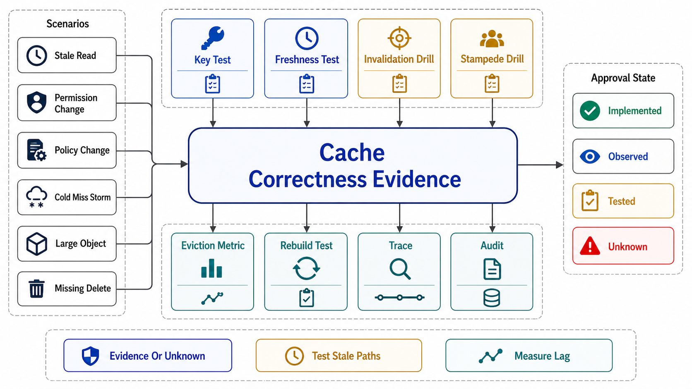

# Verification of Cache Correctness



## Abstract

Cache promises are uniquely easy to believe and uniquely hard to notice breaking: a wrong-scope hit returns 200, a stale read returns plausible data, a drifted view returns numbers, and a load-bearing cache "works" right up to the restart that reveals the origin can't. This file is the chapter's evidence machinery: ten drills (K1–K10) converting each file's gates into falsifiable experiments, the cache SLI set that watches the same promises between drills, and the stamp discipline inherited from Chapter 01 file 11 with this chapter's invalidator — every piece of evidence carries a **cache-generation stamp** `{entry-class contract version, key schema, TTL/freshness config, invalidation pipeline topology, eviction policy + capacity, layer map}`, because a coherence drill passed under last quarter's key schema verified last quarter's cache. Two postures carry over and one is new. From Chapter 07: drills that are cheap in CI (key closure, scope probes) run *standing*. From file 05: coherence and drift are measured by invariant-observing monitors (Polaris-class), continuously — the strongest evidence class this chapter has. New here: several drills are *destructive by design* (kill the cache, flush a layer, stall the pipeline) and therefore run in production-shaped load environments on a calendar — an unrehearsed cache failure mode is a scheduled outage with an unknown date.

## 1. The Drill Catalog

```text
Figure 1. The evidence loop. Standing monitors (K1/K8 continuous,
K4/K5 in CI) re-mint evidence; destructive drills (K2/K3/K7/K9)
are calendar events in load environments; any stamped-field change
resets dependent evidence to assumed-with-expiry.

  monitors ──► evidence {claim, class: observed/tested, date,
      ▲                  cache-generation stamp}
      │                          │ stamp field changes (key schema,
      │                          │ pipeline topology, policy, layers)
      │                          v
      └── re-mint            reset → assumed (expiry set)
```

| Drill | Hypothesis under test | Procedure / fault injected | Pass condition | Cadence |
|---|---|---|---|---|
| K1 Coherence | Invalidation delivers freshness within the declared bound (file 05) | Polaris-class monitor: on each invalidation, probe all layers/replicas for the pre-write value past the propagation window | Violation rate within the file 04 contract per entry class | Standing, continuous |
| K2 Staleness envelope | Age-at-serve stays within budget incl. SWR/stale-if-error windows (file 04) | Measure age-at-serve distribution; stall the pipeline deliberately; kill the origin briefly | Backstop TTL bounds staleness during stall; stale-if-error engages within its window; budgets hold at p99 | Monthly stall + standing measurement |
| K3 Stampede | Hot-key expiry cannot herd the origin (file 06 §1–2) | Force-expire the hottest keys at peak concurrency; disable-and-observe coalescing in a load env | Fill concurrency collapses to ~1 per key; origin load bounded; XFetch/jitter visible in refresh timing | Quarterly, load environment |
| K4 Key closure | No output-varying dimension is missing from the key (file 03 §1) | Property test: request pairs differing in exactly one candidate dimension replayed against the cache path | Zero cross-variant serves across the dimension matrix | Standing, CI |
| K5 Scope probe | No cross-tenant/cross-role cache hits (file 03 §2) | C8's sibling: tenant-A/role-X credentials replay tenant-B/role-Y's exact requests against *cache-served* paths | Zero cross-scope hits; privileged-fill entries keyed by visibility class | Standing, synthetic + per release |
| K6 Hot key | The hot-key playbook works at viral load (file 07 §3) | Synthesize a single-key hotspot at N× the top production key's rate | Detection SLI fires; replication/L1/split engages; no single-node saturation | Semi-annual, load environment |
| K7 Kill-cache | The system survives the cache's absence (files 01/06) | Disable the cache tier in a controlled window against production-shaped load | Origin sheds to real capacity; degraded mode engages; recovery re-warms without entering the bad loop; no-cache capacity recorded | Quarterly, game day |
| K8 Drift | Materializations agree with their base (file 08 §2) | Sampled recompute-and-diff per view; full off-peak reconciliation where feasible | Divergence rate ≈ 0 within the declared tolerance; detected drift triggers the rebuild path within its measured window | Standing (sampled) + scheduled (full) |
| K9 Cold start | Warming prevents the 20× cold-origin event (file 06 §3) | Restart/flush a load-bearing cache node/tier with warming enabled; once, in a load env, with warming disabled to measure the counterfactual | Warmed path meets traffic within origin capacity; the unwarmed counterfactual number is on file | Per warming-procedure change + annual |
| K10 AI cache honesty | Version closure and approximate-cache FP hold (file 09) | Deploy a model/tokenizer/encoder/policy version bump; shadow-sample semantic-cache hits against fresh executions | Zero cross-version KV/embedding hits post-deploy; semantic FP rate within its declared bound; guardrail caches purge on policy deploy | Per model-class deploy + standing shadow sampling |

## 2. The Cache SLI Set

| SLI | Definition | What it catches |
|---|---|---|
| Miss ratio + derivative, per entry class | 1 − hits/requests, trended | File 01 §3's argument as a dashboard: the 1-point drift that doubles origin load |
| Origin load multiplier | Origin request rate ÷ what full-traffic-no-cache would be | The load-bearing verdict, watched continuously |
| Age-at-serve distribution | Entry age at serve time, p50/p99 per class | K2 between drills; budget erosion; pipelines silently degrading |
| Invalidation pipeline lag + liveness | Event-to-purge latency per layer; heartbeat | The file 04 regime question ("would you notice?") answered permanently |
| Coherence violation rate | K1's monitor output per class | The Polaris number; the difference between running and working |
| Negative-hit ratio | Negative-entry hits ÷ requests, per class | Enumeration attacks and creation-invisibility bugs (file 03 §3) |
| Per-key top-N heat | Request rate of hottest keys | Viral keys before they saturate a node (K6's trigger) |
| Fill concurrency per key | Concurrent origin fills for the same key, max | Coalescing regressions — the K3 property, watched not assumed |
| View maintenance lag + divergence | Per materialization: lag vs budget; K8's diff rate | Drift and lag, the two ways a view lies |
| Prefix-hit rate + TTFT split (AI) | KV/prompt-cache hit rate; TTFT distribution per hit/miss | File 09's bimodality; cache regressions appearing as "the model got slower" |

The inherited design rule: alert on *ratios and derivatives* (miss-ratio slope, lag trend, multiplier drift), slice per entry class and tenant before averaging — and one addition for this chapter: **every cache SLI dashboard states the entry class's declared contract next to the measurement**, because a staleness graph without its budget line is data, not verification.

## 3. Evidence Classes and the Cache-Generation Stamp

Chapter 01 file 11's taxonomy — *tested* (a drill, dated), *observed* (standing monitor over a stated window), *assumed* (declared, expiring) — with this chapter's stamp: `{contract: entry-class table version (file 01 §2); keys: key schema + normalization spec; freshness: TTL/SWR config generation; pipeline: invalidation topology + consumer set; policy: eviction/admission config + capacity; layers: the file 02 map}`. Reset rules: a key-schema change invalidates K4/K5 evidence; a pipeline topology change invalidates K1/K2; an eviction policy or capacity change invalidates K3/K6/K9; a layer added to the map resets *everything for classes it serves*, because composition (file 02 §2) is recomputed. The standing monitors make the discipline affordable: K1/K8's continuous evidence never goes stale for as long as the stamp holds, which is precisely why they, not the calendar drills, are the chapter's evidentiary backbone.

## 4. Approval Gates

| Gate | Evidence Required | Failure Condition |
|---|---|---|
| Coverage gate | K1–K10 mapped to every entry class and view in the dossier; gaps declared *assumed* with expiry | Caches with no falsifying drill; "the cache has always worked" |
| Monitor-first gate | K1 coherence and K8 drift running as standing monitors, not calendar promises | Coherence verified twice a year against a pipeline that changes weekly |
| Destructive-drill gate | K3/K7/K9 executed in production-shaped load environments; the kill-cache and cold-start numbers on file, dated | Load-bearing caches whose absence has never been rehearsed; warming verified only in staging at 1% load |
| Stamp gate | Evidence carries the cache-generation stamp; stamped-field changes reset dependent evidence; the dossier refuses stale stamps | Drills cited from before the key-schema migration |
| Budget-line gate | Every SLI dashboard shows the declared contract beside the measurement | Staleness graphs without budget lines; hit ratios without origin-load restatement |

## Output

The output of this file is the chapter's evidence base: ten drills spanning coherence, staleness, stampedes, key closure, scope, heat, absence, drift, cold starts, and AI version-honesty — the continuous ones standing as monitors, the destructive ones rehearsed against production-shaped load — bound to a stamp discipline that retires evidence the moment the cache it proved stops existing.

## References

- [Meta Engineering, "Cache made consistent" — the invariant-monitoring pattern K1 generalizes](https://engineering.fb.com/2022/06/08/core-infra/cache-made-consistent/)
- [Principles of Chaos Engineering — hypothesis-driven fault injection (K2/K3/K7/K9's method)](https://principlesofchaos.org/)
- [Google SRE Workbook — implementing SLOs (the budget-line discipline)](https://sre.google/workbook/implementing-slos/)
- [Brooker, "Caches, Modes, and Unstable Systems" — why the destructive drills are non-optional](https://brooker.co.za/blog/2021/08/27/caches.html)
