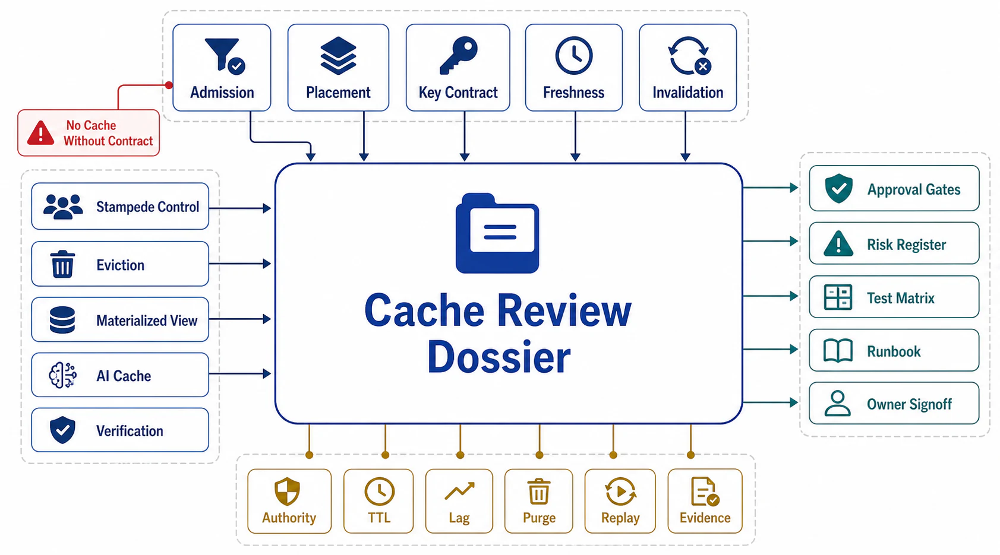

# Cache Review Templates



## Abstract

This file assembles the chapter into its executable form: the dossier a team completes to put a cache design — admission verdict to eviction policy to kill-cache number — in front of an architecture review, and the checklist the reviewer walks to approve it. The organizing principle is the chapter's root thesis made procedural: a cache has behavior in seven dimensions whether or not anyone designed it, so every dossier section forces a written answer where the default would otherwise decide — is this cache even the right tool, what exactly is in the key, how stale is legal end-to-end, what retires an entry at every layer holding it, what happens at expiry under concurrency, what deserves the memory, and what happens when the whole tier disappears. Evidence citations must satisfy file 10's stamp discipline: dated, cache-generation-stamped, standing where monitors can carry them, and rehearsed where only a game day can.

## 1. Dossier Assembly

```text
Figure 1. Dossier assembly: each section is produced by one file's
gates; the checklist consumes the whole.

  f01 ─► §A admission & contracts    f06 ─► §F failure modes
  f02 ─► §B layer map & composition  f07 ─► §G eviction & memory
  f03 ─► §C key design               f08 ─► §H materializations
  f04 ─► §D freshness contracts      f09 ─► §I AI cache classes
  f05 ─► §E invalidation protocol    f10 ─► §J evidence ledger
                     │
                     v
        reviewer checklist (§3) ─► approve design / findings
```

## 2. The Cache Surface Dossier

**§A Admission and contracts (file 01).** The §1 verdict per entry class, including the no-cache verdicts and their routing. The seven-field contract table per admitted class. The load-bearing declaration where it applies, with its consequences accepted (warming, drills, capacity numbers). Every hit-ratio figure restated as miss ratio and origin-load multiplier.

**§B Layer map and composition (file 02).** The entry class × layer matrix with the placement rule applied. The end-to-end staleness sum per class against its budget; per-layer TTLs shown as derived. Invalidation reach per layer. Which-layer-served-this attribution demonstrated in headers and traces. `Cache-Control`/`ETag`/`Vary` in the contract artifact.

**§C Key design (file 03).** Per class: the keyed-dimension list with the varying-inputs analysis; the normalization/whitelist spec with cardinality estimate; scope dimensions traced to credentials; the privileged-fill analysis; negative-entry decisions with their TTLs and creation-purge wiring. K4/K5 standing.

**§D Freshness contracts (file 04).** Reader tolerance T per class, with product owner. The regime classification (TTL-bounded vs invalidation-based) and the answered pipeline-stops question: finite backstop + monitored lag. Split-reader classes separated. SWR/stale-if-error windows in the staleness sum. Age-at-serve measured against budget.

**§E Invalidation protocol (file 05).** Transport: CDC/log-sourced, no bare dual writes. The key-dependency map per class, current. Mechanism per class from the §2 table; leases/fencing on write-through paths; hot-key purges paired with protection. Reach × completeness audit. The K1 coherence number per class.

**§F Failure modes (file 06).** Coalescing mechanism per hot class with measured peak fill concurrency. XFetch/jitter deployment. Warming procedures per restart path. The loop-breaker analysis: origin admission control, retry budgets, fail-static posture for config-shaped entries. The kill-cache (K7) and cold-start (K9) numbers, dated.

**§G Eviction and memory (file 07).** Policy per pool with the trace-simulation evidence. One-hit-wonder fraction and the admission mechanism where it pays. Size-aware admission for bimodal objects; TTL ceilings tied to reuse horizons; expired-entry harvesting verified. Hot-key SLI and playbook. The frontier evaluation (S3-FIFO/SIEVE-class) recorded either way.

**§H Materializations (file 08).** Per view: the ladder rung with change ratio, freshness budget, and query complexity; maintenance lag SLI against budget; reconciliation (K8) standing with divergence rate; rebuild path with measured duration and retention arithmetic; IVM engines treated as stateful tiers with query-class envelopes verified.

**§I AI cache classes (file 09).** Prefix-hit rate and hit/miss TTFT split; prompt structure ordered for prefix stability; provider cache economics. Version closure per class (model/tokenizer/template/encoder/policy) with deploy-invalidation shown. The semantic-cache ladder position; if present: shadow-sampled FP rate, tenant scope, product sign-off. Re-embedding campaign plans priced.

**§J Evidence ledger (file 10).** K1–K10 status per entry class and view: date, result, cache-generation stamp; standing monitors identified with their dashboards; destructive drills with their game-day records; gaps as *assumed* with expiry; every SLI dashboard showing its budget line.

## 3. Reviewer Checklist

| # | Check | Source gate | Common failure it catches |
|---:|---|---|---|
| 1 | Admission verdict written per entry class; no-cache verdicts respected on strong-consistency paths | f01 admission | Cache by reflex; consistency silently downgraded by a TTL |
| 2 | Seven-field contract complete per class | f01 contract | "Default" in a correctness dimension |
| 3 | Load-bearing caches declared as infrastructure with the consequences accepted | f01 load-bearing | Origin sized assuming the hit ratio, cache treated as optional |
| 4 | Hit ratios restated as miss ratio + origin-load multiplier | f01 arithmetic | The 1-point drift that doubles origin load, celebrated as 99% |
| 5 | Placement per the layer rule; no per-user data at shared layers | f02 placement | The same object cached four times; privacy at the CDN |
| 6 | End-to-end staleness sum ≤ budget; TTLs derived, not chosen | f02 composition + f04 derivation | 95 real seconds behind a 60-second dashboard; folkloric TTLs |
| 7 | Invalidation reach audited per layer; uncovered layers carry the honest TTL bound | f02 reach + f05 completeness | "We purge on write" true at one layer of six |
| 8 | Layer attribution observable on every cached response | f02 attribution | Six-way-ambiguous incident forensics |
| 9 | Key closure property-tested (K4); normalization whitelist with cardinality estimate | f03 closure | The dimension that varies output but not the key; UTM cache-busters |
| 10 | Scope from credentials; K5 cross-tenant/role probe standing and clean | f03 scope | Cache-served BOLA; privileged fills replayed to unprivileged viewers |
| 11 | Negative entries deliberate: short separate TTLs, creation-purge, negative-hit SLI | f03 negative | Created objects invisible behind tombstones |
| 12 | Regime classified per class; pipeline-stops question answered (finite backstop + monitored lag) | f04 regime | Invalidation-based caches with infinite backstops and no liveness alarm |
| 13 | Invalidations sourced from CDC/log; dependency map current; mechanism chosen per class | f05 transport + mapping + mechanism | Dual-write purge gaps; joins invalidated on four tables of five |
| 14 | Write-through paths lease/fence-protected against stale sets | f05 stale-set | The slow reader installing v1 after v2's purge |
| 15 | Coherence measured (K1) per class against the contract | f05 measurement | Pipeline running ≠ pipeline working |
| 16 | Hot classes coalesced/leased with measured peak fill concurrency (K3); XFetch/jitter on hot keys and fleets | f06 coalescing + desync | 4,000 duplicate fills per expiry; deploy-synchronized TTL time bombs |
| 17 | Warming on every restart path; kill-cache and cold-start numbers on file (K7/K9) | f06 warming + cache-off | The 20× cold-origin event, unrehearsed |
| 18 | Loop-breakers verified: origin admission control, retry budgets, fail-static config posture | f06 loop-breaker | The 2010 feedback shape: errors deleting keys under load |
| 19 | Eviction policy chosen by trace simulation; admission where one-hit-wonders warrant; frontier evaluated | f07 evidence + frontier | Policy by fashion; scans flushing working sets |
| 20 | Memory economics enforced: size-aware admission, TTL ceilings, expired harvesting; hot-key playbook drilled (K6) | f07 economics + hot-key | Mega-entries displacing working sets; viral keys saturating nodes |
| 21 | Views on a chosen ladder rung; lag + divergence (K8) measured; rebuild within retention | f08 all | Silent drift; views nobody can rebuild |
| 22 | AI version closure (K10); semantic ladder honored with FP SLI and tenant scope; KV economics measured | f09 all | Cross-version KV reuse; unmeasured semantic wrongness; bimodal TTFT hidden |
| 23 | Evidence ledger current: stamps valid, monitors standing, destructive drills dated, budget lines on dashboards | f10 all | Coherence verified against last quarter's key schema |

## 4. Approval Statement

Approval of a cache dossier asserts: every cached byte exists under an admission verdict, a complete correctness contract, a derived staleness budget, a mapped and measured invalidation protocol, engineered failure modes with rehearsed absence, evidence-chosen eviction, and version-closed AI classes — all evidence-backed under valid stamps. It asserts *nothing* about the storage engines beneath (Chapter 04), the log transporting invalidations (Chapter 06), the API contracts whose responses are cached (Chapter 07), or the GPU serving internals behind KV state (Chapter 10) — those approvals are prerequisites, cited by reference, never re-argued here.

## Output

The output of this file — and the chapter — is an executable review instrument: a ten-section dossier that forces every dimension a cache has behavior in into a written decision, and a twenty-three-point checklist that converts this chapter's gates into findings a review can actually produce.

## References

- [Chapter 08 file map — the approval dependency graph this dossier assembles](00-chapter-file-map.md)
- [Chapter 01 file 11 — evidence classification the ledger inherits](../01-architectural-objective-and-system-boundary/11-evidence-classification-and-architecture-review.md)
- [Google SRE Book — the launch-review discipline this template's checklist form follows](https://sre.google/sre-book/reliable-product-launches/)
