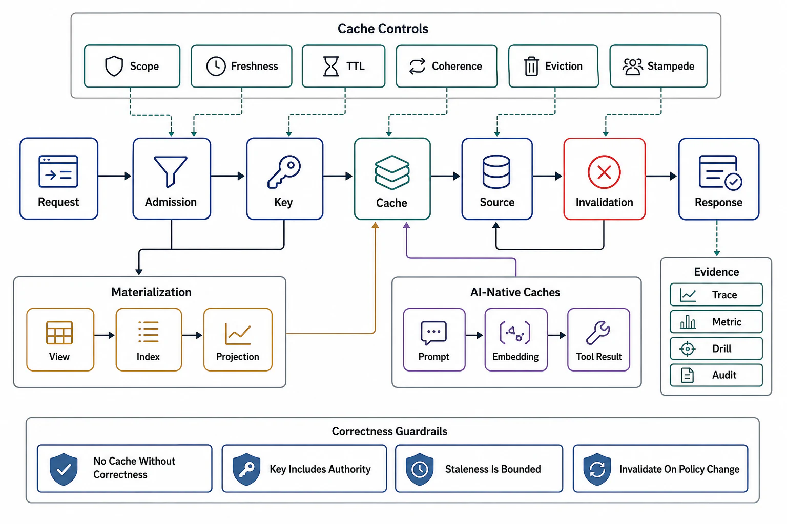

# Chapter 08 — Caching, Materialization, and Invalidation

## Abstract

This chapter's claim is that a cache is never an implementation detail: it is derived state making a consistency promise, occupying memory with an economic argument, and holding up an origin that may no longer survive without it — and all three facts are routinely left undesigned because the cache "worked" the day it was added. The chapter builds the discipline in layers: an admission decision that names when caching is the wrong tool; a seven-field correctness contract per entry class; a placement theory with the composition law (staleness *adds* across layers, origin protection *multiplies*); key construction as referential transparency with tenancy and authorization inside the closure; TTLs derived from written reader tolerances rather than folklore; invalidation as an explicit, log-sourced, *measured* coherence protocol; stampede and metastability physics with the cold-cache arithmetic that turns "just an optimization" into a 20× origin event; eviction chosen by trace evidence with the FIFO-family research frontier weighed honestly; materialized views as caches with maintenance plans on the refresh-to-IVM ladder; and the AI-native classes — KV/prefix, semantic, embedding, verdict — where the cached bytes are the most expensive in the industry and version closure is existential. Hit ratio appears in this chapter only in restated form: as a miss ratio, with an origin-load consequence.

## Chapter Structure

| File | Claim it carries |
|---|---|
| [00-chapter-file-map.md](00-chapter-file-map.md) | Reading order, approval dependency graph, prerequisites from Chapters 01–07 |
| [01-the-cache-admission-decision-and-correctness-model.md](01-the-cache-admission-decision-and-correctness-model.md) | When a cache is the wrong tool; the seven-field contract; miss-ratio arithmetic (99→98% = 2× origin load) |
| [02-cache-placement-and-the-layer-topology.md](02-cache-placement-and-the-layer-topology.md) | The layer ladder; the composition law (staleness adds, protection multiplies); RFC 9111 as contract surface |
| [03-key-construction-scope-and-variance.md](03-key-construction-scope-and-variance.md) | Key = normalized input closure; tenancy/authz in the key; `Vary`; negative caching |
| [04-freshness-ttl-and-staleness-contracts.md](04-freshness-ttl-and-staleness-contracts.md) | TTLs derived from written reader tolerance; the two freshness regimes; SWR/stale-if-error as bounded contracts |
| [05-invalidation-and-coherence.md](05-invalidation-and-coherence.md) | Log-sourced invalidation; purge vs versioned keys vs leased write-through; coherence measured (Polaris) |
| [06-stampede-metastability-and-degraded-modes.md](06-stampede-metastability-and-degraded-modes.md) | Herds, XFetch, jitter, warming, the metastable bad loop, cache-off as a drilled mode |
| [07-eviction-admission-and-memory-economics.md](07-eviction-admission-and-memory-economics.md) | Admission beats eviction; S3-FIFO/SIEVE frontier with adoption judgment; hot keys; byte-vs-miss economics |
| [08-materialized-views-and-incremental-maintenance.md](08-materialized-views-and-incremental-maintenance.md) | The refresh→hand-rolled→IVM→partial ladder; lag as staleness; drift reconciliation; DBSP frontier |
| [09-ai-native-caching.md](09-ai-native-caching.md) | KV/prefix cache economics; semantic caching's false-positive SLI; version closure as law |
| [10-verification-of-cache-correctness.md](10-verification-of-cache-correctness.md) | Drills K1–K10; the cache SLI set; cache-generation evidence stamps |
| [11-cache-review-templates.md](11-cache-review-templates.md) | The ten-section dossier and 23-point reviewer checklist |

## Source Corpus

| Source | What this chapter takes from it |
|---|---|
| [Nishtala et al., "Scaling Memcache at Facebook" (NSDI 2013)](https://www.usenix.org/conference/nsdi13/technical-sessions/presentation/nishtala) | Leases (stale sets + herds, 17k→1.3k q/s), McSqueal log-sourced invalidation, regional layering |
| [Meta, "Cache made consistent" (2022)](https://engineering.fb.com/2022/06/08/core-infra/cache-made-consistent/) | Polaris invariant monitoring; consistency as a measured number (six→ten nines) |
| [Bronson et al., "TAO" (ATC 2013)](https://www.usenix.org/conference/atc13/technical-sessions/presentation/bronson) | Write-through graph caching; read-optimized coherence at scale |
| [Vattani et al., "Optimal Probabilistic Cache Stampede Prevention" (VLDB 2015)](http://www.vldb.org/pvldb/vol8/p886-vattani.pdf) | XFetch: the optimal early-expiration policy, with its formula |
| [Brooker, "Caches, Modes, and Unstable Systems"](https://brooker.co.za/blog/2021/08/27/caches.html) | The two-loop metastability model; load-bearing caches as modes |
| [Bronson et al., "Metastable Failures in Distributed Systems" (HotOS 2021)](https://sigops.org/s/conferences/hotos/2021/papers/hotos21-s11-bronson.pdf) | Caching as a canonical sustaining effect |
| [Meta, 2010 outage postmortem](https://engineering.fb.com/2010/09/23/uncategorized/more-details-on-today-s-outage/) | The config/cache feedback loop; fail-static over delete-and-refetch |
| [Einziger et al., "TinyLFU" ](https://arxiv.org/abs/1512.00727) | Admission as the leverage point; W-TinyLFU |
| [Yang et al., "FIFO Queues are All You Need" (SOSP 2023)](https://dl.acm.org/doi/10.1145/3600006.3613147) + [Zhang et al., "SIEVE" (NSDI 2024)](https://www.usenix.org/conference/nsdi24/presentation/zhang-yazhuo) | The eviction research frontier, with production adoption status |
| [Yang, Yue, Rashmi, Twitter cache analysis (OSDI 2020)](https://www.usenix.org/conference/osdi20/presentation/yang) + [Berg et al., "CacheLib" (OSDI 2020)](https://www.usenix.org/conference/osdi20/presentation/berg) | Workload evidence: write-heavy clusters, bimodal sizes, TTL-bound working sets; consolidation + hybrid tiers |
| [RFC 9111](https://www.rfc-editor.org/rfc/rfc9111.html) + [RFC 5861](https://www.rfc-editor.org/rfc/rfc5861.html) + [RFC 2308](https://www.rfc-editor.org/rfc/rfc2308.html) | HTTP caching semantics; SWR/stale-if-error; negative caching |
| [Fastly](https://www.fastly.com/blog/over-a-decade-later-evolution-of-instant-purge) + [Cloudflare instant purge](https://blog.cloudflare.com/instant-purge/) | Surrogate keys; ~150 ms global purge — invalidation reach as a solved purchase |
| [Budiu et al., "DBSP" (VLDB 2023)](https://www.vldb.org/pvldb/vol16/p1601-budiu.pdf) + [Gjengset et al., "Noria" (OSDI 2018)](https://www.usenix.org/conference/osdi18/presentation/gjengset) | Automatic IVM's algebra; partial materialization — the cache/view synthesis |
| [Qin et al., "Mooncake" (FAST 2025)](https://www.usenix.org/system/files/fast25-qin.pdf) + [vLLM prefix caching](https://docs.vllm.ai/en/latest/design/prefix_caching.html) | KVCache-centric serving (59–498% capacity); default-on prefix caching (verified status) |

## Chapter Standards

1. Research-note structure per file: Abstract → numbered sections with formal models → ASCII figures ("Figure N.") → decision tables → approval gates → Output → verified primary-source references.
2. A cache is admitted per entry class by a written verdict, including the no-cache verdicts.
3. The seven-field contract exists per entry class; "default" is not a value.
4. Every hit-ratio number is restated as a miss ratio with an origin-load consequence.
5. Staleness composes: the end-to-end sum is computed per class and compared against a written reader tolerance; TTLs are derived, never chosen.
6. Keys are normalized closures; tenancy and authorization live inside them, sourced from credentials, verified by standing probes.
7. Invalidation is log-sourced, dependency-mapped, mechanism-chosen per class, and *measured* — coherence is a number, not an architecture diagram.
8. Every hot class names its coalescing mechanism; every fleet jitters its TTLs; every load-bearing cache warms, and its absence is a rehearsed number.
9. Eviction is chosen by trace simulation; the research frontier (≤3-year-old peer-reviewed work) is evaluated with an explicit adoption-status judgment — the standard this chapter introduces for all subsequent chapters.
10. Composition laws (how the chapter's machinery compounds across layers/systems) are stated with algebra and a worked number — also introduced here as a standing standard.
11. Materializations sit on a declared maintenance rung with lag, drift reconciliation, and a rebuild path measured against log retention.
12. The AI instantiation is load-bearing, not decorative: KV/prefix economics, semantic false-positive SLIs, and version closure as law (file 09).
13. Every stated law/formula carries at least one worked numeric example (2× origin load, 20× cold start, 95 s composition, 4,000-fill herds, XFetch's band, 13× lease reduction).
14. The when-NOT-to-use decision is first-class (file 01 §1's admission table).
15. Version-status claims are search-verified at write time and stated inline (vLLM V1 default-on APC; S3-FIFO/SIEVE production adoption; Mooncake FAST 2025; DBSP/Feldera/Materialize maturity).
16. Verification is drills + standing monitors + stamps (file 10): coherence and drift are monitored continuously; destructive drills are calendar events with dated numbers.
17. The chapter approves caching decisions only; storage engines, the log, API contracts, and GPU internals are cited prerequisites (file 11 §4).

## Chapter Completion Gate

The chapter is complete for a given system only when its review can answer:

1. For which entry classes was caching *rejected*, and where did those paths route instead?
2. What are the seven fields for every admitted entry class?
3. What is the end-to-end staleness sum per class, and whose written tolerance does it satisfy?
4. What exactly is in each key, what was normalized out, and when did the closure property test (K4) and scope probe (K5) last pass?
5. Which freshness regime is each class in, and if the invalidation pipeline silently stopped — what bounds staleness, and which alarm fires?
6. What is the measured coherence violation rate (K1), and how does it compare to the declared contract?
7. What happens when the hottest key expires at peak concurrency (K3), and when the whole tier disappears (K7) — as dated numbers, not beliefs?
8. What evidence chose the eviction policy, and what did the frontier evaluation conclude?
9. For every materialized view: which rung, what lag, what divergence rate, and how long does a rebuild take against what retention?
10. For the AI classes: what is the prefix-hit rate and TTFT split, where is every model-class version in the keys, and what is the semantic cache's measured false-positive rate — or is there honestly no semantic cache?

## Final Position

A cache is a promise made on the origin's behalf — about freshness, about scope, about surviving its own absence — and this chapter's machinery exists to make every one of those promises written, derived, measured, and rehearsed. The seam forward: caches defend origins one entry at a time, but the system's last line of defense is what happens when work *arrives* faster than any layer can absorb it — Chapter 09 turns to scheduling, queues, and resource admission, where the requests this chapter's misses generate meet the queue depths, priorities, and admission controls that decide who waits, who degrades, and who is refused.

## References

- [Nishtala et al., "Scaling Memcache at Facebook" (NSDI 2013)](https://www.usenix.org/conference/nsdi13/technical-sessions/presentation/nishtala)
- [Meta Engineering, "Cache made consistent" (2022)](https://engineering.fb.com/2022/06/08/core-infra/cache-made-consistent/)
- [Brooker, "Caches, Modes, and Unstable Systems"](https://brooker.co.za/blog/2021/08/27/caches.html)
- [RFC 9111 — HTTP Caching](https://www.rfc-editor.org/rfc/rfc9111.html)
