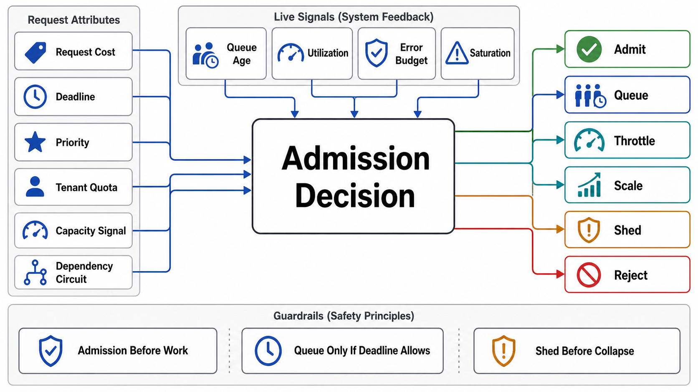

# The Admission Decision — Queue, Shed, or Scale



## Abstract

When offered load exceeds capacity, a system has exactly four honest responses — **queue** it (accept latency now for completion later), **shed** it (reject cheaply and immediately), **scale** (buy capacity, on some lag), or **backpressure** (make the *producer* slow down, Chapter 06 file 04's contract) — and one dishonest one: accept the work into an unbounded buffer and let physics choose among timeout, memory exhaustion, and collapse. This chapter's root claim is that the choice among the four is a *per-work-class design decision with arithmetic behind it*, and this file owns that decision. Its objective function is **goodput** — work completed within its usefulness window — not throughput: a server processing 10k req/s of requests whose callers timed out three seconds ago has throughput and zero goodput, and most overload collapses are exactly this state sustained (Google's overload chapter and the metastability literature agree on the mechanism: past saturation, throughput *degrades* as resources shift from serving to churning — [SRE, "Handling Overload"](https://sre.google/sre-book/handling-overload/)). The queue's admission test is the sharpest of the four: a queue is *only* correct for work that is **deferrable** — whose value survives the wait — and whose arrival excess is **transient** relative to drain capacity; a queue absorbing a *sustained* λ > μ is not buffering, it is a slow-motion outage with a growth rate (file 08's arithmetic), and no discipline, priority, or size limit changes that.

## 1. The Decision Table

| Situation | Verdict | Reason / the arithmetic that decides |
|---|---|---|
| Caller is waiting synchronously (request/response, Ch07's shapes) | **Shed over queue** — bounded, tiny queue at most | Queued wait is added latency the caller's deadline must absorb; past ~the deadline's headroom, queuing converts timeouts into wasted work. Rejection costs 100× less than execution (Ch07 f02 §2) |
| Work is deferrable (email, exports, reprocessing, LRO bodies — Ch07 f09's `202` path) | **Queue** — bounded, with a drain-time contract | The value survives the wait; the queue's size bound = (max acceptable delivery delay) × (drain rate μ−λ headroom), file 08 |
| Excess is sustained (λ > μ for longer than the queue's delay contract) | **Scale, or shed at intake** — the queue cannot help | A queue delays the moment of insufficiency; it does not add capacity. Autoscaling lag (minutes) must be bridged by shedding, not buffering |
| Producer is internal and elastic (stream consumers, batch jobs) | **Backpressure** (Ch06 f04) | Slowing the source is cheaper than storing its output; flow control beats buffering when the producer can wait |
| Load is a self-inflicted multiplier (retry storm, cold cache, stampede) | **Fix the multiplier** (Ch07 f03 budgets, Ch08 f06) | Admission machinery that absorbs amplified load hides the amplifier; the fix is upstream of this chapter |
| Work classes with incompatible latency needs share one queue | **Split the queues** | One queue has one drain order; mixing interactive and batch in it gives batch's backlog to interactive's callers (file 06's head-of-line argument) |

Two verdicts deserve their capitals. **An unbounded queue is never a design** — it is the decision *not* to decide, deferred to the memory allocator; every queue in the dossier carries a bound and a full-queue behavior (shed newest, shed oldest, backpressure — chosen, not defaulted). And **"we'll autoscale" is an answer about minutes, not milliseconds**: between the load step and the capacity arriving, the only choices are shed, degrade, or collapse — the scaling policy is part of the admission design only when its lag is stated and bridged.

## 2. Goodput and the Overload Objective

```text
Figure 1. The goodput curve is the chapter's objective function.

 completed-useful/s
      │        ideal (accept-all): work completed = min(λ, μ)
   μ ─┤ · · · · ·╭────────────  ← designed system: goodput
      │        ╱ ·  ·           holds ≈ μ past saturation
      │      ╱     ·   ·        (excess is REJECTED cheaply)
      │    ╱          ·    ·
      │  ╱                ·   · ← undesigned: goodput COLLAPSES
      │╱                       · past saturation — capacity
      └────────┬───────────────── burns on doomed work (timed-
              λ=μ      offered λ  out callers, retries, context
                                  churn); throughput ≠ goodput
```

The curve's right side is where admission control earns its existence: the designed system's flat line requires that rejection cost ≪ execution cost (Ch07 file 02's pipeline ordering), that rejected work *stays* rejected (retry budgets upstream — otherwise shed load returns multiplied), and that what is accepted completes within usefulness (deadline-aware queues, file 07 — the mechanism that keeps the "completed" in "completed-useful"). The review demands the curve be *measured*, not sketched: drive offered load to 2× capacity in a load environment and plot goodput (drill W1); the undesigned collapse shape is unmistakable and unfakeable.

## 3. Admission Is Layered, and Owns Its Placement

Admission happens at every altitude — gateway coarse limits (Ch07 f02), per-service rate limits and concurrency caps (files 04–05), queue bounds (file 03), fairness partitions (file 06), and the scheduler's own priorities (file 07) — and the design rule carried from Chapter 02 is that *policies* are control-plane state while *enforcement* is data-plane local: an admission check that phones a central service per request adds a dependency exactly where the system is trying to survive one (Ch02 file 05's placement law; the K8s API server's flow control, file 06, is the canonical in-process instance). The layering rule that prevents the classic mess: **each layer sheds for its own resource, in its own units** — the gateway for connection/parse capacity, the service for CPU/concurrency, the queue for delay budget, the GPU scheduler for KV/batch slots (file 09) — and a layer never re-implements another's check, because nine bespoke rate limiters with nine drift stories was Chapter 07's finding, and it generalizes.

## 4. Approval Gates

| Gate | Evidence Required | Failure Condition |
|---|---|---|
| Decision gate | §1 verdict per work class, written; deferrable-ness and transience justified for every queue | Queues by reflex; a queue absorbing sustained λ > μ; unbounded anything |
| Goodput gate | The goodput curve measured to ≥2× capacity (W1); goodput ≈ μ past saturation | Throughput reported where goodput collapsed; the curve never driven |
| Bound gate | Every queue: size bound derived from delay contract × drain headroom; full-queue behavior chosen | Bounds picked round ("10,000 felt safe"); full-queue behavior discovered in production |
| Scaling-lag gate | Autoscaling lag stated; the bridge (shed/degrade) designed for the gap | "We autoscale" as the overload plan; the minutes-long gap unbridged |
| Placement gate | Admission layered per §3: one owner per resource, policies distributed control-plane→data-plane, no per-request central checks | Duplicate limiters; admission that depends on a remote service to reject locally |

## Output

The output of this file is an admission architecture in which every work class has a written verdict — queue, shed, scale, or backpressure — with the arithmetic that justifies it, goodput measured as the objective past saturation, every queue bounded with a chosen full-queue behavior, and enforcement placed local to the resource it protects.

## References

- [Google SRE Book, "Handling Overload" — goodput, criticality, and the degradation objective](https://sre.google/sre-book/handling-overload/)
- [AWS Builders' Library, "Avoiding insurmountable queue backlogs" (Yanacek) — deferrability and the queue's honest scope](https://aws.amazon.com/builders-library/avoiding-insurmountable-queue-backlogs/)
- [AWS Builders' Library, "Using load shedding to avoid overload" — the goodput-past-saturation discipline](https://aws.amazon.com/builders-library/using-load-shedding-to-avoid-overload/)
- [Brooker, "Open and Closed, Omission and Collapse" — why offered load must be modeled open-loop](https://brooker.co.za/blog/2023/05/10/open-closed.html)
