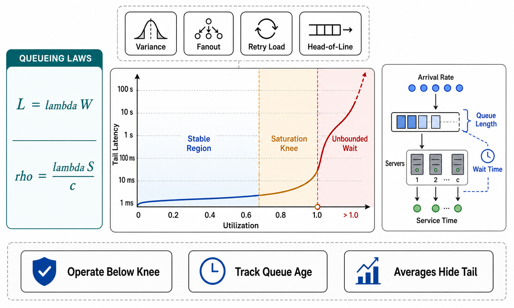

# Queueing Laws and Utilization Economics



## Abstract

Three results carry almost all of the load this chapter places on queueing theory, and this file states each one *with its validity envelope* — the assumptions it needs and the production conditions that break them — because misapplied queueing formulas produce confidently wrong capacity plans. **Little's Law** (L = λW: items in system = arrival rate × time in system) is the safe one — it is exact for any stable system, distribution-free, and is the audit identity connecting every queue-depth, rate, and latency dashboard. **M/M/1** gives the shape everyone must internalize — mean occupancy ρ/(1−ρ) — an *asymptote* at full utilization: 50% utilization means 1 item in the system; 90% means 9; 99% means 99 ([Brooker, "Latency Sneaks Up On You"](https://brooker.co.za/blog/2021/08/05/utilization.html)) — but it assumes Poisson arrivals and exponential service, both routinely false. **Kingman's approximation** ([the VUT relation](https://en.wikipedia.org/wiki/Kingman%27s_formula), G/G/1 heavy traffic) repairs the second gap by pricing *variability* explicitly: wait ≈ [ρ/(1−ρ)] · [(C_a² + C_s²)/2] · τ — utilization times variability times service time — which converts "reduce variance" from folklore into a lever with the same units as "add capacity." The file closes with the chapter's composition law: production paths are *tandem networks* of queues (gateway → service → pool → downstream), where stability requires ρ < 1 at **every** stage, the bottleneck alone sets throughput, waits **add** along the path, and — the term textbooks omit — retries make λ *endogenous*: the arrival rate is a function of the latency, which is a function of the arrival rate, and that feedback loop is where metastable collapse lives.

## 1. The Three Laws, With Envelopes

| Law | Statement | Valid when | Breaks when — and what that does to you |
|---|---|---|---|
| Little's Law | L = λW | Stable system (λ < μ), long-run averages; *no* distributional assumptions | Instability (λ ≥ μ): there is no steady state — L grows without bound and "average latency" stops being a number. Also misleads across mixed classes: apply per work class, not blended |
| M/M/1 | L = ρ/(1−ρ); W = τ/(1−ρ) | Poisson arrivals, exponential (CV=1) service, one server, FIFO, stationary λ | Bursty/correlated arrivals (batch jobs, thundering herds, synchronized retries) and heavy-tailed service (CV ≫ 1) make real waits *far worse* than predicted; use it for shape and intuition, never for sizing |
| Kingman (VUT) | W ≈ [ρ/(1−ρ)]·[(C_a²+C_s²)/2]·τ | G/G/1, heavy traffic (ρ near 1), stationary, moderate tails | Light load (overestimates); *extremely* heavy tails (second moments barely exist — one 60 s request in a 10 ms stream dominates everything, and the mean wait stops describing anyone's experience: watch percentiles, not W); non-stationarity (diurnal ramps violate every steady-state term) |

Two envelope conditions deserve their own paragraph because they falsify naive use of all three laws at once. **Open vs closed loop**: the formulas assume *open* arrivals (λ independent of system state), but load tests and internal callers are usually *closed* loops — a fixed number of callers who wait for responses before sending again — which self-throttle and therefore *hide* the saturation cliff; a system load-tested closed-loop and deployed open-loop has been tested against the wrong physics ([Brooker, "Open and Closed"](https://brooker.co.za/blog/2023/05/10/open-closed.html); drill W1 specifies open-loop generation for exactly this reason). **State-dependent arrivals**: timeouts and retries make λ increase *because* W increased — the one dependency the classical theory excludes and production always has; it converts the smooth M/M/1 curve into a hysteresis loop with a metastable bad branch (file 08 owns the consequences).

## 2. Utilization Economics, Worked

```text
Figure 1. The asymptote, in numbers a capacity review can use.
M/M/1 mean time in system W = τ/(1−ρ), service time τ = 10 ms:

  ρ (utilization)   50%    80%    90%    95%    99%
  W (mean)         20ms   50ms  100ms  200ms   1s      ← 2×→100×
  L (in system)      1      4      9     19     99        τ
  marginal cost of the NEXT point of utilization: exploding

  Kingman's correction: multiply by (C_a²+C_s²)/2 —
  a bursty arrival stream (C_a²=4) with variable service
  (C_s²=4) at ρ=90% waits not 90 ms but ~360 ms of queue.
  Variance reduction (batching bursts away, capping request
  sizes, hedging tails) is capacity you don't have to buy.
```

Three purchasing decisions fall out. **Headroom is a latency SLO input, not slack**: the utilization a fleet may run at is *derived* by inverting the curve at the latency budget — a p99-sensitive service with tight budgets simply cannot run at 90% average utilization, and "we'll improve efficiency by running hotter" is a decision to sell the latency SLO. **Pooling buys the right to run hotter**: an M/M/k pool absorbs the same variability with less headroom as k grows (one queue feeding many servers beats many single-server queues — the Erlang economics in [Brooker's load-balancing analysis](https://brooker.co.za/blog/2020/08/06/erlang.html)), which is the queueing-theory argument for consolidated pools and against per-instance queues. **Variance is a first-class target**: by Kingman, halving (C_a²+C_s²) halves the wait at fixed ρ — request-size caps (Ch07 f01's bounds), burst smoothing (file 05's token buckets), and separating heavy work classes from light ones (file 06) are all *variance* interventions whose payoff the formula prices.

## 3. The Composition Law — Tandem Stages and Endogenous Arrivals

For a serving path of stages 1..n (each a queue+server), the chapter's composition law: **(i)** stability is conjunctive — ρᵢ < 1 at *every* stage; one saturated stage starves or backlogs the whole path regardless of the others' headroom; **(ii)** throughput is min(μᵢ) — the bottleneck's, and capacity added elsewhere is invisible; **(iii)** end-to-end wait is Σ Wᵢ, each term exploding independently by §2's curve — so a five-stage path at a uniform "safe" 90% carries ~5× one stage's queueing delay, and the Ch07 file 03 deadline budget must absorb the *sum* (this is the queueing dual of Chapter 08's staleness-adds law); **(iv)** departures of one stage are arrivals of the next, so variability *propagates* — a bursty stage 1 makes stage 2's C_a² worse than its own arrival stream would suggest; and **(v)** retries close the loop around the whole path: with retry probability p on timeout, effective arrivals λ_eff = λ·(1 + p + p²·…) — bounded only if retries are budgeted (Ch07 f03) — and since p itself rises with W, the system of equations has two solutions: the good one and the metastable one. Worked: λ = 900/s against μ = 1000/s (ρ=0.9, stable); a latency blip pushes 20% of callers to retry once → λ_eff = 1080/s > μ — **the same fleet is now unstable with no change in real demand**, and stays there until the retry fraction is forced down (shedding, budgets) because the backlog keeps W high, which keeps p high. That worked number is the chapter's through-line: admission control is how a system chooses which solution of its own feedback equation to occupy.

## 4. Approval Gates

| Gate | Evidence Required | Failure Condition |
|---|---|---|
| Envelope gate | Every queueing formula in the dossier states its envelope; heavy-tail/burst evidence (measured C_a², C_s²) attached where Kingman-class sizing is used | M/M/1 sizing of bursty heavy-tailed reality; capacity plans citing formulas whose assumptions the workload visibly violates |
| Utilization gate | Target utilization derived by inverting the latency curve at the SLO, per work class; headroom stated as a number with an owner | Utilization targets set by finance or fashion; "run it hotter" without a latency trade shown |
| Variance gate | C_a²/C_s² measured per class; at least the top variance source addressed or explicitly accepted | Variance invisible in the dossier while dominating the waits |
| Composition gate | The tandem walk: per-stage ρ, W, and the Σ against the deadline budget; bottleneck identified; departure-variability propagation considered | Uniform "90% everywhere" targets; capacity added off-bottleneck; per-stage waits summing past the deadline |
| Endogeneity gate | The retry feedback loop analyzed (λ_eff vs μ under timeout-retry scenarios); the forcing-down mechanism named | Fleets stable only in the no-retry fiction; W3's storm drill never run |

## Output

The output of this file is a quantitative admission vocabulary: three laws carried with their validity envelopes instead of as incantations, utilization understood as a purchased position on an asymptote with variance as a priced lever, and the composition law for tandem paths — conjunctive stability, bottleneck throughput, additive waits, propagating variance, and the endogenous-arrival feedback loop whose two solutions are the good system and the collapsed one.

## References

- [Kingman's formula (VUT) — the G/G/1 heavy-traffic approximation](https://en.wikipedia.org/wiki/Kingman%27s_formula)
- [Brooker, "Latency Sneaks Up On You" — the utilization asymptote, worked](https://brooker.co.za/blog/2021/08/05/utilization.html)
- [Brooker, "Surprising Economics of Load-Balanced Systems" — Erlang pooling and headroom](https://brooker.co.za/blog/2020/08/06/erlang.html)
- [Brooker, "Open and Closed, Omission and Collapse" — the load-model envelope condition](https://brooker.co.za/blog/2023/05/10/open-closed.html)
- [Harchol-Balter, *Performance Modeling and Design of Computer Systems* — the rigorous treatment behind every claim here](https://www.cs.cmu.edu/~harchol/PerformanceModeling/book.html)
