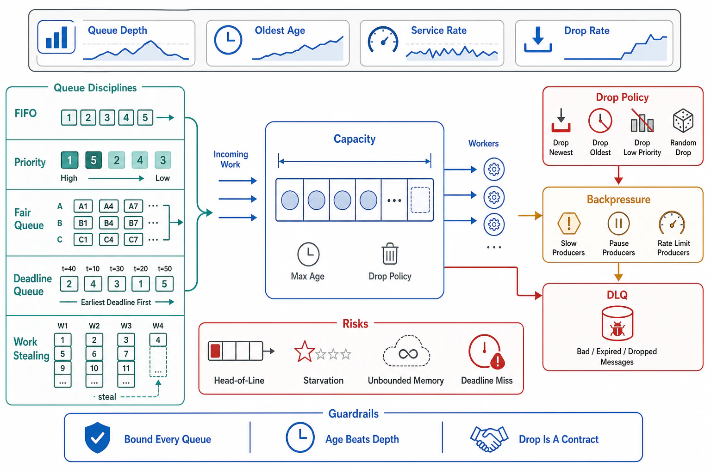

# Queue Disciplines and Bounded Queues



## Abstract

A queue's discipline — the order it releases work — is invisible at low load and decisive during overload, and the central production finding inverts the intuition every framework default encodes: **FIFO is the wrong overload discipline for deadline-bearing work**. Under sustained pressure a FIFO queue serves its *oldest* work first — precisely the requests most likely to have already blown their deadlines — so the server spends saturated capacity completing work nobody is waiting for anymore, while fresh, serviceable requests age toward the same fate behind them; this is how a deep FIFO queue converts overload into 0% goodput while reporting 100% throughput (file 01 §2's collapse, given a mechanism). The production-proven correction comes from Facebook's overload stack ([*Fail at Scale*, ACM Queue 2015](https://queue.acm.org/detail.cfm?id=2839461)): **adaptive LIFO** (FIFO in normal operation; when a standing queue forms, switch to serving *newest first* — maximizing the fraction of served requests that are still inside their deadlines) paired with **CoDel-style delay control** (from [Nichols & Jacobson, ACM Queue 2012](https://queue.acm.org/detail.cfm?id=2209336)): control on **sojourn time** — how long work actually waited — rather than queue length, because length is meaningless without a drain rate while sojourn is the deadline-relevant truth; if the *minimum* sojourn over an interval exceeds a target, the queue is standing rather than bursting, and admission tightens. LIFO's cost is honesty about fairness: under sustained overload the oldest requests starve — which is correct *if* they were doomed anyway (their callers timed out) and cruel if not, which is why the switch is conditioned on standing-queue detection and why the discipline decision is per-work-class, not global.

## 1. Discipline Under Overload

```text
Figure 1. The same queue, two disciplines, at sustained overload
(client deadline D, queue delay > D):

  FIFO:  [oldest ... newest] ──► serves work aged > D
         every completion: wasted (caller gone) — throughput
         100%, goodput → 0, and the queue NEVER re-enters the
         useful regime until arrivals stop (bad-loop stable)

  adaptive LIFO + CoDel:
         normal: FIFO (fair, orderly)
         standing queue detected (min sojourn over window > target):
           · serve NEWEST first  → served work is fresh, inside D
           · CoDel: shed/timeout entries whose sojourn > target
         goodput ≈ capacity; the aged tail is EXPLICITLY dropped
         (honest loss, visible in metrics) instead of implicitly
         served-after-death (invisible loss)
```

| Discipline | Serves first | Right for | Wrong for |
|---|---|---|---|
| FIFO | Oldest | Low-load fairness; ordered work (per-key sequences — Ch06's per-partition ordering) | Deadline work under standing load — the goodput inversion above |
| Adaptive LIFO (+CoDel) | Newest, when standing | Request/response under overload; deadline-bearing work | Work where order is a correctness property; long-deferrable jobs (order rarely matters, but starving old jobs violates the delay contract) |
| Priority classes | Highest class | Mixed criticality (file 07 owns the semantics) | Systems that never audited what asks for "high" |
| Deadline-aware (EDF-flavor) | Earliest feasible deadline | Work with explicit, propagated deadlines (Ch07 f03) | Work without real deadlines — invented ones make it a worse FIFO |

The rule that binds the table: **a queue serving deadline-bearing work must know the deadline** — carried in the envelope (Chapter 07 file 03's propagation), checked at *dequeue* (a request past its deadline is dropped at cost ~0 rather than executed at full cost — the single cheapest goodput intervention in this chapter), and used by the discipline. File 07 formalizes the scheduling; this file's claim is narrower and prior: whatever the discipline, expired work does not reach a server.

## 2. Bounds, and Full-Queue Behavior

A queue bound is a *latency statement*, derived, not a memory statement, picked: by Little's Law the bound B implies worst-case queue delay B/μ, so **B = (delay contract) × μ** — a queue allowed to hold 10 seconds of work at a drain rate of 1,000/s is bounded at 10,000 entries *because of the 10 seconds*, and any bound not derived this way is a delay contract nobody wrote down (a 1M-entry buffer at 1,000/s is a silent promise of 16-minute latency). The bound's companion decision is full-queue behavior, and the options are exactly three: **reject newest** (default for request work — the arriving caller gets the fast honest no, Ch01 f08), **drop oldest** (for freshness-valued streams — telemetry, position updates — where the newest datum supersedes the old anyway), and **backpressure** (block the producer — correct inside process pipelines and Ch06's flow-control domains, dangerous at the edge where the producer is the internet). CoDel's insight applies to the bound too: a queue can be *under* its size bound and still standing (slow drain), which is why the modern control variable is sojourn time against target, with the size bound as the hard backstop — two limits, two different failure modes caught.

## 3. Queues Are Infrastructure With SLIs

Every production queue — explicit (SQS/Kafka consumer lag) or implicit (executor pools, connection backlogs, socket accept queues, the GPU batch queue of file 09) — carries the same four SLIs: **depth** (against bound), **sojourn/age at dequeue** (against delay contract — the CoDel variable, and the one that catches slow-drain standing queues that depth misses), **drop/rejection rate by reason** (full vs expired vs shed — three different diseases), and **drain headroom** (μ − λ, the number whose sign is the difference between a queue and an outage, file 08). The implicit queues are the dangerous ones: a thread-pool's task backlog and a socket accept queue are queues with disciplines (usually FIFO), bounds (usually a default), and full behaviors (usually silent) that nobody reviewed — the dossier's queue inventory (file 11) exists to make every buffer in the request path answer this file's questions.

## 4. Approval Gates

| Gate | Evidence Required | Failure Condition |
|---|---|---|
| Discipline gate | Per queue: discipline chosen from §1's table with the overload behavior stated; adaptive-LIFO/CoDel (or equivalent) on deadline-bearing request queues | FIFO-under-overload serving dead work; discipline = framework default |
| Expired-work gate | Deadline checked at dequeue; expired entries dropped, counted, and alarmed | Servers executing work whose callers are gone; the cheapest fix unimplemented |
| Bound gate | Every bound derived as delay-contract × drain rate; sojourn target + size backstop both present | Bounds as round numbers; 16-minute silent promises; sojourn unmeasured |
| Full-behavior gate | Reject-newest / drop-oldest / backpressure chosen per queue with the producer's nature justified | Full-queue behavior discovered in an incident; edge queues that block |
| Inventory gate | The implicit queues (pools, accept queues, batch buffers) inventoried with the same four SLIs | The outage caused by a buffer nobody listed |

## Output

The output of this file is a queue design where discipline is an overload decision made per work class — adaptive LIFO with sojourn-time control where deadlines rule, FIFO only where order is correctness — expired work is dropped at dequeue instead of executed after death, every bound is a written delay contract, and every buffer in the path, explicit or implicit, is inventoried with depth, sojourn, drops, and drain headroom.

## References

- [Nichols & Jacobson, "Controlling Queue Delay" (ACM Queue 2012) — sojourn time as the control variable](https://queue.acm.org/detail.cfm?id=2209336)
- [Maurer, "Fail at Scale" (ACM Queue 2015) — adaptive LIFO + CoDel + concurrency control at Facebook](https://queue.acm.org/detail.cfm?id=2839461)
- [AWS Builders' Library, "Avoiding insurmountable queue backlogs" — bounds, sojourn, and drain contracts](https://aws.amazon.com/builders-library/avoiding-insurmountable-queue-backlogs/)
- [Google SRE Book, "Addressing Cascading Failures" — queue depth and the death of the oldest-first server](https://sre.google/sre-book/addressing-cascading-failures/)
