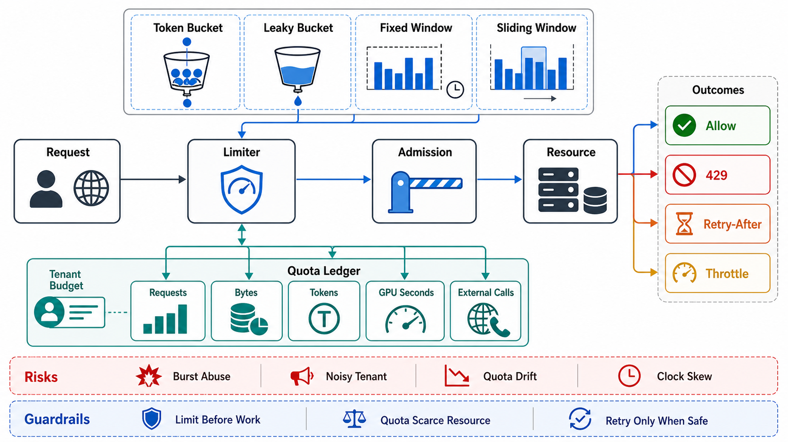

# Rate Limiting and Quotas



## Abstract

Rate limits and quotas are admission control's *contractual* layer: where file 04's shedding protects a resource from the load that exists, limits declare in advance how much load each principal is *entitled* to create — a published number a client can build against (Chapter 07's contract discipline, applied to capacity). The mechanics have a settled core: the **token bucket** (capacity b, refill rate r — allowing sustained rate r with bursts up to b) is the default because both parameters map to real contract terms — r is the entitlement, b is the tolerated burstiness — and it degrades gracefully into its cousins (leaky bucket = b≈1; fixed/sliding windows = cheaper approximations with boundary artifacts: a fixed window admits 2× the limit across a window edge). The distributed version is where the engineering lives, and the design space is a consistency-accuracy-latency triangle this file makes explicit: **local limits** (each of N nodes enforces limit/N — exact only under perfect balance, wrong under skew), **centralized token stores** (accurate, one hop per check — Stripe's production shape, Redis-backed with the limiter *failing open* because "Redis down" must not mean "API down": [Stripe, "Scaling your API with rate limiters"](https://stripe.com/blog/rate-limiters)), and **asynchronously reconciled local buckets** (fast and approximately accurate — the practical default at scale, with the approximation bound stated). The chapter rule that governs all of it: a rate limit is a *protection* mechanism whose rejections are contractual (429 + `Retry-After`, budget-visible to the client per Ch07 f05), never a *capacity plan* — the fleet behind the limiter must survive the sum of the limits or the limits are fiction.

## 1. The Token Bucket as a Contract

```text
Figure 1. Token bucket: the two parameters are contract terms.

  bucket(principal): capacity b, refill r/s, level ℓ
  request cost c:  admit if ℓ ≥ c  (ℓ -= c), else 429+Retry-After

  r  = sustained entitlement  (the quota line in the contract)
  b  = burst tolerance        (how "spiky" a legal client may be:
        b = r×5s tolerates 5-second bursts at full amplitude)
  c  = COST, not count — heavy requests debit more (the request-
        cost model from Ch01 f02/Ch04: a 1,000-row query is not
        one unit), else the limit meters the wrong thing

  worked: r=100/s, b=500. A client idle 10 s holds 500 tokens →
  may burst 500 requests instantly, then sustains 100/s. Window
  limiters would call this abuse; the bucket calls it the
  contract working — bursts were PRICED at b.
```

Design rules. **Cost-based debiting is the difference between limiting requests and limiting load**: uniform-cost limits invite the pathological client whose requests are all maximal (Ch07 f06's priced query surface is the same law at the API layer); the debit is the request's cost estimate, reconciled post-execution where estimation is hard. **Every limit is published, versioned, and observable by the limited**: current level/remaining and reset time in response headers, because a client that cannot see the limit oscillates against it (and the support load of invisible limits exceeds the abuse they stop). **429 semantics are contract semantics**: `Retry-After` honored means the limiter is *scheduling* the client's retry — set it from actual refill arithmetic, not a constant, or the limiter synchronizes its own thundering herd (Ch07 f03's jitter argument applies to the server's own advice).

## 2. Distributed Enforcement — the Triangle

| Topology | Accuracy | Cost per check | Failure posture | Choose when |
|---|---|---|---|---|
| Local (limit/N per node) | Exact only under uniform balance; skew → over/under-admission by the skew factor | Zero (in-memory) | Node-local, no new dependency | Coarse safety nets; N small and balanced; per-connection limits |
| Central store (Redis-class) | Exact | +1 network hop on the request path | **Fail open, alarmed** — the limiter is protection, not authorization; its outage must not become the API's (Stripe's posture) | Billing-grade quotas; low-QPS expensive operations; the accuracy is the product |
| Local buckets + async reconciliation | Bounded approximation (over-admission ≤ burst-of-divergence between syncs) | Zero on path; background sync | Degrades to local behavior under partition | The scale default: high QPS, protection-grade accuracy, bounded error stated in the dossier |

The envelope statement (standard 7): the triangle has no fourth corner — exact, zero-cost, and partition-tolerant enforcement does not exist (it is a small consensus problem per request), so every deployment picks its degradation and *states the bound*. The named failure of ducking the choice: per-node limits sized for yesterday's N, silently doubling the effective global limit when the fleet scales out — the limiter as configuration drift.

## 3. Quotas, Tenancy, and Placement

**Quotas are the multi-tenant instance**: per-tenant r/b values are product tier terms (Ch01 f03's tenant model), enforced at the identity-established stage of the pipeline (Ch07 f02: after authentication, before expensive work), keyed by credential-derived tenant (Ch07 f08's law — a limit keyed by client-supplied ID is a limit the client chooses). Fairness *between* tenants inside the admitted load is file 06's problem; the quota's job is the outer envelope. **Placement follows Chapter 02**: quota *policy* (the numbers, the tiers) is control-plane state, versioned and distributed; *enforcement* is data-plane local against pushed state — a per-request call to a quota service is the anti-pattern (Ch02 f03), and the reconciled-local topology in §2 is exactly the static-stability pattern (Ch02 f04) applied to buckets. **Internal callers get budgets, not exemptions**: the internal service bypassing the limiter because "it's us" is tomorrow's retry storm with a trusted certificate (file 08; Ch07 f03's budget discipline covers the same seam from the client side).

## 4. Approval Gates

| Gate | Evidence Required | Failure Condition |
|---|---|---|
| Contract gate | Per limit: r, b, cost model, and visibility headers published in the API contract; 429 + computed `Retry-After` | Invisible limits; uniform cost metering a heavy-request workload; constant Retry-After herding clients |
| Topology gate | Enforcement topology chosen from §2's triangle with the accuracy bound stated; fail-open posture (alarmed) for protection-grade limiters | Per-node limits drifting with fleet size; a Redis outage taking the API down; accuracy assumed exact where reconciliation is async |
| Placement gate | Policy as control-plane state, enforcement data-plane local, keyed by credential-derived identity at the post-authn stage | Per-request quota-service calls; limits keyed by spoofable IDs; enforcement before identity |
| Capacity-honesty gate | Σ(limits) vs fleet capacity analyzed; the gap covered by file 04's shedding | Limits as the capacity plan; every tenant simultaneously at their limit = outage |
| Internal-budget gate | Internal callers under budgets/limits like external ones, sized deliberately | "Trusted" internal traffic unlimited; the certificate-bearing retry storm |

## Output

The output of this file is a rate-limiting design that is contract first and mechanism second: token buckets whose parameters are published entitlement and priced burst, cost-based debiting that meters load rather than requests, a distributed-enforcement topology chosen from the accuracy-cost-failure triangle with its error bound written down, quota policy distributed as control-plane state and enforced locally — and the standing admission that limits protect capacity but never substitute for having it.

## References

- [Stripe, "Scaling your API with rate limiters" — token buckets, Redis, fail-open, and limiter taxonomy in production](https://stripe.com/blog/rate-limiters)
- [Google SRE Book, "Handling Overload" — quota vs capacity, per-customer limits](https://sre.google/sre-book/handling-overload/)
- [AWS Builders' Library, "Fairness in multi-tenant systems" — the quota/fairness seam this file hands to file 06](https://aws.amazon.com/builders-library/fairness-in-multi-tenant-systems/)
- [RFC 6585 — 429 Too Many Requests (the contractual rejection)](https://www.rfc-editor.org/rfc/rfc6585.html)
