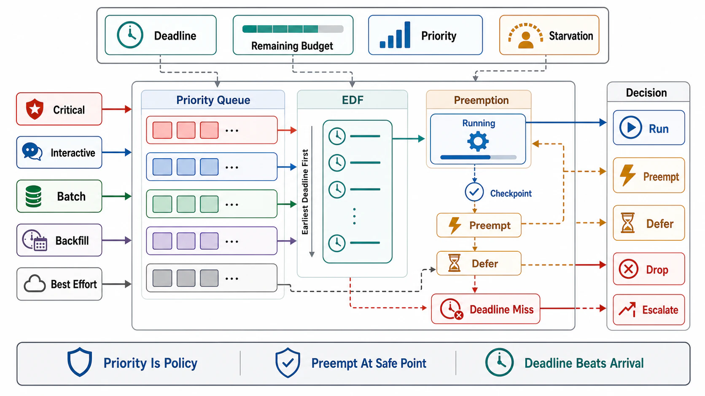

# Priority, Preemption, and Deadline Scheduling



## Abstract

Priority is the scheduler's expression of the business's preference order, and it fails in production for a governance reason before any technical one: priority is *claimed by producers* but *paid for by everyone else*, so ungoverned priority inflates — every team marks its work important, the top class swells to 80% of traffic, and the scheduler is back to FIFO with extra steps. This file states the discipline as three laws. **Priority must be scarce**: classes are few (three to five), their membership is governed policy (file 04's criticality table with owners, audited by drill W6's class-mix measurement), and the top class is *provisioned*, not just preferred — a top class larger than guaranteed capacity is a lie told in scheduler configuration. **Preemption is priority's enforcement arm, and it has a price list**: without preemption, priority only reorders the *queue* while admitted long-running work squats the servers (priority inversion's simplest form — the batch job started at 09:00 blocking the critical request at 09:01); with preemption, the scheduler reclaims capacity by evicting running work, which is correct exactly when the evicted work is *resumable* (checkpointed, idempotent, or restartable — Chapter 03/06's replay machinery is the prerequisite) and wasteful otherwise (evict-and-restart burns everything already spent — file 09's KV-preemption puts hard numbers on this). **Deadlines beat priorities where they exist**: for work carrying real deadlines (Ch07 f03's propagated budgets), earliest-deadline-first and its admission-test form — *accept only if the deadline is feasible given current commitments* — dominate static classes, because "urgent" is a fact about time, not rank; and the degenerate rule that pays for the whole file is checked at dequeue: **expired work is never scheduled** (file 03's law, restated because every violation of it is a pure goodput loss).

## 1. The Three Failure Modes Priority Must Design Against

```text
Figure 1. Priority pathologies, and the mechanism against each.

  INFLATION      everything claims P0 → P0 ≈ FIFO
     └─ governance: classes are policy with owners; class mix
        measured (W6); top class provisioned ≤ guaranteed capacity

  STARVATION     low classes wait forever under sustained load
     └─ design decision, made EXPLICIT per class:
        · true background: starvation acceptable, SAY SO
        · deferrable-with-deadline: aging/weighted share
          (a floor fraction of drain capacity, file 06's WFQ)
        · never both: an "aged-up" batch job arriving in the
          interactive class at peak is inflation via sympathy

  INVERSION      high-priority work waits on low-priority work
     └─ the lock/queue/pool holding the shared resource must be
        priority-aware (priority inheritance) — or the resource
        partitioned (file 06's bulkheads); found by tracing the
        critical path's SHARED RESOURCES, not the scheduler config
```

The inversion paragraph deserves emphasis because it lives outside the scheduler: a P0 request blocked on a connection pool drained by P3 batch reads, a mutex held by a deprioritized thread, a Kafka partition where P0 events queue behind P3 events (Ch06's per-partition ordering makes priority *impossible* within a partition — topic/partition separation is the only priority mechanism a log offers) — every one is an inversion invisible in scheduler configuration and visible only in critical-path tracing (drill W6).

## 2. Preemption — the Price List

| Evicted work is… | Preemption cost | Verdict |
|---|---|---|
| Idempotent + checkpointed (Ch06 f06 state, Ch03 f08 replay) | Lost progress since last checkpoint | Preempt freely; this is what checkpoints are for |
| Idempotent, no checkpoint | Full restart of the attempt | Preempt if (remaining top-class wait) > (evicted progress) — the arithmetic goes in the policy, not the incident |
| Non-idempotent, in flight | Correctness risk, not just waste | **Do not preempt**; drain-then-reclaim (stop admitting, let finish), and fix the resumability upstream |
| Holding shared locks/leases | Inversion propagation on kill | Release-then-evict protocols; lease fencing (Ch03 f04) so the evicted holder cannot act stale |

The two-sided contract: work that *wants* cheap preemption declares checkpoints (the spot-instance/batch design posture — assume eviction, checkpoint by contract); schedulers that *use* preemption publish the eviction signal (grace period, checkpoint-now notification) so the price list above is real. Kubernetes' pod priority/preemption plus disruption budgets is the assembled instance: preemption enabled by class, bounded by budgets that encode "how much of this workload may be simultaneously evicted" — the blast-radius bound this chapter requires of every preemption deployment.

## 3. Deadline Scheduling — Feasibility as Admission

Where deadlines are real and propagated, the scheduler's strongest move is at *admission*, not dequeue: the feasibility test — given current queue commitments and drain rate, can this request's deadline be met? — rejects infeasible work at arrival (cost ~0, honest 429/503 with retry guidance) instead of discovering infeasibility at timeout (cost = full wait + the capacity it consumed while doomed). The worked shape: queue of 400 items, μ = 100/s → a new arrival with a 2 s deadline faces 4 s of wait; admitting it is choosing to waste its service time — the feasibility check is Little's Law pointed forward, and it composes with file 03's dequeue check (admission optimism corrected at dispatch) and Ch07 f03's propagation (the deadline in hand is the *remaining* budget, not the original). Envelope (standard 7): EDF is optimal on a single resource under feasible load and degrades badly past it (domino misses — everything becomes urgent, nothing completes), so past saturation the discipline must *switch* to shedding-by-class (file 04) rather than sorting harder — deadline scheduling is a tool for the feasible region, and knowing which region you are in is file 02's job.

## 4. Approval Gates

| Gate | Evidence Required | Failure Condition |
|---|---|---|
| Scarcity gate | ≤5 classes, membership as owned policy, class mix measured with inflation alarms; top class ≤ provisioned capacity | 80% P0; priority assigned by the requester's confidence |
| Starvation gate | Per class: the explicit decision — starvable, floored (with the floor), or deadline-governed | Aging hacks that relabel batch as interactive; background work with implicit latency promises |
| Inversion gate | Critical-path shared-resource walk done (pools, locks, partitions); priority-aware or partitioned at each | P0 waiting on P3's connection pool; priority "configured" but the log serializes classes in one partition |
| Preemption gate | The §2 price list applied per workload; eviction signals + grace published; disruption budgets bound blast radius; non-idempotent work never killed | Evict-and-restart burning more than it reclaims; preemption of uncheckpointed non-idempotent work |
| Feasibility gate | Deadline work admission-tested (forward Little's Law) and dequeue-checked; past-saturation switch to class shedding defined | Doomed work admitted politely; EDF sorting a saturated queue into uniform failure |

## Output

The output of this file is a priority design that survives its own users: few governed classes with a provisioned top and measured mix, starvation decided per class instead of discovered, inversions hunted on the critical path's shared resources, preemption priced against resumability with published eviction contracts and bounded blast radius, and deadline work admitted by feasibility and dropped at expiry — so the scheduler expresses the business's preference order even at the moments that order matters.

## References

- [Google SRE Book, "Handling Overload" — criticality as governed, propagated metadata](https://sre.google/sre-book/handling-overload/)
- [Kubernetes — Pod Priority and Preemption + PodDisruptionBudgets: the assembled preemption instance](https://kubernetes.io/docs/concepts/scheduling-eviction/pod-priority-preemption/)
- [Liu & Layland, "Scheduling Algorithms for Multiprogramming in a Hard-Real-Time Environment" (JACM 1973) — EDF's optimality and its feasible-region envelope](https://dl.acm.org/doi/10.1145/321738.321743)
- [AWS Builders' Library, "Avoiding insurmountable queue backlogs" — priority as backlog triage](https://aws.amazon.com/builders-library/avoiding-insurmountable-queue-backlogs/)
