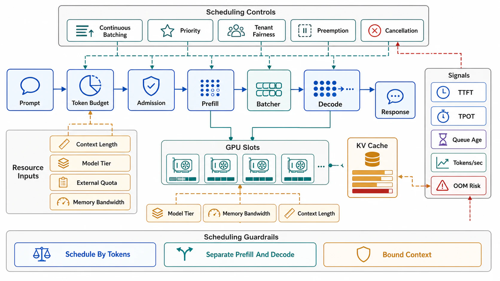

# AI Workload Scheduling



## Abstract

Inference scheduling is this chapter's laws under the industry's most expensive contention, with one structural novelty: the unit of scheduling is not the request but the **iteration**. Autoregressive generation means a "request" is thousands of sequential steps holding state (the KV cache) between them, so batch membership can — and must — change *per iteration*: **continuous batching** ([Orca, OSDI 2022](https://www.usenix.org/conference/osdi22/presentation/yu)) admits arriving requests into the running batch and retires finishing ones at iteration boundaries, replacing static-batch head-of-line blocking (the batch waits for its longest member) with a rolling admission decision thousands of times per second — the single largest serving-throughput win of the LLM era and now the default in every serious engine. The remaining interference is *phase-shaped*: prefill (compute-bound, seconds for long prompts) and decode (memory-bandwidth-bound, milliseconds per token) fight for the same iteration, so an admitted prefill stalls every running decode — TTFT bought with TPOT. The two settled responses define the current frontier: **chunked prefill** ([Sarathi-Serve, OSDI 2024](https://www.usenix.org/conference/osdi24/presentation/agrawal)) slices prefills into decode-batch-sized pieces for stall-free coexistence on shared GPUs; **disaggregation** ([DistServe, OSDI 2024](https://www.usenix.org/conference/osdi24/presentation/zhong-yinmin); Mooncake at production scale) moves the phases onto separate pools with KV transfer between them, buying independent scaling and interference-freedom at the cost of transfer latency and pool-balancing complexity. Adoption judgment (mid-2026): both are production-real (chunked prefill shipped in vLLM/TensorRT-LLM-class engines; disaggregation runs at frontier-lab scale), and the aggregation-vs-disaggregation question is *genuinely unresolved* — workload-dependent (prompt/output length ratios, SLO tightness), actively contested in the literature — making it a README open problem, not a settled recommendation this file could honestly hand out.

## 1. The Iteration-Level Scheduler

```text
Figure 1. Continuous batching: admission per iteration, against
two budgets (compute slots and KV bytes).

  every iteration (~10–100 ms):
    retire finished sequences        → free KV, free slots
    admit from queue IF:
      · batch token budget holds     (compute envelope)
      · KV-cache bytes fit           (memory envelope — the
        binding constraint at long context: Ch10's currency)
    run one step for ALL admitted sequences

  the two SLOs it must serve are Ch07 f09's split:
    TTFT  = queue wait + prefill    (admission + prefill policy)
    TPOT  = decode cadence          (batch size + interference)
  and they TRADE: bigger batches → better throughput & worse
  TPOT; eager prefill admission → better TTFT & decode stalls.
  The scheduler's config IS a position on this frontier — state it.
```

The chapter's laws, instantiated. **Admission is two-resource** (file 06's DRF argument): a slot-count policy alone lets long-context requests exhaust KV memory at low batch size — admission debits both token-compute and KV-bytes, and "fair by request" hands the GPU to whoever sends 100k-token prompts. **The KV cache makes preemption priced in dollars** (file 07 §2's list, with numbers): evicting a sequence under memory pressure either swaps KV to host memory (reclaim latency on resume) or drops it for **recomputation** — re-paying the entire prefill; a 50k-token context at ~10⁴ tokens/s of prefill throughput is ~5 s of repeated GPU work per eviction, so eviction-rate-under-pressure is a first-class SLI and chronic preemption is a capacity bug wearing a scheduling costume. **Deadline law at dequeue holds verbatim** (file 03): a request whose client disconnected mid-queue or mid-stream must be culled before its next iteration — Ch07 f09's cancellation-to-the-GPU, enforced at this scheduler.

## 2. Phase Interference and the Frontier Split

| Design | Mechanism | Buys | Pays | Envelope |
|---|---|---|---|---|
| Naive continuous batching | Whole prefills enter iterations | Simplicity | Decode stalls = TPOT spikes on every long-prompt arrival | Tolerable only at short prompts / loose TPOT SLOs |
| Chunked prefill (Sarathi-class) | Prefill sliced to fit the decode batch's iteration budget | Stall-free TPOT + shared-pool utilization | Slightly longer TTFT (prefill spread over iterations); chunk-size tuning | The shared-GPU default; frontier engines ship it |
| Disaggregation (DistServe/Mooncake-class) | Separate prefill and decode pools; KV shipped between | Zero phase interference; phases scale/spec'd independently (prefill wants FLOPs, decode wants bandwidth) | KV transfer on the request's critical path; two pools to balance (a new file 02 tandem stage); infrastructure complexity | Long contexts, tight TPOT SLOs, scale that amortizes the plumbing |

SLO-aware admission closes the loop with file 01's goodput objective: serving systems declare TTFT/TPOT targets per class, and the scheduler's feasibility test (file 07 §3) speaks tokens — admit a prefill only if its chunks fit without pushing any admitted decode past its TPOT bound; queue or shed otherwise (the [Sarathi-Serve](https://www.usenix.org/conference/osdi24/presentation/agrawal) formulation of goodput: requests completing *within SLO*, the only number that survives contact with file 01).

## 3. Training-Side and Agent-Side Admission

**Gang scheduling** is the training/batch instance of all-or-nothing admission: a distributed job needs all N workers simultaneously (synchronous collectives — one missing worker idles N−1), so partial allocation is worse than none: admit-all-or-queue-all, with queueing, quotas, fair sharing, and preemption per team handled by the cluster layer — [Kueue](https://kueue.sigs.k8s.io/) is the Kubernetes-native instance (workload queueing GA-mature and production-adopted; core gang semantics in Kubernetes itself reached beta in v1.36, May 2026 — status verified at write time), composing ClusterQueue quotas (file 05), fair sharing (file 06), and priority preemption (file 07) over GPU fleets. **Agent episodes** are this chapter's newest client (Chapter 11 owns the loop; this file owns its admission): an agent turn is a *chain* of model calls and tool calls with unbounded natural length, so admission is budgeted per episode — token, call-count, wall-clock, and cost ceilings carried in the request context (Ch07 f02) and debited per step, with the budget-exhausted path being a designed outcome (checkpoint-and-summarize, escalate, or fail cleanly — not a silent kill mid-chain); and agent traffic is *machine-speed and bursty* (one user action fans into dozens of calls), so its quotas and fairness keys (files 05–06) treat the agent principal as the tenant, exactly as Ch07 f08 §4 treats its identity.

## 4. Approval Gates

| Gate | Evidence Required | Failure Condition |
|---|---|---|
| Iteration-scheduler gate | Continuous batching with two-resource admission (token budget + KV bytes); the TTFT/TPOT frontier position stated as config with its SLO rationale | Static batching; single-resource admission; the frontier position implicit in defaults |
| Preemption-economics gate | KV eviction policy (swap vs recompute) priced; eviction-rate-under-pressure as SLI; disconnected sequences culled at iteration boundaries | Chronic recompute-preemption unmeasured; dead streams decoding to completion |
| Phase gate | Chunked prefill or disaggregation chosen with the §2 table's trade stated; if disaggregated: KV-transfer latency in the tandem-stage budget (file 02 §3) | Long-prompt TPOT spikes shipped as "the model being slow"; disaggregation adopted for fashion at short-context workloads |
| SLO-goodput gate | Per-class TTFT/TPOT targets; feasibility-tested admission; goodput-within-SLO measured under the W7 saturation drill | Throughput reported; SLO-blind admission stalling paid decode for speculative prefill |
| Gang/episode gate | Training jobs gang-admitted under quota/fair-share/preemption policy (Kueue-class); agent episodes under per-step-debited budgets with designed exhaustion paths | Deadlocked partial allocations; agents with unbounded chains and no budget-exhausted behavior |

## Output

The output of this file is an AI admission design scheduled at the iteration: continuous batching admitting against both compute and KV budgets with its TTFT/TPOT position chosen and stated, preemption priced in prefill-recompute dollars, phase interference handled by chunked prefill or disaggregation with the trade written down, goodput measured within SLO, training jobs gang-admitted under governed quotas, and agent episodes budgeted per step with exhaustion as a designed outcome.

## References

- [Yu et al., "Orca: A Distributed Serving System for Transformer-Based Generative Models" (OSDI 2022) — continuous/iteration-level batching](https://www.usenix.org/conference/osdi22/presentation/yu)
- [Agrawal et al., "Taming Throughput-Latency Tradeoff in LLM Inference with Sarathi-Serve" (OSDI 2024) — chunked prefill, stall-free scheduling, SLO goodput](https://www.usenix.org/conference/osdi24/presentation/agrawal)
- [Zhong et al., "DistServe: Disaggregating Prefill and Decoding for Goodput-optimized LLM Serving" (OSDI 2024)](https://www.usenix.org/conference/osdi24/presentation/zhong-yinmin)
- [Qin et al., "Mooncake" (FAST 2025) — disaggregation at production scale (Ch08 f09's economics, this file's scheduler)](https://www.usenix.org/system/files/fast25-qin.pdf)
- [Kueue — Kubernetes-native job queueing for batch/AI (gang semantics beta in k8s v1.36, May 2026)](https://kueue.sigs.k8s.io/)
