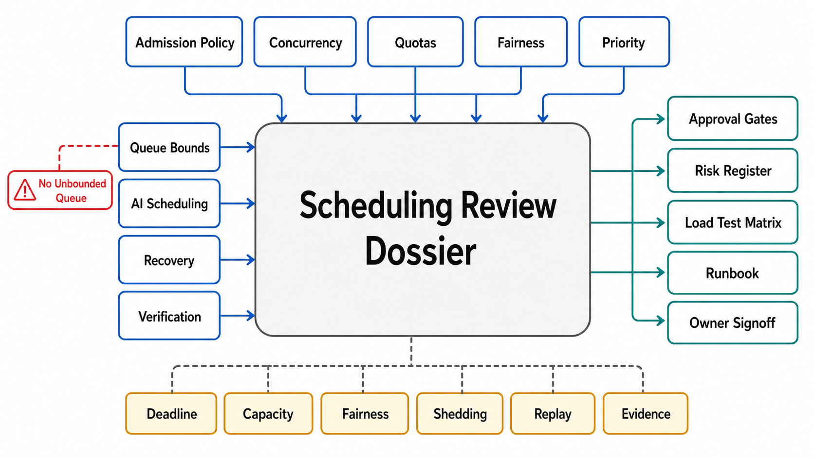

# Scheduling Review Templates



## Abstract

This file assembles the chapter into its executable form: the dossier a team completes to put an admission-and-scheduling design — intake verdicts to collapse exits — in front of an architecture review, and the checklist the reviewer walks to approve it. The organizing principle is the chapter's root thesis made procedural: every buffer, limit, and priority in a system is a decision *something* made — the framework default, the memory allocator, or the design — and each dossier section forces the written answer where physics would otherwise decide: is this work queued or shed and by what arithmetic, at what utilization does this fleet run and what latency does that purchase, in what order does overload consume the business's quality budget, who gets capacity when tenants collide, and how does the system exit the collapse loop its own retries can sustain. Evidence citations must satisfy file 10's stamp discipline: dated, load-model-stamped, open-loop where load-generated, and rehearsed where only a game day can produce them.

## 1. Dossier Assembly

```text
Figure 1. Dossier assembly: each section is produced by one file's
gates; the checklist consumes the whole.

  f01 ─► §A admission verdicts       f06 ─► §F fairness & isolation
  f02 ─► §B laws & utilization       f07 ─► §G priority & deadlines
  f03 ─► §C queue inventory          f08 ─► §H backlog & storm plans
  f04 ─► §D shedding & concurrency   f09 ─► §I AI scheduling
  f05 ─► §E limits & quotas          f10 ─► §J evidence ledger
                     │
                     v
        reviewer checklist (§3) ─► approve design / findings
```

## 2. The Admission Surface Dossier

**§A Admission verdicts (file 01).** The queue/shed/scale/backpressure verdict per work class with deferrability and transience justified; the goodput curve (W1), dated; autoscaling lag and its bridge; the layered-admission map with one owner per resource.

**§B Laws and utilization (file 02).** Formulas used, each with its envelope; measured C_a²/C_s² per class; utilization ceilings derived from latency SLOs; the tandem walk (per-stage ρ, ΣW vs deadline budget, bottleneck named); the endogenous-λ analysis with the retry feedback worked.

**§C Queue inventory (file 03).** Every buffer — explicit and implicit — with discipline (and its overload behavior), derived bound, full-queue behavior, expired-at-dequeue enforcement, and the four SLIs. W4's scan result attached.

**§D Shedding and concurrency (file 04).** The criticality table with owners and provisioning lines; the brownout ladder, priced and rehearsed (W2); per-resource adaptive limits with algorithm and blind spots; client-side throttling parameters for internal callers.

**§E Limits and quotas (file 05).** Per limit: r, b, cost model, visibility, Retry-After arithmetic; enforcement topology with stated accuracy bound and fail posture; Σ(limits)-vs-capacity honesty; internal-caller budgets.

**§F Fairness and isolation (file 06).** Per shared resource: the ladder rung with the one-bad-tenant number; DRF (or accepted simpler policy) for multi-resource pools; weight governance; quarantine and restore paths; the APF-analogue documentation with its built-in SLIs. W5's flood result.

**§G Priority and deadlines (file 07).** Classes, owners, mix measurement, provisioned top; per-class starvation decisions; the inversion walk; the preemption price list with eviction contracts and disruption budgets; feasibility-tested admission and the past-saturation switch. W6/W10 results.

**§H Backlog and storm plans (file 08).** Per queue: drain arithmetic at design λ, surge plan, pre-defined triage classes; drain-as-client admission controls; the collapse exit sequence with its pre-built pause controls; the incident-mechanism corpus, current. W3's timed run.

**§I AI scheduling (file 09).** The iteration scheduler's two-resource admission and stated TTFT/TPOT frontier position; KV preemption economics with eviction SLI; the phase decision (chunked/disaggregated) with its trade; SLO-goodput under W7; gang admission policy; agent episode budgets with exhaustion paths.

**§J Evidence ledger (file 10).** W1–W10 status: date, result, load-model stamp; open-loop generation attested; standing SLIs (§2 of file 10) with contract lines; gaps as *assumed* with expiry.

## 3. Reviewer Checklist

| # | Check | Source gate | Common failure it catches |
|---:|---|---|---|
| 1 | Queue/shed/scale/backpressure verdict written per work class; queues only for deferrable, transient excess | f01 decision | Queues by reflex; buffering a sustained λ > μ |
| 2 | Goodput curve measured open-loop to ≥2×; flat past saturation | f01 goodput + f10 open-loop | Collapse shapes never driven; closed-loop self-certification |
| 3 | No unbounded queue anywhere; bounds derived as delay × drain; full-queue behavior chosen | f01/f03 bounds | The allocator as the admission policy; round-number bounds |
| 4 | Autoscaling lag stated and bridged by shedding/degradation | f01 scaling-lag | "We autoscale" answering a milliseconds question with minutes |
| 5 | Formulas carry envelopes; C_a²/C_s² measured; no M/M/1 sizing of bursty heavy-tailed reality | f02 envelope | Confidently wrong capacity plans |
| 6 | Utilization ceilings derived from latency SLOs per class; headroom owned | f02 utilization | Hotter-is-cheaper decisions that silently sell the SLO |
| 7 | Tandem walk done: per-stage ρ, additive waits vs deadline, bottleneck named; retry feedback analyzed | f02 composition + endogeneity | Uniform 90% targets; capacity added off-bottleneck; λ_eff fictions |
| 8 | Deadline-bearing queues run adaptive-LIFO/CoDel-class discipline; expired work dropped at dequeue, counted | f03 discipline + expired-work | FIFO serving the dead under overload |
| 9 | Implicit queues (pools, accept queues, executors) inventoried with the four SLIs | f03 inventory + W4 | The outage in the buffer nobody listed |
| 10 | Criticality carried in requests, lowered-never-raised; shedding consumes classes bottom-up | f04 criticality | Uniform random shedding; payments and prefetch equally likely to die |
| 11 | Brownout ladder priced and rehearsed; rungs re-enable | f04 ladder + W2 | Quality cuts improvised mid-incident and never restored |
| 12 | Adaptive concurrency per resource with blind spots guarded; its rejections accounted as shedding | f04 adaptive-limit | Static guesses; gradient limiters admitting into an OOM |
| 13 | Internal callers adaptively throttle (or budget-break); probe traffic preserved | f04 client-throttle | Trusted callers hammering a shedding server |
| 14 | Limits published with r/b/cost model; Retry-After computed; topology accuracy bound stated; fail open alarmed | f05 contract + topology | Invisible limits; limiter outage = API outage; fleet-drift doubling limits |
| 15 | Σ(limits) vs capacity analyzed; the gap covered by shedding | f05 capacity-honesty | Limits as the capacity plan |
| 16 | Isolation rung chosen per shared resource with the one-bad-tenant number; DRF where resource shapes differ | f06 ladder + DRF | Noisy neighbors inside quota; request-count fairness on heterogeneous work |
| 17 | Quarantine with bounded blast radius and a restore path | f06 quarantine | Poison tenants fairly sharing everyone's queue |
| 18 | ≤5 priority classes, governed, mix-measured, top provisioned; starvation decided per class | f07 scarcity + starvation | 80% P0; background work with implicit promises |
| 19 | Inversion walk on the critical path's shared resources; preemption priced with eviction contracts and budgets | f07 inversion + preemption | P0 behind P3's pool; evictions burning more than they reclaim |
| 20 | Deadline admission feasibility-tested; past-saturation switch to class shedding defined | f07 feasibility + W10 | Doomed work admitted politely; EDF sorting a saturated queue |
| 21 | Drain arithmetic + surge + pre-defined triage per queue; drain traffic admission-controlled | f08 drain + self-client | 19-hour drains done by patience; recovery as the second outage |
| 22 | Pause controls pre-built per traffic class; the collapse exit rehearsed and timed (W3) | f08 pause-control + multiplier | Exit tooling written mid-incident — the 2015 and 2025 lesson |
| 23 | Incident corpus maintained, each lesson mapped to a gate or drill | f08 corpus | Postmortems as memos; the same shape recurring |
| 24 | AI: two-resource iteration admission, stated TTFT/TPOT position, priced preemption, phase decision written, SLO-goodput drilled (W7) | f09 all | Static batches; recompute churn unmeasured; disaggregation by fashion |
| 25 | Gang admission for distributed jobs; agent episodes budgeted per step with designed exhaustion | f09 gang/episode | Deadlocked partial allocations; unbounded agent chains |
| 26 | Evidence ledger current: load-model stamps valid, open-loop attested, SLIs with contract lines standing (W8) | f10 all | Goodput curves from a retired fleet still cited |

## 4. Approval Statement

Approval of an admission surface dossier asserts: every work class enters under a written verdict, waits (if at all) in an inventoried bounded queue with a chosen discipline, is shed in the business's criticality order against limits that are contracts, shares capacity under quantified isolation, runs at a utilization that was purchased knowingly, and — when the feedback loops close — recovers by a rehearsed exit with pre-built controls. It asserts *nothing* about the API contracts that shape arrivals (Chapter 07), the log that stores deferred work (Chapter 06), the caches that filter load (Chapter 08), or the GPU serving internals beneath the iteration scheduler (Chapter 10) — those approvals are prerequisites, cited by reference, never re-argued here.

## Output

The output of this file — and the chapter — is an executable review instrument: a ten-section dossier that forces every buffer, limit, priority, and recovery path into a written decision with its arithmetic, and a twenty-six-point checklist that converts this chapter's gates into findings a review can actually produce.

## References

- [Chapter 09 file map — the approval dependency graph this dossier assembles](00-chapter-file-map.md)
- [Chapter 01 file 11 — evidence classification the ledger inherits](../01-architectural-objective-and-system-boundary/11-evidence-classification-and-architecture-review.md)
- [Google SRE Book — the launch-review discipline this template's checklist form follows](https://sre.google/sre-book/reliable-product-launches/)
