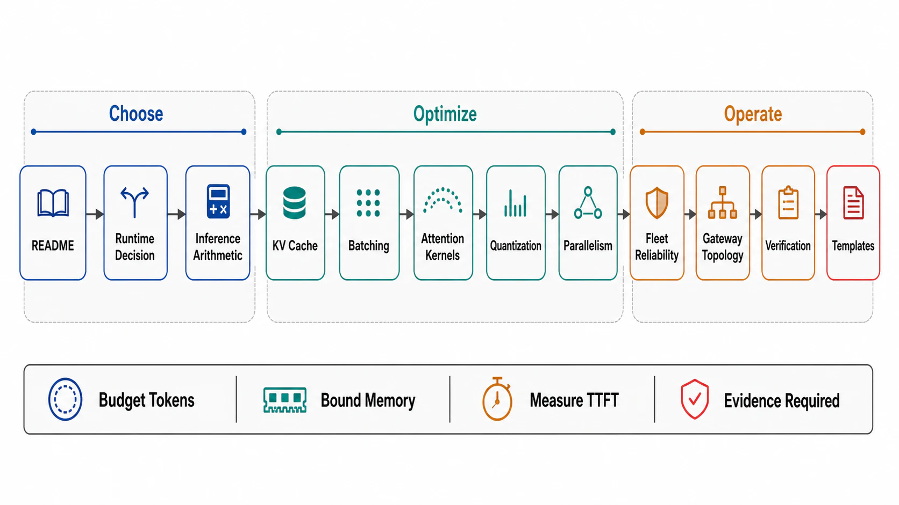

# Chapter 10 File Map — Inference Runtime and GPU Serving Architecture



## Reading Order

| Order | File | Owns |
|---:|---|---|
| 1 | [01-the-serving-runtime-and-the-buy-vs-run-decision.md](01-the-serving-runtime-and-the-buy-vs-run-decision.md) | The token pipeline's anatomy; when NOT to run your own inference; the serving contract the runtime must honor |
| 2 | [02-transformer-inference-arithmetic.md](02-transformer-inference-arithmetic.md) | First-principles capacity math: FLOPs and bytes per token, the roofline, why decode is bandwidth-bound; the capacity-envelope composition law |
| 3 | [03-kv-cache-management-and-paged-memory.md](03-kv-cache-management-and-paged-memory.md) | KV bytes-per-token derivation; PagedAttention; prefix reuse execution; GQA/MLA as architecture-side compression; KV quantization |
| 4 | [04-batching-and-the-latency-throughput-frontier.md](04-batching-and-the-latency-throughput-frontier.md) | Continuous batching execution; the batch-size/TPOT frontier; chunked prefill at the kernel level; CUDA graphs and launch overhead |
| 5 | [05-attention-kernels-and-runtime-optimization.md](05-attention-kernels-and-runtime-optimization.md) | IO-aware attention (FlashAttention lineage); the non-attention pipeline (tokenizer, sampler, detokenizer); structured reuse (RadixAttention) |
| 6 | [06-quantization-and-speculative-decoding.md](06-quantization-and-speculative-decoding.md) | Precision as a serving decision with quality gates; FP8/FP4 statuses; speculative decoding and its load envelope |
| 7 | [07-parallelism-and-multi-gpu-serving.md](07-parallelism-and-multi-gpu-serving.md) | TP/PP/EP: why each exists, what each costs; the interconnect envelope; MoE serving and routing skew |
| 8 | [08-reliability-and-fleet-operations.md](08-reliability-and-fleet-operations.md) | GPU failure classes and rates; model loading and warmup; draining streaming fleets; model-version rollout |
| 9 | [09-serving-topologies-and-the-inference-gateway.md](09-serving-topologies-and-the-inference-gateway.md) | The fleet layer: cache-aware routing, disaggregated pools, multi-model/LoRA multiplexing, token-metric autoscaling |
| 10 | [10-verification-of-serving-contracts.md](10-verification-of-serving-contracts.md) | Drill catalog G1–G10; the serving SLI set; serving-generation evidence stamps |
| 11 | [11-serving-review-templates.md](11-serving-review-templates.md) | The serving surface dossier and reviewer checklist |

## Approval Dependency Graph

```text
Figure 1. Approval dependencies. The arithmetic [02] gates every
optimization file — no technique is approved without knowing which
resource it relieves; the fleet files [08][09] consume the runtime
files; everything feeds verification [10] → templates [11].

  [01 anatomy + buy-vs-run]
        │
        v
  [02 inference arithmetic]  ◄── the load-bearing file
        │
        ├──► [03 KV management] ──► [04 batching frontier]
        │            │                     │
        ├──► [05 kernels/runtime] ◄────────┤
        │            │                     │
        ├──► [06 quantization/speculation] │
        │            │                     │
        └──► [07 parallelism] ─────────────┤
                     │                     │
                     v                     v
        [08 reliability/fleet] ──► [09 topologies/gateway]
                     │                     │
                     v                     v
              [10 verification] ──► [11 templates]
```

## Prerequisites From Earlier Chapters

| Prerequisite | Where it is established | Consumed by |
|---|---|---|
| TTFT/TPOT as separate SLIs; streaming/cancellation contracts | [Ch07 file 09](../07-api-contracts-and-request-lifecycle/09-streaming-long-running-and-ai-request-lifecycles.md) | [01], [04], [08] |
| Iteration-level scheduling, two-resource admission, phase decisions | [Ch09 file 09](../09-scheduling-queues-and-resource-admission/09-ai-workload-scheduling.md) | [01], [04], [09] |
| KV/prefix caching economics and version closure | [Ch08 file 09](../08-caching-materialization-and-invalidation/09-ai-native-caching.md) | [03], [09] |
| Queueing laws with envelopes; goodput; utilization economics | [Ch09 file 02](../09-scheduling-queues-and-resource-admission/02-queueing-laws-and-utilization-economics.md) | [02], [04] |
| Model/version rollout discipline (N/N+1, rollback) | [Ch07 file 07](../07-api-contracts-and-request-lifecycle/07-versioning-deprecation-and-compatibility.md) | [08] |
| Control-plane/data-plane separation for routers and placement | [Ch02 file 05](../02-control-plane-and-data-plane-separation/05-admission-scheduling-and-placement.md) | [09] |
| Evidence classification (tested / observed / assumed) | [Ch01 file 11](../01-architectural-objective-and-system-boundary/11-evidence-classification-and-architecture-review.md) | [10], [11] |

## Chapter Rule

This chapter approves *serving-runtime and fleet decisions*: how tokens are produced — memory layout, batch composition, kernels, precision, parallelism — and how GPU fleets are operated and routed. It does not approve the admission policies above the runtime (Chapter 09), the caching contracts around it (Chapter 08), the API lifecycles in front of it (Chapter 07), or the agent loops that call it (Chapter 11) — those are cited as prerequisites, never re-argued. Model *quality* (training, evals as product) is outside the book's scope except where serving decisions (quantization, speculation) put it at risk — there, the eval gate is this chapter's to demand.
