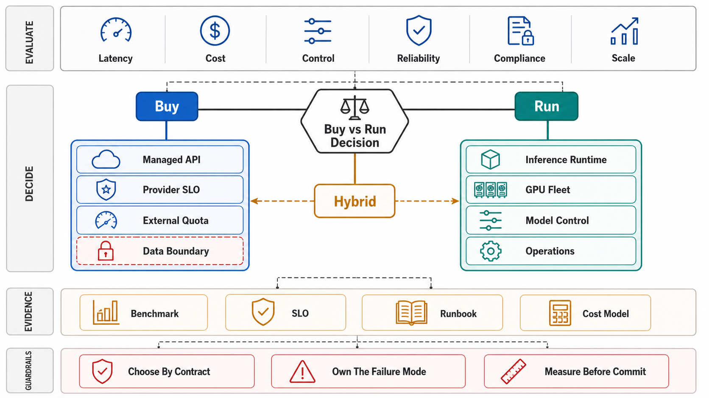

# The Serving Runtime and the Buy-vs-Run Decision



## Abstract

An inference runtime is a pipeline that converts requests into token streams under three simultaneous contracts — the latency split (TTFT and TPOT as separate promises, Chapter 07 file 09), the goodput objective under admission (Chapter 09 file 09), and a cost-per-token the business can survive — and this chapter's opening claim is that the *first* serving decision is whether to operate this machinery at all. Running your own inference is the same class of commitment as running your own database (Chapter 04's engine-admission argument, at higher prices): you inherit the scheduler, the memory manager, the kernel stack, the fleet's failure modes, and a hardware market that depreciates faster than most capacity plans amortize. The admission table below is therefore the chapter's when-NOT gate, and the honest default for most workloads is a hosted API — self-hosting is *earned* by specific, checkable conditions (sustained utilization that beats API pricing at equivalent quality, data-governance constraints that survive legal scrutiny rather than vibes, latency floors APIs cannot meet, or model customization the market does not sell). For the workloads that pass, the file fixes the anatomy every later file assumes: request → tokenizer → **scheduler** (Chapter 09 file 09's iteration-level admission, cited not re-argued) → **model executor** (prefill and decode passes over the batch — files 02–07's territory) → sampler → detokenizer/streamer, with two structural facts that shape everything downstream: the executor is a *single program multiplexing all requests* (isolation is a scheduler construct, not a process boundary — one request's pathological length is every batchmate's TPOT), and the pipeline's non-GPU stages (tokenization, sampling, detokenization, HTTP) run on CPUs that are easy to under-provision into becoming the bottleneck in front of a million-dollar accelerator fleet (file 05 §2).

## 1. Buy vs Run — the Admission Decision

| Situation | Verdict | The checkable condition |
|---|---|---|
| General workloads, spiky or modest volume | **Hosted API** — the default | API price × volume < self-host TCO (GPUs, engineers, headroom for peaks — Ch09 f02: you provision for p99 load, the API provider pools that headroom across customers) |
| Sustained high utilization on a stable model | Self-host candidate | The crossover computed with *real* utilization (fleets idle at night still depreciate); include the serving team's cost, not just the metal |
| Hard data-governance / residency constraints | Self-host (or dedicated/VPC tiers first) | A written legal requirement — not "we'd prefer"; check whether provider dedicated offerings already satisfy it at lower cost |
| Latency floor below API round-trips (on-prem robotics, HFT-adjacent) | Self-host, edge | The measured API p99 vs the product's floor; often solved by a *smaller local model* for the fast path + API for the slow path |
| Deep customization: custom architectures, fine-tunes the market won't host, research serving | Self-host | The capability literally not purchasable |
| Small-model economics (classification, embedding, guardrails) | Self-host is *cheap* here | Sub-10B models serve on single commodity GPUs; the calculus differs by 100× from frontier-model serving — evaluate per model class, not per company |

Two traps the table exists to catch. **The utilization fiction**: self-host business cases routinely assume 70%+ fleet utilization; Chapter 09 file 02 says a latency-SLO'd fleet *cannot run there* without selling the SLO — the honest comparison uses the utilization the SLO permits. **The capability treadmill**: a self-hosted model is pinned in a market where hosted frontier quality improves quarterly; the dossier must state who owns re-evaluating the decision and on what cadence, because "we self-host" decays from optimization to liability without a re-decision date.

## 2. The Token Pipeline — Anatomy and Contracts

```text
Figure 1. The serving runtime. GPU work is two phases with opposite
physics (file 02); everything else is CPU work that must never
become the reason a GPU waits.

  HTTP/gRPC ──► tokenize ──► [scheduler: Ch09 f09 — iteration-
                │             level admission, KV+compute budgets]
                │                       │
                │             ┌─────────▼─────────┐
                │             │ model executor    │  one program,
                │             │  PREFILL (compute-│  all requests:
                │             │  bound, file 02)  │  batch member-
                │             │  DECODE (band-    │  ship per
                │             │  width-bound)     │  iteration
                │             └─────────┬─────────┘
                │                       │ logits
                │             sample (temperature/top-p; grammar-
                │             constrained for structured output)
                └──◄── stream ◄── detokenize ◄── token IDs
                     (SSE framing, usage events, cancellation —
                      Ch07 f09's contract, enforced HERE:
                      a disconnect must cull the sequence at the
                      next iteration boundary or the GPU decodes
                      to nobody)
```

The contracts this file pins for the rest of the chapter: **TTFT decomposes** as queue wait + prefill time (+ tokenization, which long-context requests make non-trivial), and **TPOT** as iteration time (batch-dependent) — so every optimization in files 03–07 must state *which term* it moves, in which direction, for whom (many trade one for the other; a dossier that says "faster" without naming the term is not reviewable). **Isolation is scheduling**: co-batched requests share the executor, so per-request guarantees (fairness, tenancy — Ch09 f06) are implemented as admission and batch-composition policy, and verified by the noisy-batchmate drill (G5), not assumed from process boundaries. **Cancellation is a runtime feature**: Chapter 07 file 09 made abort-to-the-GPU a financial control; the mechanism lives here, at iteration boundaries, and its latency (abort → sequence culled) is a measured SLI.

## 3. Approval Gates

| Gate | Evidence Required | Failure Condition |
|---|---|---|
| Buy-vs-run gate | §1's table applied per model class with the crossover arithmetic at SLO-permitted utilization; a re-decision date and owner | Self-hosting by identity ("we're an AI company"); API costs compared against fictional 70% utilization |
| Anatomy gate | The pipeline instantiated with named components; TTFT/TPOT decomposition per work class; every optimization in the dossier tagged with the term it moves | "Faster inference" claims with no term named; TTFT regressions shipped as TPOT wins |
| Isolation gate | Batch-composition policy stated; noisy-batchmate effects measured (G5); tenancy enforced at admission per Ch09 f06 | Per-request promises assumed from process isolation that does not exist |
| Cancellation gate | Abort-to-cull latency measured; disconnected sequences culled at iteration boundaries (Ch07 f09's C10 satisfied by this runtime) | GPUs decoding to disconnected sockets; cancellation absorbed at the API tier |
| CPU-path gate | Tokenizer/sampler/detokenizer/HTTP throughput measured against GPU capacity; headroom stated | A saturated tokenizer pool starving an eight-GPU node |

## Output

The output of this file is the chapter's frame: a buy-vs-run decision made with SLO-honest arithmetic and a re-decision date, and — for workloads that earn self-hosting — a pipeline anatomy with named contracts (TTFT/TPOT decomposition, scheduling-as-isolation, cancellation-to-the-iteration) that every subsequent optimization file must speak in terms of.

## References

- [Kwon et al., "Efficient Memory Management for Large Language Model Serving with PagedAttention" (SOSP 2023) — the reference runtime this anatomy generalizes](https://arxiv.org/abs/2309.06180)
- [vLLM V1 architecture — the production embodiment (scheduler/executor/sampler separation)](https://docs.vllm.ai/en/latest/design/arch_overview/)
- [Chapter 09 file 09 — the admission scheduler this runtime executes under](../09-scheduling-queues-and-resource-admission/09-ai-workload-scheduling.md)
- [Chapter 07 file 09 — the streaming/cancellation contract this runtime enforces](../07-api-contracts-and-request-lifecycle/09-streaming-long-running-and-ai-request-lifecycles.md)
