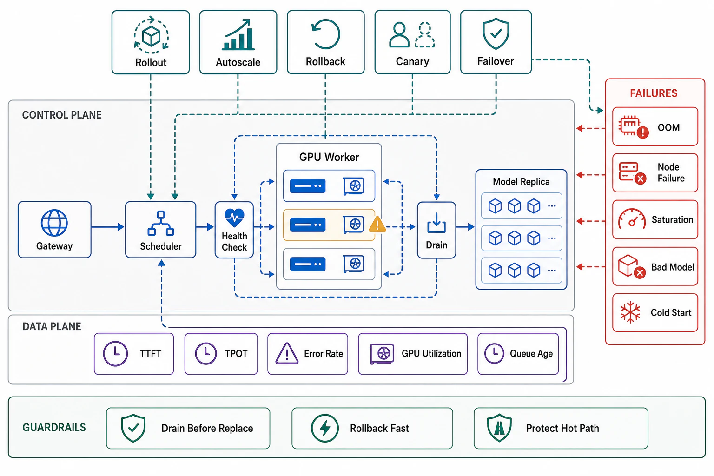

# Reliability and Fleet Operations



## Abstract

GPU fleets fail more, fail stranger, and fail more expensively than the CPU fleets this book's earlier reliability machinery was tuned on, and the base rates are published: Meta's Llama-3 run logged **419 unexpected interruptions in 54 days on 16,384 H100s** — one every three hours — with **30.1% from GPU faults (including NVLink) and 17.2% from HBM3 memory** ([Llama 3 report](https://arxiv.org/abs/2407.21783)); serving fleets shrink the blast radius per failure but inherit the same component physics: **hard faults** (Xid-class errors, uncorrectable ECC, falling off the bus) that kill a worker mid-decode, and — operationally worse — **soft degradation**: thermal throttling, correctable-ECC storms, and flaky interconnect lanes that don't fail anything but drag the collective to the slowest participant's pace (file 07's heterogeneity note), presenting as an unexplained fleet-wide TPOT regression. This file's stance: GPU health is an active discipline (DCGM-class telemetry — Xid events, ECC counters, thermals, NVLink integrity — feeding health-scored scheduling, plus periodic *active* probes: a known-answer inference and a bandwidth microbenchmark catch the degradations passive counters miss), and the fleet's lifecycle events are engineered like the state operations they are: **model loading is a cold-start budget** (140 GB across a node at real storage/network rates is minutes, plus warmup that exercises file 04's CUDA-graph bucket set — so autoscaling lag (Ch09 f01's gate) is measured in *minutes*, capacity buffers are sized accordingly, and weight distribution wants P2P/caching topology, not 200 nodes pulling one blob store); **draining is stream-aware** (in-flight generations either complete within a deadline or checkpoint-and-migrate — Ch07 f09's resumability decides which; a kill-based deploy on a streaming fleet is a mass mid-sentence failure event); and **model rollout is Chapter 07 file 07's discipline with weights** — model+config+engine versioned as one artifact, canaried against *quality and latency* SLIs simultaneously (Ch08 f09's version closure invalidating caches by construction), with rollback rehearsed at model-artifact scale, where "roll back" means minutes of reload, not a config flip.

## 1. The Failure Taxonomy and Health Machinery

```text
Figure 1. GPU failure classes, and which machinery catches each.

  class              example signals          caught by
  ─────────────────────────────────────────────────────────────
  hard fault         Xid 79 (off bus), un-    DCGM events → drain
                     correctable ECC, OOM-    + evict; the worker
                     kill of the runtime      dies loudly — EASY
  soft degradation   thermal throttle, corr-  trend telemetry +
                     ectable-ECC rate climb,  ACTIVE PROBES (known-
                     single flaky NVLink lane answer inference,
                     → slowest-participant    bandwidth micro-
                     drag on the whole TP     bench per node, on
                     group (f07)              a schedule) — HARD:
                                              nothing has FAILED
  systemic           driver/firmware regres-  canary fleets +
                     sions, engine numerics   serving-generation
                     drift (f06's re-eval)    stamps (G6, G10)
  ─────────────────────────────────────────────────────────────
  the sizing input: at Llama-3's measured rates, a 256-GPU
  serving fleet expects a component event every ~2 days —
  N+k spare capacity and automated drain/replace are steady-
  state operations, not incident response
```

The parallelism multiplier deserves its own sentence: a TP=8 group is a *single failure domain* — one GPU's hard fault kills eight GPUs' worth of serving, and one GPU's throttling taxes eight GPUs' latency — so failure-domain accounting (Chapter 01 file 08) counts *groups*, not devices, and the spare-capacity arithmetic sizes k in group units.

## 2. Lifecycle — Cold Starts, Draining, and Model Rollout

**Cold start is a budget with line items**: image pull + weight fetch (140 GB at 1 GB/s effective fetch ≈ 2.3 minutes — and the distribution tier must actually sustain that fleet-wide: 50 nodes × 140 GB against one regional blob endpoint will not deliver 1 GB/s each) + load/shard + graph capture and warmup across the shape buckets + health probe = the number Ch09's autoscaling bridge must cover; the G8 drill times it end-to-end, and the mitigations are standard state engineering (P2P distribution, node-local weight caches, pre-warmed standby capacity for the load classes that spike). **Draining**: mark unschedulable → stop admitting → in-flight sequences race their completion deadline → survivors checkpoint-and-migrate (engines with KV transfer) or terminate with Ch07 f09's honest in-band error; drain time bounds deploy velocity (a fleet that drains in 10 minutes deploys at most every 10 minutes per wave), which is a *stated* trade in the dossier, not an operational surprise. **Rollout**: the serving artifact is (weights, quantization config, engine build, kernel set, serving config) versioned as one unit — G10 canaries it against paired quality/latency SLIs with automated rollback, the file 06 re-eval gate runs inside the canary, and Ch08 f09's closure means the version bump invalidates every prefix/KV cache by unreachability — the deploy *is* the invalidation, which is correct and must be capacity-planned (a fleet-wide rollout is also a fleet-wide cold cache: Ch08 f06's warming discipline applies to the KV/prefix tier too).

## 3. Approval Gates

| Gate | Evidence Required | Failure Condition |
|---|---|---|
| Health gate | DCGM-class telemetry + scheduled active probes (known-answer, bandwidth) feeding health-scored scheduling; slowest-participant alarms per TP group | Soft degradation found by users; the flaky lane taxing eight GPUs for a month |
| Domain gate | Failure domains counted in parallelism groups; N+k sized in group units at measured event rates | Spare capacity in device units; one Xid taking "one GPU" on paper and a TP=8 group in fact |
| Cold-start gate | The G8 cold-start budget measured end-to-end (fetch → warmup → healthy); distribution topology sustains fleet-scale pulls; Ch09's scaling bridge covers the number | Autoscaling plans assuming container-class start times for 140-GB artifacts |
| Drain gate | Stream-aware drain rehearsed; completion-vs-migrate policy per work class; drain time stated as the deploy-velocity bound | Kill-based deploys mass-failing mid-generation streams |
| Rollout gate | The serving artifact versioned as one unit; G10 canary with paired quality+latency SLIs and rehearsed rollback; rollout capacity-planned as a cache-cold event | Engine bumps outside the version; quality canaries without latency ones (or vice versa); rollback discovered to take an hour, in the incident |

## Output

The output of this file is a fleet operated against its measured physics: failure classes mapped to the machinery that catches each — including the soft degradations that fail nothing and cost the most — failure domains and spares accounted in parallelism-group units at published event rates, cold starts budgeted in minutes with distribution engineered to sustain them, drains that respect in-flight streams, and rollouts that treat weights, engine, and config as one canaried, rollback-rehearsed, cache-invalidating artifact.

## References

- [Grattafiori et al., "The Llama 3 Herd of Models" (2024) — §"Infrastructure": the 419-interruption reliability corpus](https://arxiv.org/abs/2407.21783)
- [NVIDIA DCGM — GPU telemetry and health (Xid, ECC, thermals, NVLink)](https://developer.nvidia.com/dcgm)
- [NVIDIA — Xid errors reference (the hard-fault taxonomy)](https://docs.nvidia.com/deploy/xid-errors/index.html)
- [Chapter 07 file 07 — the rollout/rollback discipline this file applies to model artifacts](../07-api-contracts-and-request-lifecycle/07-versioning-deprecation-and-compatibility.md)
